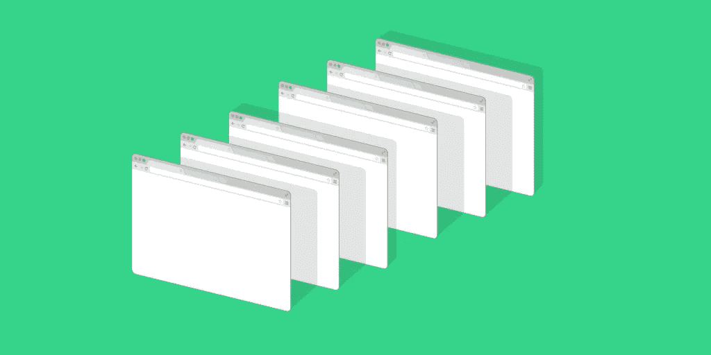
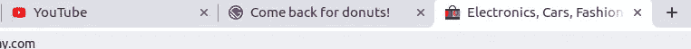

# 当用户切换标签时，如何在浏览器标签中更新你的网站标题

> 原文：<https://javascript.plainenglish.io/how-to-update-your-websites-title-whenever-your-user-switches-tab-f1d72865b10a?source=collection_archive---------3----------------------->

## “回来吃甜甜圈”——当你的潜在客户在浏览器中离开你的标签时，这可能是你想告诉他们的话…

## 非常容易实现！

只需将这段代码片段放入页面的 header 组件中(或者放入在页面加载上运行的任何组件中):

代码是为 React 剪的，但是我相信你已经明白了，并且可以把它转换成与你选择的框架或者普通的 JS 兼容。

现在，您应该会看到标签页上的标题发生了变化，当用户返回标签页时，标题会恢复到原来的样子。