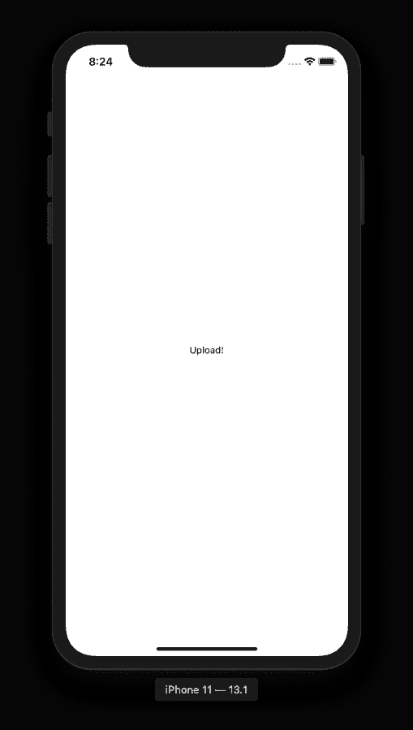

# 如何将照片上传到 React Native 中的 Firebase 存储

> 原文：<https://javascript.plainenglish.io/how-to-upload-photos-to-firebase-storage-in-react-native-dc3d2f4771b8?source=collection_archive---------6----------------------->


使用 React Native，您可以使用 JavaScript 作为主要编程语言来构建各种跨平台的应用程序屏幕。一个这样的应用程序屏幕功能是上传照片，这是社交媒体应用程序中非常常见的功能。将照片上传到 Firebase 存储是 React 本机应用程序的常见做法，这些应用程序与 Firebase 进行了后端集成，例如我们的 [React 本机模板](https://www.instamobile.io)。


在本教程中，让我们构建一个演示应用程序，其中您将创建一个简单的屏幕，允许您使用图像拾取器从设备上运行的应用程序中拾取图像，并将其上传到 Firebase 云存储。第二个屏幕将显示这些图像。

## 入门指南

首先创建一个新的 react 本地项目。从终端窗口运行以下命令。创建项目目录后，在其中导航并安装所需的依赖项。

```
npx react-native 
init uploadStorageDemo 
cd uploadStorageDemo 
yarn add react-native-progress react-native-image-picker
```

请注意，本教程使用了高于`0.60.x`的 react-native 版本。如果您使用的是低于该版本的版本，请确保寻求关于如何链接本教程中提到的库的本机二进制文件的指导。

为了遵循关于如何为每个移动平台配置`react-native-image-picker`的说明，我强烈推荐你在这里浏览官方文档。

对于 iOS，一定要安装 pods。

```
cd ios/ && pod install # after pods install cd ..
```

## 创建上传屏幕

当前的演示应用程序将包含一个屏幕，帮助用户从设备的照片库中选择图像。现在，在`src/screens/`目录下创建一个名为`UploadScreen.js`的文件和下面的模拟代码片段。

```
import * as React from 'react';
import { Text, View } from 'react-native';

export default function UploadScreen() {
  return (
    <View style={{ flex: 1, justifyContent: 'center', alignItems: 'center' }}>
      <Text>Upload!</Text>
    </View>
  );
}
```

打开`App.js`文件，导入`AppTabs`。

```
import React from 'react';
import { StatusBar } from 'react-native';
import UploadScreen from './src/screens/UploadScreen';

const App = () => {
  return (
    <>
      <StatusBar barStyle="dark-content" />
      <UploadScreen />
    </>
  );
};

export default App;
```

现在，回到终端窗口，为您希望运行 react 的平台或操作系统构建 react 本地应用程序。

```
# for iOS
npx react-native run-ios

# for Android
npx react-native run-android
```

我将在这个演示中使用 iOS 模拟器。打开模拟器的应用程序，您将看到以下输出。



## 创建一个新的 Firebase 项目

要访问每个移动操作系统平台的 Firebase 凭证并将其配置为使用 Firebase SDK，请从 [Firebase 控制台](http://console.firebase.google.com/)创建一个新的 Firebase 项目，或者如果您已经可以访问控制台中的项目，可以跳过这一步。

创建一个新项目，如下所示。


添加 Firebase 项目的详细信息。


单击“创建项目”按钮，您将被重定向到仪表板屏幕。您应该在仪表板上看到您新创建项目。

## 添加 Firebase SDK 以与本机应用程序反应

使用第 5 版或更低版本的`react-native-firebase`，因为这是一个单一报告，所有 Firebase 依赖项都可以从一个单独的模块中获得，并在 React Native 应用程序中使用。但是，对于版本 6，您必须基于您想要使用的 Firebase 特性来安装依赖项。例如，在当前应用程序中，要使用存储，您需要安装核心应用程序包和存储包。

如前所述，核心模块`@react-native-firebase/app`始终是必需的。打开终端窗口安装这些依赖项。

```
yarn add @react-native-firebase/app @react-native-firebase/storage
```

## 将 Firebase 凭据添加到您的 iOS 应用程序中

Firebase 提供了一个`GoogleService-Info.plist`文件，其中包含所有 API 密钥以及 iOS 设备验证正确的 Firebase 项目所需的其他凭据。

要访问这些凭据，请返回“Firebase 控制台”，并从 Firebase 项目的仪表板屏幕上，从侧面菜单打开“项目设置”。


转到“您的应用”部分，点击图标`iOS`选择平台。


输入申请详情并点击“注册应用程序”。然后下载`GoogleService-Info.plist`文件，如下图所示。


打开 Xcode，然后打开`/ios/uploadStorageDemo.xcodeproj`文件。右键单击项目名称并选择选项-然后选择要添加到此项目中的适当文件。


接下来，打开`ios/uploadStorageDemo/AppDelegate.m`并添加以下标题。

```
#import <Firebase.h>
```

在`didFinishLaunchingWithOptions`方法中，添加以下配置方法。

```
 - (BOOL)application:(UIApplication *)application didFinishLaunchingWithOptions:(NSDictionary *)launchOptions {
    if ([FIRApp defaultApp] == nil) {
      [FIRApp configure];
    }
```

回到终端窗口安装吊舱。

```
cd ios/ && pod install # after pods are installed cd ..
```

运行之前，确保构建了 iOS 应用程序。打开

```
npx react-native run-ios
```

## 将 Firebase 凭据添加到您的安卓应用程序中

对于 Android 应用程序，Firebase 提供了一个`google-services.json`文件，其中包含所有 API 密钥以及 Android 设备验证正确 Firebase 项目所需的其他凭据。

转到“您的应用”部分，点击图标`Android`选择平台。


下载`google-services.json`文件。


现在将下载的 JSON 文件复制到 React Native 项目中的以下位置:`/android/app/google-services.json`。打开`android/build.gradle`文件，添加以下片段。

```
dependencies { // ... classpath 'com.google.gms:google-services:4.2.0' }apply plugin: 'com.google.gms.google-services'
```

最后，确保你构建了安卓应用程序。

```
npx react-native run-android
```

## 使用反应原生图像拾取器

在这一部分，让我们开始构建应用程序。首先打开文件`UploadScreen.js`并导入以下语句。

```
import React, { useState } from 'react';
import {
  View,
  SafeAreaView,
  Text,
  TouchableOpacity,
  StyleSheet,
  Platform,
  Alert,
  Image
} from 'react-native';
import ImagePicker from 'react-native-image-picker';
import storage from '@react-native-firebase/storage';
import * as Progress from 'react-native-progress';
```

在功能组件`UploadScreen`内创建三个状态变量。第一个，`image`将用于存储图像源的 URI。然后，同一个 URI 将用于显示用户选择的图像，并将图像上传到 Firebase 云存储中。

第二个状态变量是`uploading`，它将成为`false`违约。这将跟踪图像是否上传到云存储中。

第三个变量`transferred`将跟踪图片上传的进度。

```
export default function UploadScreen() {
  const [image, setImage] = useState(null);
  const [uploading, setUploading] = useState(false);
  const [transferred, setTransferred] = useState(0);

  //...
}
```

添加一个名为`selectImage`的助手方法，它将使用`react-native-image-picker`从设备库中选择一个图像，并显示图像拾取器本身。此外，定义一个`options`对象来设置最大宽度和高度以及默认路径等属性。

这个`options`对象将作为`ImagePicker.showPicker()`方法的第一个参数被传递，该方法将返回一个发送`response`对象的回调。使用这个回调，可以设置图像状态变量的路径。

你可以在官方文件[这里](https://github.com/react-native-community/react-native-image-picker/blob/master/docs/Reference.md)找到要传递的一整套选项。

```
const selectImage = () => {
  const options = {
    maxWidth: 2000,
    maxHeight: 2000,
    storageOptions: {
      skipBackup: true,
      path: 'images'
    }
  };
  ImagePicker.showImagePicker(options, response => {
    if (response.didCancel) {
      console.log('User cancelled image picker');
    } else if (response.error) {
      console.log('ImagePicker Error: ', response.error);
    } else if (response.customButton) {
      console.log('User tapped custom button: ', response.customButton);
    } else {
      const source = { uri: response.uri };
      console.log(source);
      setImage(source);
    }
  });
};
```

定义另一个名为`uploadImage`的助手方法，它将把图像上传到云存储中。这个方法在默认情况下是异步的，所以让我们用`async-await`语法。

此外，当该方法触发时，将`uploading`的值更新为真，将`transferred`的值更新为 0，以跟踪图像上传到存储器的进度。

使用 Firebase 中的`storage`可以触发图像上传。值得注意的是，`filename`和使用`putFile`的图像 URI 必须按照下述顺序作为参考传递。

图像上传到存储器后，使用 react 本地组件`Alert`显示一个警告方法，并将状态变量设置为默认值，如下所示。

```
const uploadImage = async () => {
  const { uri } = image;
  const filename = uri.substring(uri.lastIndexOf('/') + 1);
  const uploadUri = Platform.OS === 'ios' ? uri.replace('file://', '') : uri;

  setUploading(true);
  setTransferred(0);

  const task = storage()
    .ref(filename)
    .putFile(uploadUri);

  // set progress state
  task.on('state_changed', snapshot => {
    setTransferred(
      Math.round(snapshot.bytesTransferred / snapshot.totalBytes) * 10000
    );
  });

  try {
    await task;
  } catch (e) {
    console.error(e);
  }

  setUploading(false);

  Alert.alert(
    'Photo uploaded!',
    'Your photo has been uploaded to Firebase Cloud Storage!'
  );

  setImage(null);
};
```

这是从这个功能组件返回的完整的 JSX。你将在应用程序中显示的进度将以条形图的形式出现。

```
export default function UploadScreen() {
  //... rest of the code

  return (
    <SafeAreaView style={styles.container}>
      <TouchableOpacity style={styles.selectButton} onPress={selectImage}>
        <Text style={styles.buttonText}>Pick an image</Text>
      </TouchableOpacity>
      <View style={styles.imageContainer}>
        {image !== null ? (
          <Image source={{ uri: image.uri }} style={styles.imageBox} />
        ) : null}
        {uploading ? (
          <View style={styles.progressBarContainer}>
            <Progress.Bar progress={transferred} width={300} />
          </View>
        ) : (
          <TouchableOpacity style={styles.uploadButton} onPress={uploadImage}>
            <Text style={styles.buttonText}>Upload image</Text>
          </TouchableOpacity>
        )}
      </View>
    </SafeAreaView>
  );
}
```

以下是上述组件的完整样式。

```
const styles = StyleSheet.create({
  container: {
    flex: 1,
    alignItems: 'center',
    backgroundColor: '#bbded6'
  },
  selectButton: {
    borderRadius: 5,
    width: 150,
    height: 50,
    backgroundColor: '#8ac6d1',
    alignItems: 'center',
    justifyContent: 'center'
  },
  uploadButton: {
    borderRadius: 5,
    width: 150,
    height: 50,
    backgroundColor: '#ffb6b9',
    alignItems: 'center',
    justifyContent: 'center',
    marginTop: 20
  },
  buttonText: {
    color: 'white',
    fontSize: 18,
    fontWeight: 'bold'
  },
  imageContainer: {
    marginTop: 30,
    marginBottom: 50,
    alignItems: 'center'
  },
  progressBarContainer: {
    marginTop: 20
  },
  imageBox: {
    width: 300,
    height: 300
  }
});
```

这是你将要得到的输出。


要验证映像是否存储在云存储中，请返回 Firebase 控制台仪表板，并转到存储部分。


## 结论

关于自定义进度条的更多信息，请参考`react-native-progress`的[文档](https://github.com/oblador/react-native-progress)。

*原载于 2020 年 3 月 17 日*[*https://www . insta mobile . io*](https://www.instamobile.io/mobile-development/react-native-firebase-storage/)*。*

## **简单英语的 JavaScript**

喜欢这篇文章吗？如果有，通过 [**订阅我们的 YouTube 频道**](https://www.youtube.com/channel/UCtipWUghju290NWcn8jhyAw) **获取更多类似内容！**