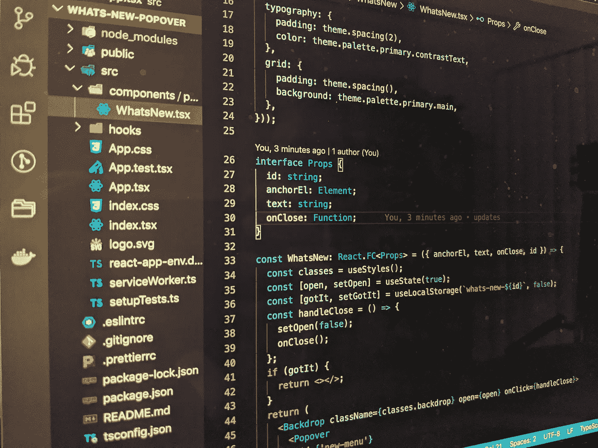
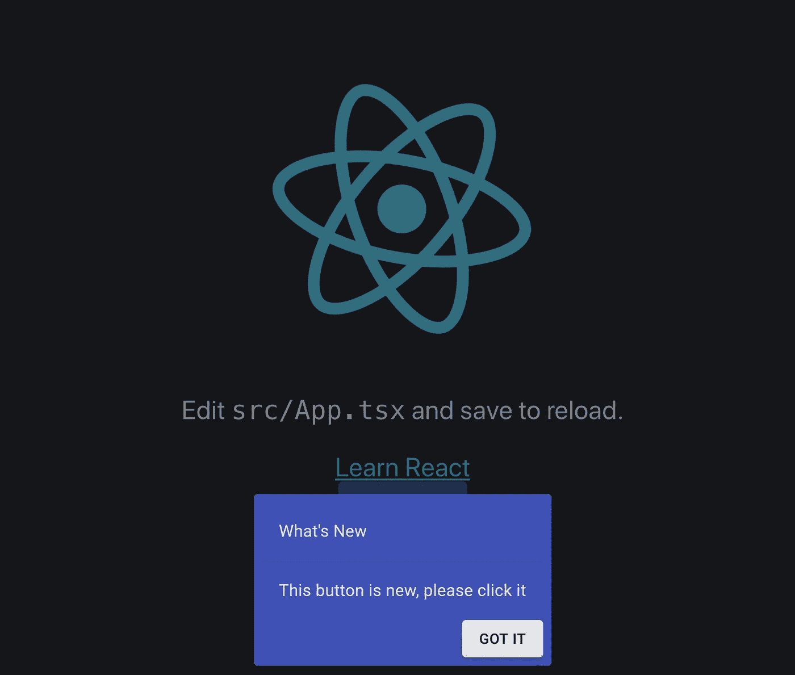

# 如何在 React 和 Material UI 中创建“最新动态”弹出窗口

> 原文：<https://javascript.plainenglish.io/how-to-use-a-whats-new-popover-in-react-and-material-ui-f936e6c8f32e?source=collection_archive---------4----------------------->



JavaScript 拥有最好的开源包和软件生态系统之一。开发人员的时间现在可以缩短，可以比以往更快地将新功能发布给用户。好的 UI / UX 的一个原则是，当开发者引入一个新的特性时，应用程序会用背景和弹出窗口提醒用户，引导用户探索并弄清楚如何使用这个新特性。

在本文中，我们将构建一个可重用的组件，我们可以用它来突出我们的应用程序中的任何新功能。

您可以在此查看完整的代码库:

[](https://gitlab.com/sundry/react/whats-new-popover) [## 杂货/反应/什么-新-流行

### GitLab.com

gitlab.com](https://gitlab.com/sundry/react/whats-new-popover) 

我们将从使用启用了 typescript 的 create react 应用程序开始，我们将使用由 react 的优秀开发人员提供给我们的默认应用程序。我们不会花太多时间来组织应用程序，但我们会创建两个新的文件夹和文件。一个用于组件和挂钩。

让我们从简单的部分开始。

当用户点击弹出窗口时，我们希望将该动作保存在本地存储中。当他们回到应用程序时，它会从本地存储中读取，而不会显示弹出窗口。这很重要，这样我们就不会在用户每次加载页面时打扰他们。

我们将创建一个 **hooks** 文件夹，这样我们就可以存储这个 **useLocalStorage** 钩子。

```
import { useState } from 'react';function useLocalStorage(key: string, initialValue: any) {
  const [storedValue, setStoredValue] = useState(() => {
    try {
      const item = window.localStorage.getItem(key);
      return item ? JSON.parse(item) : initialValue;
    } catch (e) {
      console.log(e);
      return initialValue;
    }
  }); const setValue = (value: any) => {
    try {
      const valueToStore = value instanceof Function ? value(storedValue) : value;
      setStoredValue(valueToStore);
      window.localStorage.setItem(key, JSON.stringify(valueToStore));
    } catch (e) {
      console.log(e);
    }
  };
  return [storedValue, setValue];
}export default useLocalStorage;
```

已经有一些包实现了这个钩子，但是我不喜欢在我的应用程序中引入我并不真正需要的依赖。如果你有不同的感受，请留下评论。

现在是有趣的部分。

让我们创建一个**组件**文件夹，其中的子目录将存储我们的 popover 组件。

```
import React, { useState } from 'react';
import { makeStyles } from '@material-ui/core/styles';
import Backdrop from '@material-ui/core/Backdrop';
import Popover from '@material-ui/core/Popover';
import Typography from '@material-ui/core/Typography';
import Button from '@material-ui/core/Button';
import Grid from '@material-ui/core/Grid';
import Divider from '@material-ui/core/Divider';
import useLocalStorage from 'hooks/useLocalStorage';const useStyles = makeStyles(theme => ({
  backdrop: {
    zIndex: theme.zIndex.drawer + 1,
    color: '#fff',
  },
  typography: {
    padding: theme.spacing(2),
    color: theme.palette.primary.contrastText,
  },
  grid: {
    padding: theme.spacing(),
    background: theme.palette.primary.main,
  },
}));interface Props {
  id: string;
  anchorEl: Element;
  text: string;
  onClose: Function;
}const WhatsNew: React.FC<Props> = ({ anchorEl, text, onClose, id }) => {
  const classes = useStyles();
  const [open, setOpen] = useState(true);
  const [gotIt, setGotIt] = useLocalStorage(`whats-new-${id}`, false);

  const handleClose = () => {
    setOpen(false);
    onClose();
  }; if (gotIt) {
    return <></>;
  }

  return (
    <Backdrop className={classes.backdrop} open={open} onClick={handleClose}>
      <Popover
        id={'new-menu'}
        open={open}
        anchorEl={anchorEl}
        onClose={handleClose}
        anchorOrigin={{
          vertical: 'bottom',
          horizontal: 'center',
        }}
        transformOrigin={{
          vertical: 'top',
          horizontal: 'center',
        }}
      >
        <Grid
          container
          justify="flex-end"
          direction="column"
          className={classes.grid}
        >
          <Grid item>
            <Typography className={classes.typography}>What's New</Typography>
            <Divider />
          </Grid>
          <Grid item>
            <Typography className={classes.typography}>{text}</Typography>
          </Grid>
          <Grid item container justify="flex-end">
            <Button variant="contained" onClick={() => setGotIt(true)}>
              GOT IT
            </Button>
          </Grid>
        </Grid>
      </Popover>
    </Backdrop>
  );
};export default WhatsNew;
```

首先，让我们看看我们想要传入哪些 typescript 道具来使其可重用。

```
interface Props {
  id: string;
  anchorEl: Element;
  text: string;
  onClose: Function;
}
```

1.  *id* —这是必需的，这样我们可以保存一个 id，当他们单击*get IT*按钮时，该 id 将在本地存储中使用。
2.  *anchorEl* —这需要告诉素材 UI 弹出窗口在文档中的什么元素旁边出现，给用户一个在哪里寻找新特性的想法。
3.  *文本* —这是对新增功能以及如何使用新功能的简要描述。
4.  *onClose* —这是一个回调函数，当用户点击*get IT*时，我们需要将 anchorEl 的值设置为 null 并隐藏弹出窗口。

接下来，让我们看看组件中的状态。

```
const [open, setOpen] = useState(true);

const [gotIt, setGotIt] = useLocalStorage(`whats-new-${id}`, false);
```

我们保存了一个关于弹出窗口是否打开和显示的状态，以及一个关于用户是否点击了*或者是否得到了*的本地存储布尔值。

现在我们可以写代码，如果他们已经点击了*明白了*，就不显示弹出窗口。

```
if (gotIt) {
  return <></>;
}
```

Material UI 提供了两个组件，我们将使用它们来实现我们的目标。

*背景* —该组件将显示一个变暗的背景。这很有用，因为它会将注意力从应用上转移开，突出新功能。

这个组件将在我们的锚元素旁边呈现一个框，突出显示新的特性。

在 popover 组件中，我们可以显示新功能的描述和一个供用户点击的按钮，告诉应用程序他们现在知道新功能。

任务完成！

现在是最后一部分。

如何使用 React 和 Material UI 中的新弹出窗口？

在通过运行 create react app 命令创建的默认 App 组件中，我们将添加一个新按钮，然后使用 popover 来突出显示这个新特性。

首先，我们需要一个 ref 和一个 anchor 元素。

```
const newRef = useRef<HTMLDivElement | null>(null);
const [anchorEl, setAnchorEl] = useState();useEffect(() => {
  setAnchorEl(newRef.current);
}, []);
```

当 App 第一次渲染时，我们会调用 useEffect 并抓取 newRef，设置 anchor 元素。

```
<div ref={newRef}>
  <Button variant="contained" color="primary">
    New Button
  </Button>
</div>
```

现在我们可以将 ref 分配给按钮周围的 div。这将告诉我们的弹出窗口显示在这个按钮旁边。我们想让每个人都知道我们的新按钮。告诉你的朋友！

最后，我们可以带来我们的爆米花。

```
<WhatsNewPopover
  id="new-button"
  text="This button is new, please click it"
  anchorEl={anchorEl}
  onClose={() => {
    setAnchorEl(null);
  }}
/>
```

我们给它一个对新特性有意义的 id。提供新功能的描述。传入我们的锚元素，并给它一个回调，当点击时，它会将我们的锚元素设置为空值，隐藏弹出窗口。



What’s New Popover

现在我们有了一个可重用的组件，我们可以在现实世界中使用它。当然，我们可能需要设计得更好一点，但是材质 UI 的默认风格已经很棒了。

现在让我们开始破解并创造新的功能！