# 如何用 Node.js 和 MySQL workbench 使用一个 AWS SQL 数据库！

> 原文：<https://javascript.plainenglish.io/how-to-use-an-aws-sql-database-with-node-js-and-mysql-workbench-f77a71ac12be?source=collection_archive---------0----------------------->

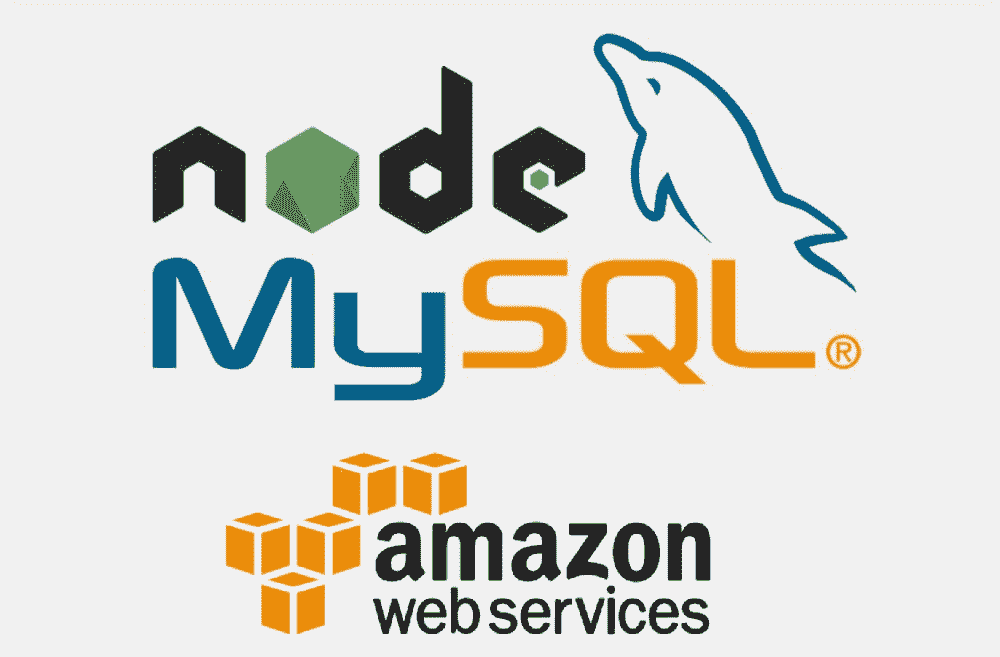

# 介绍

如果您正在创建一个跟踪数据的 Node.js 应用程序，那么您可能正在使用某种数据库。尽管数据库有很多选择，比如 MongoDB、Firebase 和 PostgreSQL，但 MySQL 仍然是基于 web 的应用程序最流行的数据库之一。它是免费的，提供了很多功能，有各种各样的用户界面，并且可以与其他数据库一起工作。MySQL 有什么让人不喜欢的地方？

然而，设置托管和连接 MySQL 数据库到服务器可能会变得棘手，特别是如果你在*臭名昭著的* AWS 上托管。我的工作是指导你完成这个过程。在本教程中，我将重点介绍三个方面:

1.  如何在 AWS 上创建 MySQL 数据库
2.  如何将数据库连接到 MySQL 工作台
3.  如何将数据库连接到 Node.js 应用程序

# 先决条件

您需要具备以下条件:

1.  AWS 帐户
2.  空白 Node.js 项目
3.  MySQL 工作台
4.  积极的态度！

# 如何在 AWS 上创建 MySQL 数据库

您将从创建一个数据库实例开始。登录 AWS 并导航到 Amazon RDS 服务控制台。然后，单击数据库实例。

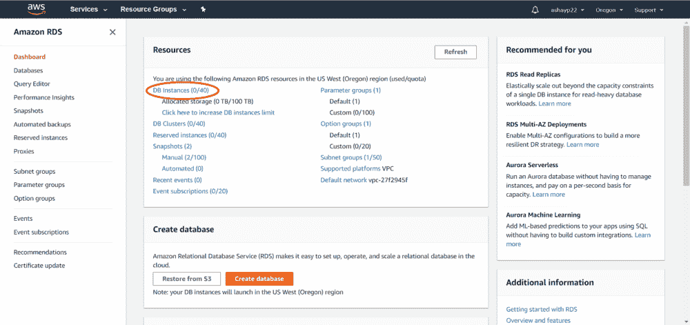

接下来，选择右上角的“创建数据库”。您应该会看到一个标题为“创建数据库”的页面现在是点击按钮的时候了。

您将使用免费层，这是*令人惊叹的*，因为您可以在 12 个月内免费使用每月 750 小时(31 天)的 db.t2.micro 数据库。注意，如果您正在为生产创建数据库，则不应选择这些设置。

首先，选择“标准创建”和 MySQL。

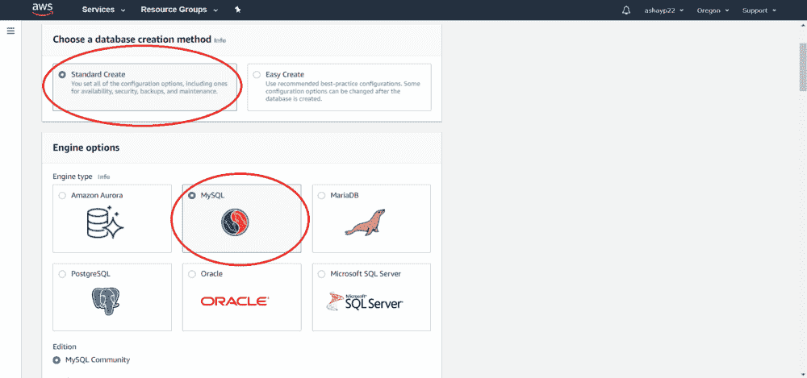

在“模板”下，选择“自由层”，并在“设置”下，为数据库创建一个名称以及凭据。通常，“admin”或“root”用于主用户名。此外，一定要在某个地方写下你的主密码，因为它非常重要，你将无法再更改它。

DO NOT FORGET YOUR MASTER PASSWORD!

跳过数据库实例大小、存储、可用性和持久性，找到连接性。现在，您将完成创建 MySQL 数据库的**重要步骤#1** ，这通常会导致错误。

首先，确保选择默认 VPC，然后选择附加连接配置。选择**是**为“可公开访问”，保持数据库端口设置为 3306。这一步之所以是必要的，是因为如果“公共可访问”被设置为否，那么您将无法使用您的计算机访问 MySQL 数据库。相反，您需要仅使用 VPC 内的 Amazon EC2 实例和设备来访问数据库。

如果您是为生产而构建，建议您设置安全措施，例如为此选项选择“否”。但是现在，没有人会黑掉我的“超级酷 db”

最后，向下滚动到底部，确保某处写着“Amazon RDS Free Tier ”,这样你就知道你不会在这个数据库上每月花费 600 美元。然后，选择“创建数据库”数据库到 AWS 创建数据库应该需要 5-10 分钟，然后您就完成了**！**

**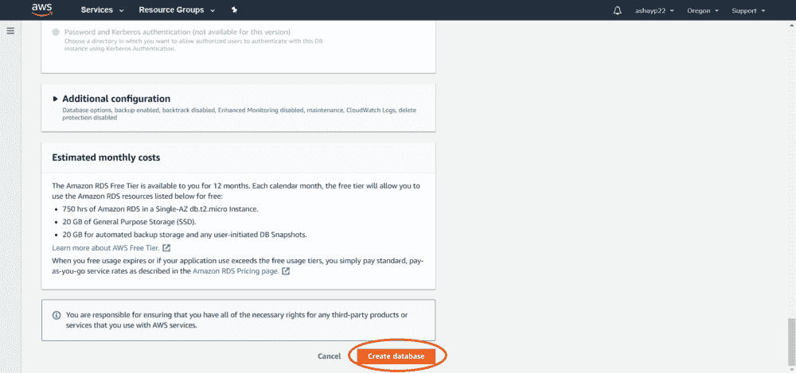**

**Don’t forget to create the database!**

# **如何将数据库连接到 MySQL 工作台**

**一旦你点击刷新 50 次，它应该说“可用”状态下。现在，打开 MySQL Workbench 并选择“+”按钮来添加一个新连接。**

**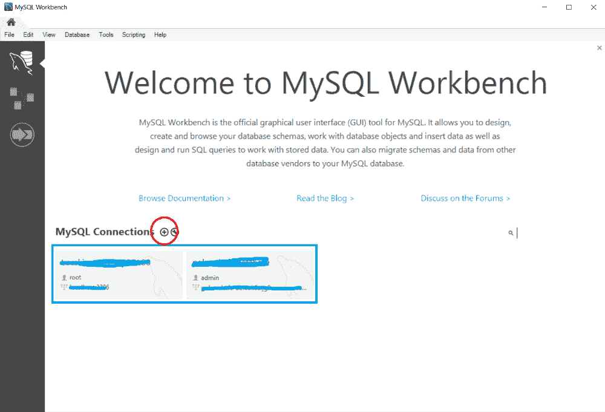**

****撑住！**在您添加详细信息之前，您必须在 AWS 网站上完成**重要步骤#2** 。单击 DB 实例，在 Security 下，单击 VPC 安全组。**

**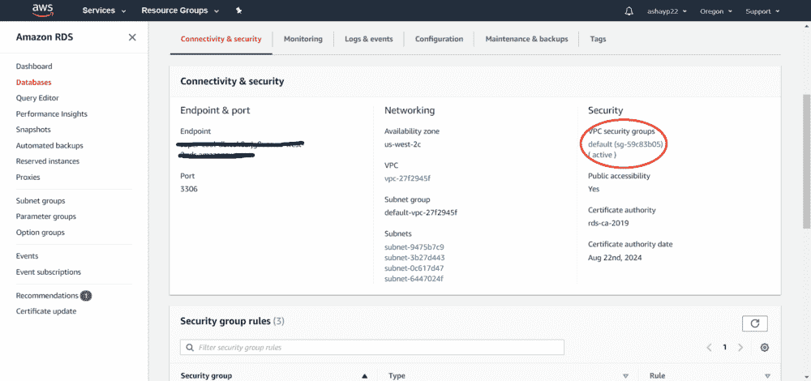**

**您应该会被带到 EC2 安全组页面。在当前安全组下，您必须添加一个新的入站规则。这是因为您希望 VPC 以外的任何公共 IP 地址都能够访问数据库。如果这一步没有完成，你**将**无法连接到 MySQL 数据库。**

**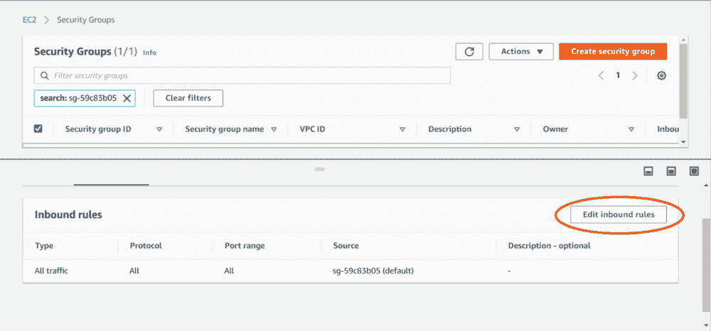**

**选择“编辑入站规则”，然后单击“添加规则”将“类型”设置为“所有流量”，并将“来源”设置为“任何地方”你也可以选择“我的 IP”并添加你自己的 IP 地址，这样别人就不能访问你的数据库了。**

**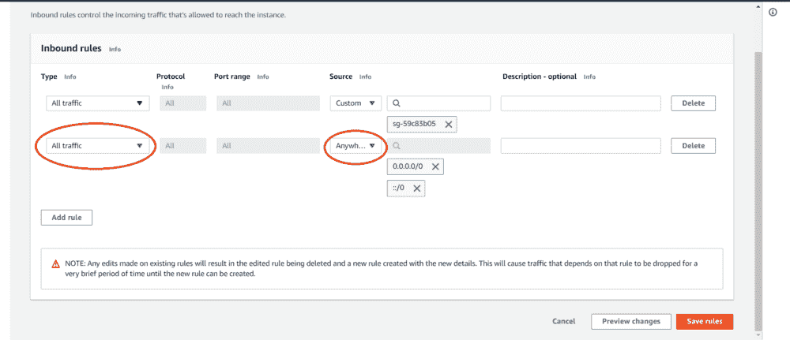**

**既然已经指定了入站规则，就可以通过 MySQL Workbench 连接到数据库了。回到“设置新连接”窗口，开始填写输入。**

*   **在“连接名称”下，添加数据库的名称。**
*   **在“连接方法”下，保持标准。**
*   **在“主机名”下，添加端点。这可以在数据库实例主页的“连接性和安全性”下找到**

**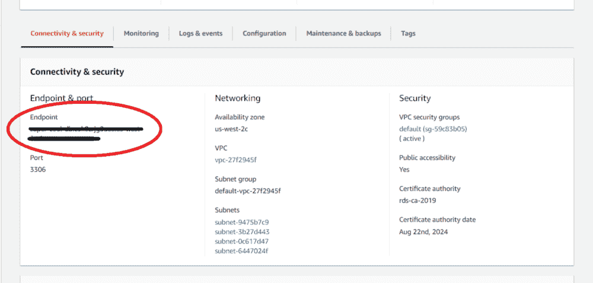**

*   **在“端口”下，添加最初创建数据库时的端口。**
*   **在“用户名”和“密码”下，添加最初创建数据库时的用户名和密码。如果您忘记了用户名，可以在数据库实例主页的“配置”下找到它。您还应该将密码存储在保管库中。**

**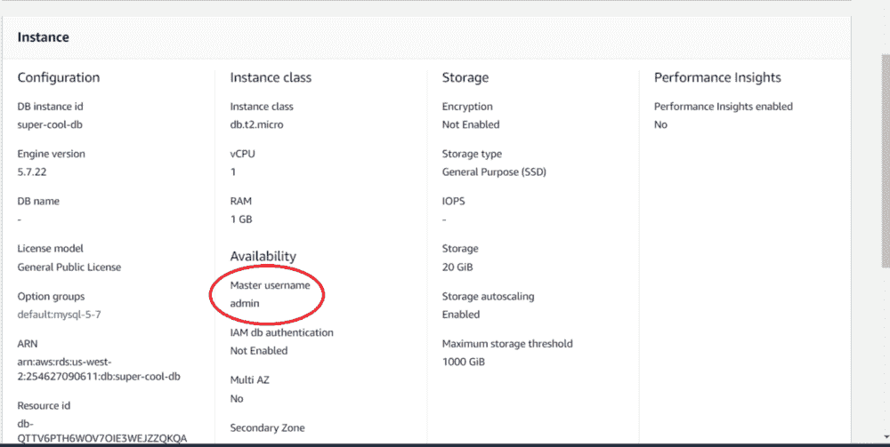**

**最后，单击“测试连接”以确保一切正常，然后单击“确定”你们都**搞定了**！你可以通过 MySQL Workbench 开始创建模式和表格，阅读和写作，以及所有其他有趣的事情。**或者**，可以通过 Node.js 来实现。**

**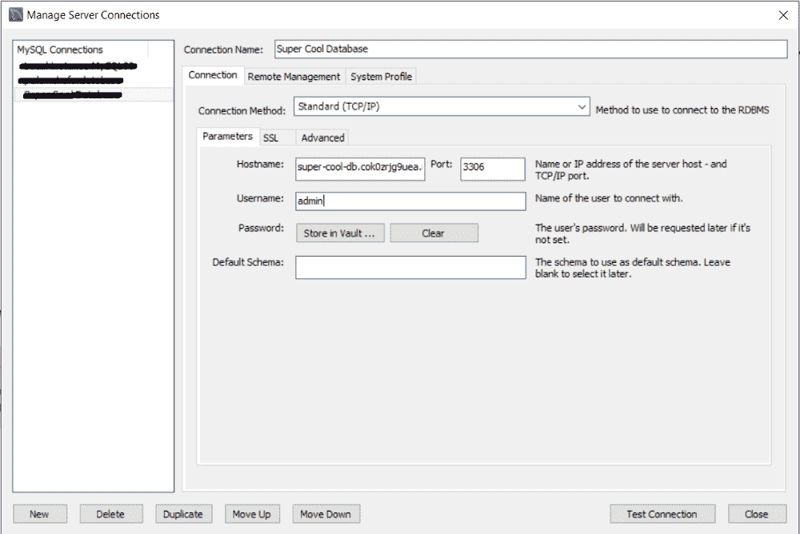**

**This is what it should look like when you are done**

# **如何将数据库连接到 Node.js 应用程序**

**现在您已经能够通过 Workbench 连接到 AWS MySQL 数据库，您可以通过 Node.js 应用程序做同样的事情。为了使用 Node.js 访问 MySQL 数据库，您需要一个 MySQL 驱动程序。**

**使用命令“npm install mysql”下载依赖项“mysql”确保它位于 Node.js 项目目录中。**

**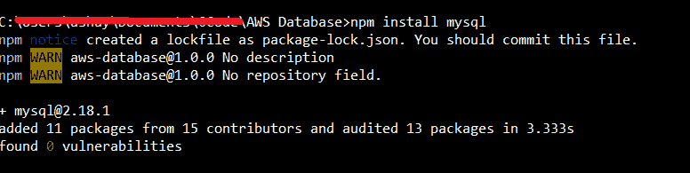**

**接下来，打开入口点(脚本文件，如 index.js 或 app.js)并导入依赖项。然后，创建一个新连接。**

**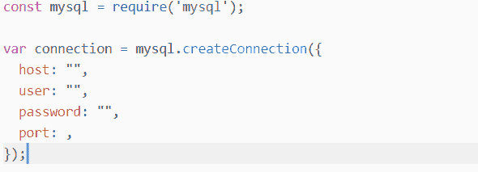**

**这些参数应该与 MySQL Workbench 的参数相同。**

*   **主机是端点**
*   **用户是主用户名**
*   **密码是主密码**
*   **端口是您指定的端口，例如 3306**

**如果要连接到数据库，可以在 port 下添加一个“database”字段，其值设置为数据库的名称。**

**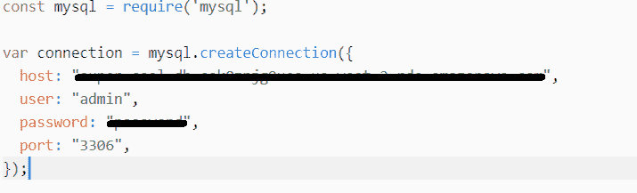**

**最后，您需要连接到数据库。添加以下代码:**

**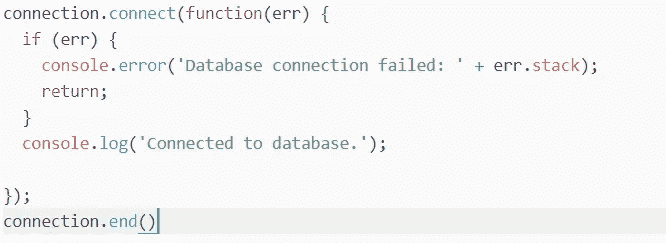**

**经过这一步，你就**全部搞定了**！您可以使用 Node.js 创建、读取、写入和删除，所有更新也会出现在您的 MySQL Workbench 连接上。**

**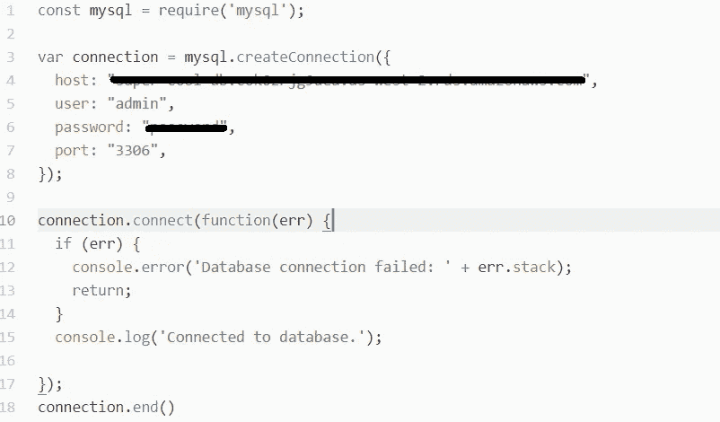**

**The final code**

# **结论**

**在本教程中，您学习了如何在 AWS 上创建一个 MySQL 数据库，并通过 MySQL Workbench 和 Node.js 连接到它。对我来说，这个过程的大部分不是填写输入字段，而是解决“无法连接”和“无效连接”错误。我希望这篇文章能帮助你避免那些*讨厌的*问题。**

## **接下来呢？**

**从现在开始，您可以:**

*   **保护您的数据库**
*   **在 AWS 上尝试不同的 MySQL 配置**
*   **终止您的 RDS 实例！**

**我将在未来发布更多关于如何做到这一切的教程，但现在，这里有一些资源:**

*   **Node.js 中的 MySQL:【https://www.w3schools.com/nodejs/nodejs_mysql.asp **
*   **删除一个实例:[https://aws.amazon.com/rds/](https://docs.aws.amazon.com/AmazonRDS/latest/UserGuide/USER_DeleteInstance.html)**
*   **亚马逊 RDS 中的安全性:[https://docs . AWS . Amazon . com/Amazon RDS/latest/user guide/usingwithrds . html](https://docs.aws.amazon.com/AmazonRDS/latest/UserGuide/UsingWithRDS.html)**

**感谢你把这篇文章看完！我真的很高兴找到像我一样对计算机科学充满热情的人。**

**确保**喜欢** / **分享**这篇文章😁，并评论你的阅读体验！**