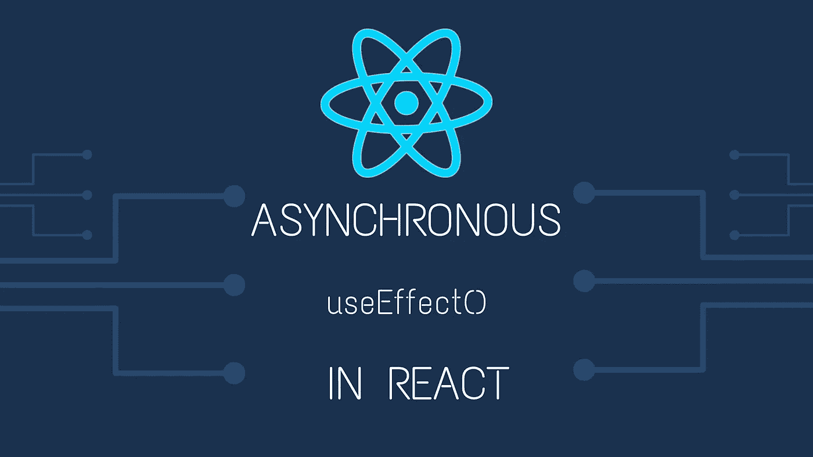

# 如何在 React hooks use effect(Typescript/JS)中使用异步函数？

> 原文：<https://javascript.plainenglish.io/how-to-use-async-function-in-react-hook-useeffect-typescript-js-6204a788a435?source=collection_archive---------0----------------------->



👾乍一看，您可能会想到做一些类似的事情，例如从远程 API 获取内容。

```
const MyFunctionnalComponent: React.FC = (props) => {
  useEffect(async () => {
   await loadContent();
  }, []); return <div></div>;
}
```

## 🤔这有什么不好？

如果你使用的是**类型脚本**，编译器应该会产生如下结果:

```
Argument of type '() => Promise<void>' is not assignable to parameter of type 'EffectCallback'.
```

让我们通过异步函数的定义来看看为什么会出现这个错误:

> 一个允许使用带有`await`关键字的异步指令的函数，只要 await 关键字之后的承诺没有解决，该函数就会阻止语句执行…

好吧看起来很棒…但是等等…

> 这个函数也将返回一个承诺，不管你是否显式地返回某个东西。如果您返回数据，它将被包装在函数将自动创建和返回的承诺的解析内容中。

哼！你是从这里开始发现问题的吗？没有吗？让我们在这里阅读一下**的使用效果**钩子来获得更多信息:[https://reactjs.org/docs/hooks-reference.html#useeffect](https://reactjs.org/docs/hooks-reference.html#useeffect)

> 通常，效果会创建需要在组件离开屏幕之前清理的资源，例如订阅或计时器 ID。为此，**传递给** `**useEffect**` **的函数可能会返回一个清理函数**。例如，创建订阅。

**📌使用异步函数使回调函数返回一个承诺，而不是一个清理函数。**

这就是编译器在 Typescript 中让步的原因。这种模式在普通 JS 中也不起作用，因为 React 不等待承诺。

## 💡如何处理 useEffect 中的异步代码？

通过使用以下技术，我们将能够在我们的效果中使用异步功能:

```
const MyFunctionnalComponent: React.FC = props => {
  useEffect(() => {
    *// Create an scoped async function in the hook* async function anyNameFunction() {
      await loadContent();
    } *// Execute the created function directly* anyNameFunction();
  }, []);return <div></div>;
};
```

现在，您的代码是安全的，因为您没有返回任何内容，编译器也停止了让步。

**🎬奖金/TLDR；📦**

也可以用一个 IIFE，效果同上。

如果你不知道什么是生活:[我的朋友苏尼尔·桑德胡](https://medium.com/javascript-in-plain-english/https-medium-com-javascript-in-plain-english-stop-feeling-iffy-about-using-an-iife-7b0292aba174)在这里描述了它。

```
const MyFunctionnalComponent: React.FC = props => {
  useEffect(() => {
    *// Using an IIFE* (async function anyNameFunction() {
      await loadContent();
    })();
  }, []); return <div></div>;
};
```

[**🇫🇷STOP！你是法国人吗🥖？您也可以访问 ici 网站，接收法国的私人通讯🙂**](https://codingspark.io)