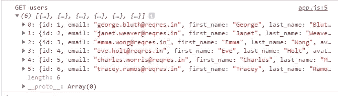

# 如何在普通 JavaScript 中使用 Axios

> 原文：<https://javascript.plainenglish.io/how-to-use-axios-in-vanilla-javascript-2dbf176e08d4?source=collection_archive---------0----------------------->

## 通过实例了解 Axios


Image created with ❤️️ By author.

# 介绍

Axios 是一个基于 promise 的 HTTP 客户端，可以在浏览器和 NodeJS 环境中工作。它提供了一个 API 来处理 XMLHttpRequests 和节点的 HTTP 接口。Axios 类似于 fetch API，它可以用在普通 JavaScript 中，也可以用在 React、Angular 和 Vue 等现代 JavaScript 框架中。

在本文中，我们将了解如何在普通 JavaScript 中使用 Axios。让我们开始吧。

# 装置

在安装任何东西之前，创建一个包含两个文件的项目文件夹:`index.html`和`index.js`文件。

在该项目文件夹中，您可以使用节点包管理器(NPM)安装 Axios，或者只使用链接了 JavaScript 文件的 HTML 文件上的 CDN。

如果您喜欢使用节点程序包管理器，请在终端中运行以下命令:

```
// Install axios
   **npm i axios -S**
```

它会将库下载到`node_modules`文件夹中，您可以将它添加到您的项目中:

```
<script src="./node_modules/axios/dist/axios.min.js"></script>
```

如果你想快速完成，你可以直接使用 HTML 格式的 CDN。

```
<script src="https://unpkg.com/axios/dist/axios.min.js"></script>
```

# 使用 Axios 从 API 获取数据

在您的项目文件夹中安装 Axios 之后，您可以使用它来执行一些 get 请求。我们将使用 [JSONplaceholder](http://jsonplaceholder.typicode.com/) 从他们的 API 中获取假数据。

让我们打开我们的`index.js`文件，创建一个使用 Axios 在控制台中打印一些用户信息的函数。

看看下面的例子:

```
const getUsers = () => { **axios.get('https://reqres.in/api/users')** .then(response => { const users = response.data.**data**; console.log(`GET users`, users);})
 .catch(error => console.error(error));
};getUsers();
```

如您所见，由于 Axios 是一个基于 promise 的 HTTP 客户端，我们使用`then()`和`catch()`方法来处理结果。

当承诺成功解决，你将获得一个对象`response`回来。这个对象有关于响应的信息，例如`headers`、`data`、`config`、`status`，甚至完成`request`对象。在我们的例子中，我们使用`data`来访问控制台中的用户信息。

以下是控制台结果:



The console results.

现在，您可以使用 DOM 轻松地在页面上显示这些信息。

# 发布请求

我们可以用`axios.post()`方法向 REST API 添加一个新用户。只需在`index.js`内添加一个新功能`createUser()`。

这里有一个例子:

```
const createUser = (user) => { **axios.post('https://reqres.in/api/users', user)** .then(response => { const addedUser = response.data; console.log(`POST: user is added`, addedUser);// append to DOM
 appendToDOM([addedUser]);
 })
 .catch(error => console.error(error));
};
```

要创建一个新用户，您需要在`index.html`文件中添加一个`<form>`来捕获用户信息。

# 删除请求

Axios 提供了`axios.delete()`方法来发出删除请求。

这里有一个例子:

```
const deleteUser = (elem, id) => {**axios.delete(`https://reqres.in/api/users/${id}`)**.then(response => {
console.log(`DELETE: user is removed`, id);// remove elem from DOM
elem.remove();
})
.catch(error => console.error(error));};
```

现在更新`createLi()`方法以附加一个事件`onclick`，该事件处理用户被点击时的移除:

```
const createLi = (user) => {const li = document.createElement('li');// add user details to `li`
li.textContent = `${user.id}: ${user.first_name} ${user.last_name}`;// attach onclick event
li.onclick = e => deleteUser(li, user.id);return li;};
```

# 结论

Axios 比`**XMLHttpRequest**`有了巨大的改进，拥有简单、优雅、易用的界面。请确保我们没有涵盖它的所有内容，您需要从其他资源了解更多信息。

感谢您阅读本文，希望您觉得有用。如果有，通过 [**订阅我们的 YouTube 频道**](https://www.youtube.com/channel/UCtipWUghju290NWcn8jhyAw?sub_confirmation=true) **获取更多类似内容！**

# 更多阅读

[](https://medium.com/javascript-in-plain-english/how-to-fetch-data-from-an-api-in-javascript-dccde83619b2) [## 如何在 JavaScript 中从 API 获取数据

### 通过实例了解 fetch API

medium.com](https://medium.com/javascript-in-plain-english/how-to-fetch-data-from-an-api-in-javascript-dccde83619b2)