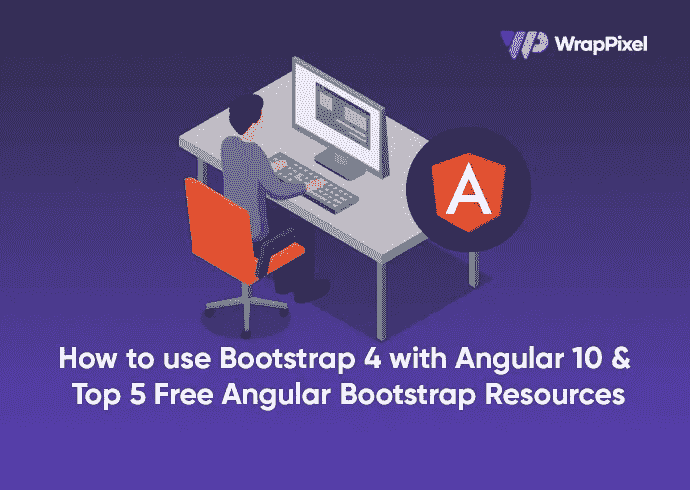
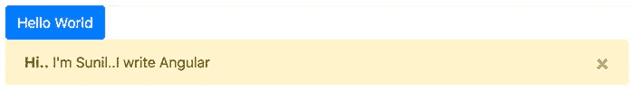
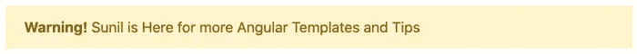
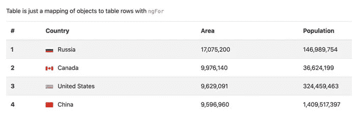
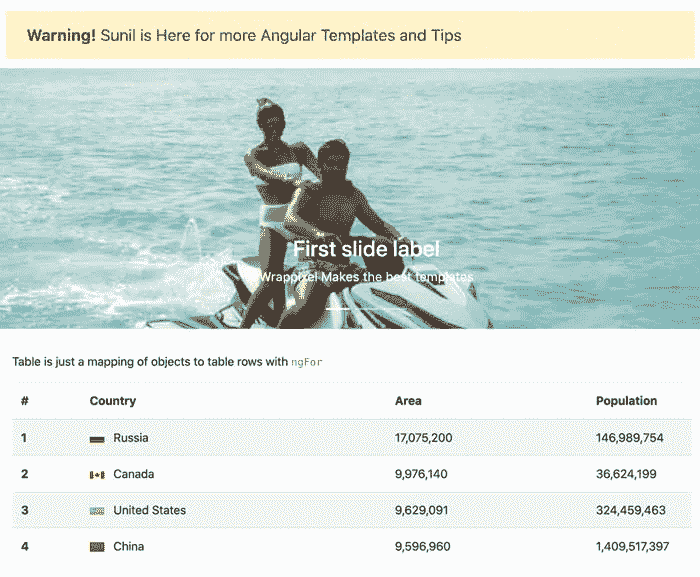
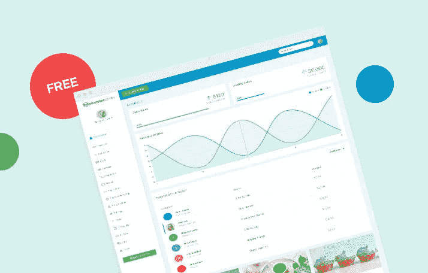
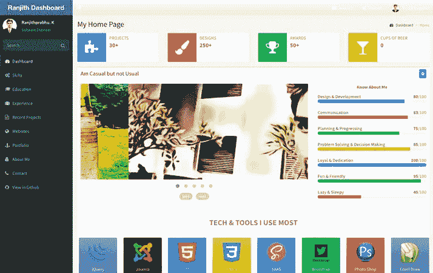
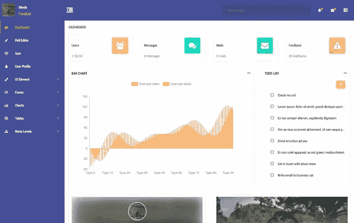
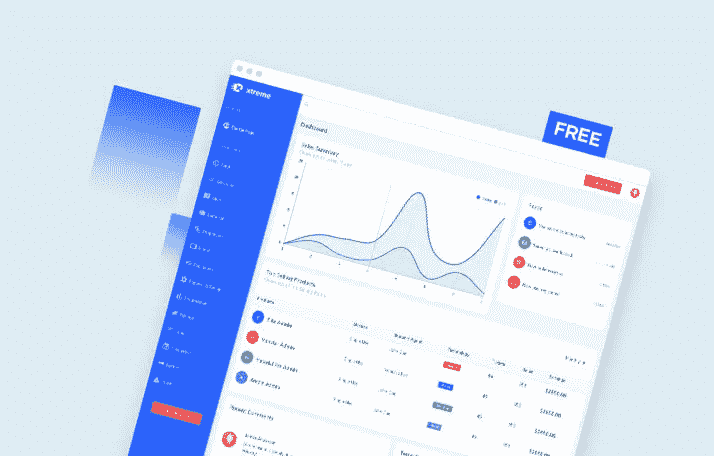

# 前 5 名免费角度引导资源

> 原文：<https://javascript.plainenglish.io/how-to-use-bootstrap-4-with-angular-10-top-5-free-angular-bootstrap-resources-e96640d65b93?source=collection_archive---------13----------------------->



在本文中，我们将看到将 bootstrap 4 安装到 Angular 10 应用程序中的不同方法。通过遵循本指南，您将了解如何将 bootstrap 4 与 Angular 10 配合使用。如果你的本地机器上没有安装 angular 10，你可以看看这个[教程](https://www.wrappixel.com/angular-upgrade/)如何安装。

**先决条件**

*   熟悉 HTML、CSS 和 JavaScript (ES6+)。
*   Vs 代码或安装在开发机器上的任何代码编辑器。
*   角度的基本知识

# 设置我们的角度引导应用程序

我们将从使用 Angular 的 CLI 设置一个新的 Angular 应用程序开始。为此，创建一个目录并在该目录中打开您的终端:

```
ng new bootstrap-angular
```

运行此命令将提示一些安装问题。键入`N`删除角度路由，并选择`css`作为我们应用程序的样式表格式。

安装完成后，我们在终端上输入`cd bootstrap-angular`进入项目目录。

Bootstrap 包括 bootstrap 的核心脚本和 jQuery。我们将使用 npm 来安装和设置这个包。为此，请打开您的终端并运行以下命令。确保您在项目工作目录中):

```
npm install --save bootstrap jquery
```

安装后，我们必须将它添加到我们的角包中。

第一种方法是将它添加到我们的`angular.json`文件中。打开`angular.json`文件并导入到样式和脚本数组中:

```
"styles": [
              "src/styles.css",
              "./node_modules/bootstrap/dist/css/bootstrap.css"
            ],
            "scripts": [
              "./node_modules/jquery/dist/jquery.js",
              "./node_modules/bootstrap/dist/js/bootstrap.js"
            ]
```

这将把引导脚本和样式添加到我们的应用程序中。完成后，我们现在可以通过修改我们的`src/app/app.components.html`文件中的代码来尝试引导组件:

```
<section>
  <div class="container">
    <div class="row">
      <div class="col-md-12">
        <!-- testing buttons -->
        <button class="btn btn-primary">Hello World</button>
        <div
          class="alert alert-warning alert-dismissible fade show"
          role="alert"
        >
          <strong>Hi..</strong> I'm Sunil..I write Angular
          <button
            type="button"
            class="close"
            data-dismiss="alert"
            aria-label="Close"
          >
            <span aria-hidden="true">×</span>
          </button>
        </div>
      </div>
    </div>
  </div>
</section>
```

我们可以通过在终端上运行`ng serve`来打开我们的应用程序。这将在端口 4200 上打开我们的应用程序:



# 使用 Bootstrap CDN 方法

在我们的应用程序中添加引导的另一种方式是在我们的根`index.html`文件中添加引导 CDN。为了确认这是可行的，您可以删除您在`angular.json`文件中添加的代码。将`src/index.html`文件修改为:

```
<!doctype html>
<html lang="en">
<head>
  <meta charset="utf-8">
  <title>BootstrapAngular</title>
  <base href="/">
  <meta name="viewport" content="width=device-width, initial-scale=1">
  <link rel="icon" type="image/x-icon" href="favicon.ico">
  <link rel="stylesheet" href="https://stackpath.bootstrapcdn.com/bootstrap/4.5.2/css/bootstrap.min.css"
    integrity="sha384-JcKb8q3iqJ61gNV9KGb8thSsNjpSL0n8PARn9HuZOnIxN0hoP+VmmDGMN5t9UJ0Z" crossorigin="anonymous">
</head>
<body>
  <app-root></app-root>
  <script src="https://code.jquery.com/jquery-3.5.1.slim.min.js"
    integrity="sha384-DfXdz2htPH0lsSSs5nCTpuj/zy4C+OGpamoFVy38MVBnE+IbbVYUew+OrCXaRkfj" crossorigin="anonymous">
  </script>
  <script src="https://cdn.jsdelivr.net/npm/popper.js@1.16.1/dist/umd/popper.min.js"
    integrity="sha384-9/reFTGAW83EW2RDu2S0VKaIzap3H66lZH81PoYlFhbGU+6BZp6G7niu735Sk7lN" crossorigin="anonymous">
  </script>
  <script src="https://stackpath.bootstrapcdn.com/bootstrap/4.5.2/js/bootstrap.min.js"
    integrity="sha384-B4gt1jrGC7Jh4AgTPSdUtOBvfO8shuf57BaghqFfPlYxofvL8/KUEfYiJOMMV+rV" crossorigin="anonymous">
  </script>
</body>
</html>
```

如果这不能立即起作用，您将不得不重新启动您的应用程序来查看更改。

# 使用 ng-bootstrap 方法

另一个好方法是使用`ng-bootstrap`小部件。这里有我们可以在应用程序中使用的所有引导组件。

要安装它，请打开您的终端并键入以下内容:

```
ng add @ng-bootstrap/ng-bootstrap
```

使用`ng add`配置使工作更容易的包。现在我们可以通过修改我们的`src/app/app.component.html`文件来测试我们的组件:

```
<section>
  <div class="container">
    <div class="row">
      <div class="col-md-12">
        <ul ngbNav #nav="ngbNav" class="nav-tabs">
          <li ngbNavItem>
            <a ngbNavLink>First</a>
            <ng-template ngbNavContent>First content</ng-template>
          </li>
          <li ngbNavItem>
            <a ngbNavLink>Second</a>
            <ng-template ngbNavContent>Second content</ng-template>
          </li>
        </ul>
        <div [ngbNavOutlet]="nav"></div>
      </div>
    </div>
  </div>
</section>
```

我们可以通过使用特定的组件将一些引导组件添加到我们的应用程序中。

# 警报组件

```
<section>
  <p>
    <ngb-alert [dismissible]="false">
      <strong>Warning!</strong> Sunil is Here for more Angular Templates and Tips
    </ngb-alert>
  </p>
</section>
```

在这里，可以使用`ngb-alert`访问警报组件



# 旋转式组件

```
<section>
  <ngb-carousel>
    <ng-template ngbSlide>
      <div class="picsum-img-wrapper">
        
      </div>
      <div class="carousel-caption">
        <h3>First slide label</h3>
        <p>Wrappixel Makes the best templates</p>
      </div>
    </ng-template>
    <ng-template ngbSlide>
      <div class="picsum-img-wrapper">
        
      </div>
      <div class="carousel-caption">
        <h3>Second slide label</h3>
        <p>I am Sunil, I can give you cool Frontend Templates and Tips</p>
      </div>
    </ng-template>
    <ng-template ngbSlide>
      <div class="picsum-img-wrapper">
        
      </div>
      <div class="carousel-caption">
        <h3>Third slide label</h3>
        <p>Praesent commodo cursus magna, vel scelerisque nisl consectetur.</p>
      </div>
    </ng-template>
  </ngb-carousel>
</section>
```

使用`ngb-carousel`可以访问引导转盘组件。每个转盘都有一个`ngbSlide`属性。

# 桌子

我们也可以使用表，因为这是 bootstrap 的核心组件之一。为了使用它，我们将在我们的`src/app/app.component.ts`文件中定义一些虚拟数据:

```
import { Component } from "@angular/core";
interface Country {
  name: string;
  flag: string;
  area: number;
  population: number;
}
const COUNTRIES: Country[] = [
  {
    name: "Russia",
    flag: "f/f3/Flag_of_Russia.svg",
    area: 17075200,
    population: 146989754,
  },
  {
    name: "Canada",
    flag: "c/cf/Flag_of_Canada.svg",
    area: 9976140,
    population: 36624199,
  },
  {
    name: "United States",
    flag: "a/a4/Flag_of_the_United_States.svg",
    area: 9629091,
    population: 324459463,
  },
  {
    name: "China",
    flag: "f/fa/Flag_of_the_People%27s_Republic_of_China.svg",
    area: 9596960,
    population: 1409517397,
  },
];
@Component({
  selector: "app-root",
  templateUrl: "./app.component.html",
  styleUrls: ["./app.component.css"],
})
export class AppComponent {
  title = "bootstrap-angular";
  countries = COUNTRIES;
}
```

然后在`src/app/app.component.htm`文件中定义我们的模板:

```
<section>
      <div class="container">
        <div class="row">
          <div class="col-md-12">
            <p>Table is just a mapping of objects to table rows with <code>ngFor</code></p>
            <table class="table table-striped">
              <thead>
                <tr>
                  <th scope="col">#</th>
                  <th scope="col">Country</th>
                  <th scope="col">Area</th>
                  <th scope="col">Population</th>
                </tr>
              </thead>
              <tbody>
                <tr *ngFor="let country of countries; index as i">
                  <th scope="row">{{ i + 1 }}</th>
                  <td>
                    
                    {{ country.name }}
                  </td>
                  <td>{{ country.area | number }}</td>
                  <td>{{ country.population | number }}</td>
                </tr>
              </tbody>
            </table>
          </div>
        </div>
      </div>
    </section>
```



我们可以把所有的组件放在一起，建立一个很棒的网站。



设置完成后，您可以继续探索应用程序中的所有 Bootstrap 4 组件。

# 面向每位开发者的 5 大免费角度引导模板

# [怪物自由角引导仪表板](https://www.wrappixel.com/templates/monster-angular-lite/)



为了免费获得尖端的 angular admin 模板，WrapPixel 提供了 Monster Angular Lite 供您免费下载。其中一个设计简洁的模板有很多吸引人的特性，可以提供最佳的用户体验。

作为一个突出的模板提供全面响应的页面，具有一系列功能，如页面模板、UI 组件、仪表板、表格示例、100 多种字体图标、图表选项、定期更新等等。一个管理面板角度模板免费下载，提供定制选项，惊人的颜色是基于角度框架和 SaSS 基 CSS。希望为您的商业项目获得高级功能？WrapPixel 独家提供该模板的高级版本，以获得由 Angular 最新版本提供的令人兴奋的功能的完整体验。

*   [怪兽棱角仪表盘 Lite 的现场预览](https://www.wrappixel.com/demos/angular-admin-templates/monster-angular-lite/index.html)
*   [下载怪兽棱角仪表盘 Lite](https://www.wrappixel.com/templates/monster-angular-lite/)
*   [检查高级版的大量新功能](https://www.wrappixel.com/templates/monster-angular-dashboard/)

# [Admin pro Angular Admin Lite](https://www.wrappixel.com/templates/adminpro-angular-lite/)


想象一下，如果你用 admin dashboard angular 免费获得 7+个页面模板、10+个 UI 组件、10+个集成插件、即用型小部件、100+个创意字体图标和定期更新，会怎么样？AdminPro Angular Lite 通过免费提供基本组件来做到这一点。

[免费 angular dashboard templates](https://www.wrappixel.com/templates/category/angular-templates/) 提供的基本组件、元素和小部件资源丰富，利润丰厚，可帮助您为所有项目创建令人惊叹的高性能管理仪表板。要立即获得所有功能，您可以购买商业项目模板的专业版，这不仅可以改善客户体验，还可以简化您的开发过程。

*   [Admin pro Angular Admin Lite 的实时预览](https://www.wrappixel.com/demos/angular-admin-templates/admin-pro-angular-lite/index.html)
*   [下载 AdminPro Angular Admin Lite](https://www.wrappixel.com/templates/adminpro-angular-lite/)
*   [查看高级版的大量新功能](https://www.wrappixel.com/templates/adminpro-angular-dashboard/)

# [兰吉斯角自举](https://github.com/ranjithprabhuk/Angular-Bootstrap-Dashboard)



Angular Bootstrap Dashboard 是一个基于 Bootstrap 和 AngularJS 的 web 仪表盘应用程序。此仪表板模板中包含的所有组件都经过开发，以发挥 HTML5 和 Bootstrap 的所有潜力，并提供一组新功能(JS 和 CSS ),非常适合您的下一个仪表板管理主题或管理 web 应用程序项目。

*   [兰吉斯的现场预告](http://dashboard.ranjithprabhu.in/#/login)
*   [下载 Ranjith](https://github.com/ranjithprabhuk/Angular-Bootstrap-Dashboard)

# [Bknds 仪表板](https://github.com/bknds/ng-pi-admin)



Bknds 是易于使用的管理仪表板基于角度引导。您可以从 github 下载并在您的项目中使用它。它有浅色和深色两种颜色模式，很少有现成的页面模板。它可能很适合你的管理面板。

*   [Bknds 仪表盘实时预览](https://treesflower.com/dist/pages/index)
*   [下载 Bknds 仪表盘](https://github.com/bknds/ng-pi-admin)

# Xtreme 免费角度引导 4 管理员



你优先考虑的是鲜艳的颜色和预算吗？Xtreme Angular Admin Lite 是一个免费的 angular clean design 管理模板，提供完全响应的页面以及即时定制选项，为您的管理仪表板提供个性化的触摸。这个特殊的模板提供了页面模板、图表选项、迷你侧边栏版本、UI 组件、漂亮的字体图标、灵活的设计等功能，适用于您的个人和商业项目。

它基于 Angular 框架和 SaSS Base CSS，采用模块化方法，使其成为最受好评的仪表板模块化设计管理模板。为了获得高级功能的完整优势，WrapPixel 为您提供了一个具有超越功能的专业版。

*   [Xtreme Angular Lite 的实时预览](https://www.wrappixel.com/demos/free-admin-templates/xtreme-angular-lite/)
*   [下载 Xtreme Angular Lite](https://www.wrappixel.com/templates/xtreme-angular-lite/)
*   [查看高级版的大量新功能](https://www.wrappixel.com/templates/xtreme-angular-admin/)