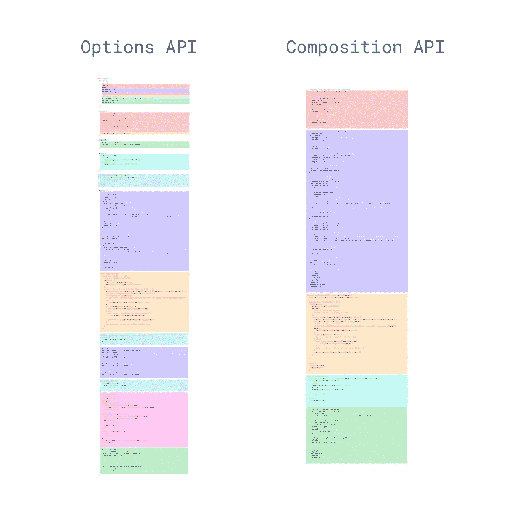

# 如何在 Vue 中使用新的合成 API

> 原文：<https://javascript.plainenglish.io/how-to-use-composition-api-in-vue-967fc9b8393c?source=collection_archive---------1----------------------->

## 在本文中，我们将在 Vue2.x 项目设置中使用 Vue 组合 API，并构建一个简单的 todo 应用程序


Composition API 是最常讨论的，也是 Vue 下一个主要版本的新特性语法。这是使我们的逻辑可重用和组织我们的代码库的一种全新的方法。

# 如何开始使用 API

我们将在现有插件的帮助下使用 Vue2.x 项目中的复合 API，首先用 Vue CLI 创建我们的应用程序

```
vue create composition-todo
```

然后我们需要从命令行安装插件:

```
yarn add @vue/composition-api
```

我们将用下面的代码将插件初始化到 main.js 文件中:

```
import Vue from 'vue'
import App from './App.vue'
import CompositionApi from '@vue/composition-api'

Vue.config.productionTip = false
Vue.use(CompositionApi)

new Vue({
  render: h => h(App),
}).$mount('#app')
```

这就是我们继续使用 API 所需要的一切。我们将开始使用反应式、参考式、计算式、Vue 生命周期等等。让我们继续处理代码，在 app.vue 文件中创建全新的组件，我们将从 API 导入 reactive，并编写下面的代码

```
<template>
  <div id="app">
    <section>
      <input type="text" v-model="state.todo" />
      <ul>
        <li v-for="(todo, i) in state.todolist" :key="i">{{todo}}</li>
      </ul>
    </section>
    <button [@click](http://twitter.com/click)="addTodo">Add Todo</button>
  </div>
</template><script>
import { reactive } from "[@vue/composition-api](http://twitter.com/vue/composition-api)";
export default {
  setup() {
    const { state, addTodo } = useOurTodo();
    return {
      state,
      addTodo
    };
  }
};
function useOurTodo() {
  let state = reactive({
    todo: "",
    todolist: []
  });
  function addTodo() {
    state.todolist.push(state.todo);
    state.todo = "";
  }
  return {
    state,
    addTodo
  };
}
</script><style lang="sass">
</style>
```

如果我们看一下上面的代码，我们可以看到我们已经创建了一个设置函数，设置了我们的反应数据属性并返回了它的值。在 API 的帮助下，我们能够以更具可读性和可重用性的方式构建我们的函数，相比之下，在选项 API 中，之前它会根据结构进行强制。我们可以把代码分成小模块。



comparing with Options API

现在，我们将进一步将逻辑分组到不同的部分。我们将进行修改，使其结构更加合理。

```
<template>
  <div id="app">
    <section>
      <h3>My Todo List</h3>
      <input type="text" v-model="state.todo" />
      <ul>
        <li v-for="(todo, i) in state.todolist" :key="i">
          {{todo}}
          <button @click="removeTodo(i)">x</button>
        </li>
      </ul>
    </section>
    <button @click="addTodo">Add Todo</button>
  </div>
</template>

<script>
import { reactive } from "@vue/composition-api";
export default {
  setup() {
    const { state, addTodo, removeTodo } = useOurTodo();
    return {
      state,
      addTodo,
      removeTodo
    };
  }
};

function useOurTodo() {
  let state = reactive({
    todo: "",
    todolist: []
  });

  function addTodo() {
    state.todolist.push(state.todo);
    state.todo = "";
  }
  function removeTodo(i) {
    state.todolist.splice(i);
  }
  return {
    state,
    addTodo,
    removeTodo
  };
}
</script>

<style lang="sass">
</style>
```

我们对代码做了进一步的修改。这样，我们可以用更简洁的方式编写代码，这对我们的代码结构化和模块化很有用。类似地，我们可以使用更多提供的组合 API 特性，比如 Props、watchers、context、Lifecycle hooks，这些将在下一篇文章中讨论。

代码现在得到了改进，但是它展示了逻辑分离的重要性。我们不必理解哪些数据或属性或方法属于哪个组件领域，我们现在可以简单地将它分组到可读性更好、可重用的模块化函数中。

你可以从 Github 获得代码，也请查看 branch = >[shorturl.at/hxU34](http://shorturl.at/hxU34)

*********************** —快乐编码—* * * * * * * * * * * * * * * * * * * * * * *

**参考读物:**

[](https://dev.to/dasdaniel/composition-api-in-vue3-2ob6) [## 在 Vue3 中尝试合成 API

### 10 月 4 日，Vue-3 代码在 github.com/vuejs/vue-next 公开，它仍然在 alpha monorepo 之前，你…

开发到](https://dev.to/dasdaniel/composition-api-in-vue3-2ob6) [](https://rimdev.io/vue-3-composition-api/) [## Vue 3 组合 API

### 您是否发现自己迷失在具有多种功能的大型 Vue 组件中？组合 API 是一个新的…

rimdev.io](https://rimdev.io/vue-3-composition-api/)