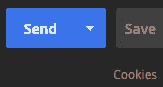
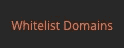
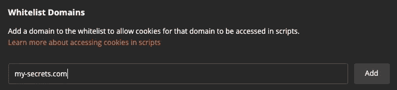
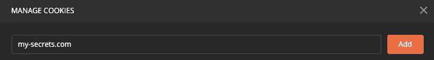
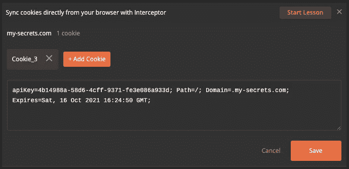
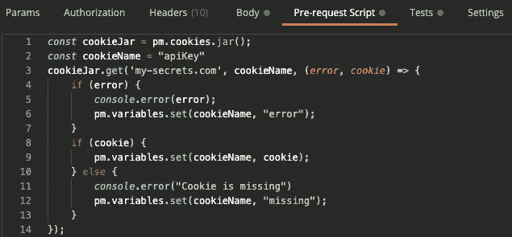
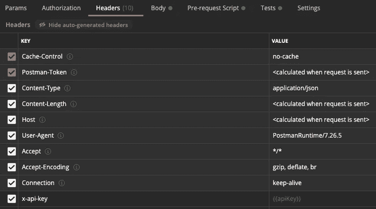
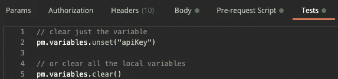

# 如何在 Postman 中使用 Cookies 存储秘密

> 原文：<https://javascript.plainenglish.io/how-to-use-cookies-to-store-secrets-in-postman-afa9a666590d?source=collection_archive---------3----------------------->


Photo by [Christina Branco](https://unsplash.com/@starvingartistfoodphotography?utm_source=medium&utm_medium=referral) on [Unsplash](https://unsplash.com?utm_source=medium&utm_medium=referral)

在 Postman 环境中存储您的秘密(例如，API 密钥和密码)可能无法满足您的安全需求。尽管它们是静态存储的，但是每个团队成员都可以明文访问它们。您可以利用 Postman cookies 作为替代，因为它们对于机器、计算机用户和 Postman 桌面客户端来说都是本地的。

你可能会想，“饼干不好。它们也是纯文本。”

没错。是的，但至少它们没有存储在 Postman 服务器中，每个团队成员都可以访问。

[邮差沙箱](https://learning.postman.com/docs/writing-scripts/script-references/postman-sandbox-api-reference/#using-external-libraries)支持 [crypto-js](https://www.npmjs.com/package/crypto-js) 包，你可以用它来增加 cookie 值的安全性。

让我们来探索如何使用邮递员 cookie。为了简单起见，我就不做加密了。

## 创建 Cookie

在您的请求中，单击“Cookies”链接。



The “Cookies” link is below the “Send” button in your request.

将域列入白名单。



This link is located at the bottom-left of the Cookies dialog.



Use a fake domain.

将域添加到您的 cookies 中。



Add the fake domain to your cookies.

添加一个 cookie。



Add a cookie to the fake domain.

现在，您可以在请求中使用 cookie 的值。

## 使用 cookie

使用请求前脚本设置局部变量。局部变量只适用于邮递员[文档](https://learning.postman.com/docs/sending-requests/variables/#variable-scopes)的请求。

```
*const* cookieJar = pm.cookies.jar();*const* cookieName = "apiKey"cookieJar.get('my-secrets.com', cookieName, (*error*, *cookie*) *=>* { if (error) { *console*.error(error); pm.variables.set(cookieName, "error"); } if (cookie) { pm.variables.set(cookieName, cookie); } else { *console*.error("Cookie is missing") pm.variables.set(cookieName, "missing"); }});
```



The pre-request script code.

照常在请求中使用变量。在这个例子中，我们将在头中使用“apiKey”变量。



Setting the header using the variable containing the cookie’s value.

为了安全起见，请确保清除局部变量。我们将在测试中这样做。

```
// clear just the variablepm.variables.unset("apiKey")// or clear all the local variablespm.variables.clear()
```



Clearing the variable after the request.

## 结论

该方法将允许您在 Postman 中使用秘密，而无需与世界共享。

阅读第 2 部分:“如何在 Postman 中使用 CryptoJS 和 Cookies 处理秘密。”

[](/postman-secrets-cookies-cryptojs-4051db70e8c2) [## 如何使用 CryptoJS 和 Cookies 在 Postman 中处理秘密

### 在我之前的文章中，我们探讨了如何在 Postman 中使用 cookies 来存储您的秘密。取决于您的安全性…

javascript.plainenglish.io](/postman-secrets-cookies-cryptojs-4051db70e8c2) 

# 作者的笔记

加入我的邮件列表来接收关于我写作的更新。

访问[**miguelacallesmba.com/subscribe**](https://miguelacallesmba.com/subscribe)并报名。

保持安全，米格尔

## 关于作者

Miguel 是首席安全工程师，也是“[无服务器安全](https://ServerlessSecurityBook.com)”一书的作者。作为一名开发人员和安全工程师，他参与了多个无服务器项目，为开源无服务器项目做出了贡献，并以各种工程角色参与了大型军事系统。