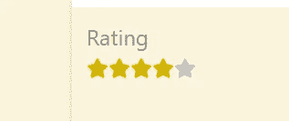

# 如何使用 CSS 和 React 创建星级

> 原文：<https://javascript.plainenglish.io/how-to-use-css-and-react-to-create-a-star-rating-5bfc85882b1b?source=collection_archive---------8----------------------->


Photo by [Anna Tukhfatullina Food Photographer/Stylist](https://unsplash.com/@anna_tukhfatullina?utm_source=unsplash&utm_medium=referral&utm_content=creditCopyText) on [Unsplash](https://unsplash.com/s/photos/star-rating?utm_source=unsplash&utm_medium=referral&utm_content=creditCopyText)

作为个人项目的一部分，我正在开发一个页面，用户可以在上面添加关于他们尝试过的啤酒的新帖子。在新帖子的表单中，我添加了通过星级来评定啤酒的选项。



Star Rating

星星最初都是灰色的。当用户点击一颗星星时，啤酒的等级就设定好了。您可以自定义未选中或选中的星星的颜色。

## 反应 JSX 明星图标

表单组件包含 star rating 部分，该部分有一个带有文本`Rating`的`p`元素和 5 种字体的 Awesome 填充的星形图标。

## SCSS 模块风格的明星

我将 scss 模块中的所有样式作为一个对象导入到`new.js`文件中。星星的容器等级是`rating`。

```
import styles from './new.module.scss';
```

在引入任何功能之前，我将星星的初始颜色设置为灰色。我还使用 sass 将悬停的星星和左边的任何星星的颜色设置为黄色。

如果你看一下`new.js`，你会发现有一个内部的 div 来包含这五颗星星。当悬停在这个 div 上时，我将所有星星的颜色设置为黄色。星号在 scss 文件中被称为 SVG，因为它们是 SVG HTML 元素。

然后，我不得不基本上取消选择所有的明星的权利，悬停的明星。这是因为如果用户悬停在第三颗星星上，这表明他们想要将评级设置为 3/5，左边的两颗星星进入等式。

因此，我使用 CSS 选择器`~`将任何后续星星的颜色设置为灰色，当用户悬停在任何给定的星星上时。

## 处理用户点击星号的反应状态和函数

我创建了一个状态数组变量来跟踪每个星星是否被点击过。

```
const [clicked, setClicked] = useState([false, false, false, false, false]);
```

第一颗星的指数为 0，第二颗星的指数为 1，依此类推。

每当用户点击一颗星时，`clicked`中的元素直到并包括被点击的星的索引，将被设置为真。

对应于星号的 React 元素将监听被点击的状态，以确定采用哪个 CSS 类。

带有状态、星形单击处理程序和星形元素的 react 代码如下:

当用户点击一颗星时，`handleStarClick`将被调用来为`clicked`状态变量中的元素设置 true，直到并包括被点击的星的索引。那么`clicked[i]`对于那些`i`索引将为真，并且 react 星形元素将具有`className={styles.clickedstar}`。

```
.clickedstar {
    color: rgb(212, 180, 0);
}
```

如果星号没有被点击，则没有应用特殊的类，它呈现默认的灰色，表明它没有被用户点击。

这就是我为使我简单的星级评定工作而必须编写的全部代码。感谢您的阅读，请让我知道是否有我可以改善我的代码的方法。