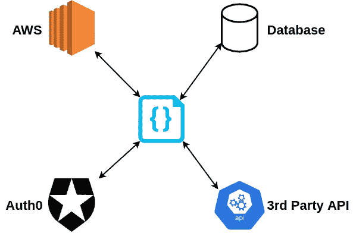
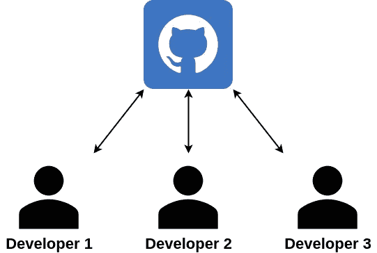
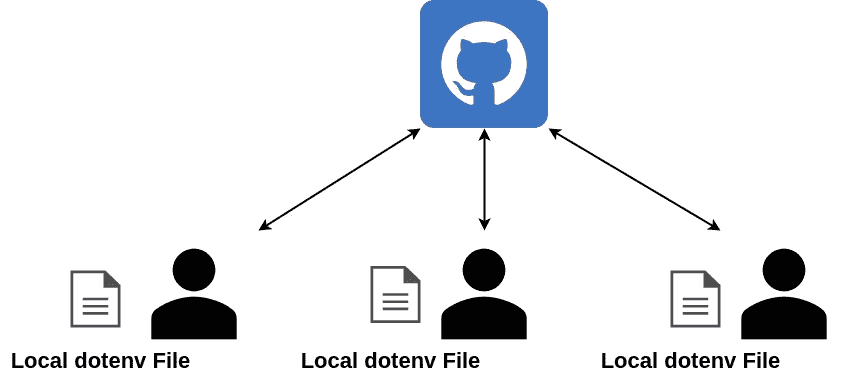

# 如何在 Express 中使用 dotenv

> 原文：<https://javascript.plainenglish.io/how-to-use-dotenv-in-express-3aa933758ead?source=collection_archive---------2----------------------->

## 使用 dotenv in Express 轻松保护您应用程序的敏感信息。

## 现代应用程序使用各种数据。

有时，数据被用于认证第三方服务、连接到数据库或任何其他无数选项。在数据库连接的例子中，必要的数据是开发人员的**用户名**和**密码**，以及许多其他必需的参数。

为此，应用程序必须能够访问这些数据。这意味着数据必须存储在应用程序可以访问的地方。

存储数据最容易的地方就是源代码。然而，这为开发者的数据引入了安全问题，因为数据是私有的，并且不应该对那些可以看到源代码的人可用。

本文将采用以问题为中心的方法来解释**为什么**开发者使用`dotenv`来解决这个问题，然后快速演示如何使用这个软件包。

# 问题是

在源代码中存储数据是开发人员每天都要做的事情。然而，当存储敏感数据时，这就成了一个问题。

敏感数据可能是以下任何一种:

*   AWS 凭证；
*   数据库凭据；
*   Auth0 凭据；

问题出现在项目源代码的协作和公共可见性上。

大多数开发人员使用**版本控制系统** ( **VCS** )来管理项目。一个流行的例子是 GitHub。当开发者将他们的源代码发布到 VCS 上时，该代码由第三方(VCS)和任何其他有权访问开发者的库的开发者(合作者)托管并可见。不仅如此，VCS 通常还会存储项目所有状态的历史记录，这意味着删除后，被移除的数据仍然可见。

因为源代码对任何有权访问的人都是可见的，所以存储在应用程序源代码中的所有数据都是可见的。因此，敏感数据受到危害。开发人员不能确切地确定谁有权访问他们的敏感信息，因为数据可能会在一场疯狂失控的电话游戏中传播。

数据泄露的问题非常严重。不过，有一个解决方案。

# dotenv 作为解决方案

`dotenv`是一个 NPM 包，用于存储**环境变量**中的敏感数据。

环境变量是应用程序的外部变量。开发人员可以将它们视为存储在机器的操作系统或应用程序的运行容器中的配置数据。这些变量是在运行时动态配置的，可以根据应用程序运行的环境而改变。

环境变量是保护敏感数据的一个很好的解决方案。

应用程序可以引用环境变量来查找必要的数据，而不是指定特定开发人员用来在他们的机器上运行应用程序的确切数据。因此，开发人员不会将敏感数据推送到自己的 VCS，而是会将引用环境变量的源代码推送到本地的开发人员源代码**中。**

为了避免将本地`dotenv`文件推送到 VCS，它被 VCS 指定的**忽略文件**忽略。

# 设置演示应用程序

我们将使用命令`express --view=pug dotenv-demo`来设置我们的`dotenv`演示。

运行命令后，`cd dotenv-demo`。

我们只需要为这个项目安装一个依赖项，这是显而易见的:`dotenv`。运行命令`npm i dotenv`将其安装在`package.json`中。

最后，用`npm i`安装模块。

## 创建必要的文件

在项目的根目录下创建两个文件:`.gitignore`和`.env`。

`.env`将用于存储我们的本地环境变量，`.gitignore`将用于确保`.env`不会被推送到 GitHub。

打开`.gitignore`并添加以下代码:

简单吧？现在，`.env`不会被推送到 GitHub(只要我们在编写`gitignore`之前没有提交)。我们的环境变量对于我们的机器来说是局部的。

## 行动中的 dotenv

我们需要一些数据来测试`dotenv`是否真的在工作。首先，我们需要指定我们的应用程序应该使用`dotenv`从`.env`加载环境变量。

打开`app.js`,使它看起来像下面的代码片段:

第一行是唯一重要的一行。这一行需要`dotenv`，并使来自`.env`的环境变量可以被 NodeJS 中的`process.env`对象访问。

接下来，让我们给`.env`添加一些数据，这些数据将显示在`/`路径上:

`SAMPLE_DATA`是环境变量的名称，`dotenv is working!`是它的值。

打开文件`./routes/index.js`并修改代码以匹配以下代码:

环境变量存储在`process.env`对象上。`SAMPLE_DATA`是我们在上一步中编写的变量的名称。

现在，用`npm start`测试应用程序。转到`/`路径，查看环境变量是否已经提取并显示在页面上。输出应该类似于:

Woo!

太好了——它起作用了。现在我们的`SAMPLE_DATA`值是安全的，任何其他协作开发人员都可以使用`.env`文件替换他们自己的变量值，而不需要依赖其他人的数据。

感谢阅读这篇文章，祝编码快乐！