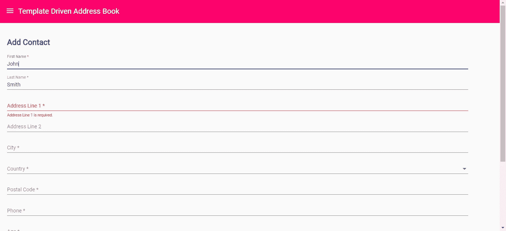
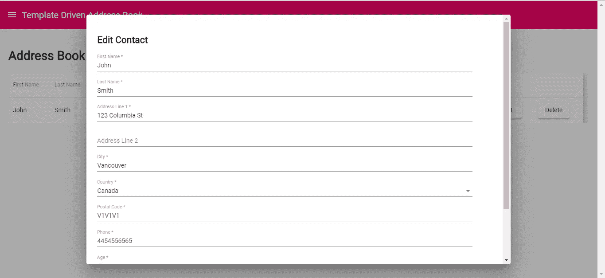
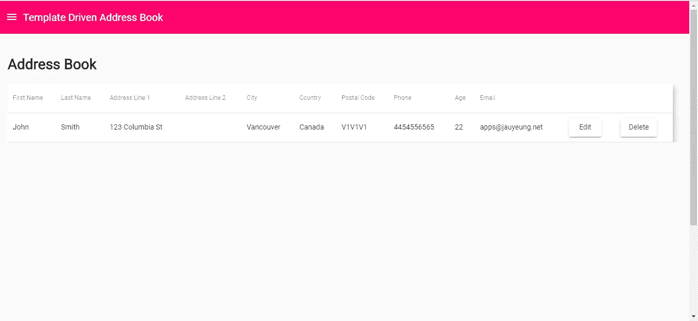
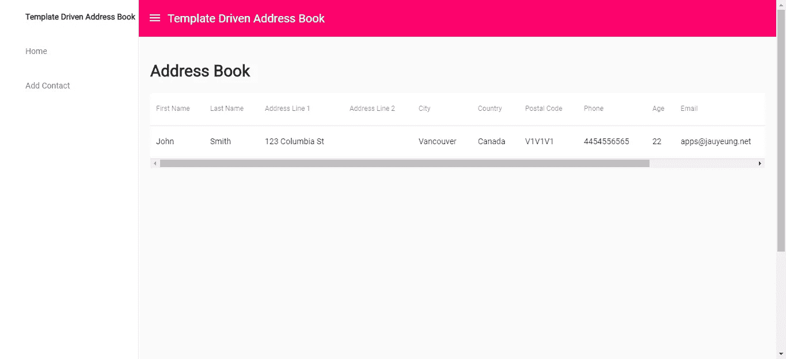

# 如何在 Angular 中使用事件发射器

> 原文：<https://javascript.plainenglish.io/how-to-use-event-emitters-in-angular-d051f6152b1a?source=collection_archive---------2----------------------->

Angular 是一个用于构建应用程序的综合框架。Angular 的一个优点是可以将数据从父组件传递到子组件，以及从子组件传递到父组件。React 只能将数据从父组件传递到子组件。

在这个故事中，我们将构建一个具有添加和编辑联系人功能的地址簿应用程序。用于添加和编辑联系人的表单将使用基于模板的表单验证，这是 Angular 允许您验证表单的方式之一。

这将是一个简单的应用程序。它有一个主页，在一个表中列出了联系人，每行有一个编辑按钮，允许用户编辑他们的联系人的对话框，每行有一个删除按钮，允许您删除当前行中的联系人。

要开始构建应用程序，我们首先必须通过运行`npm i -g @angular/cli`来安装 Angular CLI。请务必选择包括路由和使用 SCSS 的风格时，要求。然后我们通过运行`ng new template-drive-form-app`来创建项目。

接下来我们必须安装一些库。我们需要一个 flux store 来方便地传递数据，还需要另一个库来验证无法用 Angular 轻松验证的表单数据。我们使用`@ngrx/store`存储 flux，使用`ng2-validation`添加额外的表单验证功能。我们使用有棱角的材料部件来使我们的应用程序看起来更有吸引力。我们通过运行`npm i @ngrx/store ng2-validation @angular/cdk @angular/material`来安装它们。

现在我们已经准备好构建我们的应用程序了。我们通过运行`ng add @ngrx/store`添加 flux store 样板文件。这将创建一个包含`index.ts`文件的`reducers` 文件夹。

然后我们创建我们的组件。我们运行以下命令:

```
ng g component contactDialog
ng g component contactForm
ng g component contactFormPage
ng g component homePage
ng g component topBar
ng g service contactService
ng g class exports
```

这就创建了我们需要的组件和服务。`exports.ts`文件将包含我们的国家列表。

在`environment.ts`中，我们把:

```
export const environment = {
  production: false,
  apiUrl: '[http://localhost:3000'](http://localhost:3000')
};
```

这将允许我们连接到我们的 JSON 服务器 API，它允许我们将数据保存到一个 JSON 文件中，而无需创建我们自己的后端。它以 Node.js 包的形式提供。该包装的详细说明位于[https://github.com/typicode/json-server](https://github.com/typicode/json-server)。

接下来在`contact-dialog.component.ts`中，如果上面的`ng g`命令都运行了，我们应该得到:

```
import { Component, OnInit, Inject } from '[@angular/core](http://twitter.com/angular/core)';
import { MatDialogRef, MAT_DIALOG_DATA } from '[@angular/material](http://twitter.com/angular/material)';
import { ContactService } from '../contact.service';
import { Store } from '[@ngrx/store](http://twitter.com/ngrx/store)';
import { SET_CONTACTS } from '../reducers/contacts-reducer';[@Component](http://twitter.com/Component)({
  selector: 'app-contact-dialog',
  templateUrl: './contact-dialog.component.html',
  styleUrls: ['./contact-dialog.component.scss']
})
export class ContactDialogComponent implements OnInit {constructor(
    public dialogRef: MatDialogRef<ContactDialogComponent>,
    [@Inject](http://twitter.com/Inject)(MAT_DIALOG_DATA) public contactData: any,
    private contactService: ContactService,
    private store: Store<any>
  ) { }ngOnInit() {
  }getContacts() {
    this.contactService.getContacts()
      .subscribe(res => {
        this.store.dispatch({ type: SET_CONTACTS, payload: res });
        this.dialogRef.close();
      })
  }}
```

这允许我们在联系人更新后从服务器获取联系人。

在`contact-dialog.component.html`中，我们输入:

```
<h2>Edit Contact</h2>
<app-contact-form [edit]='true' [contact]='contactData' (contactEdited)='getContacts()'></app-contact-form>
```

我们将`edit`和`contact`值作为输入传递给`app-contact-form`元素。一旦联系人被更新，`(contactEdited)`事件就被发送给这个组件，然后它将获取联系人并更新存储，因为`getContacts`在`contactEdited`事件中被设置为事件处理函数。注意`EventEmitter`事件只从源组件传播到它的直接父组件。其他组件不会收到这个事件，所以即使你把`(contactEdited)=’getContacts()’`放在另一个组件模板文件中，它也不会做任何事情。

接下来在`contact-form.component.ts`中，我们放入:

```
import { Component, OnInit, Input, SimpleChanges, Output } from '[@angular/core](http://twitter.com/angular/core)';
import { COUNTRIES } from '../exports';
import { NgForm } from '[@angular/forms](http://twitter.com/angular/forms)';
import { Store } from '[@ngrx/store](http://twitter.com/ngrx/store)';
import { ContactService } from '../contact.service';
import { SET_CONTACTS } from '../reducers/contacts-reducer';
import { Router } from '[@angular/router](http://twitter.com/angular/router)';
import { EventEmitter } from '[@angular/core](http://twitter.com/angular/core)';[@Component](http://twitter.com/Component)({
  selector: 'app-contact-form',
  templateUrl: './contact-form.component.html',
  styleUrls: ['./contact-form.component.scss']
})
export class ContactFormComponent implements OnInit {
  contactData: any = <any>{};
  countries = COUNTRIES;
  [@Input](http://twitter.com/Input)('edit') edit: boolean;
  [@Input](http://twitter.com/Input)('contact') contact: any = <any>{};
  [@Output](http://twitter.com/Output)('contactEdited') contactEdited = new EventEmitter();constructor(
    private store: Store<any>,
    private contactService: ContactService,
    private router: Router
  ) { }ngOnInit() {
  }ngOnChanges(changes: SimpleChanges) {
    if (this.contact) {
      this.contactData = this.contact;
    }
  }getPostalCodeRegex() {
    if (this.contactData.country == "United States") {
      return /^[0-9]{5}(?:-[0-9]{4})?$/;
    } else if (this.contactData.country == "Canada") {
      return /^[A-Za-z]\d[A-Za-z][ -]?\d[A-Za-z]\d$/;
    }
    return /./;
  }getPhoneRegex() {
    if (["United States", "Canada"].includes(this.contactData.country)) {
      return /^[2-9]\d{2}[2-9]\d{2}\d{4}$/;
    }
    return /./;
  }save(contactForm: NgForm) {
    if (contactForm.invalid) {
      return;
    }if (this.edit) {
      this.contactService.editContact(this.contactData)
        .subscribe(res => {
          this.contactEdited.emit(null);
        })
    }
    else {
      this.contactService.addContact(this.contactData)
        .subscribe(res => {
          this.getContacts();
          this.router.navigate(['/']);
        })
    }
  }getContacts() {
    this.contactService.getContacts()
      .subscribe(res => {
        this.store.dispatch({ type: SET_CONTACTS, payload: res });
      })
  }
}
```

这是我们返回正则表达式模式来动态验证电话和邮政编码格式的地方。它还允许我们根据之前传入的`edit`输入是否为真来添加或更新联系人。一旦保存了联系人，我们就更新存储或向父节点发出`contactEdited`事件，然后从后端更新联系人存储。`emit`函数为您想要传递回父节点的数据获取一个参数。

在`contact-form.component.html`中，我们输入:

```
<form #contactForm='ngForm' (ngSubmit)='save(contactForm)'>
    <mat-form-field>
        <input matInput placeholder="First Name" required #firstName='ngModel' name='firstName'
            [(ngModel)]='contactData.firstName'>
        <mat-error *ngIf="firstName?.invalid && (firstName.dirty || firstName.touched)">
            <div *ngIf="firstName.errors.required">
                First Name is required.
            </div>
        </mat-error>
    </mat-form-field>
    <br>
    <mat-form-field>
        <input matInput placeholder="Last Name" required #firstName='ngModel' name='lastName'
            [(ngModel)]='contactData.lastName'>
        <mat-error *ngIf="lastName?.invalid && (lastName.dirty || lastName.touched)">
            <div *ngIf="lastName.errors.required">
                Last Name is required.
            </div>
        </mat-error>
    </mat-form-field>
    <br>
    <mat-form-field>
        <input matInput placeholder="Address Line 1" required #addressLineOne='ngModel' name='addressLineOne'
            [(ngModel)]='contactData.addressLineOne'>
        <mat-error *ngIf="addressLineOne?.invalid && (addressLineOne.dirty || addressLineOne.touched)">
            <div *ngIf="addressLineOne.errors.required">
                Address Line 1 is required.
            </div>
        </mat-error>
    </mat-form-field>
    <br>
    <mat-form-field>
        <input matInput placeholder="Address Line 2" #addressLineTwo='ngModel' name='addressLineTwo'
            [(ngModel)]='contactData.addressLineTwo'>
    </mat-form-field>
    <br>
    <mat-form-field>
        <input matInput placeholder="City" required #city='ngModel' name='city' [(ngModel)]='contactData.city'>
        <mat-error *ngIf="city?.invalid && (city.dirty || city.touched)">
            <div *ngIf="city.errors.required">
                City is required.
            </div>
        </mat-error>
    </mat-form-field>
    <br>
    <mat-form-field>
        <mat-label>Country</mat-label>
        <mat-select matInput required #country='ngModel' name='country' [(ngModel)]='contactData.country'>
            <mat-option *ngFor="let c of countries" [value]="c.name">
                {{c.name}}
            </mat-option>
        </mat-select>
        <mat-error *ngIf="country?.invalid && (country.dirty || country.touched)">
            <div *ngIf="country.errors.required">
                Country is required.
            </div>
        </mat-error>
    </mat-form-field>
    <br>
    <mat-form-field>
        <input matInput placeholder="Postal Code" required #postalCode='ngModel' name='postalCode'
            [(ngModel)]='contactData.postalCode' [pattern]='getPostalCodeRegex()'>
        <mat-error *ngIf="postalCode?.invalid && (postalCode.dirty || postalCode.touched)">
            <div *ngIf="postalCode.errors.required">
                Postal code is required.
            </div>
        </mat-error>
    </mat-form-field>
    <br>
    <mat-form-field>
        <input matInput placeholder="Phone" required #phone='ngModel' name='phone' [(ngModel)]='contactData.phone'
            [pattern]='getPhoneRegex()'>
        <mat-error *ngIf="phone?.invalid && (phone.dirty || phone.touched)">
            <div *ngIf="phone.errors.required">
                Phone is required.
            </div>
            <div *ngIf="phone?.invalid">
                Phone is invalid.
            </div>
        </mat-error>
    </mat-form-field>
    <br>
    <mat-form-field>
        <input matInput placeholder="Age" required #age='ngModel' name='age' [(ngModel)]='contactData.age'
            [range]="[0, 200]">
        <mat-error *ngIf="age?.invalid && (age.dirty || age.touched)">
            <div *ngIf="age.errors.required">
                Age is required.
            </div>
            <div *ngIf="age?.errors?.range">
                Age is invalid.
            </div>
        </mat-error>
    </mat-form-field>
    <br>
    <mat-form-field>
        <input matInput placeholder="Email" required #email='ngModel' name='email' [(ngModel)]='contactData.email'
            email>
        <mat-error *ngIf="email?.invalid && (email.dirty || email.touched)">
            <div *ngIf="email.errors.required">
                Email is required.
            </div>
            <div *ngIf="email?.errors?.email">
                Email is invalid.
            </div>
        </mat-error>
    </mat-form-field>
    <br>
    <div mat-dialog-actions>
        <button mat-raised-button cdkFocusInitial>Save</button>
    </div>
</form>
```

这是用于验证联系人数据的表单。`range`输入由`ng2-validation`提供。同一个包中也提供了`email`属性。`required`属性由 Angular 提供。`#inputName=’ngModel’ name=’inputName’`您的输入需要进行验证。例如，在电话号码输入中，如果您提供了`#phone=’ngModel’ name=’phone’`，那么您可以显示电话号码验证的错误:

```
<mat-error *ngIf="phone?.invalid && (phone.dirty || phone.touched)">
  <div *ngIf="phone.errors.required">
      Phone is required.
  </div>
  <div *ngIf="phone?.invalid">
      Phone is invalid.
  </div>
</mat-error>
```

我们用`phone.errors.required`检查`required`错误的存在，用`phone?.invalid`检查无效格式错误。`pattern`属性是我们添加到表单字段中的内容，用来验证正则表达式。它可以是动态的，也可以是静态的。如果它是静态的，我们把它放入动态属性`pattern`的值中。否则，我们可以像以前一样编写一个函数来返回正则表达式。

`ng2-validation`包的工作方式也是如此。我们定义了`#age=’ngModel’ name=’age’`。对于年龄字段，我们通过添加`[range]=”[0, 200]”`来定义我们希望有效的范围，然后我们以类似的方式检查并显示错误:

```
<mat-error *ngIf="age?.invalid && (age.dirty || age.touched)">
  <div *ngIf="age.errors.required">
    Age is required.
  </div>
  <div *ngIf="age?.errors?.range">
    Age is invalid.
  </div>
</mat-error>
```

`ng2-validation`包为`age`表单字段的`errors`对象提供了`range`字段，方便检查数字范围。

接下来在`contact-form-page.component.html`中，我们放入:

```
<h2>Add Contact</h2>
<app-contact-form></app-contact-form>
```

显示我们的联系人表单以添加联系人。

在`home-page.component.ts`中，我们把:

```
import { Component, OnInit } from '[@angular/core](http://twitter.com/angular/core)';
import { Store, select } from '[@ngrx/store](http://twitter.com/ngrx/store)';
import { ContactService } from '../contact.service';
import { SET_CONTACTS } from '../reducers/contacts-reducer';
import { ContactDialogComponent } from '../contact-dialog/contact-dialog.component';
import { MatDialog } from '[@angular/material](http://twitter.com/angular/material)';[@Component](http://twitter.com/Component)({
  selector: 'app-home-page',
  templateUrl: './home-page.component.html',
  styleUrls: ['./home-page.component.scss']
})
export class HomePageComponent implements OnInit {
  displayedColumns: string[] = [
    'firstName',
    'lastName',
    'addressLineOne',
    'addressLineTwo',
    'city',
    'country',
    'postalCode',
    'phone',
    'age',
    'email',
    'edit',
    'delete'
  ]
  contacts: any[] = [];constructor(
    private store: Store<any>,
    private contactService: ContactService,
    public dialog: MatDialog
  ) {
    store.pipe(select('contacts'))
      .subscribe(contacts => {
        this.contacts = contacts;
      })
  }ngOnInit() {
    this.getContacts();
  }getContacts() {
    this.contactService.getContacts()
      .subscribe(res => {
        this.store.dispatch({ type: SET_CONTACTS, payload: res });
      })
  }openEditContactDialog(index: number) {
    const dialogRef = this.dialog.open(ContactDialogComponent, {
      width: '70vw',
      maxHeight: '90vh',
      data: Object.assign({}, this.contacts[index])
    })dialogRef.afterClosed().subscribe(result => {
      console.log('The dialog was closed');
    });
  }deleteContact(contactId: number) {
    this.contactService.deleteContact(contactId)
      .subscribe(res => {
        this.getContacts();
      })
  }
}
```

这是我们获取联系人数据并将其显示在表格中的地方，也是让用户单击 edit 打开 edit contact form 对话框并单击 delete 删除其联系人的地方。

在`home-page.component.html`中，我们把:

```
<h1>Address Book</h1>
<div class='table-responsive'>
    <table mat-table [dataSource]="contacts" class="mat-elevation-z8"><ng-container matColumnDef="firstName">
            <th mat-header-cell *matHeaderCellDef>First Name</th>
            <td mat-cell *matCellDef="let c"> {{c.firstName}} </td>
        </ng-container><ng-container matColumnDef="lastName">
            <th mat-header-cell *matHeaderCellDef>Last Name </th>
            <td mat-cell *matCellDef="let c"> {{c.lastName}} </td>
        </ng-container><ng-container matColumnDef="addressLineOne">
            <th mat-header-cell *matHeaderCellDef>Address Line 1</th>
            <td mat-cell *matCellDef="let c"> {{c.addressLineOne}} </td>
        </ng-container><ng-container matColumnDef="addressLineTwo">
            <th mat-header-cell *matHeaderCellDef>Address Line 2</th>
            <td mat-cell *matCellDef="let c"> {{c.addressLineTwo}} </td>
        </ng-container><ng-container matColumnDef="city">
            <th mat-header-cell *matHeaderCellDef>City</th>
            <td mat-cell *matCellDef="let c"> {{c.city}} </td>
        </ng-container><ng-container matColumnDef="country">
            <th mat-header-cell *matHeaderCellDef>Country</th>
            <td mat-cell *matCellDef="let c"> {{c.country}} </td>
        </ng-container><ng-container matColumnDef="postalCode">
            <th mat-header-cell *matHeaderCellDef>Postal Code</th>
            <td mat-cell *matCellDef="let c"> {{c.postalCode}} </td>
        </ng-container><ng-container matColumnDef="phone">
            <th mat-header-cell *matHeaderCellDef>Phone</th>
            <td mat-cell *matCellDef="let c"> {{c.phone}} </td>
        </ng-container><ng-container matColumnDef="age">
            <th mat-header-cell *matHeaderCellDef>Age</th>
            <td mat-cell *matCellDef="let c"> {{c.age}} </td>
        </ng-container><ng-container matColumnDef="email">
            <th mat-header-cell *matHeaderCellDef>Email</th>
            <td mat-cell *matCellDef="let c"> {{c.email}} </td>
        </ng-container><ng-container matColumnDef="edit">
            <th mat-header-cell *matHeaderCellDef></th>
            <td mat-cell *matCellDef="let c; let i = index">
                <button mat-raised-button (click)='openEditContactDialog(i)'>Edit</button>
            </td>
        </ng-container><ng-container matColumnDef="delete">
            <th mat-header-cell *matHeaderCellDef></th>
            <td mat-cell *matCellDef="let c">
                <button mat-raised-button (click)='deleteContact(c.id)'>Delete</button>
            </td>
        </ng-container><tr mat-header-row *matHeaderRowDef="displayedColumns"></tr>
        <tr mat-row *matRowDef="let row; columns: displayedColumns;"></tr>
    </table>
</div>
```

以显示表格。

然后在`home-page.component.scss`中，我们放入:

```
th,
td {
  padding: 10px !important;
}table.mat-table {
  width: 95vw;
}
```

向表格单元格添加一些填充并更改表格的宽度。

在`top-bar.component.ts`中，我们有:

```
import { Component, OnInit } from '[@angular/core](http://twitter.com/angular/core)';
import { Store, select } from '[@ngrx/store](http://twitter.com/ngrx/store)';
import { TOGGLE_MENU } from '../reducers/menu-reducer';[@Component](http://twitter.com/Component)({
  selector: 'app-top-bar',
  templateUrl: './top-bar.component.html',
  styleUrls: ['./top-bar.component.scss']
})
export class TopBarComponent implements OnInit {
  menuOpen: boolean;constructor(
    private store: Store<any>
  ) {
    store.pipe(select('menu'))
      .subscribe(menuOpen => {
        this.menuOpen = menuOpen;
      })
  }ngOnInit() {
  }toggleMenu() {
    this.store.dispatch({ type: TOGGLE_MENU, payload: !this.menuOpen });
  }
}
```

这允许用户使用菜单按钮打开和关闭菜单。

在`top-bar.component.html`中，我们有:

```
<mat-toolbar>
    <a (click)='toggleMenu()' class="menu-button">
        <i class="material-icons">
            menu
        </i>
    </a>
    Template Driven Address Book
</mat-toolbar>
```

为了显示顶栏，在`top-bar.component.scss`中，我们添加:

```
.menu-button {
  margin-top: 6px;
  margin-right: 10px;
  cursor: pointer;
}.menu-button {
  color: white;
}.mat-toolbar-row,
.mat-toolbar-single-row {
  height: 64px;
  background-color: #fc036b;
  color: white;
}
```

在图标和文本之间增加一些间距。

然后我们在`reducers`文件夹中创建`contacts-reducers.ts`和`menu-reducers.ts`。

在`contacts-reducer.ts`中，我们把:

```
const SET_CONTACTS = 'SET_CONTACTS';function contactsReducer(state, action) {
    switch (action.type) {
        case SET_CONTACTS:
            state = action.payload;
            return state;
        default:
            return state
    }
}export { contactsReducer, SET_CONTACTS };
```

在`menu-reducer.ts`中，我们输入:

```
const TOGGLE_MENU = 'TOGGLE_MENU';function menuReducer(state, action) {
    switch (action.type) {
        case TOGGLE_MENU:
            state = action.payload;
            return state;
        default:
            return state
    }
}export { menuReducer, TOGGLE_MENU };
```

在`reducers`文件夹的`index.ts`中，我们放入:

```
import { menuReducer } from './menu-reducer';
import { contactsReducer } from './contacts-reducer';export const reducers = {
  menu: menuReducer,
  contacts: contactsReducer
};
```

这 3 个文件组成了我们的 flux store，用于存储联系人和菜单状态。

在`app-routing.module.ts`中，我们把:

```
import { NgModule } from '[@angular/core](http://twitter.com/angular/core)';
import { Routes, RouterModule } from '[@angular/router](http://twitter.com/angular/router)';
import { HomePageComponent } from './home-page/home-page.component';
import { ContactFormPageComponent } from './contact-form-page/contact-form-page.component';const routes: Routes = [
  { path: '', component: HomePageComponent },
  { path: 'contact', component: ContactFormPageComponent }
];[@NgModule](http://twitter.com/NgModule)({
  imports: [RouterModule.forRoot(routes)],
  exports: [RouterModule]
})
export class AppRoutingModule { }
```

因此，我们可以通过我们的链接和在浏览器中键入 URL 来访问我们的路线。

在`app.component.ts`中，我们添加了菜单和路由器出口，通过输入:

```
import { Component, HostListener } from '[@angular/core](http://twitter.com/angular/core)';
import { Store, select } from '[@ngrx/store](http://twitter.com/ngrx/store)';
import { TOGGLE_MENU } from './reducers/menu-reducer';[@Component](http://twitter.com/Component)({
  selector: 'app-root',
  templateUrl: './app.component.html',
  styleUrls: ['./app.component.scss']
})
export class AppComponent {
  menuOpen: boolean;constructor(
    private store: Store<any>,
  ) {
    store.pipe(select('menu'))
      .subscribe(menuOpen => {
        this.menuOpen = menuOpen;
      })
  }[@HostListener](http://twitter.com/HostListener)('document:click', ['$event'])
  public onClick(event) {
    const isOutside = !event.target.className.includes("menu-button") &&
      !event.target.className.includes("material-icons") &&
      !event.target.className.includes("mat-drawer-inner-container")
    if (isOutside) {
      this.menuOpen = false;
      this.store.dispatch({ type: TOGGLE_MENU, payload: this.menuOpen });
    }
  }}
```

在`app.component.html`中，我们把:

```
<mat-sidenav-container class="example-container">
    <mat-sidenav mode="side" [opened]='menuOpen'>
        <ul>
            <li>
                <b>
                    Template Driven Address Book
                </b>
            </li>
            <li>
                <a routerLink='/'>Home</a>
            </li>
            <li>
                <a routerLink='/contact'>Add Contact</a>
            </li>
        </ul></mat-sidenav>
    <mat-sidenav-content>
        <app-top-bar></app-top-bar>
        <div id='content'>
            <router-outlet></router-outlet>
        </div>
    </mat-sidenav-content>
</mat-sidenav-container>
```

为了显示我们上面描述的那些元素，在`app.component.scss`中，我们放入:

```
#content {
    padding: 20px;
    min-height: 130vh;
  }ul {
    list-style-type: none;
    margin: 0;
    li {
      padding: 20px 5px;
    }
}
```

添加一些填充并设置页面的最小高度。

我们需要代码来发出获取、保存和删除联系人的 HTTP 请求。在`contact.service.ts`中，我们把:

```
import { Injectable } from '[@angular/core](http://twitter.com/angular/core)';
import { HttpClient } from '[@angular/common](http://twitter.com/angular/common)/http';
import { environment } from 'src/environments/environment';[@Injectable](http://twitter.com/Injectable)({
  providedIn: 'root'
})
export class ContactService {constructor(
    private http: HttpClient
  ) { }getContacts() {
    return this.http.get(`${environment.apiUrl}/contacts`);
  }addContact(contactData) {
    return this.http.post(`${environment.apiUrl}/contacts`, contactData);
  }editContact(contactData) {
    return this.http.put(`${environment.apiUrl}/contacts/${contactData.id}`, contactData);
  }deleteContact(contactId) {
    return this.http.delete(`${environment.apiUrl}/contacts/${contactId}`);
  }}
```

提出我们的要求。以上组件中使用了这些函数。

在`app.module.ts`中，我们把:

```
import { BrowserModule } from '[@angular/platform-browser](http://twitter.com/angular/platform-browser)';
import { NgModule } from '[@angular/core](http://twitter.com/angular/core)';
import {
  MatButtonModule,
  MatCheckboxModule,
  MatInputModule,
  MatMenuModule,
  MatSidenavModule,
  MatToolbarModule,
  MatTableModule,
  MatDialogModule,
  MAT_DIALOG_DEFAULT_OPTIONS,
  MatDatepickerModule,
  MatSelectModule,
  MatCardModule,
  MatFormFieldModule
} from '[@angular/material](http://twitter.com/angular/material)';
import { CustomFormsModule } from 'ng2-validation'
import { BrowserAnimationsModule } from '[@angular/platform-browser](http://twitter.com/angular/platform-browser)/animations';
import { FormsModule } from '[@angular/forms](http://twitter.com/angular/forms)';
import { AppRoutingModule } from './app-routing.module';
import { AppComponent } from './app.component';
import { StoreModule } from '[@ngrx/store](http://twitter.com/ngrx/store)';
import { reducers } from './reducers';
import { TopBarComponent } from './top-bar/top-bar.component';
import { HomePageComponent } from './home-page/home-page.component';
import { ContactFormPageComponent } from './contact-form-page/contact-form-page.component';
import { HttpClientModule } from '[@angular/common](http://twitter.com/angular/common)/http';
import { ContactFormComponent } from './contact-form/contact-form.component';
import { ContactDialogComponent } from './contact-dialog/contact-dialog.component';
import { ContactService } from './contact.service';[@NgModule](http://twitter.com/NgModule)({
  declarations: [
    AppComponent,
    TopBarComponent,
    HomePageComponent,
    ContactFormPageComponent,
    ContactFormComponent,
    ContactDialogComponent
  ],
  imports: [
    BrowserModule,
    AppRoutingModule,
    FormsModule,
    MatButtonModule,
    StoreModule.forRoot(reducers),
    BrowserAnimationsModule,
    MatButtonModule,
    MatCheckboxModule,
    MatFormFieldModule,
    MatInputModule,
    MatMenuModule,
    MatSidenavModule,
    MatToolbarModule,
    MatTableModule,
    HttpClientModule,
    MatDialogModule,
    MatDatepickerModule,
    MatSelectModule,
    MatCardModule,
    CustomFormsModule
  ],
  providers: [
    ContactService
  ],
  bootstrap: [AppComponent],
  entryComponents: [
    ContactDialogComponent
  ]
})
export class AppModule { }
```

包括运行应用程序所需的所有库和组件。

在`styles.scss`中，我们提出:

```
/* You can add global styles to this file, and also import other style files */
[@import](http://twitter.com/import) "~[@angular/material](http://twitter.com/angular/material)/prebuilt-themes/indigo-pink.css";
[@import](http://twitter.com/import) "./assets/bootstrap.min.css";
[@import](http://twitter.com/import) "./assets/bootstrap-theme.min.css";
body {
  font-family: "Roboto", sans-serif;
  margin: 0;
}form {
  mat-form-field {
    width: 95%;
    margin: 0 auto;
  }
}.center {
  text-align: center;
}
```

引导文件用于以响应的方式显示表格，而角度材料不提供。它是在[https://getbootstrap.com/docs/3.4/customize/](https://getbootstrap.com/docs/3.4/customize/)通过只检查网格系统和表格选项，提取下载的文件，并把它们放在`assets`文件夹中生成的。

最后，我们运行`npm install -g json-server`来安装 JSON 服务器，转到我们的项目文件夹并运行`json-server — watch db.json`，这样它将创建一个 JSON 文件来存储我们的数据。

最后，我们得到:



**立即在**[**http://jauyeung.net/subscribe/**](http://jauyeung.net/subscribe/)**订阅我的电子邮件列表。**

**在推特上关注我**[**https://twitter.com/AuMayeung**](https://twitter.com/AuMayeung)