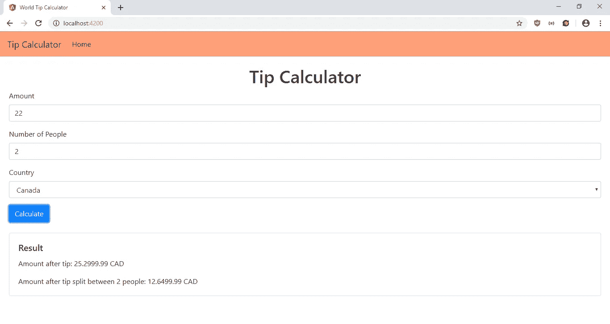

# 如何使用输入掩码来验证 Angular 应用程序中的输入

> 原文：<https://javascript.plainenglish.io/how-to-use-input-masks-to-validate-input-in-an-angular-app-3fcf70734639?source=collection_archive---------0----------------------->

设置输入验证总是很麻烦。输入掩码是一种以简单的方式强制用户输入格式的方法。当输入掩码应用于输入元素时，只能输入设定格式的输入。

例如，如果电话的输入掩码为，则区号可能有 3 个数字，后面是破折号，然后是前缀的 3 个数字，再后面是另一个破折号，然后是剩余的 4 个数字。

有许多 JavaScript 库可以向输入字段添加输入任务。如果我们正在编写一个 Angular 应用程序，我们可以使用位于[https://www.npmjs.com/package/ngx-mask](https://www.npmjs.com/package/ngx-mask)的`ngx-mask library`。该库允许我们强制输入格式，也有一个管道将模板变量转换成指定的格式。

在本文中，我们将构建一个小费计算器，获取不同国家的小费率，并让用户输入他们在给小费之前已经花费的金额，以及与多少人分享小费后的金额。我们将从 https://restcountries.eu/rest/v2/all 获得国家及其货币的列表。要开始构建应用程序，我们首先通过运行`npm i -g @angular/cli`安装 Angular CLI(如果尚未安装的话)。接下来，我们通过运行`ng new tip-calculator`创建我们的项目。在向导中，我们选择包含路由，并使用 SCSS 作为我们的 CSS 预处理器。

然后我们安装一些软件包。我们需要上面提到的 `ngx-mask` 包以及 MobX 来将国家存储在共享存储中。要安装它们，我们运行:

```
npm i ngx-mask mobx mobx-angular
```

接下来，我们创建我们的组件和服务。为此，我们运行:

```
ng g component homePage
ng g service tips
ng g class countriesStore
```

现在我们准备写一些代码。在`home-page.component.html`中，我们将现有代码替换为:

```
<h1 class="text-center">Tip Calculator</h1>
<form (ngSubmit)="calculate(tipForm)" #tipForm="ngForm">
  <div class="form-group">
    <label>Amount</label>
    <input
      type="text"
      class="form-control"
      placeholder="Amount"
      #amount="ngModel"
      name="amount"
      [(ngModel)]="form.amount"
      required
      mask="9999990*.99"
    />
    <div *ngIf="amount?.invalid && (amount.dirty || amount.touched)">
      <div *ngIf="amount.errors.required">
        Amount is required.
      </div>
      <div *ngIf="amount.invalid">
        Amount is invalid.
      </div>
    </div>
  </div> <div class="form-group">
    <label>Number of People</label>
    <input
      type="text"
      class="form-control"
      placeholder="Number of People"
      #amount="ngModel"
      name="amount"
      [(ngModel)]="form.numPeople"
      required
      mask="9999990"
    />
    <div *ngIf="numPeople?.invalid && (numPeople.dirty || numPeople.touched)">
      <div *ngIf="numPeople.errors.required">
        Number of people is required.
      </div>
      <div *ngIf="numPeople.invalid">
        Number of people is invalid.
      </div>
    </div>
  </div> <div class="form-group">
    <label>Country</label>
    <select
      class="form-control"
      #country="ngModel"
      name="country"
      [(ngModel)]="form.country"
      required
    >
      <option *ngFor="let c of store.countries" [value]="c.name">
        {{ c.name }}
      </option>
    </select>
    <div *ngIf="country?.invalid && (country.dirty || country.touched)">
      <div *ngIf="country.errors.required">
        Country is required.
      </div>
    </div>
  </div> <button class="btn btn-primary">Calculate</button>
</form><br /><div class="card">
  <div class="card-body">
    <h5 class="card-title">Result</h5>
    <p class="card-text">
      Amount after tip: {{ amountAfterTip | mask: "9999999.99" }} {{ currency }}
    </p>
    <p class="card-text">
      Amount after tip split between {{ this.form.numPeople }} people:
      {{ splitAmountAfterTip | mask: "9999999.99" }} {{ currency }}
    </p>
  </div>
</div>
```

我们添加了小费计算器表单，让用户输入他们的总小费金额、一起吃饭的人数以及用户所在的国家。我们使用 Angular 的模板驱动的表单验证来检查是否填写了所有内容。此外，我们使用由`ngx-mask`提供的`mask`指令来确保用户在金额字段中输入货币金额，并且我们使用相同的指令来强制人数为非负数。Country 字段有从我们的 MobX 商店获取的选项。

在页面底部，我们显示计算后的结果。我们使用`ngx-mask`提供的`mask`过滤器来显示货币金额，并显示正确的小数位数。

接下来在`home-page.component.ts`中，我们将现有代码替换为:

```
import { Component, OnInit } from '[@angular/core](http://twitter.com/angular/core)';
import { TipsService } from '../tips.service';
import { countriesStore } from '../countries-store';
import { NgForm } from '[@angular/forms](http://twitter.com/angular/forms)';[@Component](http://twitter.com/Component)({
  selector: 'app-home-page',
  templateUrl: './home-page.component.html',
  styleUrls: ['./home-page.component.scss']
})
export class HomePageComponent implements OnInit {
  store = countriesStore;
  countries: any[] = [];
  form: any = <any>{};
  amountAfterTip: number = 0;
  splitAmountAfterTip: number = 0;
  currency: string = ''; constructor(private tipsService: TipsService) { } ngOnInit() {
    if (this.store.countries.length == 0) {
      this.tipsService.getCountries()
        .subscribe(res => {
          this.store.setCountries(res);
        })
    }
  } calculate(tipForm: NgForm) {
    if (tipForm.invalid) {
      return;
    }
    const country = this.store.countries.find(c => c.name == this.form.country)
    this.currency = country ? country.currencies[0].code : '';
    this.amountAfterTip = +this.form.amount * (1 + this.tipsService.getTipRates(this.form.country));
    this.splitAmountAfterTip = +this.amountAfterTip / +this.form.numPeople;
  }
}
```

在`ngOnInit`钩子中，我们获取国家，如果还没有填充，就将它们放入我们的 MobX 存储中。我们还有在模板中调用的`calculate`函数。我们检查我们在模板中定义的`tipForm`是否有效，如果有效，那么我们计算小费并得到国家的货币名称。

在`app-routing.module.ts`中，我们输入:

```
import { NgModule } from '[@angular/core](http://twitter.com/angular/core)';
import { Routes, RouterModule } from '[@angular/router](http://twitter.com/angular/router)';
import { HomePageComponent } from './home-page/home-page.component';const routes: Routes = [
  { path: '', component: HomePageComponent },
][@NgModule](http://twitter.com/NgModule)({
  imports: [RouterModule.forRoot(routes)],
  exports: [RouterModule]
})
export class AppRoutingModule { }
```

因此，当用户点击链接或输入 URL 时，他们可以看到我们刚刚添加的页面。

接下来在`app.component.html`中，我们放入:

```
<nav class="navbar navbar-expand-lg navbar-light bg-light">
  <a class="navbar-brand" routerLink="/">Tip Calculator</a>
  <button
    class="navbar-toggler"
    type="button"
    data-toggle="collapse"
    data-target="#navbarSupportedContent"
    aria-controls="navbarSupportedContent"
    aria-expanded="false"
    aria-label="Toggle navigation"
  >
    <span class="navbar-toggler-icon"></span>
  </button><div class="collapse navbar-collapse" id="navbarSupportedContent">
    <ul class="navbar-nav mr-auto">
      <li class="nav-item active">
        <a class="nav-link" routerLink="/">Home </a>
      </li>
    </ul>
  </div>
</nav><div class="page">
  <router-outlet></router-outlet>
</div>
```

向我们的页面添加链接，并暴露`router-outlet`以便用户可以看到我们的页面。

然后在`app.component.scss`中，我们添加:

```
.page {
  padding: 20px;
}nav {
  background-color: lightsalmon !important;
}
```

添加填充到我们的页面，并改变我们的引导导航栏的颜色。

在`app.module.ts`中，我们将现有代码替换为:

```
import { BrowserModule } from '[@angular/platform-browser](http://twitter.com/angular/platform-browser)';
import { NgModule } from '[@angular/core](http://twitter.com/angular/core)';
import { NgxMaskModule } from 'ngx-mask'
import { MobxAngularModule } from 'mobx-angular';
import { AppRoutingModule } from './app-routing.module';
import { AppComponent } from './app.component';
import { HomePageComponent } from './home-page/home-page.component';
import { FormsModule } from '[@angular/forms](http://twitter.com/angular/forms)';
import { HttpClientModule } from '[@angular/common](http://twitter.com/angular/common)/http';
import { TipsService } from './tips.service';[@NgModule](http://twitter.com/NgModule)({
  declarations: [
    AppComponent,
    HomePageComponent
  ],
  imports: [
    BrowserModule,
    AppRoutingModule,
    NgxMaskModule.forRoot(),
    MobxAngularModule,
    FormsModule,
    HttpClientModule,
  ],
  providers: [TipsService],
  bootstrap: [AppComponent]
})
export class AppModule { }
```

我们添加我们在应用中使用的组件、服务和库。

然后在`countriesStore.ts`中，我们添加:

```
import { observable, action } from 'mobx-angular';class CountriesStore {
    [@observable](http://twitter.com/observable) countries = [];
    [@action](http://twitter.com/action) setCountries(countries) {
        this.countries = countries;
    }
}export const countriesStore = new CountriesStore();
```

创建 MobX store 来让我们的组件共享数据。每当我们在组件中调用`this.store.setCountries`时，我们在这个存储中设置货币数据，因为我们在它之前添加了`@action`装饰器。当我们在组件代码中调用`this.store.countries` 时，我们总是从这个存储中获取最新的值，因为有了`@observable`装饰器。

然后在`tips.service.ts`中，我们将现有代码替换为:

```
import { Injectable } from '[@angular/core](http://twitter.com/angular/core)';
import { HttpClient } from '[@angular/common](http://twitter.com/angular/common)/http';[@Injectable](http://twitter.com/Injectable)({
  providedIn: 'root'
})
export class TipsService { constructor(private http: HttpClient) { } getCountries() {
    return this.http.get('[https://restcountries.eu/rest/v2/all'](https://restcountries.eu/rest/v2/all'));
  } getTipRates(country) {
    const ROUND_UP_COUNTRIES = `France,Italy,Hungary,Greece,Latvia`.split(',').map(c => c.trim());
    const FIVE_PERCENT_TIP_COUNTRIES = `
      Ecuador,
      Argentina,
      Austria,
      Albania,
      Turkey,
      India,
      Slovenia,
      Romania,
      Lithuania,
      Russia
    `.split(',')
      .map(c => c.trim());
    const TEN_PERCENT_TIP_COUNTRIES = `
      Colombia,
      Slovakia,
      Estonia,
      Cuba,
      Uruguay,
      Bulgaria
    `.split(',')
      .map(c => c.trim());
    const FIFTEEN_PERCENT_TIP_COUNTRIES = `
      Serbia,
      Canada,
      Mexico,
      Chile,
      Poland,
      Ukraine,
      Egypt,
      Armenia
    `.split(',')
      .map(c => c.trim()); const TWENTY_PERCENT_TIP_COUNTRIES = ['United States'] if (TWENTY_PERCENT_TIP_COUNTRIES.includes(country)) {
      return 0.2;
    } if (FIFTEEN_PERCENT_TIP_COUNTRIES.includes(country)) {
      return 0.15;
    } if (TEN_PERCENT_TIP_COUNTRIES.includes(country)) {
      return 0.1;
    } if (FIVE_PERCENT_TIP_COUNTRIES.includes(country) || ROUND_UP_COUNTRIES.includes(country)) {
      return 0.05;
    } return 0 }
}
```

添加`getCountries`函数从 REST Countries API 获取国家列表，添加`getTipRates`函数获取各个国家的小费率。

最后，在`index.html`中，我们将代码替换为:

```
<!DOCTYPE html>
<html lang="en">
  <head>
    <meta charset="utf-8" />
    <title>World Tip Calculator</title>
    <base href="/" /><meta name="viewport" content="width=device-width, initial-scale=1" />
    <link rel="icon" type="image/x-icon" href="favicon.ico" />
    <link
      href="[https://maxcdn.bootstrapcdn.com/bootstrap/4.0.0/css/bootstrap.min.css](https://maxcdn.bootstrapcdn.com/bootstrap/4.0.0/css/bootstrap.min.css)"
      rel="stylesheet"
    />
    <script
      src="[https://code.jquery.com/jquery-3.3.1.slim.min.js](https://code.jquery.com/jquery-3.3.1.slim.min.js)"
      integrity="sha384-q8i/X+965DzO0rT7abK41JStQIAqVgRVzpbzo5smXKp4YfRvH+8abtTE1Pi6jizo"
      crossorigin="anonymous"
    ></script>
    <script
      src="[https://cdnjs.cloudflare.com/ajax/libs/popper.js/1.14.7/umd/popper.min.js](https://cdnjs.cloudflare.com/ajax/libs/popper.js/1.14.7/umd/popper.min.js)"
      integrity="sha384-UO2eT0CpHqdSJQ6hJty5KVphtPhzWj9WO1clHTMGa3JDZwrnQq4sF86dIHNDz0W1"
      crossorigin="anonymous"
    ></script>
    <script
      src="[https://stackpath.bootstrapcdn.com/bootstrap/4.3.1/js/bootstrap.min.js](https://stackpath.bootstrapcdn.com/bootstrap/4.3.1/js/bootstrap.min.js)"
      integrity="sha384-JjSmVgyd0p3pXB1rRibZUAYoIIy6OrQ6VrjIEaFf/nJGzIxFDsf4x0xIM+B07jRM"
      crossorigin="anonymous"
    ></script>
  </head>
  <body>
    <app-root></app-root>
  </body>
</html>
```

将引导 CSS 和 JavaScript 依赖项添加到我们的应用程序中，并更改标题。

完成所有工作后，我们就可以运行`ng serve`来运行 app 了。那么我们应该得到:



在“金额”和“人数”字段中，除了数字之外，您不能输入任何其他内容。