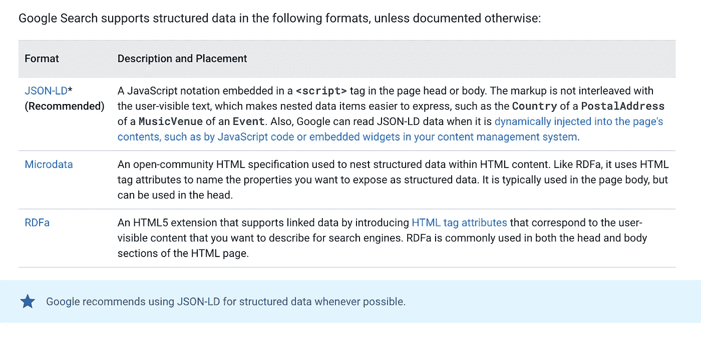
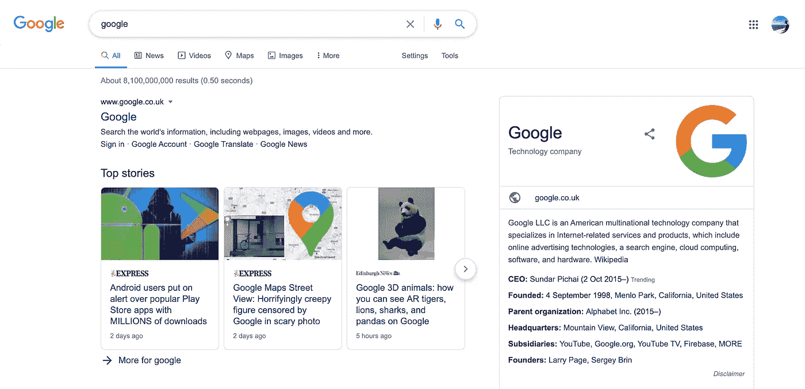

# 如何在 Angular 中使用 JSON-LD 进行高级 SEO

> 原文：<https://javascript.plainenglish.io/how-to-use-json-ld-for-advanced-seo-in-angular-63528c98bb91?source=collection_archive---------0----------------------->

## 角度搜索引擎优化

## 在 Angular 中动态插入 JSON-LD 标记的指南，以增加我们获得丰富结果、知识卡片和取悦机器人的机会。


SEO for Google SERP

> 在本文中，我们将创建一个将 JSON-LD 标记动态插入 DOM 的 Angular 服务。

# JSON-LD 是做什么的？

JSON-LD 代表链接数据的 **JSON，或者如果你不熟悉 JSON 的话，代表链接数据的 JavaScript 对象符号。**

> JSON-LD 可以与微数据和 RDFa(结构化数据的其他例子)相媲美。

这是 2011 年由 Google、Bing、Yahoo！而 Yandex 基于[schema.org](http://schema.org)词汇。

> 创建 JSON-LD 的目的是创建一个统一的结构化数据词汇表，该词汇表易于标记并且易于爬行器解析。

本质上，JSON-LD 为页面上的元素提供了结构化数据。它描述了网页。JSON-LD 标记是有效的 JSON，它注释页面上的元素，描述数据，**围绕实体**提供可区分的事实。

搜索引擎抓取并解析这些数据，以确定这些事实和实体，从而通过 Google 和 Bing 等搜索引擎实现更准确的索引和可发现性。

JSON-LD 有助于创建一个更加结构化的互联网。Google 使用 JSON-LD 标记中嵌入的有组织的数据来提高其已经膨胀的网络知识。

## 我为什么要关心 JSON-LD？

在以下情况下，您会希望使用 JSON-LD:

*   你正在努力用最新的技术标准获得最佳的 SEO 标记。
*   你希望在 SERP (Google)中得到丰富的结果。
*   您希望在最少的时间内提供最具描述性的机器可读的数据。

> 值得注意的是，它并没有取代`*<meta>*`标签和其他 SEO 标记。这是附加的。

还有一个原因…



Google Recommends JSON-LD for Structured Data

这是谷歌认可的，如果你不在乎谷歌对搜索引擎优化的看法，那么恐怕你做错了。

# JSON-LD 基础知识

## 语境

`"@context": “https://schema.org"` —告诉搜索引擎你将要引用 schema.org 的词汇。然后，您可以使用 schema.org 定义中的任何项目类型和属性。

## 类型

`"@type": "NewsArticle"` —定义所描述的项目类型。可用的类型可以在这里找到【https://schema.org/docs/full.html 。

您可以使用嵌套类型，但是理解与产品和嵌套项目相关联的面包屑非常重要，这样您的嵌套类型才是有效的。

## 属性和值

最后，您需要将项目`property`与关联的`value`相关联。

比如说…

```
"name": "Party Coffee Cake"
```

所以**属性**是`name`，而**值**是`Party Coffee Cake`。

这里有一个完整的例子，摘自:

[](https://developers.google.com/search/docs/guides/intro-structured-data) [## 了解结构化数据的工作原理|搜索开发人员

### 谷歌搜索努力理解一个页面的内容。你可以通过提供关于…的明确线索来帮助我们

developers.google.com](https://developers.google.com/search/docs/guides/intro-structured-data) 

Example JSON-LD Markup for a Recipe.

正如您所看到的，JSON-LD 在一个类型为`“application/ld+json”`的脚本标签中。

看起来很简单，对吗？**那是因为它是。目前…**

> 嵌套和大型模式肯定会变得更加复杂。但是结构保持不变。

# JSON-LD 服务

**那么让我们开始吧。**

我们将创建一个 Angular 服务，它动态地将结构化数据(用 schema.org 的 JSON-LD 标记)插入到类型为`application/json+ld`的脚本标签中。

一个角度服务(单例)是最可重用的。

> 另一种方法是在组件级完成，比如在`*AppComponent*`中。然而，**如果我们想从应用程序的多个方面影响 JSON-LD，同时尽可能保持干燥，这并不能帮助我们。**

我们先从两种基本的 JSON-LD 类型开始:**[**https://schema.org/Website**](https://schema.org/Website)**和[**https://schema.org/Organization.**](https://schema.org/Organization.)****

****让我们创建**两个静态模式构建函数**。本质上，这将是两个生成有效 JSON-LD 的函数，通过参数传递动态数据。****

****我们需要一个用于`WebSite`模式，一个用于`Organization`模式。****

# ****1)网站模式****

****您可能已经猜到了一个`WebSite`模式提供了关于……**网站**的信息。**用 JSON-LD 的术语来说，一个网站就是一组相关的页面。******

****所以让我们为我们的`JSONLDService`创建一个名为`websiteSchema`的静态函数。****

## ****网站架构函数****

> ****这些值需要是动态的，因为网站模式可以描述一组相关页面，而不是整个网站，这意味着我们将为多个 URL 使用该模式。****

****所以，假设你有一个包含主要功能的网站，但在你的领域内也有一个博客。你可能想用不同的网站模式来标记这些页面，以便将这些页面组织成不同的组。这就是动态值将有所帮助的地方。****

******那么，在我们函数的内部…******

****我们将使用标准的 JavaScript (TypeScript)对象，用从[https://schema.org/Website.](https://schema.org/Website.)获得的标记来表示我们的 JSON-LD****

****除了动态值`url`和`name`的回退之外，我们还根据参数填充值。****

****我们还在`sameAs`中列出了我们的社交媒体网址，以便将账户链接到我们的网站。这为知识图提供了额外的上下文，这将在下一节中解释。****

****一旦拥有了`WebSite`模式的基本属性，就可以包含更多高级属性，比如为 SERP 站点搜索功能提供搜索查询的`potentialAction`。****

****JSON-LD — The Website Schema Builder Function****

******但是现在，让我们出于演示的目的继续讨论基础知识。******

# ****2)组织架构****

****组织标记通过支持您的公司信息，如**业务和营销细节，增强了站点属性。******

****这种标记使功能和视觉元素(如知识卡片)能够出现在搜索结果中。****

> ****知识卡由来自知识图的数据填充，知识图是一个包含来自 web 的整理信息的数据库。****

> ****这些信息很容易通过搜索引擎获得。如谷歌的知识卡(右边，在下面的截图中)****

********

****Google Search Knowledge Graph Card****

## ****我如何获得知识卡？****

****有几个因素会影响获取知识图表的能力。****

*   ******谷歌商业账户**。您只需建立一个帐户，并填写完整的帐户信息。****
*   ****维基百科(Wikipedia)——你也可以创建一个维基百科页面，因为有人建议谷歌广泛使用维基百科获取公司信息。****
*   ****我们的方法— JSON-LD **组织模式。******

****我们将通过**组织架构**来提高获得知识卡的机会。****

> ****注意:建议仅使用一个页面上的**组织架构。这个页面往往是**首页**或者**关于**的页面。******

## **orgSchema 函数**

**先说基本属性。**

*   **`url` — **组织的规范 URL** 。例如主页。**
*   **`name` — **机构名称**。**
*   **`contactPoint`—`**ContactPoint**`类型的嵌套类型**
*   **`telephone` —您业务的**电话号码**。**
*   **`contactType` —被标记的联系人类型。例如**客服****

**JSON-LD — The Organization Schema Builder Function**

**正如您所看到的，这个组织模式没有什么动态的，除了我们将它动态地插入到我们为我们的模式指定的第**一个**页面上的 DOM 中。**

**但是因为我们只在一个页面上使用这个模式，所以实际的标记数据将是静态的。**

# **动态插入 JSON-LD 标记**

**既然我们已经创建了`WebSite`和`Organization`模式，**我们需要一个方法来动态地将其插入 DOM。****

**为了提供这个功能，我们需要编写一个方法来创建一个`<script>`元素，插入所需的模式标记，并将其附加到 DOM 的`HEAD`部分。**

## **removeStructuredData()**

**我们创建一个函数，通过类名`structured-data*`在 DOM 中搜索元素来删除所有结构化数据。我们把这个叫做`removeStructuredData`。**

**调用`removeStructuredData()`的最佳时机是当用户离开当前页面时，因为标记应该被清除以用于下一个上下文。**

> **您还会注意到，我们通过构造函数参数中的`*@Inject*`注入了**文档**标记。这是因为我们通常不能访问服务中的 DOM/document 元素。**

## **insertSchema()**

**我们还创建了一个函数，它将实际创建脚本元素，用我们的 JSON-LD 标记填充它，并将其附加到 DOM。**

**我们的`insertSchema`函数检查 DOM 中是否不存在具有相同类名的元素，然后根据结果，要么创建一个新的`script`元素与之交互，要么使用已经存在的元素。**

> **但是，如果您在每次`*insertSchema*`调用之前使用`*removeStructuredData*`功能，则`*else*`条件将始终运行。**

**现在我们有了`<script>`元素，我们需要给它分配我们用作标识符的类，并通过将我们的 javascript 模式传递给`JSON.stringify`来插入我们的模式，以将我们的 JavaScript `**object**`转换成`**string**`。**

****剩下的就是把** `**<script>**` **追加到头部。****

**Removing, Creating and Appending JSON-LD Data to the DOM**

> **让我们的 JSON-LD 构建器工作需要调用带有正确参数的`*insertSchema()*`函数。**

```
insertSchema(JSONLDService.websiteSchema)
insertSchema(JSONLDService.orgSchema, 'structured-data-org')
```

# **完整的 JSON-LD 服务代码**

**JSON-LD Angular Service — Full Code**

**扩展这个服务就像创建额外的模式一样简单，比如`Article`、`Review`、`Logo`。**

**[](https://developers.google.com/search/docs/guides/search-gallery) [## 探索搜索库|搜索开发者| Google 开发者

### Google 使用结构化数据来理解页面上的内容。您可以通过提供具体信息来帮助我们…

developers.google.com](https://developers.google.com/search/docs/guides/search-gallery) 

# 何时插入您的 JSON-LD

Angular 路由器使用 [**路由器事件 API**](https://angular.io/api/router/RouterEvent) **，提供了一种处理 JSON-LD 数据的直观方法。这是我销毁和插入 SEO 元数据和 JSON-LD 的首选方式。**

例如**破坏`NavigationStart`上的**和`NavigationEnd`上的**插**。

您还可以通过以下方式处理 SEO/JSON-LD:

*   **解析器** —适用于数据相关的 SEO/JSON-LD 标记。
*   **组件**—ngunit 生命周期挂钩

## 现在我们有了一个用 Angular 实现 JSON-LD 的简单方法🚀

> 感谢阅读！有任何问题，请在评论中告诉我。

# 用简单的英语写的便条

你知道我们有四份出版物和一个 YouTube 频道吗？你可以在我们的主页[**plain English . io**](https://plainenglish.io/)找到所有这些内容——关注我们的出版物并 [**订阅我们的 YouTube 频道**](https://www.youtube.com/channel/UCtipWUghju290NWcn8jhyAw) **来表达你的爱吧！**

# 访问帮助并测试 JSON-LD 结构化数据

[](https://developers.google.com/search/docs/guides/intro-structured-data) [## 了解结构化数据的工作原理|搜索开发人员

### 谷歌搜索努力理解一个页面的内容。你可以通过提供关于…的明确线索来帮助我们

developers.google.com](https://developers.google.com/search/docs/guides/intro-structured-data)  [## 结构化数据测试工具——谷歌

### JSON-LD

search.google.com](https://search.google.com/structured-data/testing-tool/u/0/)  [## 有角的

### Angular 是一个构建移动和桌面 web 应用程序的平台。加入数百万开发者的社区…

angular.io](https://angular.io/api/router/RouterEvent)**