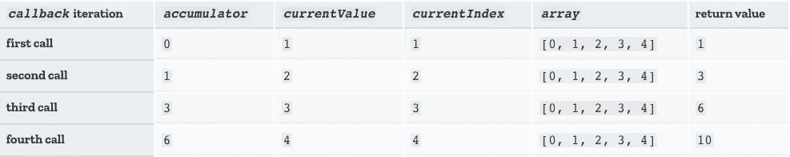
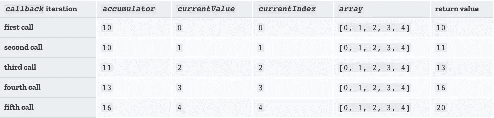

# 如何使用映射、过滤和减少

> 原文：<https://javascript.plainenglish.io/how-to-use-map-filter-and-reduce-5b512e6ad3c6?source=collection_archive---------3----------------------->

## 需要了解的 3 个强大的 JavaScript 数组方法


Photo by [Clément H](https://unsplash.com/@clemhlrdt?utm_source=unsplash&utm_medium=referral&utm_content=creditCopyText) on [Unsplash](https://unsplash.com/s/photos/web-development?utm_source=unsplash&utm_medium=referral&utm_content=creditCopyText)

如果你问一个开发人员“需要知道哪些最重要的 JavaScript 数组方法？”，你可能会听到提到`**map**`、`**filter**`和`**reduce**`。这 3 个强大的方法使您能够遍历数组的内容，类似于使用一个`for`循环。这些方法中的每一个都将创建一个新的数组(或元素、对象等)。对于`reduce`，基于提供的回调函数，**他们** **不会变异或者改变原来的数组**。

为什么要用`map`、`filter`或者`reduce`而不是`for`循环？

*   他们可以创建更容易阅读的代码。
*   他们写得更快。
*   它们使得将方法链接在一起变得容易。
*   它们不会破坏原始数组。

在这篇文章中，我将分解这 3 个流行的数组方法。

# Array.map()


Mighty morphin’ array elements 🔥

`map()`方法**按顺序调用数组中每个元素的回调函数，并创建一个由结果组成的全新数组。**原来的数组不会改变。如果您计划使用新数组做某事，或者希望为数组中的每个元素创建一个新值，此方法会很有帮助。

例如:

```
let array = [1, 2, 3, 4, 5]let newArray = array.map(element => element * 2)console.log(newArray) // [2, 4, 6, 8, 10]console.log(array) // [1, 2, 3, 4, 5]
```

也可以这样写，在别处命名一个函数，函数名作为回调传入`map()`:

```
let dogs = [
    {name: "Missy", breed: "Pit mix"},
    {name: "Cody", breed: "Havanese"},
    {name: "Petunia", breed: "Shepherd Lab mix"},
    {name: "Riley", breed: "🤷‍♀️"}
]const getDogInfo = function(dog) {
  let info = [dog.name, " is a ", dog.breed].join(" ");
  return info;
}let dogInfo = dogs.map(getDogInfo)console.log(dogInfo)
// ["Missy  is a  Pit mix", 
// "Cody  is a  Havanese", 
// "Petunia  is a  Shepherd Lab mix", 
// "Riley  is a  🤷‍♀️"]
```

`map`的完整语法实际上有点长，但是在大多数用例中，我们将只传入`currentValue`(或者我们正在迭代的元素)和回调函数。根据 [MDN](https://developer.mozilla.org/en-US/docs/Web/JavaScript/Reference/Global_Objects/Array/map) 和 [W3Schools](https://www.w3schools.com/jsref/jsref_map.asp) ，完整的语法是这样的:

```
*array*.map(*function(currentValue, *index*, *arr*), *thisArg**)
// *optional*
```

(数组中正在处理的当前元素的)`index`、`arr`(数组`map`被调用)和`thisArg`(执行`callback`时用作`this`的值)都是可选参数。当省略`thisArg`时，`this`的值将被视为未定义。

你可以在这里阅读更多关于`map()` [的潜在用例](https://www.digitalocean.com/community/tutorials/4-uses-of-javascripts-arraymap-you-should-know)。

# Array.filter()


Choosing just those elements you **really** want ❤️

`filter()`方法与`map()`相似，因为它也对数组中的每个元素调用一个回调函数，并按顺序分配一个值，并且创建一个全新的数组，而不改变原来的数组。**新过滤的数组由回调函数返回 true 的所有元素组成。**原始数组中任何返回 false 的元素都将被跳过。如果没有返回 true 的元素，将返回一个空数组。

这种方法非常适合(你猜对了)过滤掉你不想要或不需要的元素，这样在新数组中只留下你想要的元素。

例如:

```
let primates = ["gibbon", "gorilla", "bonobo", "pygmy marmoset", "cotton-top tamarin", "squirrel monkey", "howler monkey"]let apes = primates.filter(primate => primate.length <= 7 )
// clearly not how you determine an ape, just for demo purposes!!🙈console.log(apes) // ["gibbon", "gorilla", "bonobo"]
// but yes, these are apes 😉
```

或者另一个例子，回调函数在别处被命名并被传入:

```
let recipes = ['tempeh piccata', 'vegan nachos', 'tofu scramble', 'kitchari', 'mushroom risotto', 'pad thai', 'zucchini pasta', 'portobello mushroom burger']const findTastyFood = function(food) {
   return !food.includes('mushroom')
   // no mushrooms!! 🍄 🙅‍♀️ 🚫
}let tastyFoods = recipes.filter(findTastyFood)console.log(tastyFoods) // ["tempeh piccata", "vegan nachos", "tofu scramble", "kitchari", "pad thai", "zucchini pasta"]
// no gross mushrooms here! 👍
```

`filter()`的完整语法与`map()`非常相似，并添加了额外的可选值，如下所示:

```
*array*.filter(*function(currentValue, *index*, *arr*), *thisArg**)
// *optional*
```

# Array.reduce()


Reduce that array! ✨

`reduce()`方法**使用累加器将函数应用于数组的每个值，并将数组缩减为单个值。**你可以把累加器想象成数组中每个元素将被“相加”的“总数”或“结果”，类似于用一个迭代`total += array[i]`的函数声明`let total = 0`。累加器可以返回很多东西，比如一个数组，一个对象或者一个数字。与`map`和`filter`一样，带有`reduce`的原始数组将保持不变。

下面是完整的语法:

```
*array*.reduce(*function(accumulator, currentValue, *index*, *arr*), *initialValue**)
// *optional*
```

`index`、`arr`和`initialValue`都是可选值，就像`map`和`filter`一样，但通常建议包含`initialValue`。如果提供了一个元素，那么`accumulator`(总计)将等于`initialValue`，`currentValue`将等于数组中的第一个元素。如果没有提供`initialValue`，数组的第一个元素将被认为是`accumulator`，第二个元素将成为`currentValue`。( [MDN](https://developer.mozilla.org/en-US/docs/Web/JavaScript/Reference/Global_Objects/Array/reduce) )

例如，如果没有`initialValue`:

```
let sum = [0, 1, 2, 3, 4].reduce( 
   (accumulator, currentValue, currentIndex, array) => 
      accumulator + currentValue )console.log(sum) // 10
```

迭代将如下所示，最终总和为 10:



via [MDN](https://developer.mozilla.org/en-US/docs/Web/JavaScript/Reference/Global_Objects/Array/reduce)

但是如果我们提供 10 的`initialValue`:

```
let sum = [0, 1, 2, 3, 4].reduce(
   (accumulator, currentValue, currentIndex, array) => {
      return accumulator + currentValue
   }, 10)console.log(sum) // 20
```

然后，我们将从 10 开始，并从那里添加数组中的每个元素，给出最终的总和 20:



via [MDN](https://developer.mozilla.org/en-US/docs/Web/JavaScript/Reference/Global_Objects/Array/reduce)

`reduce`方法可以有很多用途，也有助于浓缩数学谱之外的信息。例如，如果您曾经发现自己链接了`map`和`filter`，那么您可以用`reduce`替换这两个方法，从而减少遍历并降低时间复杂度。

这里还有一个例子:

```
let fruits = ['🍊', '🍐', '🍓', '🍇', '🍒', '🍊', '🍇']

let countedFruit = fruits.reduce(function (allFruit, fruit) { 
  if (fruit in allFruit) {
    allFruit[fruit]++
  }
  else {
    allFruit[fruit] = 1
  }
  return allFruit
}, {})console.log(countedFruit) // {🍊: 2, 🍐: 1, 🍓: 1, 🍇: 2, 🍒: 1}
```

所有这三种方法都有更多的使用案例，更多的例子可以在 [MDN](https://developer.mozilla.org/en-US/docs/Web/JavaScript/Reference/Global_Objects/Array) 、[数字海洋](https://www.digitalocean.com/community/tutorials/list-processing-with-map-filter-and-reduce)等网站找到。

编码快乐！