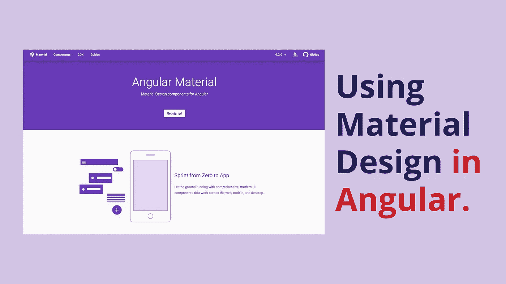
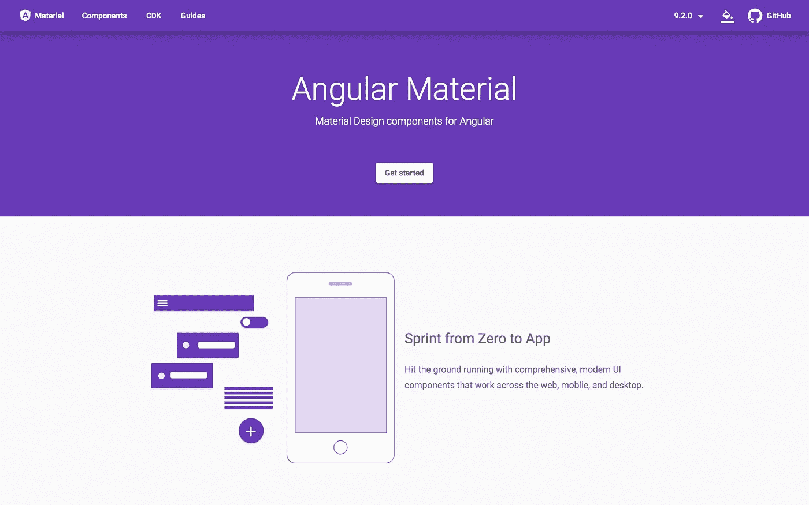
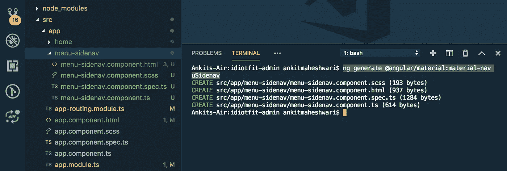
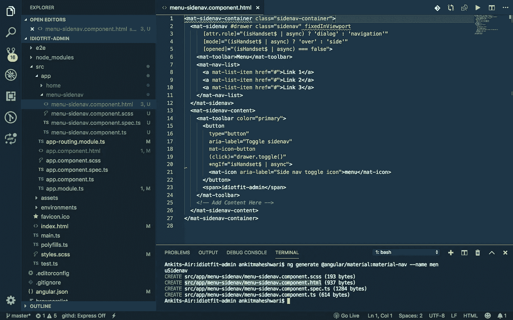
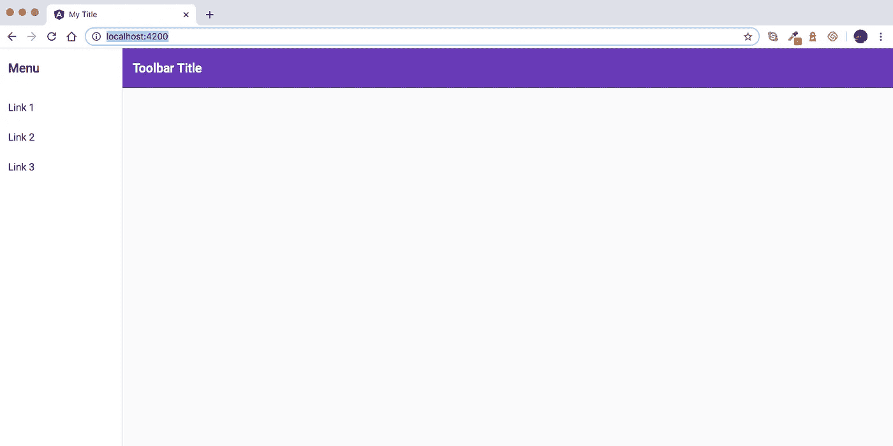

# 如何在棱角中运用材料设计？

> 原文：<https://javascript.plainenglish.io/how-to-use-material-design-in-angular-ab9af481bc08?source=collection_archive---------4----------------------->

在这篇文章中，我们将学习如何将“谷歌材料设计”融入到 Angular 项目中。



# 什么是材料设计？

材料设计是谷歌在 2014 年开发的一种用于网络和移动应用的设计语言。材料设计使开发人员可以轻松定制他们的 UI，同时仍然保持用户舒适的好看的应用程序界面。

# 角状材料介绍

[角形材料](https://material.angular.io/)由一套预制的角形部件组成。与 Bootstrap 不同，它为您提供可以按照您想要的方式设计的组件，Angular Material 致力于提供增强和一致的用户体验。同时，它使您能够控制不同组件的行为。

就像 Angular 一样， [Angular Material](https://material.angular.io/) 自最初发布以来已经进化了很多，有了很大的改进和 bug 修复。



[https://material.angular.io](https://material.angular.io/)

# 创建一个新的角度项目(点击这里↓)

[](https://medium.com/codechintan/create-a-single-page-website-using-angular-firebase-hosting-8ba22b8176a1) [## 使用 Angular & Firebase 托管创建一个单页网站。

### 创建一个新的有一个网页的网站和 Firebase 托管服务器的角度项目。

medium.com](https://medium.com/codechintan/create-a-single-page-website-using-angular-firebase-hosting-8ba22b8176a1) 

操作您已经有一个角度项目，或者您已经通过上面的[链接](https://medium.com/@AnkitMaheshwariIn/create-a-single-page-website-using-angular-firebase-hosting-8ba22b8176a1)创建了一个新项目。

注意:添加角度材料需要角度项目。

# 如何将角度材料添加到您的角度项目中

为了给项目添加有角度的材料，我们将使用`**ng add**`命令。该命令在 Angular 6+版本中添加。要添加有角度的材料，运行以下命令:

```
ng add @angular/material
```

此命令将在您的项目中进行以下更改:

1.  将库(`@angular/material`)添加到现有项目 **node_modules** 文件夹中。
2.  在 **angular.json** 文件中引入主题 CSS。
3.  它还将在**index.html**添加脚本，并更新`**AppModule**`

> Angular 6 中增加的另一个特性是`ng update`，在新版本发布时更新 npm 依赖关系。它还更新您的 RxJS 代码和材料设计代码，以利用新的 API。

# 依赖关系和组件

角形材料由以下几类设计成分组成:

*   表单控件
*   按钮和指示器
*   导航和布局
*   弹出窗口和模态
*   数据表

您可以使用`ng update`命令生成启动器组件。通过此命令可用的一些示意图如下:

*   航行
*   仪表盘
*   桌子

这些原理图可通过如下`ng generate`命令轻松安装:

*   `**ng generate @angular/material:material-table --name <component-name>**`:生成一个用数据表显示数据的组件
*   `**ng generate @angular/material:material-nav --name <component-name>**`:生成一个带有侧边导航和工具栏的组件
*   `**ng generate @angular/material:material-dashboard --name <component-name>**`:生成一个包含卡片动态网格列表的组件。

# 使用有角度的材料，使用元件示意图

> **了解更多 Angular 中的所有原理图:**[https://material . Angular . io/guide/schematics # navigation-schematic](https://material.angular.io/guide/schematics#navigation-schematic)

现在，我们将添加一些对许多应用程序通用的组件，比如导航/侧边菜单。

要添加导航侧菜单栏，只需运行:

```
ng generate @angular/material:material-nav --name menuSidenav
```

> 此命令添加可折叠的侧面导航和抽屉组件。您应该得到下面的输出，它为我们生成了四个文件:



现在，打开 src/app/menu-side nav/menu-side nav . component . html 文件，您应该会看到为我们生成的导航的所有 HTML 代码。见下图↓



src/app/menu-sidenav/menu-sidenav.component.html file

现在，来看看材料设计的魔力吧！打开**app.component.html**，将所有代码替换为:

```
<app-menu-sidenav></app-menu-sidenav>
```

现在，当你运行应用程序时，你会看到导航栏。使用以下命令运行应用程序:

```
ng serve –open
```



You must see this output!

您可以随时编辑[src/app/menu-side nav/menu-side nav . component . html]文件，并在侧边导航菜单中进行更改。

如你所见，Angular Material 提供了一种简单的方法，只需几个命令和几行代码，我们就可以将材质设计融入到我们的 Angular 应用程序中！

# 搞定了。🤩在角度项目中使用材料设计就是这么简单。

再见👋👋

> 欢迎在评论框中发表评论…如果我错过了什么，或者有什么是不正确的，或者有什么不适合你:)
> 保持联系，获取更多文章。
> 
> 更多文章敬请关注:
> [https://medium.com/@AnkitMaheshwariIn](https://medium.com/@AnkitMaheshwariIn)

如果你不介意给它一些掌声👏 👏既然有帮助，我会非常感谢:)帮助别人找到这篇文章，所以它可以帮助他们！

永远鼓掌…


# 了解更多信息

[](https://medium.com/javascript-in-plain-english/create-a-single-page-website-using-node-js-and-express-js-a0b53e396e4f) [## 使用 Node.js 和 Express.js 创建一个单页网站

### 为了在 Node.js 中建立一个网站，我们将使用 Express.js 框架。也可以使用任何其他框架，但是 Express.js 是…

medium.com](https://medium.com/javascript-in-plain-english/create-a-single-page-website-using-node-js-and-express-js-a0b53e396e4f) [](https://medium.com/javascript-in-plain-english/create-rest-api-web-services-using-node-js-and-express-js-with-crud-operations-ff790d6ae030) [## 用 Node 和 Express.js 创建 CRUD Rest API

### 为了在 Node.js 中构建 API，我们将使用 Express.js 框架。也可以使用任何其他框架，但是 Express.js 非常…

medium.com](https://medium.com/javascript-in-plain-english/create-rest-api-web-services-using-node-js-and-express-js-with-crud-operations-ff790d6ae030) [](https://medium.com/codechintan/everything-you-need-to-know-about-angular-framework-typescript-10049b858ae0) [## 关于 Angular framework/TypeScript 你需要知道的一切。

### 完整的角度系列-什么是角度/类型脚本？|为什么我们需要有棱角？|使用 Angular 的好处？|…

medium.com](https://medium.com/codechintan/everything-you-need-to-know-about-angular-framework-typescript-10049b858ae0) 

## **用简单的英语写的 JavaScript 的注释:**

我们总是有兴趣帮助推广高质量的内容。如果你有一篇文章想用简单的英语提交给 JavaScript，用你的中级用户名发邮件到 submissions@javascriptinplainenglish.com[给我们，我们会把你添加为作者。我们还推出了三种新的出版物！请关注我们的新出版物:](mailto:submissions@javascriptinplainenglish.com) [**AI in Plain English**](https://medium.com/ai-in-plain-english) ，[**UX in Plain English**](https://medium.com/ux-in-plain-english)，[**Python in Plain English**](https://medium.com/python-in-plain-english)**——谢谢，继续学习！**