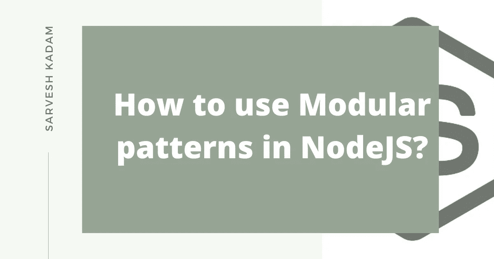
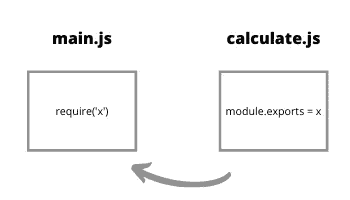
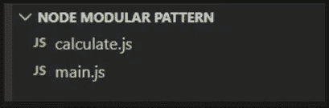

# 如何在 Node.js 中使用模块化模式

> 原文：<https://javascript.plainenglish.io/how-to-use-modular-patterns-in-nodejs-982f0e5c8f6e?source=collection_archive---------9----------------------->

## 模块化模式是 Node 的基本特征之一

当构建应用程序时，由于我们的应用程序/代码变得复杂，我们不能将整个代码放在一个文件中。

由于这变得难以管理，我们使用节点模块化模式来编写不同的文件，并将它们(包括函数、对象和方法)导出到主文件。

现在你可能会问,“模块”到底是什么？

简单地说,“模块”只不过是一个 JavaScript 文件。就这样。

借助节点模块化功能，我们可以导入您自己的外部文件、核心节点模块和 npm 模块。

## **导入自己的文件**:

在本文中，我们将讨论如何导出和导入我们自己的文件。
基本上，有两个文件“calculate.js ”,我们将从中导出并导入“main.js”文件。

Importing Files

为了简化起见，我们将这两个文件放在同一个文件夹中。

*   **导入功能:**

这里，我们使用“module.exports”导出一个名为“add”的函数，然后使用“require”方法将该函数导入到不同的文件中。

在节点中，每个文件被称为“模块”,“导出”是模块对象的属性。

我们现在可以通过传递如下所示的参数在不同的文件，即“main.js”中调用该函数。

*   **导入对象:**

我们也可以导出整个对象，并访问其中的不同方法。

当我们导出对象时，使用“require”方法添加并导入到我们的主文件中。

我们现在可以使用“. dot”运算符访问“add”对象的“result”方法。

我们可以进行上述对象导出的另一种方法是只导出您需要的方法，而不是整个对象。

正如您所看到的，我们正在“添加”对象中导入“结果”方法，所以这个方法可以在主文件中直接调用。

如果您不需要整个对象，而只需要它的一些方法/函数，并使我们的代码更加安全，这是一个很好的做法。

*   **导入函数构造函数:**

函数构造函数基本上用于创建一个新的对象实例，该实例具有与主对象/函数相同的属性。

您可以在这里了解更多关于函数构造器

在下面的情况下，我们使用“new”关键字创建一个“Add”对象的新实例。我们创建对象实例的过程称为“实例化”。

然后我们使用“module.exports”导出这个实例。

现在，我们可以将它导入到我们的主文件中，并访问其中的“结果”方法，以获得我们的计算值。

这样，我们可以导出和导入函数构造函数。

还有另一种方法可以做到这一点，那就是在主文件中创建新的实例，而不是在如上所示的导出文件中

` module.exports = new Add()`。

我们将在导出 ES6 类时看到这一点，ES6 类的工作方式类似于函数构造函数。

*   **导入 ES6 类:**

` class '是一种特殊类型的函数，其中` class '关键字帮助初始化它，并使用` constructor '方法存储属性。你可以在这里了解更多 ES6 课程

现在我们将使用“module.exports”导出整个“类”

现在，在我们的主文件中，我们使用“new”关键字创建一个新的实例，并访问“result”方法来获得我们计算的值。

## 结论:

在本文中，我们讨论了如何导入我们自己的文件。

我们研究了如何实现这一点的几种方法，例如

*   导入函数
*   导入对象
*   导入函数构造函数
*   导入 ES6 类

有 n 种方法可以导出和导入您自己的文件。

我们在本文中没有讨论的其他内容是导入 npm 模块和导入节点核心模块，我们将在下一篇文章中讨论这些内容。

*感谢您花时间阅读这篇文章，请关注我的* [*推特*](https://twitter.com/kadamsarvesh10) *记录我的学习*

*最初发布于*[*https://sarveshcadm . tech*](https://sarveshkadam.tech/how-to-use-modular-patterns-in-nodejs)*。*