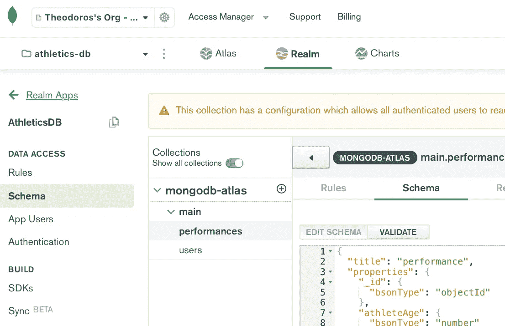
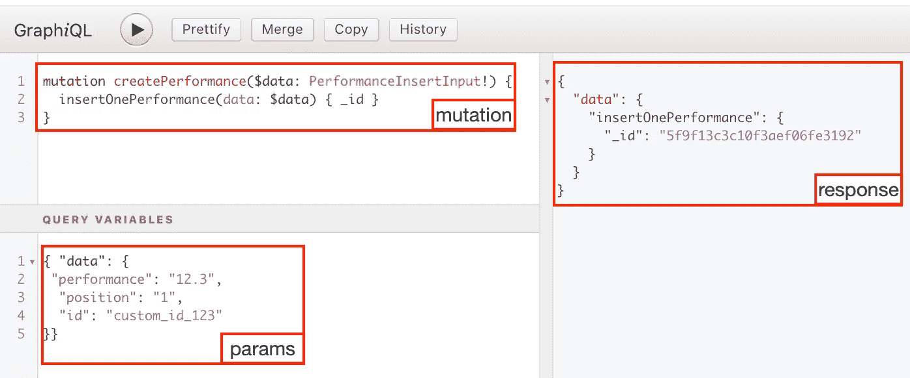
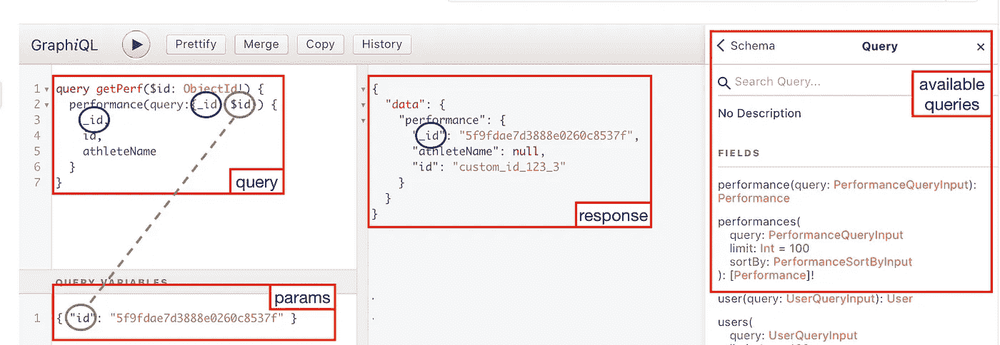
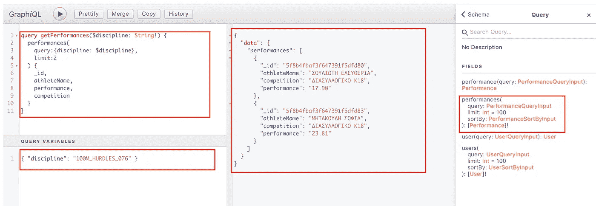

# MongoDB Realm + GraphQL(插入一个文档并进行搜索)

> 原文：<https://javascript.plainenglish.io/how-to-use-mongodb-atlas-graphql-from-a-react-web-app-insert-one-and-search-360cc15cb6fa?source=collection_archive---------4----------------------->


Photo by [Aperture Vintage](https://unsplash.com/@aperturevintage?utm_source=unsplash&utm_medium=referral&utm_content=creditCopyText) on [Unsplash](https://unsplash.com/s/photos/zen-rocks?utm_source=unsplash&utm_medium=referral&utm_content=creditCopyText)

最近，我开始了一个个人兼职项目，在这个项目中，我需要创建一个数据库并使用他们的数据。

我喜欢在我的副业项目上进行实验，所以我决定使用一些熟悉的和一些新的技术。

整个堆栈将是:

*   做出反应。JS & Apollo 客户端
*   https://graphql.org
*   MongoDB(使用无服务器的 Mongo Atlas + MongoDB Realm 服务)[https://realm.mongodb.com]

我熟悉 w/ React，Mongo 和新的部分是 GraphQL 和整个“无服务器”的 Mongo Atlas。

在这一系列的文章中，我将尽力收集那些不琐碎的或者在这个过程中给我带来困惑的事情。

## **这个系列是关于什么的？**

**在接下来的系列文章**中，我会解释:

1.  插入一个。使用参数获取一个或多个文档。
2.  更新一个并删除一个文档
3.  插入许多并得到所有重复错误。(自定义功能)
4.  丰富从客户端发送的有效负载(自定义功能)
5.  作为 Apollo 客户机的替代方案，我将使用 vanilla JS 和 fetch()来认证、登录和执行对数据库的单个查询。

## **不会做**

解释如何建立一个 ReactJs 项目。

解释如何在 MongoDB 领域中创建 BD。

解释 GraphQL 的基础知识。

**这篇文章**将解释如何使用 params 简单地执行一个突变(insertOne)和两个简单的查询(Get One 和 Get Many)。

这两个地方都将发生变化。

1.  在 MongoDB 平台领域中
2.  在我们的反应代码中

首先，您需要为您的集合定义一个模式，以避免未定义的道具出现错误。我们的系列是关于运动表现的。

你可以在你的领域应用中实现。



下面是我们集合的(简化)模式。

```
{
  "title": "performance",
  "properties": {
    "_id": {
      "bsonType": "objectId"
    },
    "athleteName": {
      "bsonType": "string"
    },
    "competition": {
      "bsonType": "string"
    },
    "date": {
      "bsonType": "date"
    }
    "discipline": {
      "bsonType": "string"
    },
    "id": {
      "bsonType": "string"
    }
  }
}
```

## 创建一个文档

在您定义了一个模式之后，您可以使用 graph QL“Explorer”右边的“Docs”来查看所有可用的查询和变化。在 Explorer 中，您可以试验并创建应用程序所需的请求和响应。对于我们的情况，突变的一个版本是:



Explanation of GraphQL Explorer Structure using our example.

现在我们已经准备好了变异，我们需要从我们的 React 应用程序进行调用。

我们将突变添加到我们的***operations . graph QL***文件中，

```
mutation createPerformance(*$data*: *PerformanceInsertInput*!) {
 insertOnePerformance(*data*: $data) { _id }
}
```

我们在控制台中执行以下命令。

```
***$*** *npm run generate* 
```

***(详情:*** [***安装| GraphQL 代码生成器***](https://graphql-code-generator.com/docs/getting-started/installation)***)***

上面的命令将自动创建我们突变和查询所需的适当类型(在 *types.ts* 中)和钩子(在 *graphql-operations.ts* 中)。

现在我们已经准备好了钩子，我们可以在我们的组件中调用它们。

## 检索文档

太好了。现在我们可以创建表演了，我们可以发出请求并获取一些。这里我们有两个选择。要么根据其属性检索一个特定的文档，要么进行“类似搜索”调用，检索符合我们标准的所有文档。

对于这两种情况，步骤(再次)是相同的。

1.  我们在 MongoDB Explorer 中解决了我们的查询。
2.  我们将查询复制到我们的***operations . graph QL***文件中，并执行***$ NPM run generate****命令。*
3.  我们将逻辑移到组件中，就像我们在创建场景中所做的一样。

## 检索一个文档

从第一个例子开始，我们希望**检索一个特定的文档**。当然，我们可以使用非常具体和狭窄的搜索来完成它，但最常见的场景是使用其特定的 ***_id、*** ，这是由 MongoDB 本身定义的，并且是唯一的。



*在我们的例子中，要注意赋值参数的名称。在我们的应用程序中，我们有两个不同的 id。“id”和“_id”。第一个是我们业务定义的，你可以忽略。“_id”是唯一的。如果你不熟悉 GraphQL 中 params 的定义，可以查看他们的文档(*[*https://graphql.org*](https://graphql.org)*)。*

现在我们已经有了我们的查询并生成了我们的钩子(*通过 npm run generate* )我们可以在我们的组件中使用它。在这里，我们决定采用不同的方法。我们直接使用了钩子，并从响应中析构了 *{ loading }* ，以便在我们的 render 方法中使用它来检查何时收到了响应。然后，我们处理承诺的 onComplete()和 onError()，以便采取相应的行动。

## 检索许多文档

如果我们想要**获得更多符合特定标准的文档，**我们将使用*几乎*相同的查询。



如您所见，现在，我们使用复数形式的查询 **(performances)** 来代替 performance。这种差异还伴随着其他一些变化。

1.  我们需要[Performance]类型的响应(带有性能的数组)，而不是单个性能文档。
2.  在这种情况下，我们有两个额外的输入参数。 ***限制*** ，它限制了结果的大小，还有 ***sortBy*** ，它允许我们按特定的属性进行排序。

GraphQL Explorer 在自动完成方面非常有帮助，它会向您建议用于排序的可用值，但是请记住，您将所有这些值*都放在 types.ts 文件中，该文件是通过您的操作自动生成的。*

组件内部的用法与单个文档的查询完全相同。

**结论**

向 Mongo DB Atlas 提交文档相对容易。也可以搜索单个或一组结果。

在下面的帖子中，我将解释如何更新或删除一个现有的文档。

敬请期待