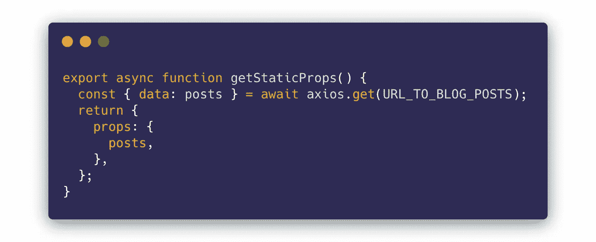
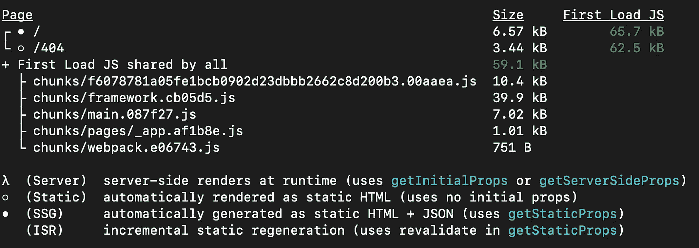
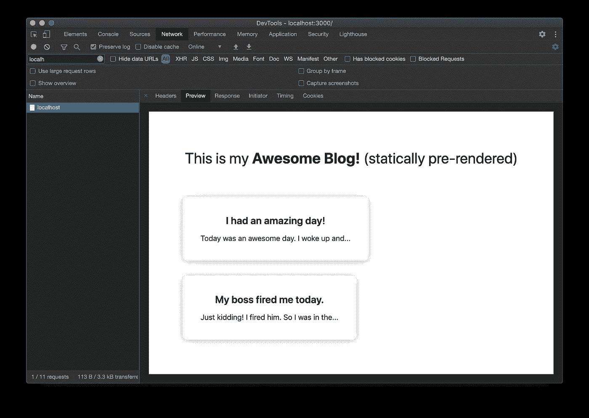

# JAMstack 时代如何使用 Next.js 创建静态站点

> 原文：<https://javascript.plainenglish.io/how-to-use-next-js-to-create-a-static-site-in-the-jamstack-era-64b0505d85ab?source=collection_archive---------5----------------------->

Photo by [Alexandru Acea](https://unsplash.com/@alexacea?utm_source=medium&utm_medium=referral) on [Unsplash](https://unsplash.com?utm_source=medium&utm_medium=referral)

JAMstack (JavaScript-API-Markup)运动让我们重新思考如何建立网站。

最新的趋势是在构建时预渲染页面，而不是在客户端或服务器上渲染页面(通过服务器端渲染)，以获得极快的体验，这也是理所当然的。

# 什么可以是静态生成的网站？

一般来说，预渲染网站/页面(即使用静态站点生成)是一个好主意，因为它没有很多对每个用户都不同的动态内容。

动态内容是指必须从外部 API(如第三方服务或数据库)获取的数据。

博客或作品集就是一个很好的例子。

当然，一个完全不需要外部数据获取的页面是完美的静态页面。

每当你添加一篇博客文章或添加一个新项目到你的投资组合中，你触发了一个项目的重建，所有的数据都是新的。但是仍然是静态的，并且通过内容传递网络提供超快的服务。

# 为什么是 Next.js？

由于 React 是当前前端游戏中的王者，所以我们为什么要采用利用它的技术就很清楚了。

使用 React 进行 SSG(静态站点生成)时，基本上有两种选择:Next.js 或 Gatsby.js

两者都是这个领域令人敬畏的技术和先驱，然而，我个人会坚持使用 Next.js，因为它似乎是受欢迎程度增长巨大的技术。它还与他们的父平台 Vercel 集成得非常好，因此部署只需点击一下鼠标。

# 示例应用程序

让我们看看静态站点生成是如何工作的。

我们可以看的一个示例 Next.js 项目是一个博客，它充当我们的概念证明:

We’ll build this!

该项目托管在 [GitHub here](https://github.com/adamkss/Next.js-Static-Site-Generation-POC) 上。

您可以看到这是一个只有一页的非常简单的应用程序。重要的部分在`index.js`页。我们来看看`getStaticProps`函数:

getStaticProps function

当您使用`npm run build`命令构建项目并将返回的道具注入 React 组件时，Next 将运行这个函数。整洁！

如果您运行该命令并查看输出，您将看到以下内容:

Search for our main root. Statically generated!

白点意味着我们的根路径(`/`)基本上是来自`pages`文件夹的`index.js`是静态生成的。太好了！🎉

现在，如果我们通过运行`npm run start`来开始服务这个构建，一个服务器将会启动，这对于本地测试来说是非常好的。然后，让我们在浏览器中导航到我们的本地实例，看看主`GET`请求返回什么:

The initial GET request returns the pre-rendered page

这是静态站点生成的实际应用！对服务器的初始请求返回我们的索引页面，该页面已经预先呈现了博客数据。客户端不需要任何工作。

# 在数据变更的基础上重建

比方说，每当您添加一篇新的博客文章时，您都需要重新构建您的 Next.js 项目。

像 Contentful 和 Netlify CMS 这样的现代内容管理系统与 Next.js + Vercel 生态系统集成得非常好，并且整个过程可以是自动的。

# 使用静态站点生成的优势

以下是使用 SSG 的几个优点:

1.  速度。您的静态项目可以托管在任何 CDN 上，这意味着它可以以超快的速度提供给客户。
2.  无需为服务器端渲染支付昂贵的服务器费用。
3.  弹性和正常运行时间。将你的应用托管在 CDN 上意味着很少的停机时间。此外，假设你只在构建时获取数据，这意味着你从*获取数据的服务器*可以关闭，而你的静态站点仍然存在，非常感谢。

# 最后

感谢您查看这篇文章。继续尝试静态站点生成吧！🔥

## 简单英语的 JavaScript

喜欢这篇文章吗？如果有，通过 [**订阅获取更多类似内容解码，我们的 YouTube 频道**](https://www.youtube.com/channel/UCtipWUghju290NWcn8jhyAw) **！**