# 如何在 JavaScript 中使用 NPM(和导入/导出模块)

> 原文：<https://javascript.plainenglish.io/how-to-use-npm-and-import-export-modules-in-javascript-31a7f66a2064?source=collection_archive---------0----------------------->


Source: [https://codigoonclick.com/](https://codigoonclick.com/)

如果你熟悉 JavaScript 或 Web 开发，那么你一定听说过`npm`。NPM 帮助我们管理项目中的包和依赖项。因此，在学习 JavaScript 框架时，以一种更简单的方式学习`npm`的知识会非常有用。

在这一系列文章中，我们旨在涵盖以下主题:

1.  [ES6 重要特性](https://medium.com/javascript-in-plain-english/things-to-learn-before-learning-a-javascript-framework-b7baec310247)
2.  [对象和数组方法](https://medium.com/javascript-in-plain-english/object-and-array-methods-to-learn-before-javascript-frameworks-59728dcea306)
3.  [异步 JavaScript 和获取 API](https://medium.com/javascript-in-plain-english/asynchronous-javascript-to-learn-before-javascript-frameworks-9b63972290c2)
4.  JavaScript 中的 NPM 和导入/导出模块(本文)

先从 **NPM** 说起吧:

# NPM

## 什么是 NPM？

NPM 是节点的默认程序包管理器。它用于安装、共享和管理项目中的 javascript 包。

NPM 有三个组成部分:

*   [网站](https://npmjs.com)(使用该网站，我们可以查找、共享和查看软件包)
*   命令行界面(CLI)(CLI 是帮助我们管理软件包的组件)
*   注册表(npm 注册表是所有包所在的数据库，我们可以下载其他开发者发布的包，也可以将我们自己的包发布到注册表)

## **注:**

1.  NPM 也可以用来发布和管理私有包。
2.  包只是一个执行一个或多个操作的程序。

## 如何安装 npm？

NPM 预装了 node.js。所以，你不需要担心手动安装，你只需要在你的系统上安装 node.js。

要安装 node.js，请访问[https://nodejs.org/en/download](https://nodejs.org/en/download/)，并安装其 LTS(长期支持)版本。

安装后，使用下面显示的命令检查它们是否已安装:

```
// to check nodejs's version
node -v or node --version // to check npm's version
npm -v or npm --version
```

这将导致类似这样的结果:

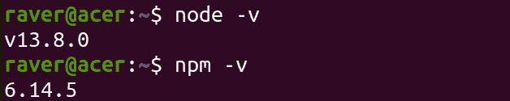

Checking for node’s and npm’s version

## **package.json**

这个`package.json`文件就像你的项目清单。这使得安装和管理软件包变得更加容易。它由项目的所有元数据组成，这些元数据在与其他开发人员共享项目时会很有用。

根据官方文件:

*一个*一个`***package.json***`一个*文件:*

*   *列出您的项目所依赖的包*
*   *使用* [*语义版本化规则*](https://docs.npmjs.com/about-semantic-versioning) 指定您的项目可以使用的包版本
*   *使您的构建可重复，因此更容易与其他开发人员共享*

## 如何创建 package.json 文件？

要创建一个`package.json`文件，请在项目的根文件夹中运行`npm init`。运行该命令后，它会询问您有关项目的一些数据，您可以选择回答这些数据或按下 *enter* 将数据值设置为默认值。

这里有一个相同的例子:

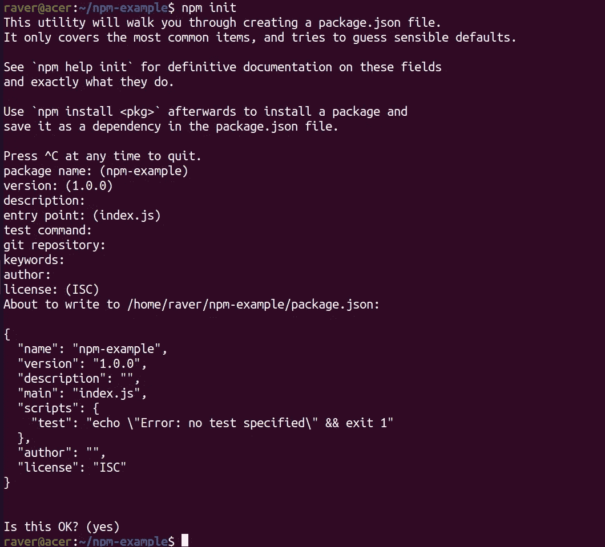

Create package.json file

您也可以执行命令`npm init -y`来创建`package.json`，它会通过将所有数据设置为默认值来自动创建文件。

以下是执行此命令的示例:

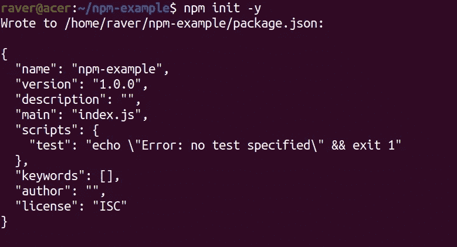

Create package.json using ‘npm init -y’

所以，你可以注意到这个文件包含了一些关于我们项目的重要数据，比如名称、描述、版本和作者等等。

## 重要的 npm 命令

在这里，我们将了解一些有用的 npm 命令。让我们首先了解从 npm 安装软件包。

## **安装 NPM 软件包**

要安装一个`npm`包，只需运行以下命令:

`npm install <package-name>`

例如，让我们安装 [*lodash*](https://www.npmjs.com/package/lodash) :

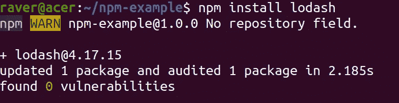

Install an npm package

安装完成后，项目文件夹结构应该如下所示:

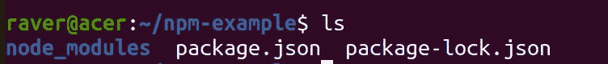

Project’s folder structure

因此，我们可以注意到我们有了一个名为`node_modules`的新文件夹和名为`package-lock.json`的文件。

`node_modules`文件夹包含包及其所有依赖项(即我们的包工作所依赖的程序和文件),而`package-lock.json`文件包含精确的版本依赖树。

因此，安装到您的项目中后，您现在可以在您的项目中使用 *lodash* 及其函数。

**注意:**要全局安装一个包，只需在命令后面加上`-g`或`--global`。为了理解这一点，让我们全局安装 [*nodemon*](https://www.npmjs.com/package/nodemon) :

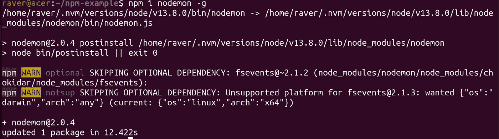

Installing npm modules globally

如您所见，我的系统中已经有了它，所以只更新了这个包。

## **注:**

1.  您想在项目中使用的任何包都应该安装在本地。
2.  您想从命令行或 CLI 使用的任何软件包都应该全局安装。

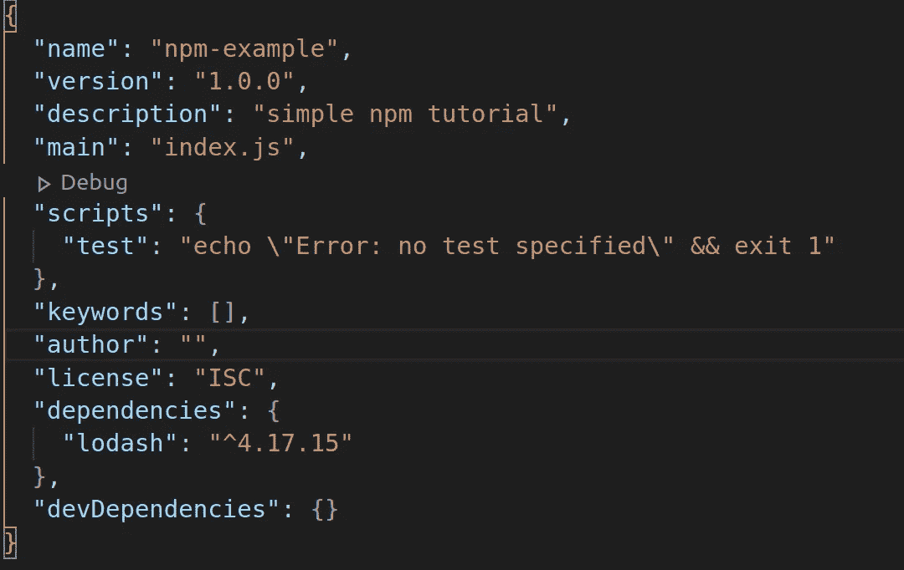

package.json file

因此，您可以注意到 *lodash* 被添加到了`package.json`文件的`dependencies`列表中，但是 *nodemon* 没有被添加，因为它是全局安装的。现在，如果你注意到，有另一个名为`devDependencies`的`key`是空的。

我们来了解一下是什么。

我们也可以安装只打算在项目的开发阶段使用而不是在生产阶段使用的包。这些包被称为 **devDependencies** 。

要安装一个`devDependency`，在命令后面添加`--save-dev`。让我们安装 [*eslint*](https://www.npmjs.com/package/eslint) 作为开发依赖项:

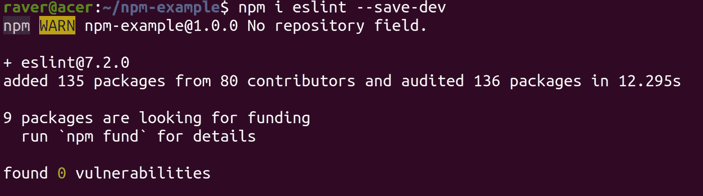

Installing a devDependency

如果您现在注意到了`package.json`文件，那么它应该是这样的:

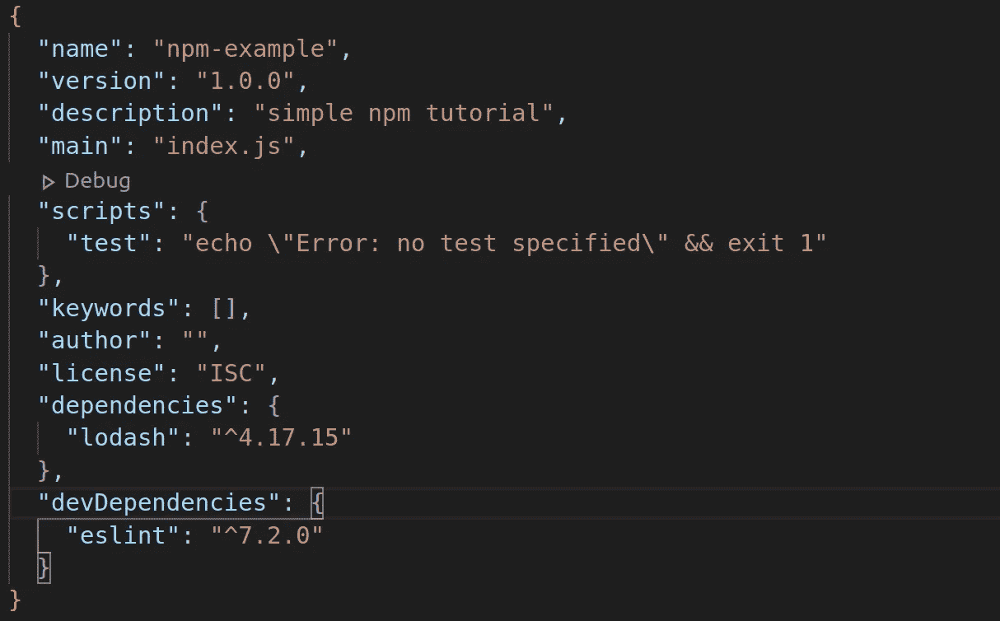

package.json file

因此，`eslint`被添加到了`devDependencies`列表中。

## **安装特定版本的软件包**

要安装特定版本的软件包，请将该版本添加到软件包中，如下所示:

`npm i <package-name>@version`

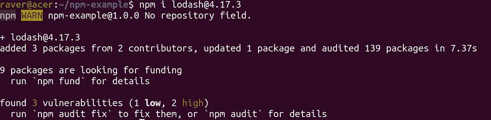

Installing a specific version of the package

因此，如果您现在注意到您的`package.json`中的`lodash`版本，那么它应该是:

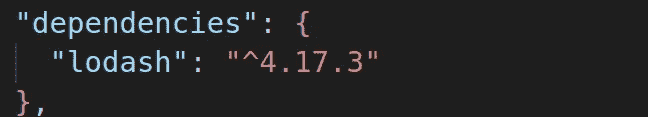

snippet from package.json file

## **更新 npm 软件包**

要更新特定的`npm`包，只需运行`npm update <package-name>`或运行`npm update`来更新项目中安装的所有包。

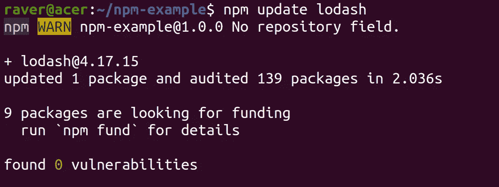

Updating an npm package

所以，现在`lodash`将更新到最新版本:

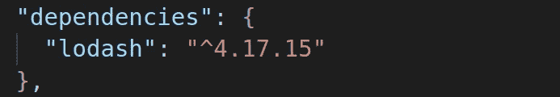

snippet from package.json file

**注意:**更新一个全局包运行`npm update <package-name> -g`。

## **卸载 npm 软件包**

使用以下命令卸载一个`npm`包:

```
npm uninstall <package-name>
```

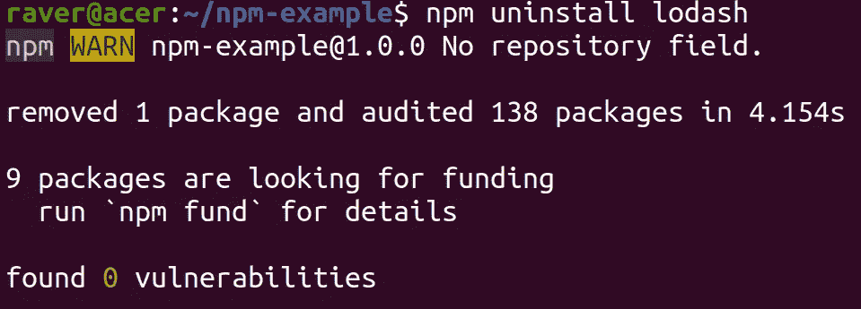

Uninstalling an npm package

这将删除包及其依赖项(如果它们没有被任何现有项目使用)。

## **从 package.json 安装软件包**

当您在团队中工作并希望与同事共享您的项目时，您不应该共享完整的`node_modules`文件夹，因为只有`package.json`和`package-lock.json`可以完成这项工作，因为它包含与您的项目及其包及其版本相关的所有数据。

要从`package.json`文件安装软件包，请运行:

```
// Install packages from package.json
npm install or npm i
```

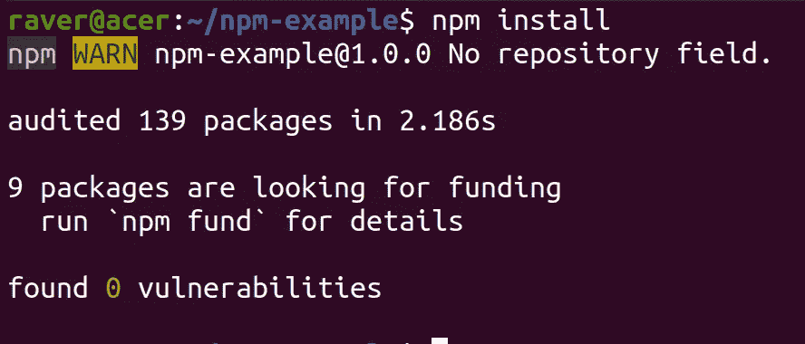

Installing packages from package.json

这将自动安装项目运行所需的所有包和依赖项。

## **注:**

1.  最初是为 node 开发的，但是前端社区也对它进行了修改。
2.  我们不能在脚本标签中直接使用`npm`包，因为我们需要使用像`[webpack](https://webpack.js.org/)`和`[parcel](https://parceljs.org/)`这样的工具。但是，在开始使用任何框架之前，没有必要学习这些工具，因为现在大多数框架都提供了一些工具来帮助您开始使用 webpack 或 package。这种工具的例子有`[react-cra](https://create-react-app.dev/docs/getting-started/)`和`[vue-cli](https://cli.vuejs.org/)`。

如果你想了解更多关于`package-lock.json`的信息，那么[这个](https://www.youtube.com/watch?v=x-i34oO6ijc&feature=youtu.be)视频是一个不错的选择。

至此，我们已经讨论了本文的第一个主题，现在让我们进入下一个主题，即 JavaScript 中的导入/导出模块。

# JavaScript 中的导入/导出模块

## **什么是 JavaScript 模块，为什么我们需要使用它们？**

JavaScript 模块是用于执行一些特定操作的文件，可以在不中断主程序的情况下添加/删除这些操作。

我们使用模块，因为它使我们的代码更具可重用性，有助于将功能分割成更小的文件，并且在编写代码时消除命名冲突。

我们可以从一个模块中导出一些代码，然后在另一个模块中导入相同的代码。这样，我们就能够将特定用途的代码分离到它们自己的文件中，并在主程序中使用它们。

这里我们将讨论 ES6 模块以及导入/导出它们的方法。

**记住:**如果你没有从一个文件中导出某些特定的代码，那么它就不能被导入或在另一个文件中使用。

为了理解导入和导出模块的概念，让我们考虑一个没有插头的设备的例子。

现在，很明显，在这种状态下，该设备不起作用。要使它工作，我们必须给它加上一个插头，然后把它接到插座上。

在模块的情况下，设备就是模块本身，现在，当您在模块中添加导出语句时，您基本上是在设备中添加一个插头，当您从另一个模块导入模块的值时，您是在将插头连接到插座。

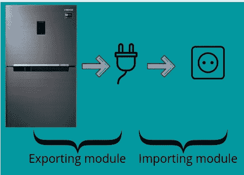

Importing and exporting a module

## **导出**

为了从模块中导出任何东西，我们使用了`export`关键字。

我们可以使用以下方法导出代码:

1.  命名导出(每个模块零个或多个导出)
2.  默认导出(每个模块只有一个)

让我们看看它们是如何工作的:

Export in JavaScript

因此，我们可以注意到,`named`导出对于导出多个值是有用的，但是使用`default`导出只能用于导出一个值。

## 进口

为了将一个模块的导出内容导入到另一个模块中，我们使用了`import`关键字。此外，我们需要提到该模块的相对或绝对(如果项目有配置)路径。

根据不同类型的出口，我们可以有以下类型的进口:

1.  从模块中导入单个或多个命名导出
2.  导入默认值

让我们看看它们是如何工作的:

Import in JavaScript

因此，我们可以注意到`named`导入对于导入多个值很有用，但是使用`default`导入只能用于导入一个值。

## **从 npm 包导入**

我们可以使用以下语法从`npm`包中导入函数和代码:

Syntax to import from an npm package

现在，正如你所注意到的，我们在这里没有使用相对路径，因为 webpack 决定它必须从`node_modules`文件夹导入函数/值。

让我们使用`lodash`示例来了解如何导入 npm 包:

Import from an npm package

因此，您可以观察到我们在最后的导入语句中没有使用文件扩展名，如果它是一个`.js`文件，我们可以不使用文件扩展名进行导入。对于所有其他文件格式，我们必须指定文件扩展名。

**注意:**默认情况下，webpack 只允许导入 javascript 文件，但我们可以将其配置为导入 CSS 和其他文件。

这里有一个简单的例子来更好地理解这个概念。请随意使用沙盒进行游戏和实验。

import/export modules example

至此，我们已经涵盖了本文以及本系列的所有主题。我希望本系列能以某种方式帮助您学习 JavaScript 中的有用概念，这些概念是在学习任何 JavaScript 框架之前都应该知道的。

和往常一样，为了结束这篇文章，我将留给你们一个简单的`React Component`，它使用了上述概念:

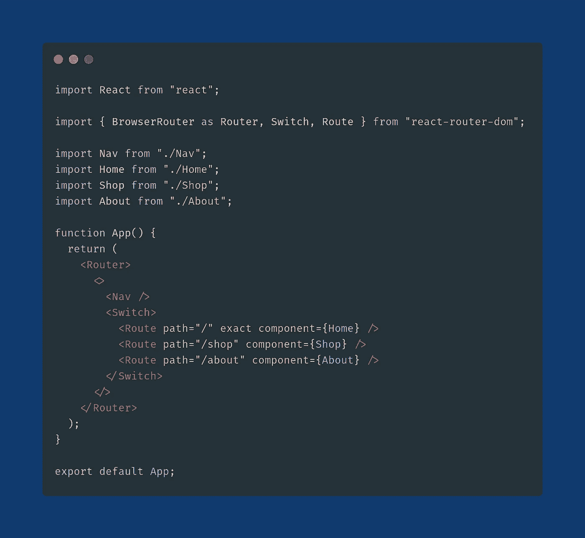

A simple React Component

此外，检查之前的部分(如果你没有):

[](https://medium.com/javascript-in-plain-english/things-to-learn-before-learning-a-javascript-framework-b7baec310247) [## 学习 JavaScript 框架之前需要了解的事情(第 1 部分)

### 所以，在这一系列的文章中，我将尝试解释一些我认为非常重要的特性和概念…

medium.com](https://medium.com/javascript-in-plain-english/things-to-learn-before-learning-a-javascript-framework-b7baec310247) [](https://medium.com/javascript-in-plain-english/object-and-array-methods-to-learn-before-javascript-frameworks-59728dcea306) [## 在 JavaScript 框架之前要学习的对象和数组方法(第 2 部分)

### JavaScript 中可应用于对象和数组的不同类型的方法

medium.com](https://medium.com/javascript-in-plain-english/object-and-array-methods-to-learn-before-javascript-frameworks-59728dcea306) [](https://medium.com/javascript-in-plain-english/asynchronous-javascript-to-learn-before-javascript-frameworks-9b63972290c2) [## 在 JavaScript 框架之前要学习的异步 JavaScript(第 3 部分)

### 异步 javascript 透视

medium.com](https://medium.com/javascript-in-plain-english/asynchronous-javascript-to-learn-before-javascript-frameworks-9b63972290c2) 

## 进一步阅读

[](https://plainenglish.io/blog/how-to-compose-and-integrate-apis-together-as-if-you-were-using-npm-for-apis) [## 如何将 API 编写和集成在一起，就像使用 NPM 进行 API 一样

### 将两个 API 整合到一个应用程序中，该应用程序显示了历史上由首都举办的最大型音乐会。与…

plainenglish.io](https://plainenglish.io/blog/how-to-compose-and-integrate-apis-together-as-if-you-were-using-npm-for-apis) 

如果您想与我联系，请遵循以下链接:

[领英](https://www.linkedin.com/in/rajat-verma-39458317b/) | [推特](https://github.com/rajat2502) | [推特](https://twitter.com/rajatverma2502)

*更内容于*[***plain English . io***](https://plainenglish.io/)*。报名参加我们的* [***免费周报***](http://newsletter.plainenglish.io/) *。在*[***Twitter***](https://twitter.com/inPlainEngHQ)、[***LinkedIn***](https://www.linkedin.com/company/inplainenglish/)*、*[***YouTube*T42**](https://www.youtube.com/channel/UCtipWUghju290NWcn8jhyAw)、[T47*不和*](https://discord.gg/GtDtUAvyhW)T52*上跟随我们。对增长黑客感兴趣？查看* [***电路***](https://circuit.ooo/) *。*