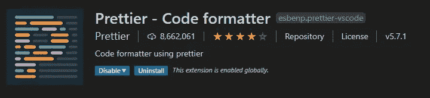
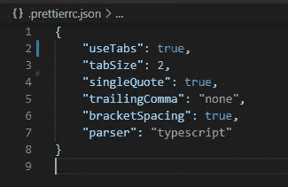
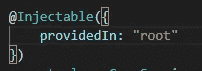
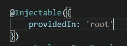

# 如何使用更漂亮的自定义您的代码格式

> 原文：<https://javascript.plainenglish.io/how-to-use-prettier-to-customize-your-code-formatting-b1a5424f2ed6?source=collection_archive---------9----------------------->

## *学习配置和使用这个代码格式化程序，让您的生活更加轻松*

Photo by [Sidney M.](https://unsplash.com/@2morrow?utm_source=medium&utm_medium=referral) on [Unsplash](https://unsplash.com?utm_source=medium&utm_medium=referral)

制表符还是空格？双引号还是单引号？尾随逗号和空格？没关系，只要你在代码中保持一致并使用相同的模式。然而，得到关于这些小事情的警告和错误会很快变得很烦人。这就是为什么你应该使用一个代码格式化程序，并配置它在你保存文件时立即格式化文件，然后你就可以处理重要的事情了。有很多选择，但本周我想谈谈[更漂亮的](https://prettier.io/)，一个轻便简单的工具，它提供了对许多语言和大多数编辑器的支持。

## 1.在您的项目中安装更漂亮的

npm: `npm install --save-dev --save-exact prettier`

纱线:`yarn add --dev --exact prettier`

安装后，创建一个 json 文件来存储您的自定义配置:

`echo {}> .prettierrc.json`

您还应该为您不想格式化的所有内容创建一个`.prettierignore`文件。您可以使用您的`.gitignore`文件作为这一步的参考。

## 2.在编辑器中安装更漂亮的扩展

在 vscode 上搜索并安装此扩展:

您可以将其配置为保存时格式化，这非常有用。为此，用`ctrl shift P`打开调色板并转到`user settings`。转到`formatting` 并选择选项`format on save`。

## 3.设置您的格式选项

现在让我们回到我们的`prettierrc.json`文件，添加我们的新配置。Prettier 没有太多的选择，但这正是关键所在——避免无休止的争论，优化时间。对于本例，让我们看看如何设置制表符，而不是空格、单引号、尾随逗号和括号间距:

使用 tabSize 来定义一个制表符应该占据多少个空格，如果你愿意，你可以使用“解析器”选项——但是 prettier 会自动从输入文件路径中推断出来，所以这不是非常重要。[查看文档以获得选项的完整列表。](https://prettier.io/docs/en/options.html)

## 4.格式化您的文件

现在我们准备开始用更漂亮的来格式化我们的代码。让我们看看使用双引号保存文件后会发生什么:

Before saving

After saving

有用！如果没有，你会和你的棉绒发生冲突，你会有一个额外的步骤。在我的例子中，我与 tslinter 有一些冲突，所以我去了我的`tslint.json`并删除了与 prettier 冲突的选项:

`"indent": [true, spaces]`

就这样，现在漂亮一个人会处理缩进的问题。希望这是一个有帮助的教程，现在你可以专注于创建漂亮的应用程序，而不会一直被人嘲笑。编码快乐！

*感谢您的阅读！*