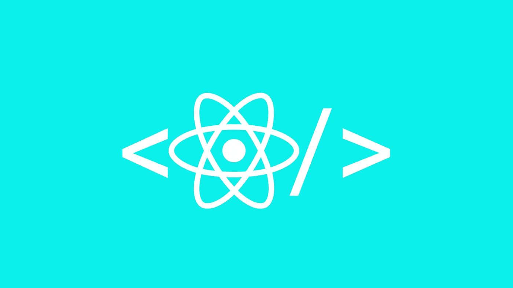
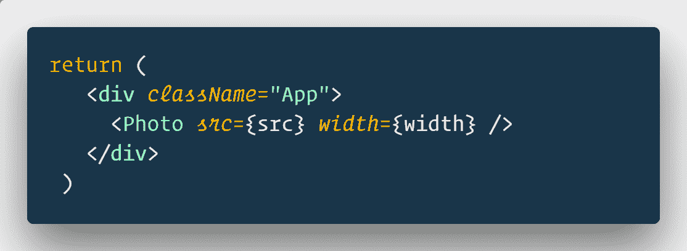
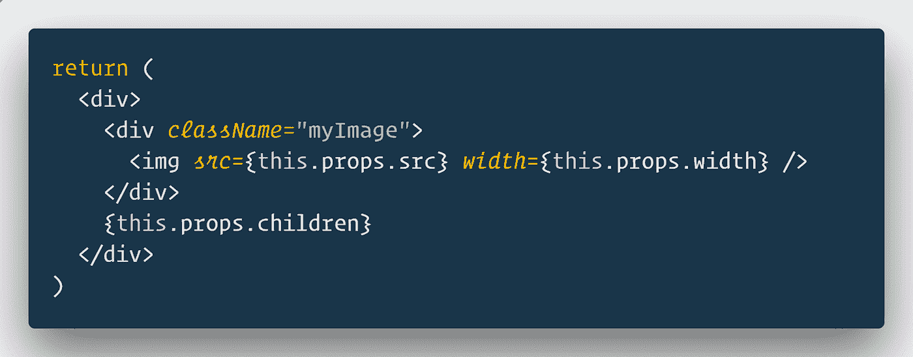
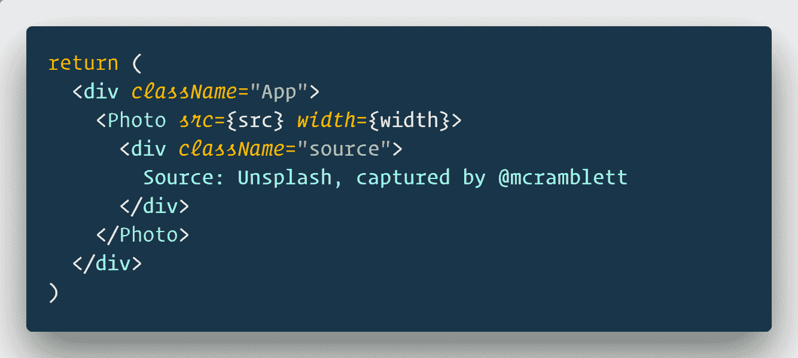

# 如何在 React 中使用道具

> 原文：<https://javascript.plainenglish.io/how-to-use-props-children-in-react-7d6ab5836c9d?source=collection_archive---------0----------------------->

今天我们就来详细调查一下。你也可以在这里参考关于同一[的官方文档](https://reactjs.org/docs/composition-vs-inheritance.html)。

# 孩子是什么？

在 React 中，子组件指的是通用盒子，其内容在从父组件传递过来之前是未知的。

**这是什么意思？**这仅仅意味着在调用组件时，组件将显示开始和结束标记之间包含的任何内容。该组件通常会从应用程序组件中调用。

# 道具示例.儿童

我用`create-react-app`设置了一个基本的 react 应用程序。我将创建另一个组件来呈现带有 img 标签的图像和其他所有内容。

photo 组件编写为自关闭等效于。如果我们没有孩子，我们可以使用自闭式的。你可以把它转换成打开和关闭，中间不加任何东西，效果是一样的。

在我的照片组件中，我试图看到`props.children`中有什么。

它显示的是图像，除此之外…什么都没有！

这是因为 App 中的照片组件没有子组件。

假设我想传递更多的组件，但是信息并不完整。我想要的只是在照片中为我的任何和所有组件的占位符。

让我们看一看。

对`Photo`组件不做任何更改。我刚刚在`Photo`之间经过了一个`div`。

我们现在还能得到什么？

您可能想假设 App 将在应用程序中呈现为它的 html，但是它已经在另一个组件`Photo`中了。它不会渲染`App`中的任何内容。但是它知道它们是这个组件的子组件。

`Component
> Child
> AnotherChild`

所有这些孩子都可以作为`this.props.children`访问。

# 孩子的力量在于他们可以成为任何人。

可能的用法有:

*   将未知数量的相似元素分组到一个父元素中。
*   你不知道时间之前的元素。
*   需要包装的嵌套结构。

性能保持不变，通过`props.children`传递和获得道具，没有什么可担心的性能问题。

如果发送 props 是可能的，避免使用`props.children`,因为随着应用程序的增长和需求的变化，管理作为子进程传递的数据会很困难。

如果多个组件需要相同的子组件，考虑将它们赋给 render 中的变量，然后作为子组件传递，我对上面的例子做了同样的处理。