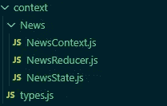
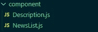

# 如何将 React 上下文 API 与功能组件一起使用

> 原文：<https://javascript.plainenglish.io/how-to-use-react-context-api-with-functional-component-472f1d5e0851?source=collection_archive---------0----------------------->


在本文中，我们将使用 Hackernews API 在 React 中创建一个小应用程序

*本文假设您对 React 和 bootstrap 有基本的了解。*

## 上下文 API 简介

上下文 API 是 React 提供的一个 API，用于帮助进行状态管理。它为我们提供了与 redux 相似的功能。

如果我们要将状态值从父组件传递到其他子组件，我们必须通过 props 传递数据。但是，随着元件数量的增加，这一过程会变得困难。为了使组件间共享数据的任务变得容易，我们必须使用一些第三方状态管理库。但是，React 现在为我们提供了上下文 API，帮助我们进行状态管理。

现在让我们使用 API 来创建一个小应用程序。我们的应用程序将非常简单。我们将使用上下文 API 来创建应用程序。我们的项目将如下所示:


我们将显示最新的黑客新闻故事，并让用户点击其中一条新闻。当用户点击新闻时，我们会在右边显示更多的信息。在这里，我们不会过多关注应用程序的样式，好吗？

现在，让我们开始吧。

让我们创建一个 react 应用程序。为此，我们需要在主工作目录内的终端中输入以下命令:

```
npx create-react-app .
```

现在我们已经创建了 react 应用程序，让我们安装我们需要的包。

```
npm i bootstrap axios
```

我们将使用 bootstrap 进行样式设计，使用 axios 请求数据。

现在我们已经安装了这个包，让我们继续实现这个项目。

让我们打开 *src* 目录中的 **App.js** 文件。然后，编写下面几行代码:

你可以在上面的代码中看到我们做了一些导入。我们已经导入了两个组件:`NewsList`和`Description`。我们将很快研究这些组件。你可以在第 6 行看到，我们已经导入了`NewsState`。然后我们在第 12 行用它作为包装器。这个`NewsState`是全局状态，它可以被任何子组件使用。这意味着`NewsList`和`Description`，也就是 14 号线& 15 处的部件可以接入`NewsState`。我们很快会在`NewsState`上工作。

我们现在将致力于国家。为此，让我们在 *src* 目录中创建一个名为 *context* 的目录。在*上下文*目录下创建一个名为 **types.js** 的文件。然后，在*上下文*目录下创建一个名为*新闻*的文件夹。然后，在 *src/context/News* 目录下创建三个名为 **NewsContext.js** 、 **NewsState.js** 、 **NewsReducer.js** 的文件。这应该使*上下文*目录的文件夹结构类似于这样:



现在我们已经创建了这些文件，让我们打开文件 **NewsContext.js** 并编写以下代码行:

```
import { createContext } from "react"; **const** NewsContext = createContext(); export default NewsContext;
```

这里，我们导入了`createContext`。`createContext`的作用顾名思义就是创造语境。

在`createContext`的帮助下，我们创建了上下文并将其存储在常量`NewsContext`中。然后我们出口了`NewsContext`。

现在，让我们打开**newstate . js**并编写以下代码行:

在上面的代码中，我们可以看到前几行只是导入。在第 1 行，我们已经导入了`React`和`useReducer`。然后在第 4 行和第 5 行，我们分别导入了`NewsContext`和`NewsReducer`。我们将很快着手`NewsReducer`的工作。类似地，我们在第 6 行从 **types.js** 中导入了`GET_NEWS`和`GET_DESCRIPTION`。我们稍后将讨论这些类型。

在第 8 行，我们创建了`NewsState`。我们在第 9 行创建了一个`initialState`。之后，在第 14 行，我们使用了`useReducer`。`useReducer`接受两个参数。第一个参数应该是 reducer，在我们的例子中是`NewsReducer`。第二个参数是`initialState`。这个`useReducer`给我们提供了`state`和`dispatch`。`state`如其名，为我们提供了国家的价值观。`dispatch`函数帮助我们将收到的数据发送给 reducer 函数。

在那之后的第 16 行，我们有一个函数叫做`getNews`。这个函数帮助我们从第 18 行的 Rest API 端点获取新闻。如果在获取数据时出现任何错误，我们会将其记录在控制台的第 23 行。在第 21 行，我们使用了`dispatch`函数。`dispatch`功能有助于将我们的数据发送到 reducer。减速器最终会改变我们的状态。我们将很快研究减速器。

让我们仔细看看`dispatch`功能。第 21 行的`dispatch`函数接受一个包含`payload`和`type`的对象作为选项。`payload`应该是我们需要存储在状态中的数据。`type`接受类型的名称，在本例中是`GET_NEWS`。

在第 27 行，我们可以看到名为`getDescription`的函数。这个功能帮助我们获取特定新闻的描述。我们已经编写了代码，使用`id`在第 29 行发出请求。然后在第 32 行，我们分派了我们的`payload`和`type`，它们的值分别为`data`和`GET_DESCRIPTION`。如果出现任何错误，我们会将其记录在控制台的第 34 行。

现在，看一下第 39 到 48 行。这里，我们使用了`NewsContext.Provider`。这个`NewsContext.Provider`充当我们创建的上下文的包装器。记得我们已经在 **NewsContext.js** 文件中创建了`NewsContext`。您可能还记得，我们在 **App.js** 文件中使用这个包装器作为`NewsState`。

现在，我们来谈谈`NewsContext.Provider`。`NewsContext.Provider`收进道具`value`。`value`应该是一个包含我们的状态和函数的键值对的对象。这个提供者的每个后代都可以访问`value`。然后在第 47 行，您可以看到我们已经在`{props.children}`的帮助下编写了呈现子组件的代码。

既然我们已经理解了在 **NewsState.js** 中编写的代码，现在让我们打开文件 **NewsReducer.js** 并编写以下代码行:

您可以在第 1 行看到，我们已经导入了`GET_NEWS`和`GET_DESCRIPTION`类型。然后我们导出了我们的 reducer 函数。我们可以看到 reducer 函数位于第 3 行到第 20 行。减速器函数以`state`和`payload`为参数。然后在第 4 行，我们创建了两个常量`payload`和`type`，并存储了`action.payload`和`action.type`的值。记住`action`是我们从**newstate . js**中的`dispatch`函数接收的对象。

从第 6 行到第 19 行，我们使用了`switch` `case`。我们正在检查动作的`type`。如果类型是`GET_NEWS`，我们分解初始状态，然后将状态中`news`的值改为`payload`。如果类型是`GET_DESCRIPTION`，我们分解我们的状态，然后将状态中`activeNews`的值改为`payload`。

现在让我们打开文件 **types.js** ，并编写以下代码行:

```
export **const** GET_NEWS = "GET_NEWS";export **const** GET_DESCRIPTION = "GET_DESCRIPTION";
```

我们创建 **types.js** 的主要原因是因为我们需要不同动作的类型名称，正如你所看到的。这些类型名称在我们的 reducer 和 state 中使用。我们可以在两个文件中对类型进行硬编码，但是我们可能会遇到一些问题。如果类型名中出现任何拼写错误，我们可能会遇到一些难以调试的错误。

现在，让我们在主项目目录中创建一个*组件*目录。然后，我们在*组件*目录下创建两个文件 **Description.js** 和 **NewsList.js** 。这应该使我们的*组件*目录看起来像这样:



现在让我们打开文件 **NewsList.js** 并编写以下代码行:

我们可以看到，前几行是导入。我们在第 1 行导入了`useContext`和`useEffect`。我们已经在第 3 行导入了我们的`newsContext`。

在第 6 行，我们使用了`useContext`。`useContext`接受我们创建的上下文。在这种情况下，我们的背景是`newsContext`。然后，我们将上下文存储为`NewsContext`。

现在，让我们看看第 8 行到第 10 行。在那里，我们使用了`useEffect`。我们使用`useEffect`的方式在基于类的组件中充当`ComponentDidMount`。当组件安装好后，我们执行代码`NewsContext.getNews()`。记得我们已经在**newstate . js**文件的`NewsContext.Provider`中添加了`getNews`函数作为我们的`value`。这个`getNews`做的是，它从 API 获取新闻，然后将它添加到我们的状态中。

现在，让我们看看第 15 行。我们已经为条件渲染编写了代码。如果`NewsContext.news`存在，我们映射`news`数组并将其呈现给 DOM。记住`news`是我们在**newstate . js**文件中的`NewsContext.Provider`中定义的状态值。

在第 20 行，我们使用了`onClick`事件监听器。当它被点击时，我们要求`NewsContext`使用`NewsContext.getDescription(news.id)`获取特定新闻 Id 的描述。记住`getDescription`是我们在**newstate . js**文件中`NewsContext.Provider`的`value`中添加的功能。

现在我们已经处理了 **NewsList.js** 文件，让我们打开文件 **Description.js** 并编写以下代码行:

让我们来看看这里发生了什么。我们这里进口了一些东西。在第 1 行，我们已经导入了`useContext`和`React`。在第 3 行，我们已经导入了`newsContext`。

可以在第 14 行看到，我们使用了条件呈现。如果`activeNews`存在，我们已经编写了代码来呈现`activeNews`中存在的值。在第 16 行，我们使用`activeNews.title`编写了显示新闻标题的代码。然后，在第 19 行，我们编写了代码，通过使用`activeNews.user`显示作者的姓名。然后，在第 20 行，我们编写了代码来显示这篇文章使用`activeNews.time_ago`发布的时间。然后在第 21 行，我们编写了代码，使用`activeNews.comment.length`显示注释的数量。类似地，在第 27 行，我们使用`activeNews.url`编写了代码来显示文章/新闻的 URL。我们还使用了`a`标签来指引我们的用户到那个 URL。此外，在第 32 行，我们使用`activeNews.points`编写了显示点的代码。

有了这些，我们已经完成了我们的小型项目，并且学会了如何在功能组件中使用 Context API。

我建议您查看 React 的文档，以了解有关上下文 API 的更多信息。

## 进一步阅读

[](https://bit.cloud/blog/-extracting-and-reusing-pre-existing-components-using-bit-add-l28qlxpz) [## 使用位添加提取和重用预先存在的组件

### 最后，您完成了在应用程序中为 input 创建一个出色的输入字段的任务。你对…很满意

bit.cloud](https://bit.cloud/blog/-extracting-and-reusing-pre-existing-components-using-bit-add-l28qlxpz) 

*更多内容请看*[***plain English . io***](https://plainenglish.io/)*。报名参加我们的* [***免费周报***](http://newsletter.plainenglish.io/) *。关注我们关于*[***Twitter***](https://twitter.com/inPlainEngHQ)[***LinkedIn***](https://www.linkedin.com/company/inplainenglish/)*[***YouTube***](https://www.youtube.com/channel/UCtipWUghju290NWcn8jhyAw)***，以及****[***不和***](https://discord.gg/GtDtUAvyhW) *对成长黑客感兴趣？检查* [***电路***](https://circuit.ooo/) ***。*****