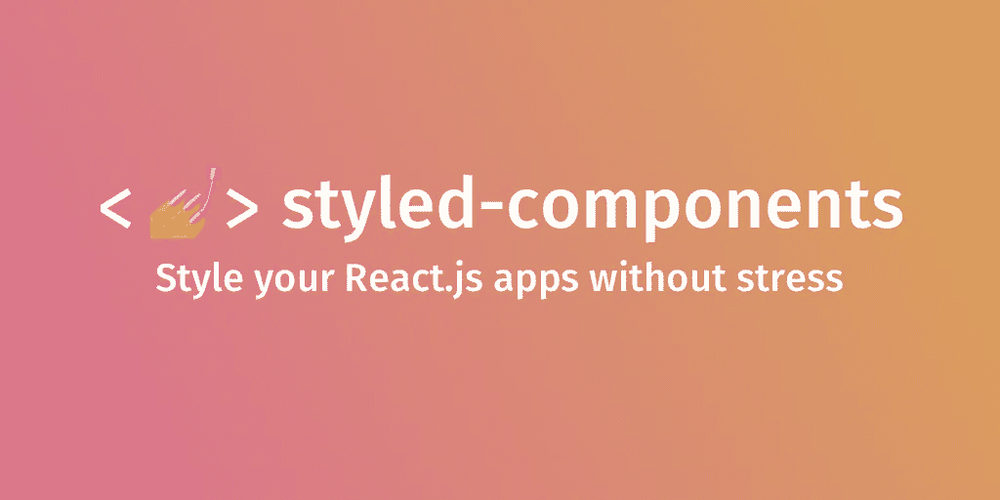

# 如何将 React.js props 与样式化组件一起使用

> 原文：<https://javascript.plainenglish.io/how-to-use-react-js-props-with-styled-components-db11fc83f5c9?source=collection_archive---------0----------------------->



[https://styled-components.com/](https://styled-components.com/)

## 什么是样式组件，我们为什么要使用它？

你知道样式组件吗？如果没有，这里有一个快速介绍:styled-components 是一个 NPM 库，它让你用 CSS-in-JS 解决 React.js 应用程序的样式问题。这非常方便的原因之一是，它还允许您使用 React.js 属性，我们可以将这些属性传递给 styled-components 中的组件，为我们的应用程序创建动态样式。例如，当您想要动态地改变组件的外观，而不必编写 CSS 源代码或使用内联样式时。

## 让我们开始吧。

首先，我们创建一个新的 React.js 应用程序

> 创建-反应-应用我的-反应-应用

然后，我们用纱线或 NPM 安装了样式组件

> 纱线添加样式组件

然后，我们像往常一样导入 React 和样式化组件

```
import React from “react”
import styled from “styled-components”
```

现在我们开始有趣的部分。我们将创建一个样式化的组件，所以是一个基本的 HTML 按钮，如“按钮”所定义的，我们可以用某种 CSS 在反斜杠内部增强它。典型的 CSS 语法是显而易见的，但是作为背景颜色的值，我们现在可以传递一个属性。

```
const Button = styled.button`
   background-color: ${props => props.color};
`
```

然后我们可以像往常一样在 React.js 中通过变量名简单地使用这个组件。作为这个组件道具，我们现在传递一个对 CSS 有效的颜色。

```
function App() {
  return (
    <div className=”App”>
      <Button color=”green”>This is a green button</Button>
      <Button color=”blue”>This is a blue button</Button>
    </div>
  )
}
```

因此，您现在应该会看到两个按钮。一个绿色和一个蓝色，因为我们给了这两种颜色作为按钮的颜色。

## 到目前为止很酷吧。但是我们甚至可以使用布尔值！

众所周知，在 CSS 中我们可以用 visibility 属性使元素可见或不可见，这取决于我们是指定“**可见**还是“**隐藏**”。

为了使用它，我们创建一个新的组件。其中的 JS 代码是 if-else 的简写语法，我们希望使用它来使组件可见或不可见，这取决于我们传递的属性。
我们的语法意思是，如果道具 **visible** 为 **true** ，我们要为 visibility 属性设置 CSS 值 visible，如果为 **false** ，我们要设置 CSS 值 hidden。所以真就是看得见，假就是看不见。

```
const ToggleButton = styled.button`
  */* if true, button will be visible */* visibility: ${props => (props.visible ? “visible” : “hidden”)};'
`
```

现在有两种方法可以通过组件控制 visibility 属性。
如果我们根本没有传递 prop，React.js 会默认将它的值设置为 **false** 。如果我们传递它，即使后面没有值，因为我们不需要它用于布尔值，React.js 将传递 **true** 。例子一如既往的在下面。

```
<ToggleButton visible>This button is visible</ToggleButton> <ToggleButton>This button is not visible</ToggleButton>
```

但是如果我们想把整个事情和我们的状态联系起来，我们也可以使用 JavaScript 语法。结果是一样的，但是你可以用一个变量来表示**真**和**假**，这是两者之一。

```
<ToggleButton visible={true}>This button is visible</ToggleButton> <ToggleButton visible={false}>
  This button is not visible
</ToggleButton>
```

## 如你所见，这是一个非常强大的概念，提供了许多可能性

下面你仍然会找到所有的源代码，感谢阅读，请务必将这篇文章分享给你的朋友。

致以最诚挚的问候，并享受这一技巧
*路易*

## 关于我，作者:)

嗨！再次感谢您的阅读，我叫路易斯，是一名来自德国的 18 岁学生。我热爱 web 开发，包括后端和前端。我最喜欢的技术是 React，Vue，React Native 和 Node.js.
请务必关注我，了解更多与这些相关的内容，并随时查看我的 IG @louis.jsx
祝您愉快！