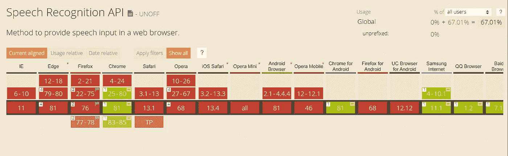
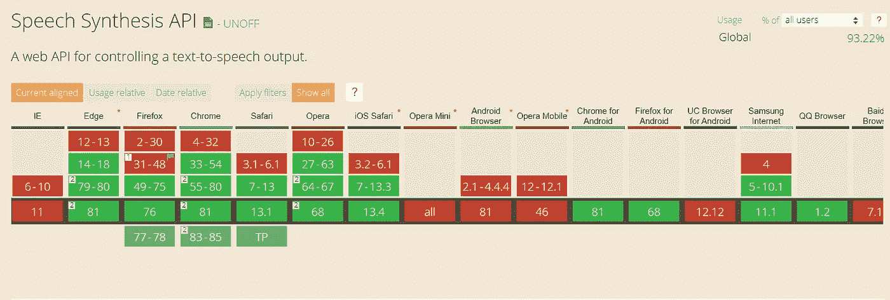

# 如何在 JavaScript 中使用语音识别和语音合成

> 原文：<https://javascript.plainenglish.io/how-to-use-speech-recognition-and-speech-synthesis-in-javascript-9bcb213f6ddd?source=collection_archive---------2----------------------->

## 关于如何使用 Web Speech API 为您的网站添加语音识别和语音合成的教程


Photo by [Ilyass SEDDOUG](https://unsplash.com/@ilyasssed?utm_source=unsplash&utm_medium=referral&utm_content=creditCopyText) on [Unsplash](https://unsplash.com/s/photos/microphone?utm_source=unsplash&utm_medium=referral&utm_content=creditCopyText)

# 介绍

语音识别是通过麦克风接收声音并使其能够让计算机识别和响应的过程，从而允许作为结果启动进一步的操作。

语音合成是用计算机对人类语音的人工模拟。它主要用于将文本信息翻译成音频信息，并作为一种辅助技术来帮助视力受损的人阅读文本内容。

## 网络语音 API

它是一个 JavaScript API，使 web 开发人员能够将语音识别和合成集成到他们的 web 页面中。它使开发人员能够使用脚本生成文本到语音的输出，并使用语音识别作为表单、连续听写和控制的输入。

## 1.语音识别 API

除了语音识别 API，还有一些其他相关的 API 用于显示结果、语法等。这些结果可以被其他 API 用作执行不同任务的输入。

不幸的是，正如你从下面的兼容性图表中看到的，Chrome 是唯一一个实现它的浏览器。



[https://caniuse.com/#search=web%20speech%20api](https://caniuse.com/#search=web%20speech%20api)

让我们演示一下如何实现带有语音识别的 google 搜索，

> 当您使用语音识别 API 时，浏览器很可能会要求您允许使用您的麦克风。

超文本标记语言

```
<form action="[https://www.google.com/search](https://www.google.com/search)" target="_blank">
 <input name="query" placeholder="Search" id="query" autofocus>
 <input type="button" value="Speak" onclick="recognition.start()">  
</form>
```

射流研究…

```
const SpeechRecognition = window.SpeechRecognition || window.webkitSpeechRecognition;var recognition = new SpeechRecognition();
  recognition.onresult = function(event) {
    if (event.results.length > 0) {
      query.value = event.results[0][0].transcript;
      query.form.submit();
    }
  }
```

你需要设置识别界面为`SpeechRecognition`而不管浏览器。语音识别界面是浏览器的`window`的一个对象。在 Chrome 中，`webkitSpeechRecognition`和火狐，`SpeechRecognition`。最后，`transcript`将在语音识别服务停止后提供文本输出。

## 2.语音合成 API

你也知道这是文本到语音的转换。语音合成的用途和语音识别一样多。大多数手机都有这个工具来帮助视障人士。

从兼容性图表中可以看出，与语音识别 API 不同，这更能兼容各种浏览器



[https://caniuse.com/#search=Speech%20Synthesis%20API](https://caniuse.com/#search=Speech%20Synthesis%20API)

首先，让我用一行代码演示一个简单的语音合成 API 示例。

```
speechSynthesis.speak(new SpeechSynthesisUtterance('Hello World'));
```

你可以通过创建一个新的`SpeechSynthesisUtterance`(基本上就是你想说的)，然后把它传递给`speechSynthesis`对象的`speak()`方法，轻松地得到*‘Hello World’*。

现在让我们转到文本到语音的实现，

超文本标记语言

```
<section class="warn"></section>
<select name="voice" id="voices" disabled>
</select><br><br><textarea disabled></textarea><button id="submit" onclick="speaker.speak();" disabled>Text to Speech</button>
```

射流研究…

我们从`<textarea>`获取输入文本，利用该文本，我们将创建`SpeechSynthesisUtterance`(在上面的代码中，我将它用作`utterance`)并将其传递给`synth.speak` ( `speechSynthesis.speak`)。

> 在 iOS 上，API 可以工作，但必须由用户动作回调触发，比如对点击事件的响应。

# 结论

在过去的几年里，这两个 API 在可访问性方面都发挥了很大的作用，尤其是对于视力受损的人、手臂受伤的人等等。文章到此为止。谢谢，注意安全！

## 来自简明英语团队的说明

你知道我们有四种出版物吗？给他们一个关注来表达爱意吧:[**JavaScript in Plain English**](https://medium.com/javascript-in-plain-english)，[**AI in Plain English**](https://medium.com/ai-in-plain-english)，[**UX in Plain English**](https://medium.com/ux-in-plain-english)，[**Python in Plain English**](https://medium.com/python-in-plain-english)**—谢谢，继续学习！**

**我们还推出了一个 YouTube，希望你能通过 [**订阅我们的英语频道**](https://www.youtube.com/channel/UCtipWUghju290NWcn8jhyAw) 来支持我们**

**一如既往,“简明英语”希望帮助推广好的内容。如果您有一篇文章想要提交给我们的任何出版物，请发送电子邮件至[**submissions @ plain English . io**](mailto:submissions@plainenglish.io)**，并附上您的媒体用户名和您感兴趣的内容，我们将会回复您！****

## ****资源****

****[wicg.github.io/speech-api](https://wicg.github.io/speech-api/)****

****[caniuse.com](https://caniuse.com/#search=Speech)****

****[developer.mozilla.org/Web_Speech_API](https://developer.mozilla.org/en-US/docs/Web/API/Web_Speech_API)****