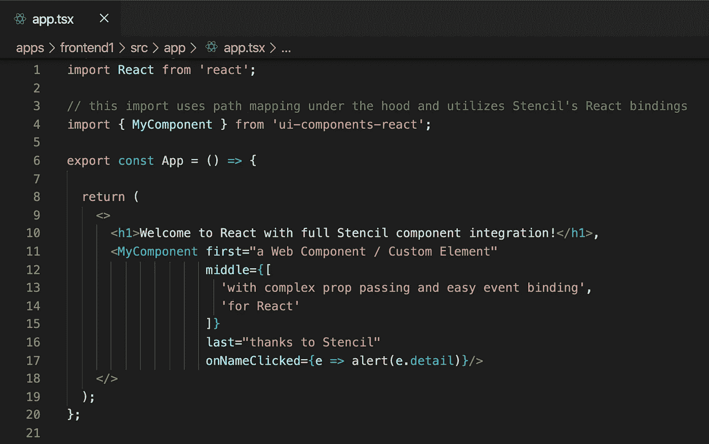
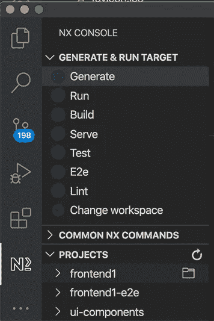
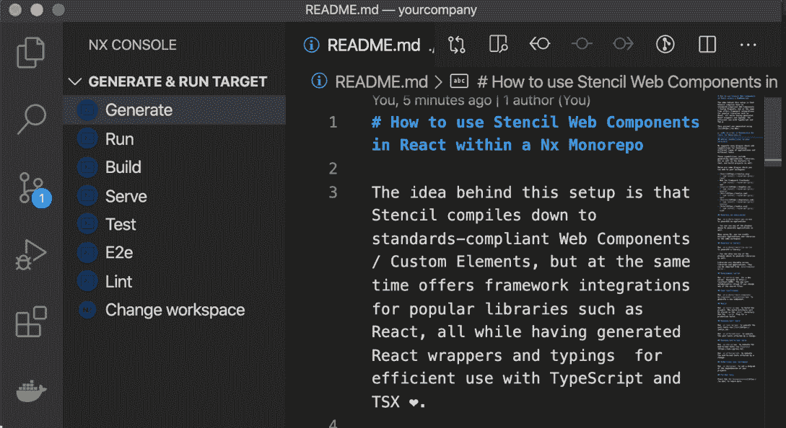
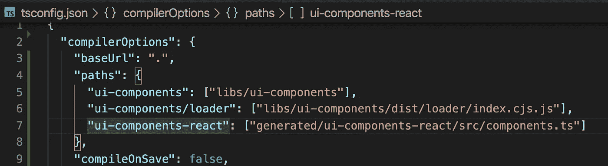

# 如何在 React 中有效地使用模板 Web 组件(带类型)

> 原文：<https://javascript.plainenglish.io/how-to-use-stencil-web-components-in-react-within-a-nx-monorepo-d6644f6ee858?source=collection_archive---------2----------------------->

这篇文章描述了如何通过生成的 React 包装器和类型在 React **中有效地使用你的[模板 Web 组件](https://stenciljs.com/)。**这给了你对 TypeScript 和 JSX 的完全支持。此外，这种方法还克服了 React 和定制元素之间通信的弱点。



Stencil Web Components in React with generated React wrappers and bindings for TypeScript

## 为什么是模板

首先，使用 Stencil 构建组件库的动机是 Stencil 向下编译符合标准的 Web 组件/自定义元素，同时它为 Angular、Vue 或 React 等流行的库提供了[框架集成](https://stenciljs.com/docs/overview)。这使得它与框架无关，经得起未来考验，并使前端架构能够拥有多个应用程序，这些应用程序使用不同的技术堆栈。在本文中，我们将探讨如何在 React 中有效地使用模板组件库:

## 考虑

GitHub 上的[Stencil-ds-react-template](https://github.com/ionic-team/stencil-ds-react-template)文档建议您在生成 React 绑定之前先将模板组件发布到 npm。这不适合我的工作流程，因为我喜欢避免发布包和处理版本管理。相反，我更喜欢有一个 monorepo，其中包含我所有的库和应用程序。这就是为什么我大量使用 TypeScript 的[路径映射](https://www.typescriptlang.org/docs/handbook/module-resolution.html)特性，它允许我的库导入到应用程序中，而不需要发布它们。对于 React 绑定来说，路径映射也是一个很好的特性，正如您将看到的，这使得路径映射成为一个简单的任务。

## 工具作业🚀

我想为我的模板组件生成 React 包装器的原因不仅仅是因为[简化了 React 和定制元素](https://custom-elements-everywhere.com/)之间的交互(例如，你不能优雅地传递复杂的数据)，还因为开发速度和生产率，因为我不想自己编写和更新粘合代码。这就是 Nx 的用武之地。

## Nx monorepo，带 React 和 Stencil ️

Nx 是一个用于 monorepo 开发的开源工具包，可以帮助您搭建项目、生成应用程序或库，并且在许多其他事情中，它还可以智能地构建 monorepo 中受影响的更改。

如果您还没有使用 Nx，您可以通过运行以下命令来尝试一下，该命令将引导您完成使用 React 应用程序创建 monorepo 工作区的过程:

```
npx create-nx-workspace@latest

? Workspace name (e.g., org name)     yourcompany
? What to create in the new workspace react
? Application name                    frontend1
? Default stylesheet format           SASS(.scss) 
```

这为我们提供了一个非常清晰的文件夹结构，其中包含了测试和运行 React 应用程序的所有内容。除了 Jest 单元测试，Nx 还使用 Cypress 搭建了一个完整的端到端测试项目(E2E)。

当您安装一个名为 Nx Console 的 [Visual Studio 代码扩展时，Nx 的威力会变得更加明显，它为您提供了一个 GUI，其中包含一些有用的命令来服务/构建/测试/生成/输出您的代码:](https://marketplace.visualstudio.com/items?itemName=nrwl.angular-console)



Nx Console Visual Studio Code

有了这些，让我们在 Nx 和一个[优秀的模板插件](https://github.com/DominikPieper/nx-extensions)的帮助下生成我们的模板库(感谢张秀坤·派珀):

1.  `yarn add @nxext/stencil -D`
2.  使用 Nx 控制台为您生成模板库(见下图)。我将模板库命名为`ui-components`，我们稍后会用到它。如果你想不用 Nx 控制台，执行下面的命令:`nx generate @nxext/stencil:library --name=ui-components --style=scss`



Generate a Stencil library using the Nx Console

Nx 刚刚生成了一个 libs 文件夹，其中包含一个名为 ui-components 的模板项目，其中包含一个组件`my-component`。我们已经可以构建项目来获得一个 dist 文件夹，其中包含我们可以在任何现代浏览器中使用的已编译的定制元素，而无需加载框架。但是我们现在真正感兴趣的是为我们的 Web 组件生成一个 React 包装器，所以让我们开始吧。

## 生成 React 绑定

模板项目就绪后，我们要生成 React 绑定所要做的就是以下步骤:

*   决定一个(虚拟)包名，您希望在该包名下公开您的模具组件库。你可能已经想到了你刚刚输入的用于创建模板项目的库名，所以在我的例子中，我将使用 **ui-components** 。如果您在没有 Nx 搭建的情况下使用了模板 CLI(NPM init 模板组件),这也很好，尽管下面提到的路径可能会因项目搭建的不同而略有不同。在任何情况下，最重要的一点是决定一个包名，我们稍后将使用该包名进行 TypeScript 的路径映射，以使我们的库无需发布即可访问。
*   安装@stencil/react-output-target 作为开发依赖:`yarn add @stencil/react-output-target -D`
*   更新`stencil.config.ts`并添加`reactOutputTarget`。这个目标需要以下信息:在哪个包名下你的模板组件是可访问的(使用我们刚刚决定的名字)以及你想把生成的 React 包装器，别名 proxiesFile 放在哪里。这是我的模板配置的结果:

Stencil component library with React bindings

*   注意，在我的 monorepo 中，为了清晰起见，我喜欢将 React 包装器输出到名为 generated 的顶级文件夹中。这是一个仅包含生成的源代码的文件夹，因此不应提交。所以让我们用**更新我们的** `**.gitignore**` **来忽略** `**/generated**`内的所有内容。此外，Stencil 支持与多个框架集成，这就是为什么我将生成的代码放在另一个名为`ui-components-react`的文件夹中，只是为了给它一个明确的范围和清晰的隔离。
*   我还添加了 esmLoaderPath 选项，该选项将生成另一个名为`loader`的文件夹，React 组件需要该文件夹来加载自定义元素的定义并引导它们。因此，这个加载器是创建我们的包装 React 组件的关键构建块。为了保持整洁，我将这个加载器放在 dist 文件夹中，就像编译后的 Web 组件一样。

## 路径映射

生成绑定后，我们最终得到三个包:

*   `ui-components`我们的核心模板组件
*   `ui-components-react`生成的反应组分
*   `ui-components/loader`生成的加载器充当我们的定制元素和 React 包装器之间的桥梁

我们现在不发布这些包，而是简单地将正确的路径映射添加到 monorepo 中最外层的`[tsconfig.json](https://github.com/Mobiletainment/Nx-Stencil-React/blob/master/tsconfig.json)` [。这允许从 monorepo 中的任何库或应用程序中按名称导入这些包，因为它只是将导入映射到给定的源代码位置:](https://github.com/Mobiletainment/Nx-Stencil-React/blob/master/tsconfig.json)



我们已经可以在 react 应用程序中使用 ui-components-react 包:

React app that uses Stencil components with type safe bindings and full framework integration

如您所见，我们没有使用 my-component 定制元素，而是使用它生成的 React derivative`MyComponent`。TypeScript 将自动选择为 MyComponent 生成的接口，以便我们能够以类型安全的方式设置 props 和事件处理程序。最重要的是，Stencil 的粘合代码允许我们将复杂的数据，如对象和数组传递给定制元素，从而减轻了我们在 React 中处理[定制元素时通常会遇到的问题。](https://custom-elements-everywhere.com/libraries/react/results/results.html)

## 额外提示:模板自定义元素和笑话

模板的当前分发包依赖于`CSSStyleSheet`的替换方法在组件初始化期间注册样式。虽然这在现代浏览器环境中可能没问题，但目前在用 Jest 执行测试时会导致错误。幸运的是，有一个多填充物可以拯救我们:

*   `yarn add construct-style-sheets-polyfill -D`
*   将 polyfill 添加到 jest.config.js 中的 setup 文件:

```
module.exports = {
  setupFiles: ['construct-style-sheets-polyfill'],
  ...
```

## 源代码

你可以在 GitHub 上查看完整的工作示例:[https://github.com/Mobiletainment/Nx-Stencil-React](https://github.com/Mobiletainment/Nx-Stencil-React)

请注意，所描述的过程可能会随着未来的软件包更新而改变。撰写本文时使用的软件包版本是:

```
"@nrwl/react": "9.3.0",
"@nrwl/workspace": "9.3.0",
"@nxext/stencil": "0.0.13",
"@stencil/core": "1.14.0",
"@stencil/react-output-target": "0.0.6",
"construct-style-sheets-polyfill": "2.3.5",
"document-register-element": "1.14.3",
"react": "16.13.1",
"react-dom": "16.13.1",
"typescript": "~3.9.3"
```

## **用简单英语写的便条**

你知道我们推出了一个 YouTube 频道吗？我们制作的每个视频都旨在教给你一些新的东西。点击此处 查看我们，并确保订阅该频道😎