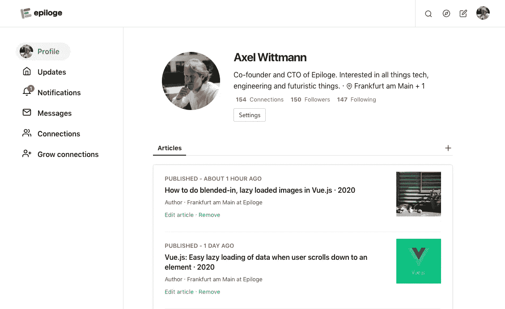

# 如何在你的 Vue 应用中使用 svg 图标

> 原文：<https://javascript.plainenglish.io/how-to-use-svg-icons-in-your-vue-app-6e2c30865d7c?source=collection_archive---------0----------------------->


Photo by [Harpal Singh](https://unsplash.com/@aquatium?utm_source=medium&utm_medium=referral) on [Unsplash](https://unsplash.com?utm_source=medium&utm_medium=referral)

## 不需要任何外部库就可以轻松做到这一点

在早期的网站开发中，有各种各样的方法将图标加入到你的网站中。最直接的方法是将每个图标保存为. png 或。jpg 文件，然后将其显示为普通图像。这种粗糙方法的缺点是，你在页面上集成的图标越多，需要加载的图像就越多。这种*老派*图标整合的一个非常不幸的副作用是，图标有时在网站已经部分加载后才加载。

随着时间的推移，图标的各种方法变得流行起来。开发者开始使用*图像精灵*，也就是说，他们把他们在整个网站上使用的所有图标和小图像放在一个更大的白色背景文件中。当他们显示一个单独的图标时，精灵作为背景图像被加载，但是聪明的是只显示相关图标的部分。例如，Instagram webapp 长期以来一直使用这种方法，只是最近才将其符号改为 svg 文件。

今天，图标的首选解决方案是 svg 文件。它们很小，容易操作(例如，改变颜色或阴影)，加载你的应用程序，如果你想让它们看起来不同，你可以完美地操作它们。但是如何将它们集成到你的 Vue 应用中呢？你真的需要另一个外部 vue 库来完成吗？嗯，对于我们的站点 [Epiloge](http://www.epiloge.com) ，我们在没有任何外部帮助的情况下整合了它们，事情一直在顺利进行。

# 在 Vue 中，使用一个基本组件并将每个图标作为一个单独的文件包含在内

首先，创建一个基本文件，作为您想要使用的所有不同 svg 图标的容器。大概是这样的:

```
<template>
  <svg ae jd" href="http://www.w3.org/2000/svg" rel="noopener ugc nofollow" target="_blank">http://www.w3.org/2000/svg" 
    :width="width" 
    :height="height" 
    :viewBox="viewBox" 
    :aria-labelledby="iconName"
  >
    <title :id="iconName" lang="en">{{iconName}}</title>
    <g :fill="iconColor">
      <slot />
    </g>
  </svg>
</template><script>
export default {
  props: {
    viewBox: { type: String, default: '0 0 24 24'},
    iconName: { type: String, default: ''},
    width: { type: [Number, String], default: 18 },
    height: {type: [Number, String], default: 18 },
    iconColor: {type: String, default: 'currentColor'}
  }
}
</script>
```

将此图标基础文件保存在 Vue.js 资源中。我们将它放在文件结构的根目录中，然后在 main.js 文件中全局注册该组件，但是您可以将它放在您认为最合适的位置:

```
import IconBase from '@/components/IconBase.vue'
Vue.component('icon-base', IconBase);
```

这个基本图标文件创建了一个具有特定属性的`<svg>`标签:`viewBox`是您包含的 svg 的大小，默认情况下是 24px x 24px，但是您可以根据您使用的 SVG 来更改它。例如，我们修改了我们的移动网络应用版本 [Epiloge](http://www.epiloge.com) 的某些图标，并在那里使用了 400 像素到 400 像素的`viewBox`。宽度和高度应该等于`viewBox`，但是根据您使用的图标，您可能希望根据特定的图标修改它，以便更好地居中或对齐它们——只是尝试一下。

我们使用了来自 [www.icomoon.io](http://www.icomoon.io) 的免费图标——如果你不能在他们的网站上立即找到它们，点击标题右上角的按钮 *IcoMoon App* 。但是有很多其他网站都有免费的 svg 图标，你会发现它们无处不在。如果你不知道谷歌图片是否是免费的，就不要使用谷歌图片并从那里复制它们。

另一个提示:我们已经使用了 [Sketch](http://www.sketch.com) 来修改 svg 图标。虽然如果您不熟悉 path-svg 图标，这可能是相当多的时间投资和努力。我们最终只是简单地使用免费的 Icomoon 图标，摆弄它们的颜色(尤其是不透明度),只为我们的移动应用程序修改它们。



A screenshot from [our Vue.js App Epiloge](http://www.epiloge.com), you can see we use svg icons on the left and in the header, but with different opacities

# 确保您使用的图标仅使用路径

SVG 可以包括各种形状。最常见的是一个*路径*，它只是一个视图框中用线连接起来的点的数组。这些是我们使用的 svg 图标，而不是 svg 对象，如椭圆或圆等。为什么？我们发现不同的浏览器有时会以不同的方式呈现复杂的 svgs 而简单的路径会在所有浏览器和设备上一致地呈现。

下面是一个图标的简单例子——勾号。您可以将此图标作为 vue 文件保存在 assets 组件的图标文件夹中:`IconCheck.vue`。如果您想在全局范围内而不仅仅是在一个页面上使用一个图标，一定要将这个组件注册到您的 main.js 中。

```
//IconCheck.vue
<template>
   <path d="M20.7 5.3c-0.4-0.4-1-0.4-1.4 0l-10.3 10.3-4.3-4.3c-0.4-0.4-1-0.4-1.4 0s-0.4 1 0 1.4l5 5c0.2 0.2 0.4 0.3 0.7 0.3s0.5-0.1 0.7-0.3l11-11c0.4-0.4 0.4-1 0-1.4z"></path>
</template>//Addition to main.js
import IconCheck from '@/components/icons/IconCheck.vue'
Vue.component('icon-check', IconCheck);
```

# 在模板中显示图标

在模板中显示图标是一件非常简单的事情。代码包含在下面，只需在模板的任何地方使用它。

使用 svg-icons，您可以对您的图标进行一定的控制，例如您可以根据自己的意愿更改`iconColor`(我们通常根据图标的使用位置使用不同的不透明度，例如`rgba(0,0,0,0.80)`代表深灰色图标，而 rgba(0，0，0，0.35)则用作看起来“已禁用”的浅灰色图标)。如果使用不同类型的图标，而不是标准的视图框大小，也可以修改视图框。添加`viewBox=”0 0 150 150"`作为这个尺寸的 svg 图标，并将宽度和高度设置为 150px

```
<icon-base width="22" height="22" iconColor="rgba(0,0,0,0.80)" icon-name="checkmark"><icon-three-dots/></icon-base>
```

根据您希望在页面上显示的内容，使用 v-if 语句显示不同的图标是非常简单的。我们在整个 webapp 中都是这样做的。或者在 iconColor 上使用 v-bind 函数来指示图标是否以较低的不透明度被禁用。注意，如果你想把一个图标作为一个按钮，把它包在一个`<a>`标签或者一个`<router-link>`标签中，并设置这个外部标签的宽度和高度。

# 仅此而已。

我希望这篇将 svg 图标轻松包含到你的 Vue.js 项目中的教程能对其他人有所帮助。总而言之，svg-icons 是将常用图标集成到 Vue.js 项目中的最直接、轻量级和通用的方法。以下是使用它们的好处:

*   你可以使用无许可证一致的图标集，将它们保存为。图标文件夹中的 vue 文件，并在任何地方使用它们。每个图标可以小到几百字节，如果在 Vue.js 项目中使用 gzip，甚至更小。
*   您获得了一种基于用户在您的站点上采取的操作来操纵图标的方法，例如不同的颜色、不透明度或大小。
*   使用 Sketch 或其他图像处理软件来修改图标或创建新图标。
*   允许不同的视图框和图标大小，而不会遇到图标清晰度的问题。并且在所有浏览器中保持图标的一致性。