# 我构建了一个 Chrome 扩展来提醒我比特币的价格变化

> 原文：<https://javascript.plainenglish.io/how-to-use-the-chrome-extensions-technology-to-show-bitcoin-alerts-42ad492665d7?source=collection_archive---------8----------------------->

## 使用 Chrome 扩展和常规 JavaScript 构建比特币警报系统的分步指南


Crypto portfolio image by [Undraw](https://undraw.co/)

我为谷歌 Chrome 开发了一个小扩展，当比特币价格上涨或下跌时，它会自动提醒我。为此，该扩展允许我们配置两个警报。

我创建它有两个原因:第一个是为了避免在不同页面查看比特币价格时分心，第二个原因是因为我想做一些快速而实用的事情，让我知道价格是否变化。

我创建的扩展简单而有用，我鼓励您改进它并添加更多选项。

GitHub 代码:[https://github.com/Kesknoren/btcAlertSimpleExtension](https://github.com/Kesknoren/btcAlertSimpleExtension)

我们走吧。

# 基本信息

第一件事是创建一个包含我们的扩展的文件夹，其中有一个名为 *manifest.json* 的文件，包含我们的扩展的特性。

在 Linux 中:

```
$ mkdir btcAlertSimpleExtension && cd $_
```

现在，创建一个名为 manifest.json 的文件

```
$ gedit manifest.json
```

*这里* *可以直接下载* [*。*](https://github.com/Kesknoren/btcAlertSimpleExtension/blob/master/manifest.json)

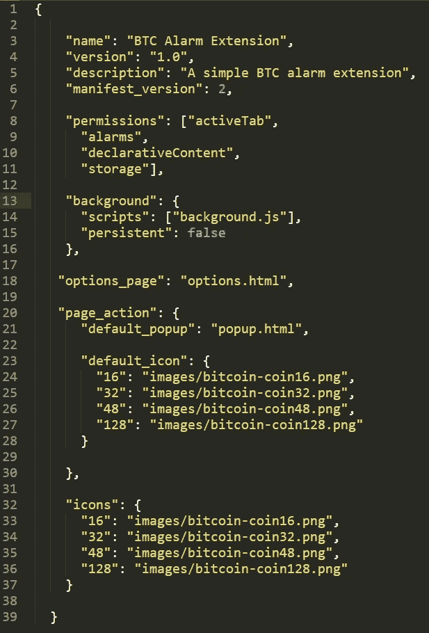

manifest.json file

# 说明

json 文件告诉 Chrome 关于你的扩展的信息，比如它的名字或者它使用的脚本。

基本字段

*   名称:扩展的名称
*   版本:我们扩展的版本。
*   描述:扩展的纯文本描述。
*   manifest_version:应始终为 2，因为自 2014 年以来版本 1 已不受支持。

背景

*   它们被列在“scripts”键之后的数组中，并且“persistent”应该被指定为 false。这个脚本在后台运行，处理大多数 chrome 事件。

页面 _ 操作

*   这个动作是通过点击我们的扩展图标来执行的。在我们的例子中，我们的扩展只有一个配置页面，所以我们不会使用这个选项。

选项 _ 页面

*   我们使用此字段来定义扩展选项。当我们单击扩展的图标时，将会打开一个菜单来配置警报。

核标准情报中心

*   不同分辨率的扩展图标。

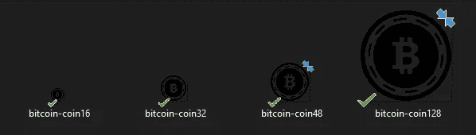

The icons of our extension

# 后台脚本文件

背景. js

*这里* *可以直接下载* [*。*](https://github.com/Kesknoren/btcAlertSimpleExtension/blob/master/background.js)

我们使用后台脚本获取 BTC 价格并添加我们的警报。

在下面的代码中，我定义了一些默认值，并在安装扩展时保存在 [chrome 存储器](https://developer.chrome.com/apps/storage)中。首次安装、更新扩展或浏览器更新到新版本时，将触发 runtime.onInstalled 事件。

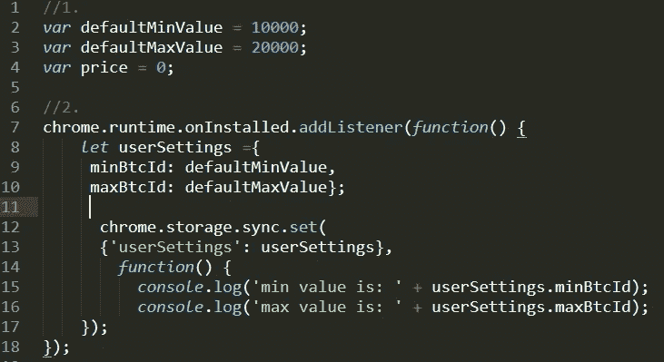

background.js part 1.

在这里，我创建了一个警报。在接近*周期分钟*指定的时间时，触发 onAlarm 事件。

FetchBtcPrice 是一个从 gdax.com API 获取实际比特币价格的函数。

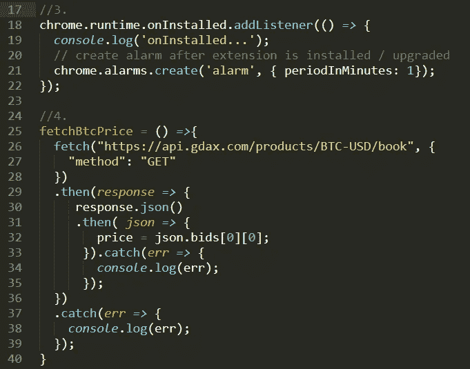

background.js part 2.

我们上面定义的警报监听器在警报过去时触发。

当事件大约每分钟被触发时，我们检查比特币的价格是否已经改变，并根据我们将在扩展的选项页面中定义的警报显示警告。

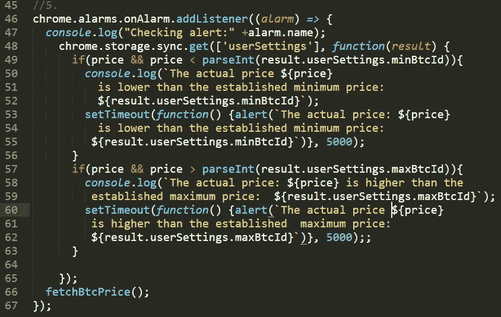

background.js part 3.

# 选择

# 用户界面

options.html

*这里* *可以直接下载* [*。*](https://github.com/Kesknoren/btcAlertSimpleExtension/blob/master/options.html)

对于我们的选项页面的外观，我们将使用 [bootstrap4](https://getbootstrap.com/) 以便导入必要的 css。

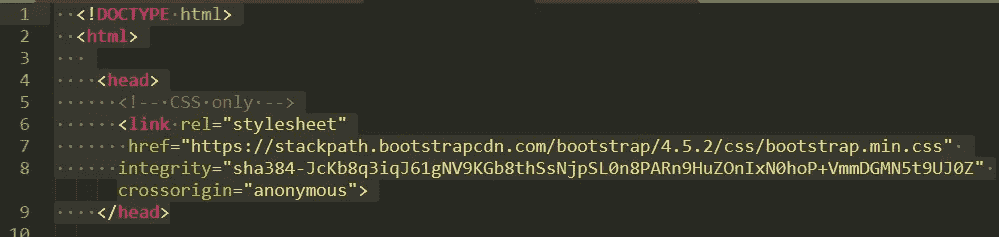

options.html file part 1

我们定义了选项页面的外观。一方面，它会在上部显示当前的比特币价格，另一方面，在页面的中心部分，它会显示两个字段，以输入比特币必须达到的最低和最高价格，以提醒我们。

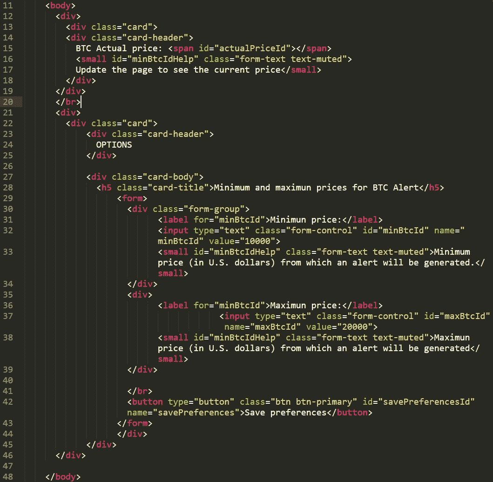

options.html file part 2

在这里，我们导入 options.js 文件，该文件包含选项页面的所有逻辑。

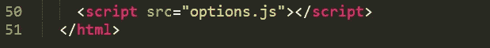

options.html part 3

options.js

*这里* *可以直接下载* [*。*](https://github.com/Kesknoren/btcAlertSimpleExtension/blob/master/options.js)

我们向按钮上的事件“click”添加一个侦听器，id 为:savePreferencesId，因此当它被单击时，我们引入的警报将被保存。

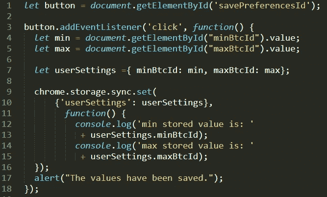

options.js file part 1

我们定义了一个[life](https://developer.mozilla.org/en-US/docs/Glossary/IIFE)函数，当 options.js 被加载以获取实际的 BTC 价格时执行该函数。

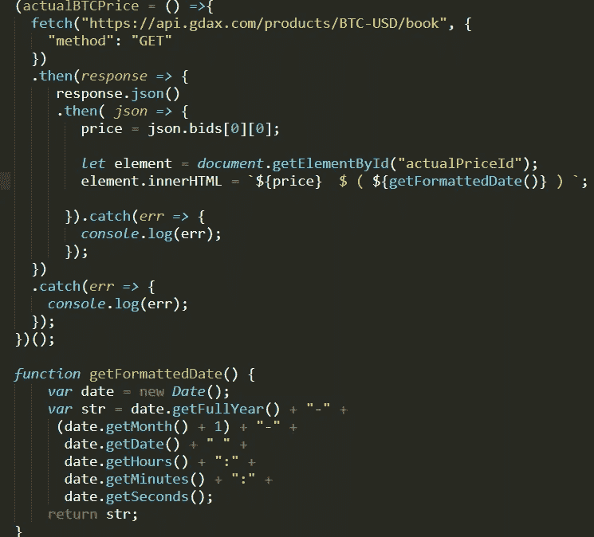

options.js file part 2

# 弹出页面

我们的扩展中不需要它，所以它有最少的内容。

# 用户界面

popup.html

*这里* *可以直接下载* [*。*](https://github.com/Kesknoren/btcAlertSimpleExtension/blob/master/popup.html)

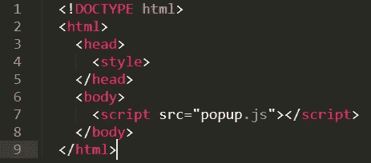

popup.html file

popup.js

*这里* *可以直接下载* [*。*](https://github.com/Kesknoren/btcAlertSimpleExtension/blob/master/popup.js)

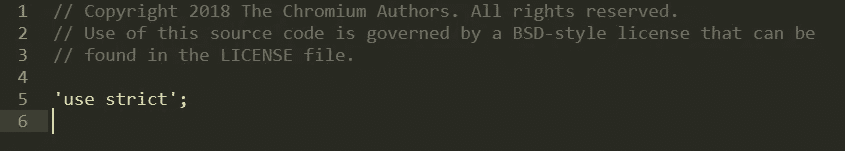

popup.js file

# Chrome 扩展图

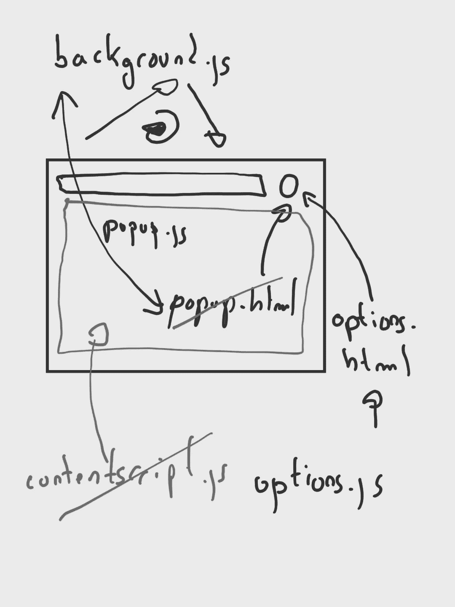

Chrome extension diagram

# 安装扩展

有不同的方法可以做到这一点，但最简单的方法之一是打开 Chrome://extensions/，打开开发者模式，然后点击 Load unpacked。在这里，我们选择扩展的文件夹。

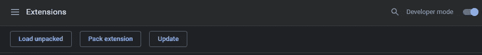

Chrome extension manager menu

如果一切顺利，我们将看到我们刚刚安装的扩展。

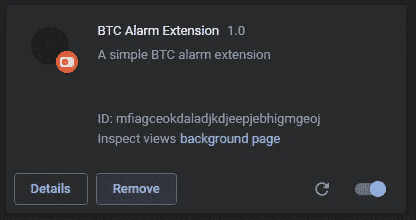

Our installed extension

# 使用分机

一旦我们安装了扩展，我们会在浏览器的右上方看到它。如果我们单击扩展的图标，我们将看到一个弹出窗口，其中包含相同的选项。

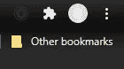

Our icon extension in the Chrome menu bar

现在，我们单击菜单选项，将显示我们的扩展的配置页面。

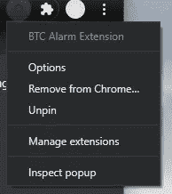

Extension options menu

在这里，我们设置了最低和最高比特币价格的警报。

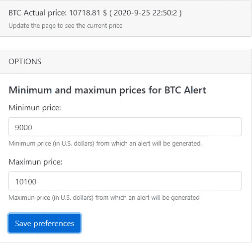

Options screen

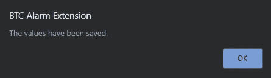

Confirmation message

如果比特币的价格达到两个定义的警报之一，任何浏览器标签都会出现一条消息通知我们。

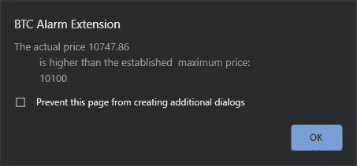

BTC Alarm.

# 结论

我通过查看比特币的价格建立了一个节省我时间的东西。我从未为 Chrome 创建过扩展，说实话，我创建了一个有点不寻常的扩展，它只有一个配置页面和一个警告系统。我不需要更多；我的需求是在比特币价格变化时提醒我，我已经编写了尽可能少的代码来实现这一点。

这不是最好的代码，也不是谷歌 Chrome 扩展的真正目的，但它满足了我的需求。很多时候不需要更多。

谢谢你阅读我。我希望这篇文章能激励你在需要的时候创造出对你有帮助的东西。

# 参考

[谷歌浏览器扩展](https://developer.chrome.com/extensions)。

[铬储存。](https://developer.chrome.com/apps/storage)