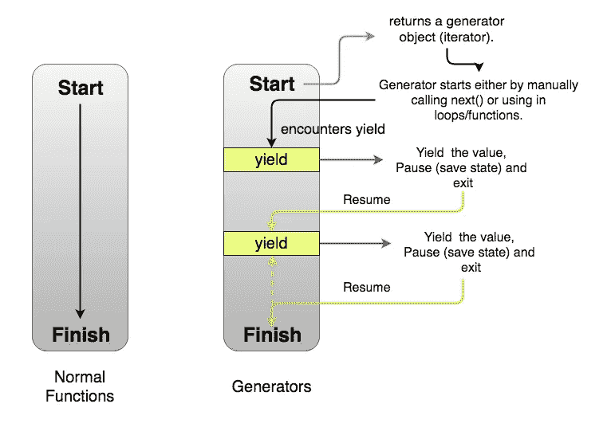
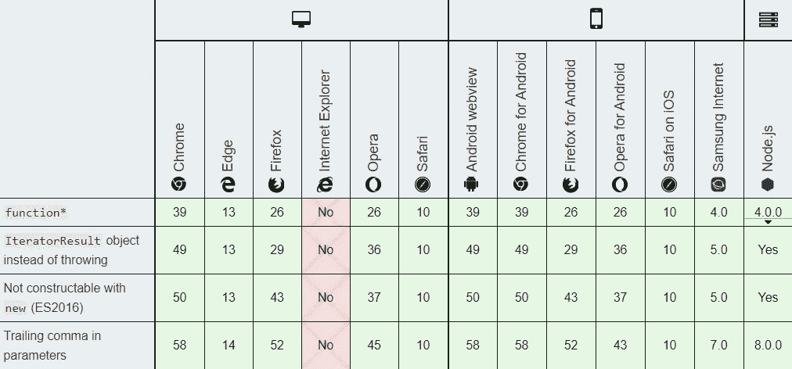
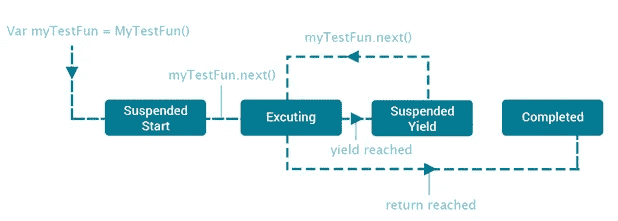

# 如何在 JavaScript 中使用生成器函数*

> 原文：<https://javascript.plainenglish.io/how-to-use-the-generator-function-in-javascript-6ab00380cc5f?source=collection_archive---------0----------------------->


Photo by [Jayphen Simpson](https://unsplash.com/@jayphen?utm_source=unsplash&utm_medium=referral&utm_content=creditCopyText) on [Unsplash](https://unsplash.com/?utm_source=unsplash&utm_medium=referral&utm_content=creditCopyText)

Function 关键字后跟一个星号用于定义一个生成器函数，该函数返回一个 ***生成器*** 对象。

*我们可以稍后退出并重新进入生成器功能。在重入的情况下，它们的上下文(变量绑定)将被保存。*

这里需要注意的重要一点是，调用一个生成器函数并不立即执行它的主体，事实上它返回的是这个函数的迭代器对象。

> 简而言之，生成器看起来像一个函数，但它的行为像一个迭代器。

## 语法:

```
function* generatorFunctionName([param[, param[, ... param]]]) {
   statements
}
```

*   ***名称:*** 功能名称
*   ***param |可选:*** 函数的形参。
*   ***语句:*** 组成函数体。

```
function* generator(i) {
  yield i;
  yield i + 1;
}const gen = generator(1);
console.log(gen.next().value);
// expected output: 1console.log(gen.next().value);
// expected output: 2
```

只有当迭代器的 ***next()*** 方法被调用时，生成体才会被执行。执行一直进行到第一个 yield 表达式(用 yield*指定从迭代器返回的值)委托给另一个生成器函数。

***next()*** 方法以一个 ***Boolean*** 的形式返回一个对象，该对象的 value 属性包含生成的值，以及一个***【done】***属性，该属性指示生成器是否已生成其最后一个值。

```
{ 
  value: AnyValue,
  done: true|false
}
```

***要恢复执行*** 的生成器功能，我们可以调用 ***next()*** 带参数的方法。此操作也将导致用来自 ***next()*** 的参数替换执行暂停处的 yield 表达式。

***要完成*** 生成器功能的执行，我们可以使用 return 语句。返回值将用于设置生成器返回的对象的 value 属性。在生成器函数内部抛出的任何异常，也会导致生成器结束，除非它已经被捕获到它的主体内部。



**GeneratorFunction** 构造函数，或者函数表达式语法也可以用来定义**生成器函数**。然而，我们应该记住，发电机是不可建造的。

```
function* generatorFunction() {}
var obj = new generatorFunction;// Uncaught TypeError: generatorFunction is not a constructor
```

***一旦生成器完成，*** 我们将无法使用后续的 ***next()*** 调用来执行生成器的任何代码。他们只会返回一个这样形式的对象: ***{value: undefined，done: true}。*** 在下面的例子中，我们可以同样检查。

```
function* generatorFunction() {
  var index = 0;
  while (true)
  {
    yield index++;
      if(index > 2)
      {
          return;
      }
  }
}var gen = generatorFunction();console.log(gen.next()); 
console.log(gen.next()); 
console.log(gen.next()); 
console.log(gen.next());**// Output -->**
{ value: 0, done: false }
{ value: 1, done: false }
{ value: 2, done: false }
{ value: undefined, done: true }
```

## 将参数传递给生成器:

```
function* logGenerator(i) {
    while(i < 3)
    {
      console.log(i++, yield);  
    }
}var gen = logGenerator(0);// the first call of next executes from the start of the function
// until the first yield statement
gen.next();            
gen.next('Logging Starts...');   
gen.next('Logging Going On...'); 
gen.next('Logging Ends...');**// Output -->**
0 Logging Starts...
1 Logging Going On...
2 Logging Ends...
```

## 使用产量*:

```
function* anotherGenerator(i) {
  yield i + 10;
  yield i + 20;
  yield i + 30;
}function* functionGenerator(i) {
  yield i;
  yield* anotherGenerator(i);
  yield i + 1;
}var gen = functionGenerator(1);console.log(gen.next()); 
console.log(gen.next()); 
console.log(gen.next()); 
console.log(gen.next()); 
console.log(gen.next());**// Output -->**
{ value: 1, done: false }
{ value: 11, done: false }
{ value: 21, done: false }
{ value: 31, done: false }
{ value: 2, done: false }
```

***注意:*** *我们还可以在* ***异步编程*** *中使用* ***生成器函数*** *，并承诺使用它们将减轻(如果不能完全消除)与***有关的问题，例如回调地狱和控制反转。然而，我们也可以使用****async****函数来做同样的事情，其实现将会简单得多。**

# *浏览器兼容性*

**

# *结论*

*   *生成器是一类特殊的函数，它简化了编写迭代器的任务。*
*   *生成器是一个产生一系列结果而不是单个值的函数，即您*生成*一系列值。*

**

*暂时就这样了。在下面的文章中，我已经介绍了更多关于生成器功能的内容，比如用例、优点等等…*

*[如何在 JavaScript 中使用生成器函数*(续…)](https://medium.com/javascript-in-plain-english/how-to-use-the-generator-function-in-javascript-continued-aada07d220c7)*

## *参考*

*Mozilla MDN
代码爆发*

## ***用简单英语写的 JavaScript 的注释:***

*我们总是有兴趣帮助推广高质量的内容。如果你有一篇文章想用简单的英语提交给 JavaScript，用你的中级用户名发邮件到 submissions@javascriptinplainenglish.com[给我们，我们会把你添加为作者。](mailto:submissions@javascriptinplainenglish.com)*