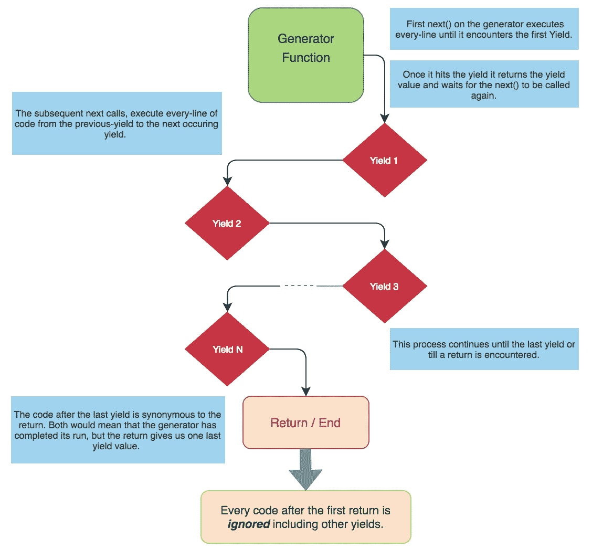

# 如何在 JavaScript 中使用生成器函数*

> 原文：<https://javascript.plainenglish.io/how-to-use-the-generator-function-in-javascript-continued-aada07d220c7?source=collection_archive---------4----------------------->


这是 [JavaScript 生成器函数系列](https://medium.com/javascript-in-plain-english/how-to-use-the-generator-function-in-javascript-6ab00380cc5f)的第二部分。在本文中，我们将讨论生成器函数的用例，以及在处理它时需要记住的几个要点。

# 使用案例:-

# 可迭代实现

在任何迭代器实现中，首先我们必须手动创建一个迭代器对象，它将有一些方法来移动到下一条记录，功能与 ***next()*** 方法相同。

其次，我们需要以某种方式保持 iterable 的状态。使用普通函数，实现同样的功能是非常乏味的，有时也是一项具有挑战性的任务。

然而，使用生成器函数，我们可以在不使用额外样板代码的情况下实现它。原因是生成器本身就是可迭代的。

*   **使用正常功能**

```
var iterableObject = {
  [Symbol.iterator]() {
    let index = 0;
    return {
      next() {
        index++;
        if (index === 1) {
          return { value: 'Iterable : ' + index, done: false};
        } else if (index === 2) {
          return { value: 'Iterable : ' + index, done: false};
        } else if (index === 3) {
          return { value: 'Iterable : ' + index, done: false};
        }
        return { value: '', done: true };
      }
    }
  },
}for (var val of iterableObject) {
  console.log(val);
}
```

*   **使用发电机功能**

```
function * iterableObject(index) {
  yield 'Iterable : ' + index++;
  yield 'Iterable : ' + index++;
  yield 'Iterable : ' + index++;
}for (const val of iterableObject(1)) {
  console.log(val);
}
```

在上面的例子中，我们可以看到使用发生器函数的方法更简单，也更容易实现。

# 异步功能实现

生成器可以简化承诺的工作。在下面的例子中，我们可以看到相同的-

*   **利用承诺**

```
function fetchAPI(apiURL) {
    return fetch(apiURL)
    .then(request => request.text())
    .then(text => {
        return JSON.parse(text);
    })
    .catch(error => {
        console.log('Error Occurred : ${error.stack}');
    });
}
```

*   **我们同样可以使用生成器和**[**co . js**](https://github.com/tj/co)**库实现如下:**

```
const fetchAPI = co.wrap(function* (apiURL) {
    try {
        let request = yield fetch(apiURL);
        let text = yield request.text();
        return JSON.parse(text);
    }
    catch (error) {
        console.log('Error Occurred : ${error.stack}');
    }
});
```

*   **使用 ECMAScript 2017**

```
async function fetchAPI(apiURL) {
    try {
        let request = await fetch(apiURL);
        let text = await request.text();
        return JSON.parse(text);
    }
    catch (error) {
        console.log('Error Occurred : ${error.stack}');
    }
}
```

# 使用发电机作为观测器

`yield`也可以从`next()`接收一个值(通过一个参数)。这意味着我们可以使用生成器作为数据消费者，直到通过`next()`推送新的值，这些数据消费者才会暂停。

请查看 [*此链接*](https://exploringjs.com/es6/ch_generators.html#sec_generators-as-observers) 了解相同的详细说明。

# 协同程序(数据生产者和消费者)

由于生成器可以被暂停，既可以用作数据生产者，也可以用作消费者，因此我们可以很容易地将它们用作 [***协程***](https://exploringjs.com/es6/ch_generators.html#sec_generators-as-coroutines)*(协同多任务任务)。*

# *需要注意的要点*

## *1.yield 只能在生成器函数中使用*

*我们只能在生成器函数中使用 yield，在非生成器函数中是不允许的。这意味着在回调中屈服不起作用。*

```
*function* someGeneratorFunction() {
    ['Batman', 'Superman'].forEach(hero => yield hero); 
 // Throws SyntaxError
}*
```

*我们也可以在不使用回调的情况下重写上面的代码，它会像下面这样很好地工作。然而，这样做总是不可能的。*

```
*function* someGeneratorFunction() {
    for (const hero of ['Batman', 'Superman']) {
        yield hero; // OK
    }
}*
```

## *2.仅一次访问*

*一旦我们迭代了生成器对象，我们就不能再迭代它了。我们需要创建新的生成器对象来迭代相同的值。*

```
*function * evenNumber() {
  let num = 2;
  while (true) {
    yield num;
    num = num + 2
  }
}
const numbers = evenNumber();console.log(numbers.next())
console.log(numbers.next())const anotherNumbers = evenNumber();console.log(anotherNumbers.next())
console.log(anotherNumbers.next())*
```

*他们也不允许像数组一样的随机访问。要访问任何特定的值，我们必须一个接一个地生成这些值。*

# *利益*

*   *[懒评](https://exploringjs.com/es6/ch_generators.html#sec_examples-of-generators)*
*   *高效的内存利用*

**

## *参考*

*[探索 js](https://exploringjs.com/es6/ch_generators.html)
代码突发*