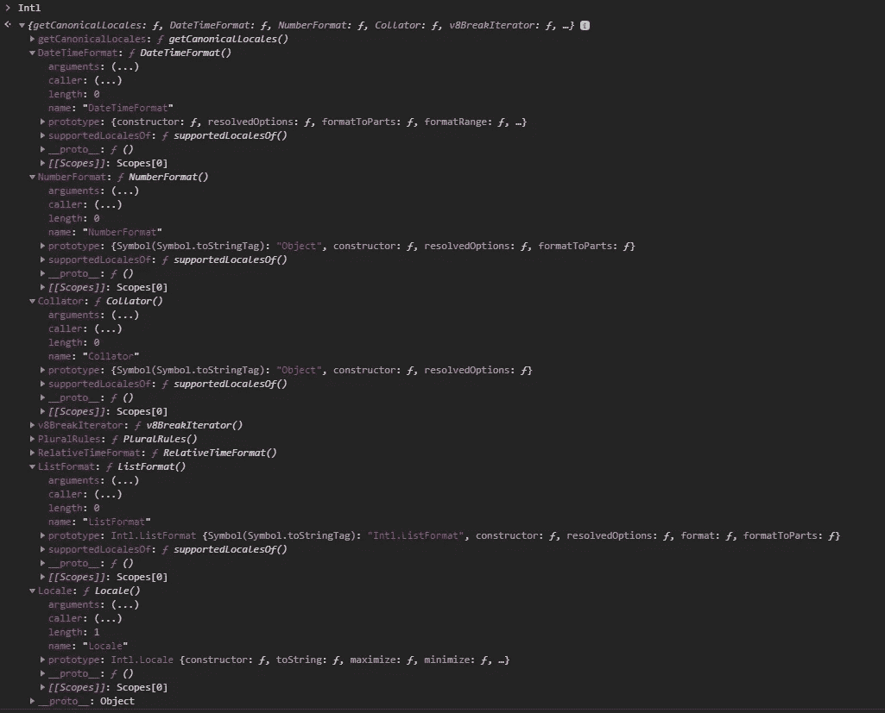

# 如何使用 JavaScript 国际化 API

> 原文：<https://javascript.plainenglish.io/how-to-use-the-javascript-internalization-intl-object-with-their-last-features-148c6acdeb67?source=collection_archive---------4----------------------->

## 简短、有用的 JavaScript 课程——让它变得简单。


two monitors with no visible code

Intl 对象是 ECMAScript 国际化 API 的命名空间，它提供语言数字格式、字符串比较和日期/时间格式。Intl 对象在全局作用域中可用，并提供对几个构造函数的访问，以及对国际化构造函数和其他语言敏感函数的公共功能

下面是 Chrome 80 DevTools 中 Intl 全局对象的样子:



How the Intl object looks like

# 性能

注意:所有例子都在 chrome 80 中测试过。

**国际机场。启用区分语言的日期和时间格式的对象的 DateTimeFormat**
构造函数。

构造函数:new Intl.dateTimeFormat(locale，<optional options="" object="">)</optional>

选项:具有以下部分或全部属性的可选对象:

```
{
  day: 'numeric' | '2-digit',
  hour: 'numeric' | '2-digit',
  minute: 'numeric' | '2-digit',
  second: 'numeric' | '2-digit',
  weekday: 'narrow' | 'short' | 'long',
  era: 'narrow' | 'short' | 'long',
  year: 'numeric' | '2-digit',
  month: 'numeric' | '2-digit' | 'narrow' | 'short' | 'long',
  timeZoneName: 'short' | 'long',
  timeZone: 'UTC',
  // Force 12-hour or 24-hour
  hour12: true | false
}
```

示例:

```
let now = new Date(2020, 02, 25, 20, 30, 00);let nowEnUs = new Intl.DateTimeFormat('en-US');let noeEs = new Intl.DateTimeFormat('es-ES');console.log(nowEnUs.format(now));
//3/25/2020console.log(noeEs.format(now));
//25/3/2020
```

可以使用 options 参数自定义日期和时间格式:

```
const options= {
        weekday: 'long',
        month: 'long',
        year: 'numeric'
};let now = new Date(2020, 02, 25, 20, 30, 00);let nowEnUs = new Intl.DateTimeFormat('en-US',options);let noeEs = new Intl.DateTimeFormat('es-ES',options);console.log(nowEnUs.format(now));
//March 2020 Wednesdayconsole.log(noeEs.format(now));
//marzo de 2020 miércoles
```

现在，您还可以将同一个月的日期组合在一起:

```
const dtf = new Intl.DateTimeFormat("en", {
    year: 'numeric',
    month: 'numeric',
    day: 'numeric',
    hour: 'numeric',
    minute: 'numeric'
});let start= new Date(2020, 01, 25, 20, 30, 00);let end= new Date(2021, 01, 01, 20, 30, 00);console.log(dtf.formatRange(start, end))
//2/25/2020, 8:30 PM – 2/1/2021, 8:30 PM
```

**国际。NumberFormat**
根据区域设置和格式选项对数字进行格式化，换句话说，数字可以采用更容易理解的格式。

构造函数:new Intl。数字格式(区域设置，<optional options="" object="">)</optional>

选项:具有以下部分或全部属性的可选对象:

```
{
  localeMatcher: 'lookup' | '2-best fit',
  style: 'decimal' | 'currency' | 'percent' | 'decimal',
  currency: '<<ISO 4217 currency codes:USD,INR...>>',
  currencyDisplay:'symbol | code | name',
  useGrouping:'',
  minimumIntegerDigits:'<<1 to 21 - the default 1>>',
  minimumFractionDigits:'<<1 to 20 - the default 0>>',
  maximumFractionDigits:'<<1 to 20>>',
  minimumSignificantDigits:'<<1 to 21 - the default 1>>',
  maximumSignificantDigits:'<<1 to 21 - the default 21>>'
}
```

示例:

```
let myNumber = 1000000.999;let nfEs = new Intl.NumberFormat('es-ES');let nfEn = new Intl.NumberFormat('en-EU');console.log(nfEs.format(myNumber));
//1.000.000,999console.log(nfEn.format(myNumber));
// 1,000,000.999
```

更大的数字很难读。NumberFormat 也可以格式化 BigInts:

```
let value = 1000000000000n;let nfEs = new Intl.NumberFormat('es-ES');let nfEn = new Intl.NumberFormat('en-EU');console.log(nfEs.format(value));
//1.000.000.000.000console.log(nfEn.format(value));
//1,000,000,000,000
```

国际机场。NumberFormat 目前支持以下所谓的简单单位:

```
let formatterKb = new Intl.NumberFormat('en', {
  style: 'unit',
  unit:  'kilobyte',
});console.log(formatterKb.format(1.024));
//1.024 kBlet formatterMb = new Intl.NumberFormat('en', {
  style: 'unit',
  unit:  'megabyte',
});console.log(formatterMb.format(1.024));
//1.024 MB
```

在这里您可以看到最新支持的设备列表:[最新列表](https://tc39.es/proposal-unified-intl-numberformat/section6/locales-currencies-tz_proposed_out.html#table-sanctioned-simple-unit-identifiers)

现在，您可以使用 signDisplay 属性显式显示符号:

```
let formatterEn = new Intl.NumberFormat('en', {
 style: 'unit',
 unit: 'percent',
 signDisplay: 'always'
});formatterEn.format(-100.55);
//"-100.55%"formatterEn.format(100.55);
//"+100.55%"
```

**国际。整理器**
国际。Collator 为排序和搜索提供了一种语言敏感的字符串比较。

构造函数:new Intl。排序器(区域设置，<optional options="" object="">)</optional>

选项:具有以下部分或全部属性的可选对象:

```
options : {
  numeric  <<true | false>> 
  ignorePunctuation <<true | false>> 
  caseFirst <<String "upper", "lower", "false">> 
  localeMatcher  <<String 'lookup' | 'best fit'>>
  sensitivity <<String 'base' | 'accent' | 'case' | 'variant'>>
  usage <<String 'search' | 'sort'>>
}
```

示例:

```
let collatorDe= new Intl.Collator('de').compare;
['a','z','ñ','b'].sort(collatorDe);
//["a", "b", "ñ", "z"]let collatorEs= new Intl.Collator('es').compare;
console.log(['a','z','ñ','b'].sort(collatorEs));
//["a", "b", "ñ", "z"]let collatorEsCaseFirts= new Intl.Collator('es',{**caseFirst: 'upper'**}).compare;
console.log(['a','A','z','ñ','b'].sort(collatorEsCaseFirts));
//["A", "a", "b", "ñ", "z"]
```

**国际。如今，我们经常使用像“昨天”或“两天内”这样的短语，而不是数字格式的日期和时间戳。与 Intl。我们可以自动实现这一点，并启用语言敏感的相对时间格式。**

构造函数:new Intl。RelativeTimeFormat(区域设置，<optional options="" object="">)</optional>

国际机场。relativetimeformat . prototype . format(值，单位)

选项:具有以下部分或全部属性的可选对象:

```
options : {
  localeMatcher  <<String "lookup" | "best fit">> 
  numeric <<String "always" | "auto">> 
  style <<String "long" | "short" | "narrow">> 
}
```

示例:

```
let rtfEn = new Intl.RelativeTimeFormat('en', { numeric: 'auto'  });console.log(rtfEn.format(2, 'day'));
//in 2 daysconsole.log(rtfEn.format(-1, 'day'));
//yesterdayconsole.log(rtfEn.format(-5, 'month'));
//5 months agolet rtfEs = new Intl.RelativeTimeFormat('es', { numeric: 'auto' });console.log(rtfEs.format(2, 'day'));
//pasado mañanaconsole.log(rtfEs.format(-1, 'day'));
//ayerconsole.log(rtfEs.format(-5, 'month'));
//Hace 5 meses
```

国际机场。list format
Intl。ListFormat 对象是启用区分语言的列表格式的对象的构造函数。

构造函数:new Intl。列表格式(区域设置，<optional options="" object="">)</optional>

选项:具有以下部分或全部属性的可选对象:

```
options : {
  localeMatcher  <<String "best fit" | "lookup">> 
  type <<String "conjunction" | "disjunction | unit">> 
  style <<String "long"| "short" | "narrow">> 
}
```

示例:

```
let lfEn = new Intl.ListFormat("en", {
    localeMatcher: "lookup",
    type: "disjunction",
    style: "narrow"
});console.log(lfEn.format(['Hannibal smith', 'Murdock' , 'Faceman', 'B.A." Baracus']));
//Hannibal smith, Murdock, Faceman, **or** B.A." Baracuslet lfEs = new Intl.ListFormat("es", {
    localeMatcher: "lookup",
    type: "disjunction",
    style: "narrow"
});console.log(lfEs.format(['Hannibal smith', 'Murdock' , 'Faceman', 'B.A." Baracus']));
//Hannibal smith, Murdock, Faceman **o** B.A." Baracus
```

国际机场。代表 Unicode 区域设置标识符的对象的区域设置
构造函数。

构造函数:new Intl。区域设置(区域设置，<optional options="" object="">)</optional>

首先，什么是语言环境？

区域设置是一个标识符，表示一组首选项，如数字、货币、日期和时间、度量单位等

国际机场。Locale 有一个 toString 方法，表示该区域的完整内容。此方法允许将区域设置实例作为参数提供给现有的 Intl 构造函数。

注意:“区域设置”必须是有效的区域设置。

示例:

```
let newLocale = new Intl.Locale("en-US", {language: "**es**"});console.log(newLocale.**toString**());
//**es-US**let now = new Date(2020, 02, 25, 20, 30, 00);let dtfMyNewLocale = new Intl.DateTimeFormat(newLocale);console.log(dtfMyNewLocale.format(now));
**//25/3**/2020**...**let newLocale2 = new Intl.Locale("en-US", {language: "**en**"});console.log(newLocale2.**toString**());
//**en-US**
let now2 = new Date(2020, 02, 25, 20, 30, 00);let dtfMyNewLocale2 = new Intl.DateTimeFormat(newLocale2);console.log(dtfMyNewLocale2.format(now2));
**//3/25**/2020
```

# 结论

在这篇文章中，我们已经在简单的例子中看到了 **Intl** 对象和一些 2019–2020 新增的内容。更多信息可以访问 [TC39-ECMAScript 网站。](https://www.ecma-international.org/memento/tc39-m.htm)

我希望你喜欢这篇介绍性的小文章。非常感谢您的阅读。

# 参考

*   [TC39-ECMAScript 网站。](https://www.ecma-international.org/memento/tc39-m.htm)
*   [谷歌 IO'19](https://events.google.com/io2019/recap/)
*   [开发者 Mozilla 网站](https://developer.mozilla.org/en-US/)