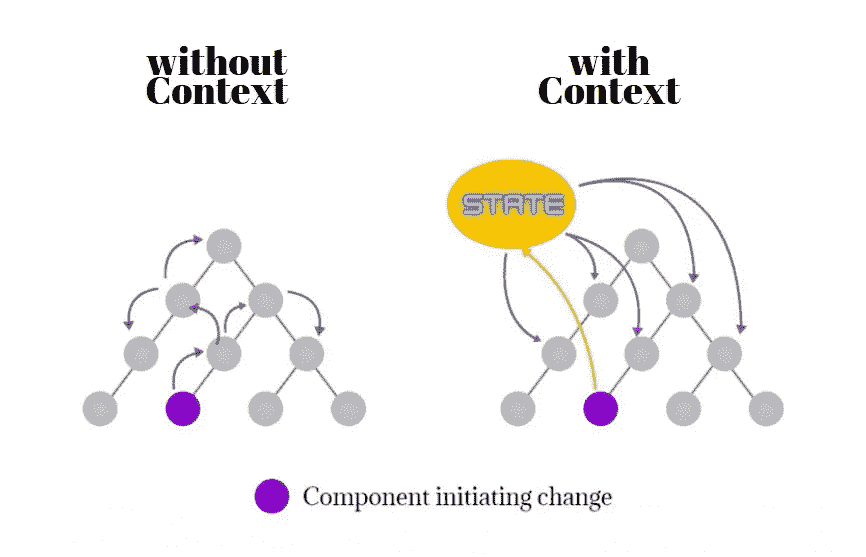
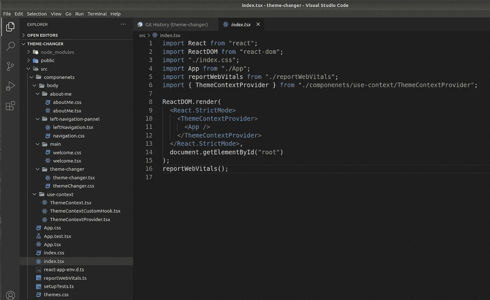

# 如何在 React 中使用 useContext API

> 原文：<https://javascript.plainenglish.io/how-to-use-the-usecontext-api-in-react-ba2da7dab9e4?source=collection_archive---------7----------------------->

## 从头开始反应中常见的使用上下文挂钩


Photo by [Enrapture Captivating Media](https://unsplash.com/@enrapture?utm_source=unsplash&utm_medium=referral&utm_content=creditCopyText) on [Unsplash](https://unsplash.com/s/photos/roads?utm_source=unsplash&utm_medium=referral&utm_content=creditCopyText)

如果您需要为 React 组件树中的每个组件定义一个通用的全局变量，您会怎么做？厌倦了搜索？别担心。你在正确的轨道上！停留这短短的 10 分钟，我保证你不会后悔，我会带你穿过这个神奇的国家管理世界。

这篇文章不仅会让你了解上下文 API 是如何工作的，还会让你了解你可能遗漏了什么&隐藏在背景中，最重要的是状态管理中的概念。我想提供 react-router 和包管理器的额外知识。所以我的意图不仅是让你在主要内容上变得更好，也是让与此相关的一切变得完美。请记住，总有另一个世界隐藏在表面之外，我们必须挖掘得更深才能看到那个世界的美丽。

如果你很急或者很快想学习这个`useContext`钩子来应用正在进行的项目问题，请跳转到 [**第五节**](https://medium.com/p/ba2da7dab9e4#e783) 继续进行。但请务必阅读整篇文章，以获得 100%的清除。

这是代码沙箱中的工作示例。

Get the real experience from code-sandbox

# 1.什么是国家管理？

如果你熟悉一些旧的 react(就在引入 hooks -v16.8 之前)，我们使用状态作为内存来保存我们在类中使用的任何变量。用最简单的术语来说，它是一个 JavaScript 对象，表示组件的一部分，可以根据用户的操作而改变。

在一个典型的 React 应用程序中，当用户执行一个动作并改变一个组件的状态时，它可能也会影响其他组件的状态。当应用程序很简单时，这并不是很糟糕。然而，它变得越复杂，跟踪所有依赖关系就变得越困难。

通常我们在组件中传递数据作为道具。但是想象一下，你必须从所有的组件中获得一些价值，如果你从道具中传递，你会发疯的。这不是在这种情况下的做法。


Bad way of managing the state

这就是所谓的 **prop drilling** ，你将数据从一个组件传递到另一个组件，最终你通过 props 将数据传递到甚至不需要它们的中间组件。

那么解决方案是什么呢？在这里，上下文关系到行动。Context API 提供了一种更好的方式来在组件之间共享值，而不必显式地通过组件树的每个不同嵌套级别传递一个属性。

# 2.管理国家的更好方法

根据 React 官方文档:

> 上下文提供了一种通过组件树传递数据的方式，而不必在每一层手动向下传递属性

上下文 API 是一种将数据从顶层组件传递到底层组件的方法，而不需要通过 props 手动传输。当一些数据需要由不同嵌套级别的许多组件访问时，这是最基本的用途。结合使用上下文 API 和钩子可以为你的应用提供非常简单和终极的全局状态管理。


Right way of managing the state

正如您在图中看到的，只有需要的组件正在获取数据。这将最终提高你的应用程序的性能。



How Context API works

上下文 API 可以应用在很多场景中。这是它的使用案例，你可以看到这个小东西覆盖了巨大的面积。

*   主题改变
*   多语言应用
*   身份验证提供商
*   通知提供者

那 Redux 呢。难道它没有提供比上下文更好的解决方案吗？战斗开始了！

# 3.冗余与语境

有人怀疑这个上下文 API 看起来像 Redux。有人说这是一种迷你还原。让我们深入研究一下，把事情搞清楚。

从技术上来说，Redux 并不局限于 React 应用中的使用。它实际上是另一个开源库，可以与任何其他视图库一起使用，如 Angular、Vue、Polymer、Ember、Backbone 等。但是大多数开发者把 Redux 和 React 联系在一起。因此，为了在 react 应用程序中使用 redux，您必须安装额外的包。

Context API 是专门为 React 制作和优化的，并作为内置工具出现。因此，我们不需要安装任何额外的依赖项，可以直接在 React 中使用，但不能在其他库/框架中使用。

Redux 有 3 个主要构件

1.  存储—保存应用程序状态。在任何 Redux 应用程序中，只有一个商店。
2.  action——描述应用程序中发生的事件(用户交互、API 调用、表单提交等)并将新数据传输到商店的普通 JavaScript 对象。每个动作必须有一个类型和一个包含数据的可选有效载荷键。
3.  reducer——获取应用程序的当前状态、执行操作并返回新状态的函数。

上下文 API 减少了 Redux 中的复杂结构，并尽可能简单地提供相同的功能。

1.  上下文—维护状态的全局数据容器。
2.  提供者—允许使用者订阅上下文更改。
3.  消费者—上下文的获取者。

你现在可以理解 Redux 的复杂性(打包了高级而沉重的组件结构)和 Context API 有多简单了。

如你所见，Redux 是一个有点复杂的工具，有一个相对陡峭的学习曲线。它主要用于大规模应用，被认为是行业标准。(但这些事情可能会发生变化，因为会有更多的竞争对手加入进来，如 GraphQL 和 Apollo Client。)理解、记忆、习惯它的模式是需要时间的。

这是否意味着我们作为设计师应该远离它？绝对没有！你绝对应该尝试一下，以增加你的知识。我想为 Redux 写一篇单独的文章，希望它能帮助你获得更多关于 Redux 的知识。

值得一提的是，大多数人都在尖叫 redux 需要太多的样板代码，必须添加很多包才能得到 Redux …就像这样。针对这些常见问题的解决方案 **Redux Toolkit** 推出了。它将提高 Redux 开发的效率，并且可以作为 Redux 的入门工具包。试用 redux toolkit 官方文档了解更多信息。

[](https://redux-toolkit.js.org/) [## Redux 工具包| Redux 工具包

### 官方的、固执己见的、包含电池的高效 Redux 开发工具集

redux-toolkit.js.org](https://redux-toolkit.js.org/) 

但是最新的带钩子的上下文 API 是最重要的，我们可以很容易地设置它，它和 Redux 一样有效。此外，Context API 是内置的解决方案，因此您不需要担心第三方实现新的更改，也不会增加您的包大小。

让我们把事情变得实际！

# 4.入门指南

好吧！让我们构建一个简单的应用程序来更好地理解这些概念。我创建了一个主题转换器应用程序，它可以根据我们的愿望改变背景主题。

要使用 TypeScript 模板创建新的 React 项目，可以运行:

```
npx create-react-app theme-changer--template typescript
```

否则

```
yarn create react-app theme-changer --template typescript
```

包经理来了。你可以使用 npm 或 Yarn。这两个包管理器在功能上更接近，但是我更喜欢 yarn，

1.  性能—安装依赖项的速度。
2.  安全性—以您期望的方式处理锁定文件。

你可以在 net 和 Yarn 中找到比 npm 表现更好的基准测试。然而，这最终是你的选择。随便挑一个你喜欢的。


[NPM vs Yarn Cheat Sheet](https://shift.infinite.red/npm-vs-yarn-cheat-sheet-8755b092e5cc) — Credits shift.infinite.red

好吧！让我们通过移除样板代码来继续应用程序。我为这个应用程序创建了一个侧边栏和几个组件，使其更加优雅和易于理解。

对于侧栏，我添加了 react-router 来路由我的组件。正如我承诺的那样，我将指导你使用 React 路由器，现在是时候了。

安装 react-router 包并为 typescript 添加类型。

```
yarn add react-router-dom
yarn add @types/react-router-dom
```

现在，您必须用`BrowserRouter`包装应用程序，以添加路由组件的能力。然后，您需要定义路由并添加一个交换机，用于匹配组件之间的路由。同样，你可以为此单独制作一个`router.tsx`。但是我坚持做最小的改动。

如您所见，我创建了三个组件。首先，我创建了左侧导航，它将为所有其他组件所共有。

您可以使用链接导航到相关的路径，它将呈现一个完全可访问的锚标记，并带有适当的`href`为什么我们使用它，因为如果我们使用`<a href>`标记而不是它，当导航到 URL 时，页面会重新加载。因为 react 是一个单页面应用程序，所以这不是正确的导航方式。因此，使用链接导航，避免麻烦。

我没有在这里包括样式，因为 CSS 文件有更多的行，在阅读时可能会分心。您可以简单地从[这里](https://github.com/Yasas4D/ThemeChanger/tree/master/src/componenets/body/left-navigation-pannel)复制样式和类名。确保也添加类名。

对于我的主页，我创建了一个简单的欢迎页面，对于 about 页面也是如此。希望不需要在这里附上，你可以在这里找到双组分。

嘿，等一下，那个叫做`ThemeChanger`的组件是什么？😕啊，别担心！这个我会在文末描述。

如果您已经完成了环境的设置，让我们转到主要内容。😍

# 5.发布 beast |上下文 API

好吧。现在是最精彩的部分！您必须创建 2 个(可选 3 个)东西来实现这个上下文 API。

1.  首先，我们需要创造环境。

如您所见，我为此创建了一个主题上下文。基本上，为了创建一个上下文，我们使用`React.createContext`来创建一个上下文对象。在 typescript 中，我们需要为我们的上下文定义一个类型。

我们可以在类型内部指定变量和函数。那么应该在泛型类型中提及。另外，请注意，这个上下文最初可能是未定义的。

2.我们应该创建一个提供者来获取上下文

这里我使用`ReactNode`作为子类型，因为我的主题上下文组件接受任何有效的反应子类型。(`ReactNode`是潜在 DOM 节点的表示。)所以任何组件都可以在这里传递，最终它将由提供者包装。

我使用了`useState`钩子来保持状态(至于初始主题，我使用了黑暗主题),它会将值传递给传入的组件。

3.[可选]我们可以创建一个自定义挂钩来轻松访问。

我只是用自定义名称返回了`useContext`钩子。

至于最后一步，我们需要在`index.tsx`文件中将主题上下文提供者包装为应用程序的包装器。这将为我们的上下文提供对任何组件的访问。

```
<ThemeContextProvider> 
       <App /> 
</ThemeContextProvider>
```



Folder Structure of the App

一切就绪！现在我们可以在任何组件中设置值，并且可以在组件树中的任何位置访问。看那多酷啊！

在移动到我们的应用程序时，我创建了一个新的`theme.css`文件，并添加了一些漂亮的主题。你可以从下面检查。

现在您需要将这个`css`文件添加到`app.tsx`文件中，并访问上下文。然后获取类名，动态绑定到 app。

正如你在第 7 行和第 8 行看到的，我正在进口`css`和我们定制的`useContext`吊钩。在第 13 行，我从全局定义的上下文存储中获取`themeName`，并将名称绑定到`classname`(第 16 行)

我们已经到了申请的末尾。唯一需要的部分是动态地改变主题。为此，我使用了另一个组件`ThemeChanger`。

我正在使用我们的自定义钩子访问上下文，在选择主题后，它将更新状态。这最终会在主`app.tsx` 中更新，并且会导致主题的改变。

您可以从任何组件中更改主题。只是你想补充。

```
const { themeName, setThemeName } = useThemeContextCustomHook()!;
```

从任何组件，你可以改变值，并从另一个更深的层次或任何组件。您只需根据自己的偏好更改创建上下文。(AuthToken，setAuthToken，setLocale…等等)想象一下在你的应用程序中实现这个的广阔领域。

所以我们最终的旅程就要结束了。享受应用程序！您也可以创建更漂亮的主题。

# 6.结论

React 的上下文 API 是一个强大的工具，并且易于实现。这是一个干净的解决方案，可以支持钻取案例和生成顶级存储，而不必实现像 Redux 这样的大型库，并提供更好的状态管理方式。

它让我们有可能在整个应用程序中共享变量，甚至功能，而不用在每次需要的时候把道具放下来。这使得我们的工作更快、更容易，因为我们可以访问应用程序中任何地方的数据，并最终提高应用程序的性能。

完整的源代码可以在下面的 git-hub 仓库中看到。

[](https://github.com/Yasas4D/ThemeChanger) [## Yasas4D/ThemeChanger

### 这个应用程序提供了一个与 useContext 相关的主题转换器。这将有助于更好地理解使用上下文…

github.com](https://github.com/Yasas4D/ThemeChanger) 

这是我们今天所做的演示视频。

Theme changer application demonstration

我假设我已经公开了 React 的上下文 API 和`useContext`钩子的值，这样您就可以在自己的 React 项目中成功地使用它。如果你有任何问题，请随时回复。感谢大家的阅读和快乐编码！