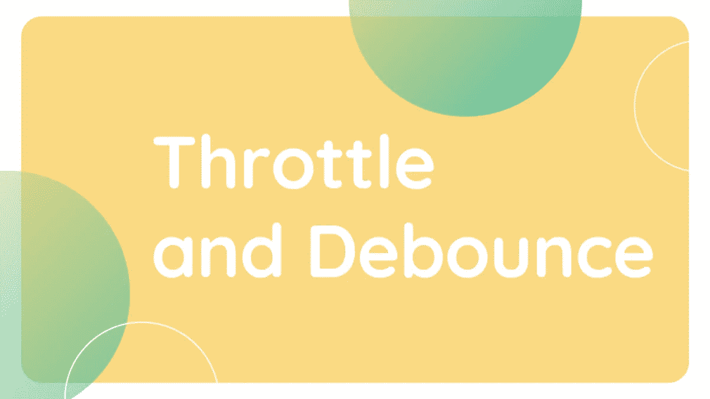

# 如何在 JavaScript 中使用节流和去抖

> 原文：<https://javascript.plainenglish.io/how-to-use-throttle-and-debounce-in-javascript-9cb20fdb24ca?source=collection_archive---------2----------------------->



节流和去抖动是两种流行且广泛使用的编码技术，有助于提高在一定时间内重复执行的 JavaScript 代码的性能。在本教程中，我们将学习 [JavaScript](https://developer.mozilla.org/en-US/docs/Web/JavaScript) Throttle 和 Debounce，以及如何在我们的代码中实现它们以提高代码的性能，并用 JavaScript 编写更好更快的代码。

节流和去抖动使编码人员能够控制调用方法的速度。它们在处理事件处理程序分配时特别有用。我们可以举滚动处理程序、键盘事件，甚至只是快速点击一个按钮的例子。

# 什么是节流？

throttle 是一个高阶函数，它采用一个方法和一个超时函数，并且只允许该函数在指定的时间内最多执行一次。是为了保证函数在指定的时间段内最多调用一次。这意味着，如果某个函数最近才运行过，节流会阻止它运行。

那么，我们在哪里使用节流技术呢？

*   我们在按钮点击中使用节流来防止垃圾点击。
*   我们可以在 API 调用中使用节流。
*   throttle 可以在`mousemove` / `touchmove`事件处理程序中使用。

## 节流的实施

首先，让我们举一个简单的例子，它解释了有和没有节流的代码。

```
export class IncreaseTheNumber extends Component<{}, {num : number}> {state = {num: 0}; 
increase = () => { 
 this.setState({num: this.state.num + 1});
}render() { 
  return ( 
     <div> 
       {this.state.num}
      <div> 
        <button onClick={this.increase}>Increment!</button> 
      </div> 
     </div> 
   ); 
 }
}
```

在上面的例子中，我们有一个状态`num`和一个可以增加这个状态`increase`的方法。我们可以点击一个按钮来增加`num`。在这里，我们可以按我们想要的速度点击`Increment` 按钮，它将增加`num` 状态。现在考虑我们需要延迟状态`num`来增加我们点击按钮的速度。因此，我们可以使用**油门**来减缓增量。查看下面的示例，在该示例中实现了节流:

```
export class IncreaseTheNumber extends Component<{}, {num: number}>{state = {num: 0}; 
increase= () => {
   this.setState({num: this.state.num + 1}); }
}function throttle(func, timeout) {  
  let exexute: true;  
  return (...args) => {    
   if (!execute) {      
      return;    
   }     
    execute= false;    
    func(...args);    
    setTimeout(() => {      
       execute = true;    
     }, timeout);  
   };
}increaseWithThrottle = throttle(this.increase, timeout);render() { 
  return ( 
       <div > 
         {this.state.numSpells}
         <div> 
           <button onClick={this.increase}>Increment</button>          
           <button onClick={this.increaseWithThrottle}> Increment with Throttled </button> 
         </div> 
        </div> 
         ); 
 }
}
```

这里，我们现在有一个名为`increaseWithThrottle`的按钮，它实现了节流技术并延迟了`num`状态的增量。

现在，我们需要理解`throttle`方法。`throttle` 是一个采用函数和超时的方法。Throttle 返回一个新方法，该方法在原始方法周围形成一个闭包。

这里，我们需要跟踪一个名为`execute` 的变量，它阻止内部方法执行，除非超时。如果我们执行该方法，我们还会触发一个超时，当超时结束时会将`execute` 设置为 true。这就是我们在 JavaScript 中实现节流的方式。

现在，让我们继续**去抖**！！

# 什么是去抖？

基本上，去抖动可能比节流更常用。在许多情况下，你可以有一个比油门更好的去抖效果。

**去抖**和**油门**只是有点不同。在节流的情况下，我们在方法调用发生时减慢它们的速度。但是在**去抖**的情况下，我们根本不执行该方法，直到该方法的先前执行已经停止。从编码概念来看，这似乎是一种更安全的方式。

如果我们想在用户完成输入、滚动或导航时执行计算或获取 API，这真的很有用。

那么，我们在哪里使用去抖技术呢？

*   我们在`resize`事件处理程序中使用去抖。
*   我们可以在`scroll`事件处理程序中使用去抖。
*   谴责可用于自动完成或自动保存功能。

## 去抖的实现

```
export class IncreaseTheNumber extends Component<{}, {num: number}>{state = {num: 0}; 
increase= () => {
   this.setState({num: this.state.num + 1}); }
}function debounce(func: Function, timeout: number) {  
   let timer: NodeJS.Timeout;  
   return (...args: any) => {    
      clearTimeout(timer);    
      timer = setTimeout(() => {      
          func(...args);    
        }
       ,timeout);  
      };
    }incrementWithDebounced = debounce(this.castSpell, timeout);render() { 
  return ( 
       <div > 
         {this.state.numSpells}
         <div> 
           <button onClick={this.increase}>Increment</button>          
           <button onClick={this.incrementWithDebounced}> Increment with Debounce</button> 
         </div> 
        </div> 
         ); 
   }
}
```

在这里使用去反跳函数，我们会注意到我们可以任意多次点击带有去反跳的增量，但是它只会在我们停止点击后执行。其代码类似于前面的节流组件，但只有去抖方法。

这里，虽然油门依赖于简单的`true` 或`false`，但有了去抖，我们需要保持对计时器的访问。我们从节点模块实现了`timer` ,因为我们需要在每次方法被再次调用时清除之前的超时。然后，我们设置一个新的超时方法来调用内部方法。

这就是**去抖**的实现方式。

因此，JavaScript 节流和去反跳的总体概念在本文中完全转换了。