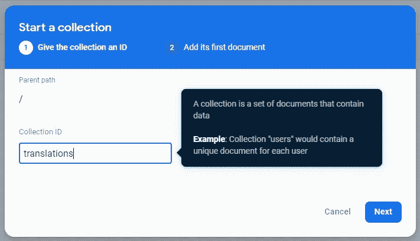
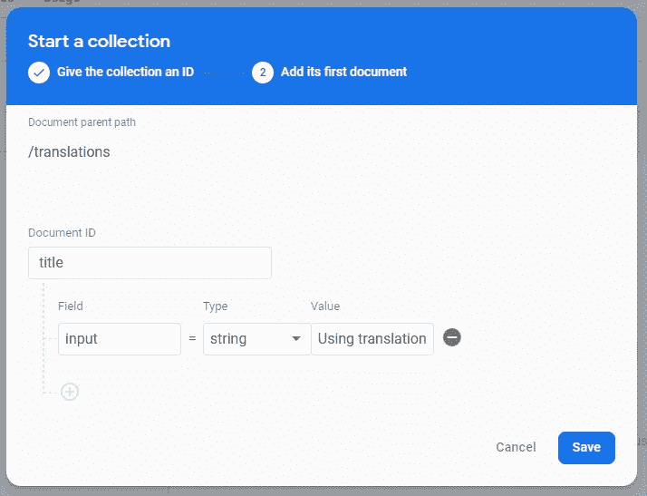
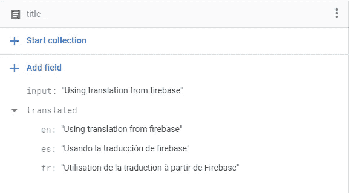

# 如何在 ReactApp 上使用 TranslateText Firebase 扩展🔥

> 原文：<https://javascript.plainenglish.io/how-to-use-translatetext-firebase-extension-with-your-reactapp-beab2894dff3?source=collection_archive---------7----------------------->

大家好，今天我们要创建一个 **SimpleLanding** 但是带有 firebase 翻译，如果你想克隆，这里是 [*Repo*](https://github.com/Alejov0/FirebaseTranslation) *。*

*PD:为了安装扩展，你需要一个*[*Blaze*](https://firebase.google.com/pricing)*计划。*

所以我假设你已经有了你的 ***firebase 项目*** 和你的 ***react 项目，*** 首先，我们需要安装扩展，[点击这里](https://firebase.google.com/products/extensions/firestore-translate-text)，点击 install，选择你的项目，点击*下一个*，*下一个*，*下一个*，*下一个(我使用默认配置)然后从 3*

现在让我们从控制台测试扩展，转到 ***数据库> Firestore*** 并创建一个名为“translations”的集合:

然后创建一个文档， *DocumentID* 可以是您想要的任何内容，但是它必须包含一个名为 *input* 的字段，并带有一个字符串值:

在创建您的文档后的几秒钟内，您将会看到翻译后的*字段，如下所示:*

现在，我们可以简单地在我们的应用程序中使用翻译后的字段，就像这样:

这就是你如何用 *firebase* 翻译你的应用程序，你可以从*控制台*手动添加你的字段，或者从代码中动态添加*，它会马上被翻译，这很容易而且非常有用。*

****感谢阅读*** 💘*