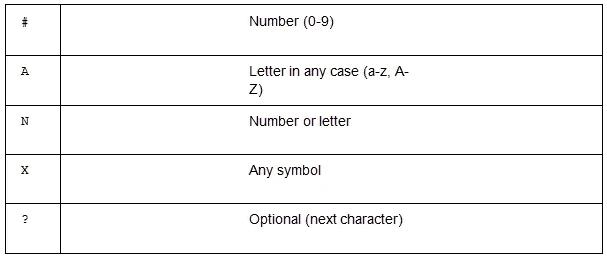

# 使用 Vue.js 构建表单时如何使用 V-Masks

> 原文：<https://javascript.plainenglish.io/how-to-use-v-masks-when-building-forms-with-vue-js-d623d08216c3?source=collection_archive---------1----------------------->

任何成功形式的一个关键方面是清晰。如果用户发现表单易于使用和理解，他们更有可能填写并提交表单。在本章中，我们将探讨输入屏蔽。您将学习如何快速轻松地将掩码应用到表单输入中，并使用真实的例子(如电话号码)根据您的需要配置它们。

**这是摘自玛丽娜莫斯蒂(**[**@玛丽娜莫斯蒂**](https://twitter.com/marinamosti) **)写的 Vue.js** **的** [**建筑形式。)要访问贯穿全书的项目基础代码，请单击此处的**](https://www.packtpub.com/business-other/building-forms-with-vue-js?utm_source=Insertwebsite&utm_medium=referral&utm_campaign=Outreach_ExplorerBPR)****。****

**玛丽娜将于 11 月在多伦多的 VueConf 发表演讲。在这里了解更多**。****

****输入掩码到底是什么？它们是显示输入数据的预定义结构。例如，如果您要屏蔽一个电话输入，您可能希望它显示为(123)234–5555，而不是简单的 1232345555。你可以清楚地看到，第一个例子不仅更容易阅读，而且它还传达了该领域试图实现的目标。****

****输入掩码是一个很好的特性，可以将您的 UX 提升到另一个水平，并且非常容易实现，这要归功于开源库，如 v-mask。GitHub 存储库页面可以在这里找到。****

******如何安装 v-mask 库******

****让我们开始安装 v-mask 库。为了让我们的项目使用它所提供的东西，我们首先需要将它添加到我们的项目依赖项中。为此，请遵循以下步骤:****

****1.打开您的终端，输入以下命令将库添加到我们的依赖项中:****

*****> npm 安装垂直面罩*****

****2.我们需要把它作为一个插件添加到 Vue 中，所以转到 main.js，让我们都导入它，让 Vue 知道我们想把它注册为我们所有应用的插件。在导入应用程序行后添加以下代码:****

*****从‘v-mask’vue . use 导入 vue mask(vue mask)；*****

****现在我们已经注册了我们的插件，我们可以访问一个新的指令:v-mask。我们可以将这个新的指令直接添加到我们的元素上，库将通过读取用户的输入和调整字段的显示来处理幕后的掩蔽。****

****让我们先在常规输入上尝试一下，然后我们将向项目的组件添加一些道具。****

****3.进入 App.vue，在输入电子邮件后创建一个新的元素:****

*****<输入 type="text" / >*****

****如果我们在这个字段中直接输入电话号码，就会得到默认的输入行为。任何事情都会发生。所以，让我们对它应用一个电话号码掩码。我们新的 v-mask 库有一个要求，即我们将其应用到的每个领域都需要进行 v-建模，所以让我们首先完成这项工作。****

****4.向表单对象内部的 data()添加一个新的电话道具:****

*****形式:{
…
电话:
}，*****

****5.现在，回到我们的新元素，并应用 v 型。我们现在还将添加 v-mask 指令，如下所示:****

*****<输入 type = " text "
v-model = " form . phone " v-mask =“(# #)# # #-# # #”
>*****

****返回浏览器，再次尝试输入。当你键入的时候，你会发现你实际上得到的是一个很好的格式化的电话号码。****

****在五个简单的步骤中，我们将输入屏蔽添加到我们的表单字段之一。现在让我们更深入地看看 v-mask 指令的作用。****

******什么是指令？******

****当我们将 v-mask 库添加到项目中，并在 main.js 中添加插件时，该库为我们创建了一个新的指令，v-mask。但指令到底是什么？我们知道它看起来像一个 HTML 属性，但还有什么？****

****指令是具有 v 前缀的特殊属性。指令属性值应为单个 JavaScript 表达式(除了 v-for […])。指令的工作是当其表达式的值发生变化时，将副作用被动地应用于 DOM。
Vue 官方文件。****

****好的，看起来我们有一个特殊的属性可以修改元素。这听起来完全像我们在应用于输入元素时看到的情况。但是，我们放入这个指令的实际表达式或值是如何工作的呢？****

****从这个例子中，我们知道我们正在传递一个字符串，您可以看到，在组成 v-mask =“attribute”的双引号内部，我们正在设置一对新的单引号(')。这意味着这个属性内部的表达式是 JavaScript，并且我们向它传递一个字符串值。****

****通过查看 v-mask 库文档，我们知道我们有一些特殊的占位符字符，可以在我们的掩码内部使用。这些项目的表格如下:****

********

****以将显示一天中的时间的掩码为例。可以定义如下:****

*****v-mask =“# #:# #”*****

****这意味着该输入将接受从 0 到 9 (##)的两个数字，后跟一个:
字符，再跟另外两个数字(##)。****

****任何与此模式不匹配的内容都将被输入忽略。****

****v-mask 是一个非常强大的库，它允许我们通过组合这些简单的规则来定制我们想要的输入显示方式。在这篇文章的最后一节，我们将看看如何修改自定义输入。这将允许我们充分利用输入掩码的功能。****

******如何增强自定义输入**
我们已经投入了大量的工作来创建我们令人敬畏的自定义 BaseInput，所以我们肯定希望继续使用它！****

****按照以下步骤修改基本输入，并允许输入屏蔽:****

****1.回到 App.vue，切换<baseinput>组件的元素:</baseinput>****

*****<base input label = " Telephone "
type = " text "
v-model = " form . Telephone "
/>*****

****我们现在进入 BaseInput.vue，新建一个道具；我们称之为 mask，默认为空字符串。重要的是，我们将它默认为一个空字符串，否则指令将试图匹配，如果它们没有声明的掩码，我们将无法在字段中键入内容！****

****2.添加到你的道具对象:

*…，
mask: {
type: String，必选:false
}*****

****3.现在，返回 App.vue，并更新我们的电话基本输入以使用 mask 属性:****

*****<base input label = " Telephone " type = " text "
v-model = " form . Telephone "
:mask = " '(# # #)# # #-# # # # ' "
/>*****

****全部完成！返回到您的浏览器，并添加一些数字到字段，您应该有一个好看的电话口罩与您的自定义组件！****