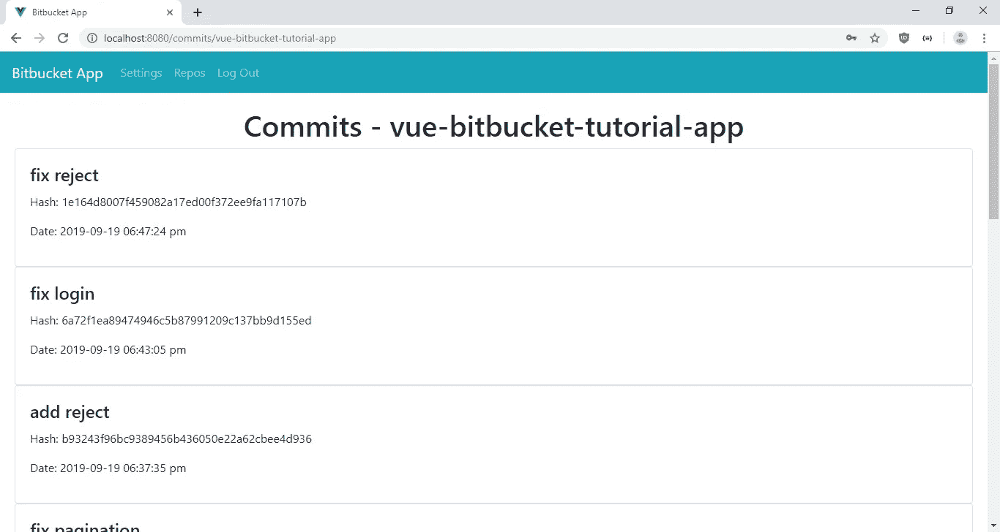
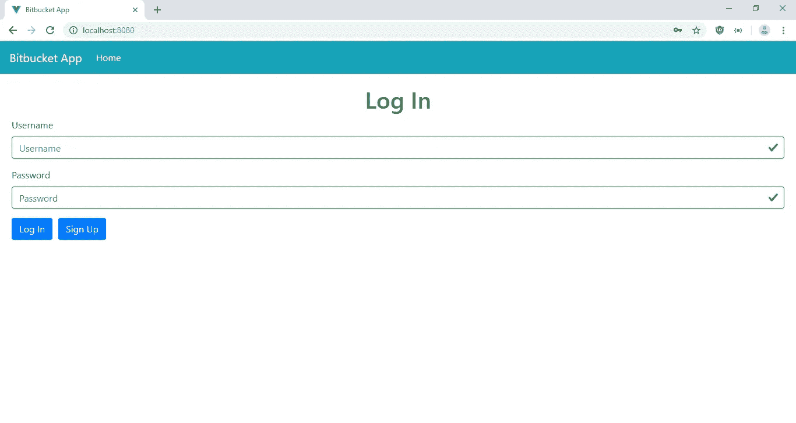
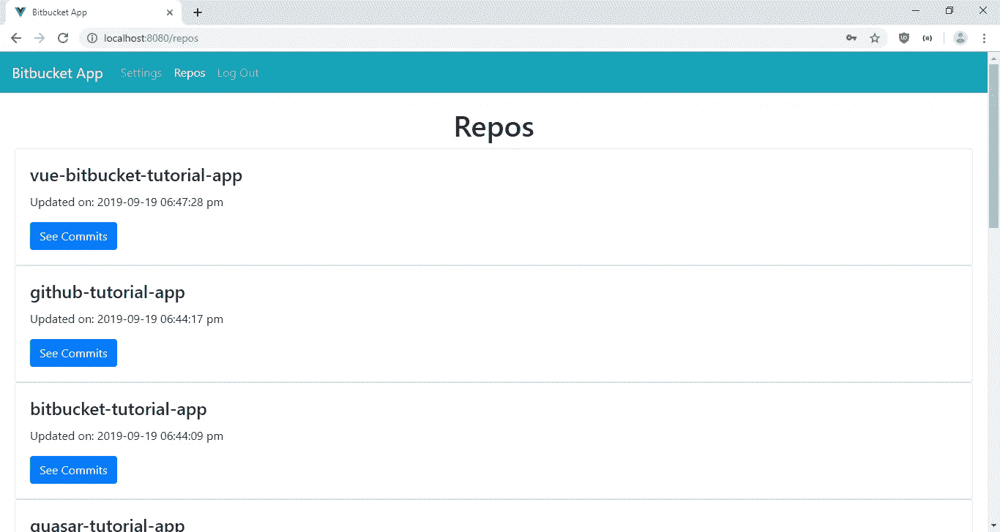
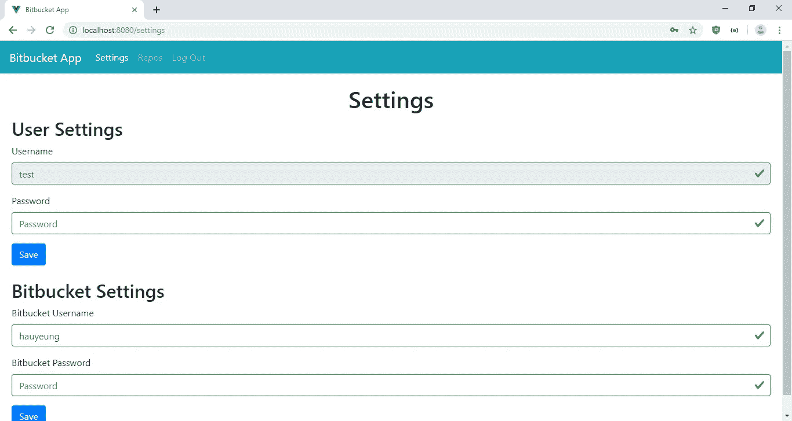
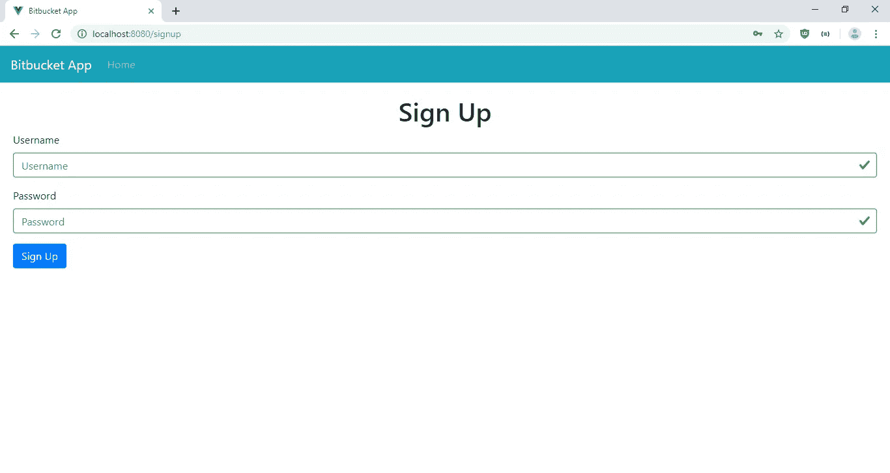

# 如何配合 Vue.js 使用 Vue 路由器

> 原文：<https://javascript.plainenglish.io/how-to-use-vue-router-with-vue-js-cdc6c57c7d9f?source=collection_archive---------4----------------------->


为了用 Vue.js 创建一个单页面应用程序，我们需要使用一个 URL 路由器来根据点击链接时输入的 URL 显示我们的页面。Vue.js 有 Vue 路由器作为路由选项。我们可以在创建应用程序项目时设置它，或者稍后将其作为包添加。它很容易使用，并且附带有 Vue.js，所以它非常频繁地用于 Vue.js 单页应用程序。

Vue Router 可以将 URL 映射到我们的页面，它还可以在用`router.beforeEach`钩子加载 URL 之前运行代码。它接受`to`、`from`和`next`参数。`to`参数指示用户通过点击链接或直接输入 URL 将要去的 URL。`from`是用户导航的 URL,`next`是一个函数，如果你想让用户看到他或她要去的路线，你可以调用这个函数。

在本文中，我们将制作一个简单的带身份验证的 Bitbucket 应用程序。我们将让用户注册一个帐户，并为他们的帐户设置他们的位桶用户名和密码。一旦用户登录并设置了他们的位存储桶凭证，他们就可以查看他们的存储库和每个存储库的提交。

前端将是一个 Vue.js 应用程序，使用 Vue 路由器进行路由。

Bitbucket 是一个很棒的存储库托管服务，可以让你免费托管 Git 存储库。您可以升级到他们的付费计划，以低价获得更多功能。它还有一个全面的自动化和获取数据的 API。

开发者为 Bitbucket 的 API 做了 Node.js 客户端。我们可以很容易地使用它来做我们想做的事情，如操纵提交、添加、删除或编辑存储库、跟踪问题、操纵构建管道等等。

Bitbucket.js 包是用于编写 Node.js Bitbucket 应用程序的最简单的包之一。我们所要做的就是用我们的 Bitbucket 用户名和密码登录 Bitbucket 实例，并调用在[https://bitbucketjs.netlify.com/#api-_](https://bitbucketjs.netlify.com/#api-_)中列出的内置函数来完成我们想用 Bitbucket 包做的几乎任何事情。

我们的应用程序将包括后端和前端。后端处理用户身份验证，并通过 Bitbucket API 与 Bitbucket 通信。前端有注册表单，登录表单，用于设置密码和位桶用户名和密码的设置表单。

# 后端

为了开始构建应用程序，我们创建一个项目文件夹，其中包含`backend`文件夹。然后我们进入`backend`文件夹，通过运行`npx express-generator`来运行快速生成器。接下来我们自己安装一些包。我们需要 Babel 来使用`import`，BCrypt 来散列密码，Bitbucket.js 来使用 Bitbucket API。Crypto-JS 用于加密和解密我们的位桶密码，Dotenv 用于存储哈希和加密秘密，Sequelize 用于 ORM，JSON Web Token 包用于身份验证，CORS 用于跨域通信，SQLite 用于数据库。

运行`npm i @babel/cli @babel/core @babel/node @babel/preset-env bcrypt bitbucket cors crypto-js dotenv jsonwebtoken sequelize sqlite3`来安装这些包。

在`package.json`的`script`部分，输入:

```
"start": "nodemon --exec npm run babel-node --  ./bin/www",
"babel-node": "babel-node"
```

使用 Babel Node 启动我们的应用程序，而不是常规的 Node.js 运行时，这样我们就可以获得最新的 JavaScript 特性。

然后，我们在`backend`文件夹中创建一个名为`.babelrc`的文件，并添加:

```
{
    "presets": [
        "[@babel/preset-env](http://twitter.com/babel/preset-env)"
    ]
}
```

启用最新功能。

然后我们必须通过运行`npx sequelize-cli init`来添加序列代码。之后，我们应该在`config`文件夹中得到一个`config.json`文件。

在`config.json`中，我们输入:

```
{
  "development": {
    "dialect": "sqlite",
    "storage": "development.db"
  },
  "test": {
    "dialect": "sqlite",
    "storage": "test.db"
  },
  "production": {
    "dialect": "sqlite",
    "storage": "production.db"
  }
}
```

使用 SQLite 作为我们的数据库。

接下来我们添加一个用于验证认证令牌的中间件，在`backend`文件夹中添加一个`middllewares`文件夹，并在其中添加`authCheck.js`。在文件中，添加:

```
const jwt = require("jsonwebtoken");
const secret = process.env.JWT_SECRET;export const authCheck = (req, res, next) => {
  if (req.headers.authorization) {
    const token = req.headers.authorization;
    jwt.verify(token, secret, (err, decoded) => {
      if (err) {
        res.send(401);
      } else {
        next();
      }
    });
  } else {
    res.send(401);
  }
};
```

如果令牌无效，我们返回 401 响应。

接下来，我们创建一些迁移和模型。运行:

```
npx sequelize-cli model:create --name User --attributes username:string,password:string,bitBucketUsername:string,bitBucketPassword:string
```

来创建模型。请注意，属性选项没有空格。

然后，我们向 Users 表的`username`列添加 unique 约束。为此，请运行:

```
npx sequelize-cli migration:create addUniqueConstraintToUser
```

然后在新创建的迁移文件中，添加:

```
"use strict";module.exports = {
  up: (queryInterface, Sequelize) => {
    return queryInterface.addConstraint("Users", ["username"], {
      type: "unique",
      name: "usernameUnique"
    });
  },down: (queryInterface, Sequelize) => {
    return queryInterface.removeConstraint("Users", "usernameUnique");
  }
};
```

运行`npx sequelize-cli db:migrate`运行所有迁移。

接下来，我们创建路线。创建一个名为`bitbucket.js`的文件，并添加:

```
var express = require("express");
const models = require("../models");
const CryptoJS = require("crypto-js");
const Bitbucket = require("bitbucket");
const jwt = require("jsonwebtoken");
import { authCheck } from "../middlewares/authCheck";const bitbucket = new Bitbucket();
var router = express.Router();router.post("/setBitbucketCredentials", authCheck, async (req, res, next) => {
  const { bitBucketUsername, bitBucketPassword } = req.body;
  const token = req.headers.authorization;
  const decoded = jwt.verify(token, process.env.JWT_SECRET);
  const id = decoded.userId;
  const cipherText = CryptoJS.AES.encrypt(
    bitBucketPassword,
    process.env.CRYPTO_SECRET
  );
  await models.User.update(
    {
      bitBucketUsername,
      bitBucketPassword: cipherText.toString()
    },
    {
      where: { id }
    }
  );
  res.json({});
});router.get("/repos/:page", authCheck, async (req, res, next) => {
  const page = req.params.page || 1;
  const token = req.headers.authorization;
  const decoded = jwt.verify(token, process.env.JWT_SECRET);
  const id = decoded.userId;
  const users = await models.User.findAll({ where: { id } });
  const user = users[0];
  const bytes = CryptoJS.AES.decrypt(
    user.bitBucketPassword.toString(),
    process.env.CRYPTO_SECRET
  );
  const password = bytes.toString(CryptoJS.enc.Utf8);
  bitbucket.authenticate({
    type: "basic",
    username: user.bitBucketUsername,
    password
  });
  let { data } = await bitbucket.repositories.list({
    username: user.bitBucketUsername,
    page,
    sort: "-updated_on"
  });
  res.json(data);
});router.get("/commits/:repoName", authCheck, async (req, res, next) => {
  const token = req.headers.authorization;
  const decoded = jwt.verify(token, process.env.JWT_SECRET);
  const id = decoded.userId;
  const users = await models.User.findAll({ where: { id } });
  const user = users[0];
  const repoName = req.params.repoName;
  const bytes = CryptoJS.AES.decrypt(
    user.bitBucketPassword.toString(),
    process.env.CRYPTO_SECRET
  );
  const password = bytes.toString(CryptoJS.enc.Utf8);
  bitbucket.authenticate({
    type: "basic",
    username: user.bitBucketUsername,
    password
  });
  let { data } = await bitbucket.commits.list({
    username: user.bitBucketUsername,
    repo_slug: repoName,
    sort: "-date"
  });
  res.json(data);
});module.exports = router;
```

在每个路由中，我们从令牌中获取用户，因为我们将把用户 ID 添加到令牌中，并从令牌中获取 Bitbucket 用户名和密码，用于登录 Bitbucket API。请注意，我们必须解密密码，因为我们在将密码保存到数据库之前对其进行了加密。

我们在`setBitbucketCredentials`路由中设置位桶凭证。我们在保存密码之前对其进行加密，以确保其安全。

然后在`repos`路径中，我们获得用户的回复，并按照相反的`update_on`顺序进行排序，因为我们在`sort`参数中指定了`-updated_on`。由于我们在`sort`参数中指定了`-date`，所以提交是按日期倒序排列的。

接下来，我们将`user.js`添加到`routes`文件夹中，并添加:

```
const express = require("express");
const models = require("../models");
const bcrypt = require("bcrypt");
const jwt = require("jsonwebtoken");
import { authCheck } from "../middlewares/authCheck";
const router = express.Router();router.post("/signup", async (req, res, next) => {
  try {
    const { username, password } = req.body;
    const hashedPassword = await bcrypt.hash(password, 10);
    const user = await models.User.create({
      username,
      password: hashedPassword
    });
    res.json(user);
  } catch (error) {
    res.status(400).json(error);
  }
});router.post("/login", async (req, res, next) => {
  const { username, password } = req.body;
  const users = await models.User.findAll({ where: { username } });
  const user = users[0];
  const response = await bcrypt.compare(password, user.password);
  if (response) {
    const token = jwt.sign({ userId: user.id }, process.env.JWT_SECRET);
    res.json({ token });
  } else {
    res.status(401).json({});
  }
});router.post("/changePassword", authCheck, async (req, res, next) => {
  const { password } = req.body;
  const token = req.headers.authorization;
  const decoded = jwt.verify(token, process.env.JWT_SECRET);
  const id = decoded.userId;
  const hashedPassword = await bcrypt.hash(password, 10);
  await models.User.update({ password: hashedPassword }, { where: { id } });
  res.json({});
});router.get("/currentUser", authCheck, async (req, res, next) => {
  const token = req.headers.authorization;
  const decoded = jwt.verify(token, process.env.JWT_SECRET);
  const id = decoded.userId;
  const users = await models.User.findAll({ where: { id } });
  const { username, bitBucketUsername } = users[0];
  res.json({ username, bitBucketUsername });
});module.exports = router;
```

我们有注册、登录和更改密码的路径。当我们注册或更改密码时，我们会在保存之前对密码进行哈希运算。

`currentUser`路线将用于前端的设置表单。

在`app.js`中，我们将现有代码替换为:

```
require("dotenv").config();
var createError = require("http-errors");
var express = require("express");
var path = require("path");
var cookieParser = require("cookie-parser");
var logger = require("morgan");
const cors = require("cors");var indexRouter = require("./routes/index");
var usersRouter = require("./routes/users");
var bitbucketRouter = require("./routes/bitbucket");var app = express();// view engine setup
app.set("views", path.join(__dirname, "views"));
app.set("view engine", "jade");app.use(logger("dev"));
app.use(express.json());
app.use(express.urlencoded({ extended: false }));
app.use(cookieParser());
app.use(express.static(path.join(__dirname, "public")));
app.use(cors());app.use("/", indexRouter);
app.use("/users", usersRouter);
app.use("/bitbucket", bitbucketRouter);// catch 404 and forward to error handler
app.use(function(req, res, next) {
  next(createError(404));
});// error handler
app.use(function(err, req, res, next) {
  // set locals, only providing error in development
  res.locals.message = err.message;
  res.locals.error = req.app.get("env") === "development" ? err : {};// render the error page
  res.status(err.status || 500);
  res.render("error");
});module.exports = app;
```

添加 CORS 插件以支持跨域通信，并通过添加以下内容在我们的应用程序中添加`users`和`bitbucket`路由:

```
app.use("/users", usersRouter);
app.use("/bitbucket", bitbucketRouter);
```

这完成了应用程序的后端部分。

# 前端

现在我们可以构建前端了。

我们将使用 Vue 构建它，所以我们从运行项目根文件夹中的`npx @vue/cli frontend`开始。请务必选择“手动选择功能”，然后选择包括 Babel 和 Vue 路由器。

接下来，我们必须安装一些软件包。我们需要 Axios 进行 HTTP 请求，需要 Bootstrap 进行样式设计，需要 Vee-Validate 进行表单验证，需要 Vue-Filter-Date-Format 包进行日期格式化。

我们通过运行以下命令来安装所有软件包:

```
npm i axios bootstrap-vue vee-validate vue-filter-date-format
```

一旦完成，我们就可以开始编写前端应用程序了。首先，我们为我们的前端添加顶部酒吧。我们制作一个在用户登录时显示，另一个在用户注销时显示。

在`components`文件夹中创建`LoggedInTopBar.vue`并添加:

```
<template>
  <b-navbar toggleable="lg" type="dark" variant="info">
    <b-navbar-brand to="/">Bitbucket App</b-navbar-brand><b-navbar-toggle target="nav-collapse"></b-navbar-toggle><b-collapse id="nav-collapse" is-nav>
      <b-navbar-nav>
        <b-nav-item to="/settings" :active="path  == '/settings'">Settings</b-nav-item>
        <b-nav-item to="/repos" :active="path.includes('/repos')">Repos</b-nav-item>
        <b-nav-item [@click](http://twitter.com/click)="logOut()">Log Out</b-nav-item>
      </b-navbar-nav>
    </b-collapse>
  </b-navbar>
</template><script>
export default {
  name: "LoggedInTopBar",
  data() {
    return {
      path: this.$route && this.$route.path
    };
  },
  watch: {
    $route(route) {
      this.path = route.path;
    }
  },
  methods: {
    logOut() {
      localStorage.clear();
      this.$router.push("/");
    }
  }
};
</script>
```

我们观察用户当前导航到的 URL 来设置`active`属性，当用户转到代码中带有条件的 URL 时，该属性会突出显示链接。

`b-navbar`由 BootstrapVue 提供。

类似地，我们在同一个文件夹中创建`LoggedOutTopBar.vue`,并添加:

```
<template>
  <b-navbar toggleable="lg" type="dark" variant="info">
    <b-navbar-brand to="/">Bitbucket App</b-navbar-brand> <b-navbar-toggle target="nav-collapse"></b-navbar-toggle> <b-collapse id="nav-collapse" is-nav>
      <b-navbar-nav>
        <b-nav-item to="/" :active="path  == '/'">Home</b-nav-item>
      </b-navbar-nav>
    </b-collapse>
  </b-navbar>
</template><script>
export default {
  name: "LoggedOutTopBar",
  data() {
    return {
      path: this.$route && this.$route.path
    };
  },
  watch: {
    $route(route) {
      this.path = route.path;
    }
  }
};
</script>
```

接下来，我们在`src`文件夹中创建一个`mixins`文件夹，并添加一个`requestsMixin.js`文件来创建共享代码，让我们的组件发出 HTTP 请求。在这个文件中，我们添加了:

```
const APIURL = "[http://localhost:3000](http://localhost:3000)";
const axios = require("axios");axios.interceptors.request.use(
  config => {
    config.headers.authorization = localStorage.getItem("token");
    return config;
  },
  error => Promise.reject(error)
);axios.interceptors.response.use(
  response => {
    return response;
  },
  error => {
    if (error.response.status == 401) {
      localStorage.clear();
    }
    return error;
  }
);export const requestsMixin = {
  methods: {
    signUp(data) {
      return axios.post(`${APIURL}/users/signup`, data);
    }, logIn(data) {
      return axios.post(`${APIURL}/users/login`, data);
    }, changePassword(data) {
      return axios.post(`${APIURL}/users/changePassword`, data);
    }, currentUser() {
      return axios.get(`${APIURL}/users/currentUser`);
    }, setBitbucketCredentials(data) {
      return axios.post(`${APIURL}/bitbucket/setBitbucketCredentials`, data);
    },repos(page) {
      return axios.get(`${APIURL}/bitbucket/repos/${page || 1}`);
    }, commits(repoName) {
      return axios.get(`${APIURL}/bitbucket/commits/${repoName}`);
    }
  }
};
```

我们有一个 HTTP 请求拦截器来将身份验证令牌添加到请求的头部，在响应拦截器中，如果收到 401 响应，我们会拦截响应并清除本地存储。

接下来我们制作页面。首先，我们制作一个页面，列出在 URL 中给定存储库名称的存储库的提交。在`views`文件夹中创建一个名为`CommitsPage.vue`的文件，并添加:

```
<template>
  <div>
    <LoggedInTopBar />
    <div class="page">
      <h1 class="text-center">Commits - {{repoName}}</h1>
      <b-card :title="b.message" v-for="b in bitBucketCommits" :key="b.hash">
        <b-card-text>
          <p>Hash: {{b.hash}}</p>
          <p>Date: {{ new Date(b.date) | dateFormat('YYYY-MM-DD hh:mm:ss a') }}</p>
        </b-card-text>
      </b-card>
    </div>
  </div>
</template><script>
// @ is an alias to /src
import LoggedInTopBar from "@/components/LoggedInTopBar.vue";
import { requestsMixin } from "../mixins/requestsMixin";export default {
  name: "home",
  mixins: [requestsMixin],
  components: {
    LoggedInTopBar
  },
  data() {
    return {
      bitBucketCommits: [],
      repoName: ""
    };
  },
  methods: {},
  async beforeMount() {
    this.repoName = this.$route.params.repoName;
    const response = await this.commits(this.repoName);
    this.bitBucketCommits = response.data.values;
  }
};
</script>
```

我们从 URL 中获取存储库名称，然后使用给定的名称获取存储库的提交，并将它们显示在 BootstrapVue 卡中。

接下来我们将`Home.vue`的内容替换为:

```
<template>
  <div>
    <LoggedOutTopBar />
    <div class="page">
      <h1 class="text-center">Log In</h1>
      <ValidationObserver ref="observer" v-slot="{ invalid }">
        <b-form [@submit](http://twitter.com/submit).prevent="onSubmit">
          <b-form-group label="Username" label-for="username">
            <ValidationProvider name="username" rules="required" v-slot="{ errors }">
              <b-form-input
                :state="errors.length == 0"
                v-model="form.username"
                type="text"
                required
                placeholder="Username"
                name="username"
              ></b-form-input>
              <b-form-invalid-feedback :state="errors.length == 0">Username is required</b-form-invalid-feedback>
            </ValidationProvider>
          </b-form-group><b-form-group label="Password" label-for="password">
            <ValidationProvider name="password" rules="required" v-slot="{ errors }">
              <b-form-input
                :state="errors.length == 0"
                v-model="form.password"
                type="password"
                required
                placeholder="Password"
                name="password"
              ></b-form-input>
              <b-form-invalid-feedback :state="errors.length == 0">Password is required</b-form-invalid-feedback>
            </ValidationProvider>
          </b-form-group><b-button type="submit" variant="primary" style="margin-right: 10px">Log In</b-button>
          <b-button type="button" variant="primary" [@click](http://twitter.com/click)="$router.push('/signup')">Sign Up</b-button>
        </b-form>
      </ValidationObserver>
    </div>
  </div>
</template><script>
// @ is an alias to /src
import LoggedOutTopBar from "@/components/LoggedOutTopBar.vue";
import { requestsMixin } from "../mixins/requestsMixin";export default {
  name: "home",
  mixins: [requestsMixin],
  components: {
    LoggedOutTopBar
  },
  data() {
    return {
      form: {}
    };
  },
  methods: {
    async onSubmit() {
      const isValid = await this.$refs.observer.validate();
      if (!isValid) {
        return;
      }
      try {
        const response = await this.logIn(this.form);
        localStorage.setItem("token", response.data.token);
        this.$router.push("/settings");
      } catch (error) {
        alert("Invalid username or password");
      }
    }
  }
};
</script>
```

这个页面是我们的注册页面。我们使用 Vee-Validate 来验证我们的表单。我们用`ValidationObserver`包装整个表单，用`onSubmit`函数中的`await this.$refs.observer.validate()`获得验证状态。我们将每个输入放在一个`ValidationProvider`中，这样每个字段都根据定义的规则进行验证。

一旦`this.logIn` promise 成功解析，我们就获得一个认证令牌，我们将它设置在本地存储中，供我们的请求访问。

接下来，我们在`views`文件夹中创建`RepoPage.vue`，并添加:

```
<template>
  <div>
    <LoggedInTopBar />
    <div class="page">
      <h1 class="text-center">Repos</h1>
      <b-card :title="b.name" v-for="b in bitBucketRepos" :key="b.slug">
        <b-card-text>
          <p>Updated on: {{ new Date(b.updated_on) | dateFormat('YYYY-MM-DD hh:mm:ss a') }}</p>
        </b-card-text><b-button :to="`/commits/${b.slug}`" variant="primary">See Commits</b-button>
      </b-card>
      <br />
      <b-pagination-nav :link-gen="linkGen" :number-of-pages="numPages" use-router v-model="page"></b-pagination-nav>
    </div>
  </div>
</template><script>
// @ is an alias to /src
import LoggedInTopBar from "@/components/LoggedInTopBar.vue";
import { requestsMixin } from "../mixins/requestsMixin";export default {
  name: "home",
  mixins: [requestsMixin],
  components: {
    LoggedInTopBar
  },
  data() {
    return {
      bitBucketRepos: [],
      page: 1,
      numPages: 1
    };
  },
  methods: {
    linkGen(pageNum) {
      return pageNum === 1 ? "?" : `?page=${pageNum}`;
    },
    async getRepos() {
      const response = await this.repos(this.page);
      this.bitBucketRepos = response.data.values;
      this.numPages = response.data.size / response.data.pagelen;
    }
  },
  beforeMount() {
    this.getRepos();
  },
  watch: {
    async page(val) {
      await this.getRepos(val);
    }
  }
};
</script>
```

获取给定用户的存储库。注意，我们有分页，因为分页是由后端提供的。我们使用 BootstrapVue 分页器，它接受一个用于传入函数以生成链接内容的`link-gen`属性和一个表示页面数量的`number-of-pages`属性。我们需要`v-model`来更新`this.page`，并且我们可以使用我们定义的`watch`块来获取集合页面的存储库。

`this.getRepos`出自`requestsMixin`。

接下来在`views`文件夹中创建一个`SettingsPage.vue`文件，并添加:

```
<template>
  <div>
    <LoggedInTopBar />
    <div class="page">
      <h1 class="text-center">Settings</h1> <h2>User Settings</h2>
      <ValidationObserver ref="userObserver" v-slot="{ invalid }">
        <b-form [@submit](http://twitter.com/submit).prevent="onUserSettingSubmit">
          <b-form-group label="Username" label-for="username">
            <ValidationProvider name="username" rules="required" v-slot="{ errors }">
              <b-form-input
                disabled
                :state="errors.length == 0"
                v-model="form.username"
                type="text"
                required
                placeholder="Username"
                name="username"
              ></b-form-input>
              <b-form-invalid-feedback :state="errors.length == 0">Username is required</b-form-invalid-feedback>
            </ValidationProvider>
          </b-form-group><b-form-group label="Password" label-for="password">
            <ValidationProvider name="password" rules="required" v-slot="{ errors }">
              <b-form-input
                :state="errors.length == 0"
                v-model="form.password"
                type="password"
                required
                placeholder="Password"
                name="password"
              ></b-form-input>
              <b-form-invalid-feedback :state="errors.length == 0">Password is required</b-form-invalid-feedback>
            </ValidationProvider>
          </b-form-group><b-button type="submit" variant="primary">Save</b-button>
        </b-form>
      </ValidationObserver><br /> <h2>Bitbucket Settings</h2>
      <ValidationObserver ref="bitbucketObserver" v-slot="{ invalid }">
        <b-form [@submit](http://twitter.com/submit).prevent="onBitbucketSettingSubmit">
          <b-form-group label="Bitbucket Username" label-for="bitBucketUsername">
            <ValidationProvider name="username" rules="required" v-slot="{ errors }">
              <b-form-input
                :state="errors.length == 0"
                v-model="bitBucketForm.bitBucketUsername"
                type="text"
                required
                placeholder="Username"
                name="bitBucketUsername"
              ></b-form-input>
              <b-form-invalid-feedback :state="errors.length == 0">Username is required</b-form-invalid-feedback>
            </ValidationProvider>
          </b-form-group> <b-form-group label="Bitbucket Password" label-for="bitBucketPassword">
            <ValidationProvider name="password" rules="required" v-slot="{ errors }">
              <b-form-input
                :state="errors.length == 0"
                v-model="bitBucketForm.bitBucketPassword"
                type="password"
                required
                placeholder="Password"
                name="bitBucketPassword"
              ></b-form-input>
              <b-form-invalid-feedback :state="errors.length == 0">Password is required</b-form-invalid-feedback>
            </ValidationProvider>
          </b-form-group><b-button type="submit" variant="primary">Save</b-button>
        </b-form>
      </ValidationObserver>
    </div>
  </div>
</template><script>
// @ is an alias to /src
import LoggedInTopBar from "@/components/LoggedInTopBar.vue";
import { requestsMixin } from "../mixins/requestsMixin";export default {
  name: "home",
  mixins: [requestsMixin],
  components: {
    LoggedInTopBar
  },
  data() {
    return {
      form: {},
      bitBucketForm: {}
    };
  },
  methods: {
    async onUserSettingSubmit() {
      const isValid = await this.$refs.userObserver.validate();
      if (!isValid) {
        return;
      }
      await this.changePassword(this.form);
      alert("Password changed");
    }, async onBitbucketSettingSubmit() {
      const isValid = await this.$refs.bitbucketObserver.validate();
      if (!isValid) {
        return;
      }
      await this.setBitbucketCredentials(this.bitBucketForm);
      alert("Bitbucket credentials changed");
    }
  },
  async beforeMount() {
    const response = await this.currentUser();
    const { username, bitBucketUsername } = response.data;
    this.form = { username };
    this.bitBucketForm = { bitBucketUsername };
  }
};
</script>
```

我们在这里有设置帐户密码和设置位桶凭证的表单。这些表格的工作方式与`Home.vue`中的登录表格相同。`this.changePassword` 和`this.setBitbucketCredentials`功能来自我们的`requestsMixin`。这些函数发出 HTTP 请求。

接下来，我们在`views`文件夹中创建`SignUpPage.vue`，并添加:

```
<template>
  <div>
    <LoggedOutTopBar />
    <div class="page">
      <h1 class="text-center">Sign Up</h1>
      <ValidationObserver ref="observer" v-slot="{ invalid }">
        <b-form [@submit](http://twitter.com/submit).prevent="onSubmit">
          <b-form-group label="Username" label-for="username">
            <ValidationProvider name="username" rules="required" v-slot="{ errors }">
              <b-form-input
                :state="errors.length == 0"
                v-model="form.username"
                type="text"
                required
                placeholder="Username"
                name="username"
              ></b-form-input>
              <b-form-invalid-feedback :state="errors.length == 0">Username is required</b-form-invalid-feedback>
            </ValidationProvider>
          </b-form-group><b-form-group label="Password" label-for="password">
            <ValidationProvider name="password" rules="required" v-slot="{ errors }">
              <b-form-input
                :state="errors.length == 0"
                v-model="form.password"
                type="password"
                required
                placeholder="Password"
                name="password"
              ></b-form-input>
              <b-form-invalid-feedback :state="errors.length == 0">Password is required</b-form-invalid-feedback>
            </ValidationProvider>
          </b-form-group><b-button type="submit" variant="primary">Sign Up</b-button>
        </b-form>
      </ValidationObserver>
    </div>
  </div>
</template><script>
// @ is an alias to /src
import LoggedOutTopBar from "@/components/LoggedOutTopBar.vue";
import { requestsMixin } from "../mixins/requestsMixin";export default {
  name: "home",
  mixins: [requestsMixin],
  components: {
    LoggedOutTopBar
  },
  data() {
    return {
      form: {}
    };
  },
  methods: {
    async onSubmit() {
      const isValid = await this.$refs.observer.validate();
      if (!isValid) {
        return;
      }
      try {
        await this.signUp(this.form);
        alert("Sign up successful");
      } catch (error) {
        alert("Username is already taken");
      }
    }
  }
};
</script>
```

我们在这里创建注册表单，并通过从`requestsMixin`中调用`this.signUp`来提交带有 HTTP 请求的数据。

接下来在`App.vue`中，将现有代码替换为:

```
<template>
  <router-view />
</template><style lang="scss">
.page {
  padding: 20px;
}
</style>
```

我们有了`router-view`,所以我们可以查看由 Vue 路由器路由的组件，并且我们向页面添加了一些填充。

接下来在`main.js`中，将现有代码替换为:

```
import Vue from "vue";
import App from "./App.vue";
import router from "./router";
import store from "./store";
import "bootstrap/dist/css/bootstrap.css";
import "bootstrap-vue/dist/bootstrap-vue.css";
import BootstrapVue from "bootstrap-vue";
import { ValidationProvider, extend, ValidationObserver } from "vee-validate";
import { required } from "vee-validate/dist/rules";
import VueFilterDateFormat from "vue-filter-date-format";extend("required", required);
Vue.component("ValidationProvider", ValidationProvider);
Vue.component("ValidationObserver", ValidationObserver);
Vue.use(BootstrapVue);
Vue.use(VueFilterDateFormat);Vue.config.productionTip = false;router.beforeEach((to, from, next) => {
  const token = localStorage.getItem("token");
  if (to.fullPath != "/" && to.fullPath != "/signup") {
    if (!token) {
      router.push("/");
    }
  } next();
});new Vue({
  router,
  store,
  render: h => h(App)
}).$mount("#app");
```

这是我们包含我们在这个应用中使用的库的地方，并且还截取 Vue 路由器导航来检查认证令牌是否出现在认证的路由中。如果令牌存在，如果用户试图访问经过认证的路由，我们就调用`next`。

我们还在这个文件中导入了引导 CSS，因此我们看到了引导样式。

最后，在`index.html`中，将现有代码替换为:

```
<!DOCTYPE html>
<html lang="en">
  <head>
    <meta charset="utf-8" />
    <meta http-equiv="X-UA-Compatible" content="IE=edge" />
    <meta name="viewport" content="width=device-width,initial-scale=1.0" />
    <link rel="icon" href="<%= BASE_URL %>favicon.ico" />
    <title>Bitbucket App</title>
  </head>
  <body>
    <noscript>
      <strong
        >We're sorry but frontend doesn't work properly without JavaScript
        enabled. Please enable it to continue.</strong
      >
    </noscript>
    <div id="app"></div>
    <!-- built files will be auto injected -->
  </body>
</html>
```

更改我们应用程序的标题。

在所有艰苦的工作完成后，我们通过进入`backend`文件夹并运行`npm start`来运行后端应用程序。然后进入`frontend`文件夹，运行`npm run serve`。

最后，我们得到:

