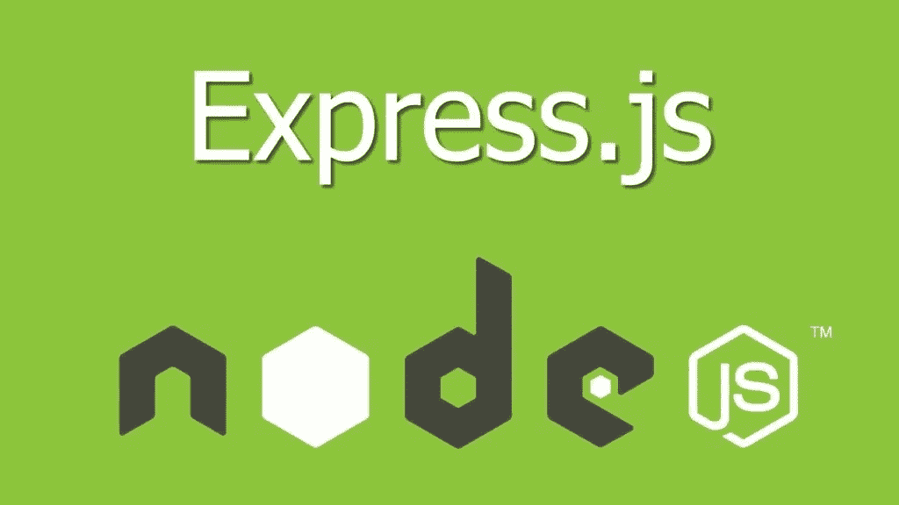

# 如何在 Express.js 中验证用户

> 原文：<https://javascript.plainenglish.io/how-to-verify-users-in-express-js-24c020433b2a?source=collection_archive---------9----------------------->



如果你正在构建一个应用程序，你可能希望你的平台上有很多用户。但是，你不只是想要大量的用户，你想要真实的、高质量的、会和你的 app 互动的用户。您想要验证这些用户。

对于使用假电子邮件地址的机器人或用户来说，没有认真使用你的应用程序进行注册的意图是很常见的。一开始处理这个问题的一个方法是确保验证用户。

本文是关于 ExpressJS 中用户验证的教程，也是我的 Express web 开发系列的继续。我将在我上一篇关于[处理密码重置的文章中讨论的概念的基础上进行构建。](https://kelvinmwinuka.com/how-to-handle-password-reset-in-expressjs/)

该文章中指定了设置和所需的包，但是您将能够看到在代码示例中使用了什么包。

我建议先看看本系列中的其他文章，尽管不管怎样，您应该能够理解这篇文章。如果你想随着系列的进展跟踪这个项目，请在 [GitHub](https://github.com/kelvinmwinuka/express-tutorial) 上查看。

# 模型

让我们首先创建保存验证令牌的模型。导航到 models 文件夹并创建一个名为“UserVerification.js”的文件。该文件应包含以下内容:

```
const { Schema, model } = require('mongoose')const schema = new Schema({
  user : {
    type: Schema.Types.ObjectId,
    ref: 'User',
    required: true
  },
  token: {
    type: Schema.Types.String,
    required: true
  }
}, {
  timestamps: true
})schema.index({ 'updatedAt': 1 }, { expireAfterSeconds: 300 })const UserVerification = model('UserVerification', schema)module.exports = UserVerification
```

模型模式包含一个将包含在验证链接中的令牌，以及与之相关联的用户。

在“updatedAt”字段上创建一个索引，指示 MongoDB 在记录更新 5 分钟后删除记录。对于测试来说，5 分钟是合理的，但是在生产中，您会希望将这个时间增加到更合理的时间。

在用户模型中，向模式添加一个布尔型“已验证”属性。将默认值设置为 false，因为用户在注册时不会被验证。

```
const { Schema, model } = require('mongoose')const saltRounds = 10var userSchema = new Schema({
  name: {
    type: Schema.Types.String,
    required: [true, 'You must provide a name']
  },
  email: {
    type: Schema.Types.String,
    required: [true, 'Email address is required']
  },
  username: {
    type: Schema.Types.String,
    required: [true, 'Username is required']
  },
  password: {
    type: Schema.Types.String,
    required: [true, 'You must provide a password']
  },
  verified: {
    type: Schema.Types.Boolean,
    required: true,
    default: false
  }
})...const User = model('User', userSchema)module.exports = User
```

# 路线

# 配置路线

我们必须创建的第一条路线是轮廓路线。这条路线将简单地呈现一个带有用户个人资料细节的模板。在 routes 文件夹中创建一个名为“profile.js”的文件，并添加一个呈现“profile.html”模板的路由。

```
const router = require('express').Router()router.get('/profile', (req, res) => {
  if (!req.isAuthenticated()) return res.redirect('/login')
  return res.render('profile.html')
})module.exports = router
```

# 用户验证路线

现在让我们创建处理用户验证的路由。在 routes 文件夹中，创建一个名为“user-verification.js”的文件。首先，该文件将包含以下内容:

```
const router = require('express').Router()
const { v4 } = require('uuid')
const { User, UserVerification } = require('../models')
const { sendEmail } = require('../helpers')/* Create routes here */module.exports = router
```

导入用户和用户验证模型。导入我们在上一篇文章中创建的“sendMail”助手函数。这是一个简单的函数，它使用 NodeMailer 通过传递给它的参数发送电子邮件。

现在让我们创建路线。

## 创建验证 url

第一个路由是获取路由'/verify '。该路由负责创建验证 URL，并包含以下内容:

```
router.get('/verify', async (req, res) => {
  if (!req.isAuthenticated()) return res.redirect('/login')
  if (req.user.verified) return res.redirect('back')const token = v4().toString().replace(/-/g, '')
  const verificationUrl = `${process.env.DOMAIN}/verify-confirm/${token}`await UserVerification.updateOne({ 
    user: req.user._id 
  }, {
    user: req.user._id,
    token: token
  }, {
    upsert: true
  })sendEmail({
    to: req.user.email,
    subject: 'Verify your email address',
    text: `Here's your email verification link: ${verificationUrl}`
  })req.flash('verify_success', 'Check your email address for your verification link. It may take a few minutes')
  res.redirect('/profile')
})
```

首先，检查用户是否经过身份验证。用户应该只能在登录时请求验证链接。如果不是，将他们重定向到登录页面。

检查用户是否已经过验证。如果用户已经验证，我们不想发送验证链接。如果是，请重定向到上一页。

创建令牌，然后创建包含令牌的验证 URL。

更新与当前用户关联的用户验证记录。确保将 upsert 选项设置为“true”。我们希望替换当前的验证链接，以便一次只能有一个链接处于活动状态，但是如果集合中没有链接，我们还希望创建一个新的链接。

发送包含用户验证链接的电子邮件，闪现一条提示用户检查其电子邮件地址的成功消息，然后重定向到用户的个人资料。

## 验证用户

第二个路由处理发送给用户的链接:

```
router.get('/verify-confirm/:token', async (req, res) => {
  if (!req.isAuthenticated()) return res.redirect('/login')

  const token = req.params.tokenconst userVerification = await UserVerification.findOne({
    user: req.user._id,
    token: token
  })if (userVerification) {
    await User.updateOne({ _id: req.user._id }, { verified: true })
    await UserVerification.deleteOne({ 
      user: req.user._id,
      token: token
    })
    sendEmail({
      to: req.user.email,
      subject: 'Verified',
      text: `Congratulations ${req.user.name}, your account is now verified!`
    })
    req.flash('verify_success', 'Congrats, you are now verified!')
  } else {
    req.flash('verify_error', 'Verification link is invalid or has expired.')
  }return res.redirect('/profile')
})
```

该路由需要一个令牌，我们稍后将验证该令牌。首先检查用户是否登录，如果没有，重定向到登录页面。

从 url 中提取令牌，并在 UserVerification 集合中查询具有当前令牌和当前用户的文档。

如果文档不存在，闪现一条错误消息，指出链接无效或过期。

如果文档存在，将用户的验证状态更新为“true ”,并删除当前的 UserVerification 文档，以防止链接被再次点击(这无论如何都是没有意义的，但却是一个好的实践)。

向用户发送确认其验证状态的电子邮件，然后显示一条成功消息，说明用户现已通过验证。之后重定向到用户的个人资料页面。

# 导入路线

进入应用程序的入口文件夹，用以下代码包含配置文件和用户验证路径:

```
app.use('/', require('./routes/profile')) 
app.use('/', require('./routes/user-verification'))
```

# 模板

我们需要为这个特性创建一个新的模板:概要文件模板。

```

  
    <div class="alert alert-success" role="alert">
      {{ messages.verify_success }}
    </div>
  
  
    <div class="alert alert-danger" role="alert">
      {{ messages.verify_error }}
    </div>
  
  <div>
    <h5>Hi, {{ user.name }}</h5>
    
      Your email is not verified, 
      <a class="btn btn-sm btn-warning" href="/verify">Verify Email</a>
    
  </div>


```

该模板呈现在先前请求中闪现的错误或成功消息。我们有一个显示用户名的 div 和一个根据用户的验证状态有条件地生成验证 URL 的按钮。

# 结论

在本文中，我演示了如何在您的 Express 应用程序中验证用户。您可能有许多原因想要验证用户:您可能想要确保您的应用程序上有活跃的人类用户，或者您可能想要限制需要验证用户的功能。

不管是什么原因，我希望这篇文章为验证过程的流程和执行提供了足够的指导。

下一篇文章将介绍如何使用 MongoDB 中的多对多关系创建用户关注和关注者关系。

**如果你喜欢这篇文章，可以考虑关注我的** [**个人网站**](https://kelvinmwinuka.com/) **，以便在我的内容在媒体上发表之前提前获得。另外，请随意评论这篇文章。我很想听听你们的想法！**

*原载于 2020 年 12 月 30 日 https://kelvinmwinuka.com**的* [*。*](https://kelvinmwinuka.com/how-to-verify-users-in-expressjs/)