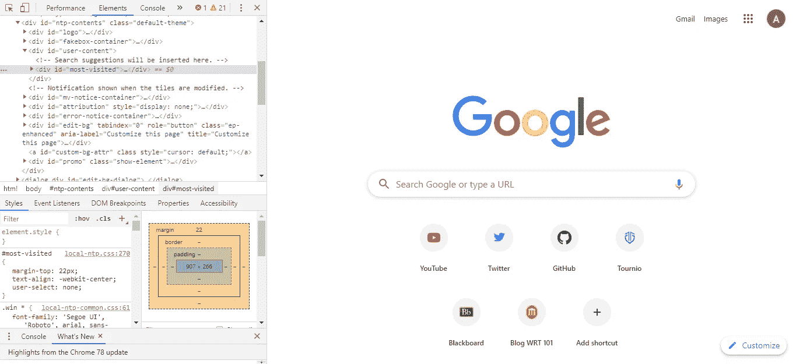
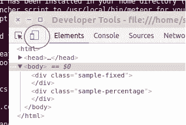
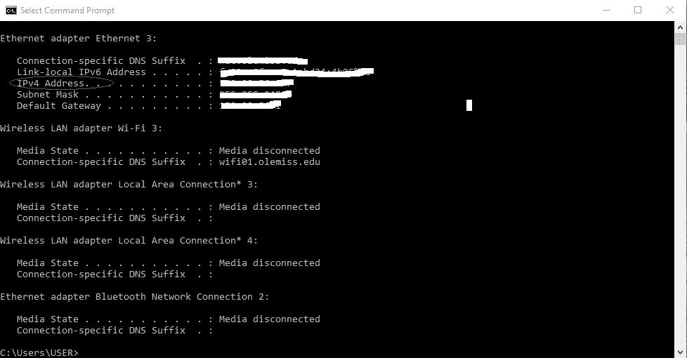

# 如何在移动设备上查看 React 应用程序

> 原文：<https://javascript.plainenglish.io/how-to-view-your-react-app-on-a-mobile-device-697e248afddd?source=collection_archive---------0----------------------->

如果你曾经参与过 React 项目，有一件很重要的事情是你的网站对移动用户的显示。当然，你可以通过使用[媒体查询](https://medium.com/swlh/using-media-queries-in-css-1d7aa8d30dcf)和浏览器内显示来实现这一点，但是如果你想在你自己的设备上看到你的项目，看看它 ***真的*** 看起来怎么样呢？今天，我们将讨论如何做到这一点。

# 设备工具栏呢？

在我们深入了解如何在移动设备上查看 React 应用之前，我们应该先谈谈 Google Chrome 及其提供的设备工具栏选项。如果你右击你的应用程序(或任何网站)并点击***Inspect***(***Ctrl+Shift+I***)，你会得到一个看起来像这样的屏幕提示:

在包含所有代码的部分，您会在左上角看到一个图标，看起来像两个框。这是设备切换工具栏选项。

Toggle Device Toolbar Option

单击此按钮后，您将进入一个屏幕，允许您在浏览器中更改显示大小，该屏幕还包含一个预置的常用设备及其大小的列表。所以现在你可能想知道为什么不在你实际的移动设备上使用它？嗯，原因是因为我发现设备工具栏有点 ***错误和不可靠*** 。有时，该功能不会显示您的应用在不同设备上的实际外观，这就是为什么仔细检查总是好的，因为实际结果可能会很惊人。

# 如何在手机上查看您的应用程序

在移动设备上查看 React 应用程序实际上非常简单，可以分为三个步骤。

## 第一步:在你的电脑上启动 React 应用

在您可以在另一台设备上查看 React 应用程序之前，您需要通过 localhost 在浏览器中启动它。一旦你这样做了，看看网址和 ***写下出现在本地主机(端口号)*** 后面的数字，因为我们一会儿就需要这些。

## 第二步:找到你的本地 IP

正常启动 React 应用程序后，您需要获取本地 IP 地址。这将允许您将移动设备连接到计算机。为此，只需打开一个新的终端，键入 ***ipconfig*** 。一旦按下 enter 键，您应该会看到这样的屏幕:

从这里开始，您将需要查看 ***IPv4 地址*** 并记下显示在右侧的地址。

## **第三步:在另一台设备上查看 React 应用**

一旦您获得了 URL 中 localhost 后面的数字和您的本地 IP 地址，您就可以使用其他设备了。只需打开你设备的浏览器，输入你之前复制下来的 IPv4 地址****，后跟冒号*** ，然后是 ***端口号*** 。格式应该是这样的:***555 . 55 . 555:1234***一旦你点击了 enter，你应该会看到你的 React 应用在你的移动设备上运行了！*

**

# *附加信息*

*还有一点你可能会发现很有用，那就是你不仅可以在移动设备上使用这个方法，还可以在任何你喜欢的设备上使用！只需在您选择的设备上简单地执行上述 3 个步骤。此外，对于不知道如何找到您的本地 IP 的 mac 用户，您可以阅读下面的内容。我希望这对你们有所帮助！*

* [## Mac OS X -如何找到您的公共或本地 IP 地址

### 连接到网络的每台设备都有一个 IP 地址。这是一个唯一的标识符，用于在…上定位您的电脑或 Mac

ccm.net](https://ccm.net/faq/42628-mac-os-x-how-to-find-your-public-or-local-ip-address)* 

**来源*:*

* [## 谷歌

### 搜索世界信息，包括网页、图像、视频等。谷歌有许多特殊的功能来帮助…

www.google.com](https://www.google.com/)  [## 如何在 Mac 上找到 IP 地址:电脑，终端

### 连接到网络的每台设备都有一个 IP 地址。这是一个唯一的标识符，用于在…上定位您的电脑或 Mac

ccm.net](https://ccm.net/faq/42628-mac-os-x-how-to-find-your-public-or-local-ip-address) 

## 进一步阅读

 [## 使用风格化组件和位对 React 应用程序进行主题化

### 作为 UI 开发人员，我们经常希望将表示与交互分开，这样我们就可以应用相同的 CSS…

比特云](https://bit.cloud/blog/theming-react-apps-with-styled-components-and-bit-l7epurug)  [## 扩展 React 应用的 5 个技巧

### 1.将 Bit 用于可组合设计 2。设计令牌 3。网络请求的定制钩子 4。客户端与服务器状态 5。一个…

javascript.plainenglish.io](/5-tips-to-scale-up-your-react-apps-8fb68319062e) 

*更多内容请看*[***plain English . io***](https://plainenglish.io/)*。报名参加我们的* [***免费周报***](http://newsletter.plainenglish.io/) *。关注我们关于*[***Twitter***](https://twitter.com/inPlainEngHQ)[***LinkedIn***](https://www.linkedin.com/company/inplainenglish/)*[***YouTube***](https://www.youtube.com/channel/UCtipWUghju290NWcn8jhyAw)*[***不和***](https://discord.gg/GtDtUAvyhW) *。对增长黑客感兴趣？检查* [***电路***](https://circuit.ooo/) *。****