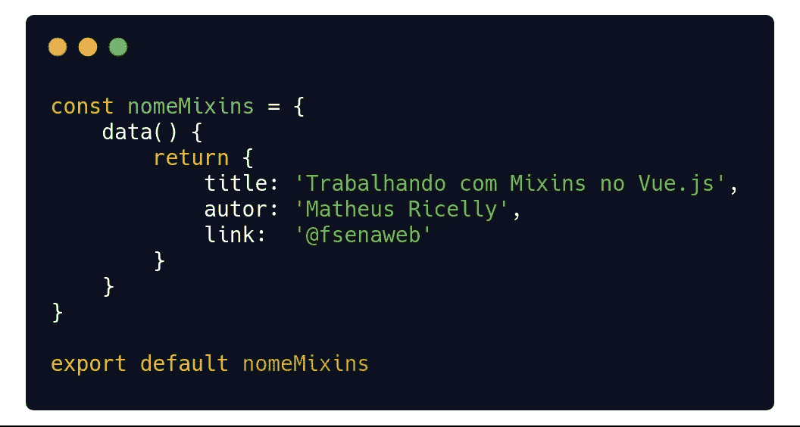

# 如何在 Vue.js 上使用 mixins

> 原文：<https://javascript.plainenglish.io/how-to-work-with-mixins-on-vue-js-a61f72737f25?source=collection_archive---------0----------------------->

通过我在 Vue 的工作，我获得了开发组件和在应用程序中重用它们的经验，从而获得了敏捷性、时间、资源等等。在最近的项目中，我意识到我的一些组件有非常相似的代码，包括一些方法和计算属性。

我实际上是将大量代码从一个组件复制并粘贴到另一个组件，更改小细节，这引起了我的注意，所以我去互联网上获取更多信息，主要是在 Vue.js 本身的文档中，以及在 Vuejs Brasil 组的 telegram 中。我发现 Mixins 有一个很棒的特性，文档本身给出了明确的解释:

> Mixins 是为 Vue 组件分发可重用功能的一种灵活方式。mixin 对象可以包含任何组件选项。当一个组件使用 mixin 时，mixin 中的所有选项都将“混合”到组件自己的选项中。

比那更清楚，不可能，不是吗？！Mixins 允许你将方法、属性、数据、计算属性应用于不同的组件。它们非常类似于拥有继承组合的方法(我们在 C #、Java 和其他语言中找到的那些相同的继承)。在那之后，我发现我在代码重用方面的工作已经慢了很多，这使得构建我的应用程序更快了。但是让我们停止谈话，让我们练习。

# 我们来看例子！

在您的 Vue 应用程序中，我们将创建一个名为 mixins 的文件夹，我们将在其中存放带有扩展名的文件。js 导入组件，我们将利用应用程序中的代码。

> 在我的例子中，我将使用葡萄牙语中的一些单词，但在功能的使用上没有任何改变。

We call this file named nomeMixins.js

在第一个例子(nomeMixins.js)中，我创建了一个名为 nomeMixins 的常量，并返回了一个对象，就像我们在包含三个简单属性的 Vue 实例本身中所做的一样。现在我们可以将 nomeMixins.js 文件导入到组件中:

Part of the .vue component with the nomeMixins import.

最初，我们进行导入( *import nomeMixins …* )并声明 Mixins，并为 import 中声明的值赋值，在本例中是 mixins: [nomeMixins]，在这里可以通过数组插入几个其他文件。

正如我前面说过的，我们不仅可以处理 data()，还可以处理方法、计算属性和许多其他内容。接下来，在同一个文件 nameMixins.js 中，我们将插入一个计算属性，它将连接 data()中对象的两个属性，如下所示:

在。vue 组件，我们不需要添加任何东西，因为它已经知道计算的属性将是它的一部分，所以只需在<template></template>标签内调用它或通过 console.log()查看结果:

这为您节省了在 Vue.js 的站点或应用程序中重复活动的一行又一行代码。这种重用有几种可能性，包括生成一个**全局混合**的方法，您可以在 Vue 的所有实例中使用它，但文档本身建议谨慎，因为这可能会影响您代码的其他部分。

你可以在[官方 Vue.js 文档](https://vuejs.org/)中找到更多信息，其中包含许多在你的应用中使用 mixins 的例子，去那里看看吧。

如果你喜欢这篇文章，一定要分享和评论。如果你想知道更多一点，交流一些想法(我的英语还在提高，但我们可以交谈)，你可以留下你对该主题的评论，甚至为接下来的文章提出一些建议。

喜欢并了解一点我的工作，访问网站 [**www.fsenaweb.me**](http://www.fsenaweb.me/) ，他有我的作品集，我的社交网络(包括 [GitHub](https://github.com/fsenaweb/) ，在那里你可以用 Vue.js 练习一些示例应用程序)，还有一个小的联系人空间。

 [## fsenaweb -概述

### PHP Web 开发人员和前端爱好者

github.com](https://github.com/fsenaweb/) 

就这些了，下次见！我的名字是 Matheus Ricelly，非常感谢大家的关注！