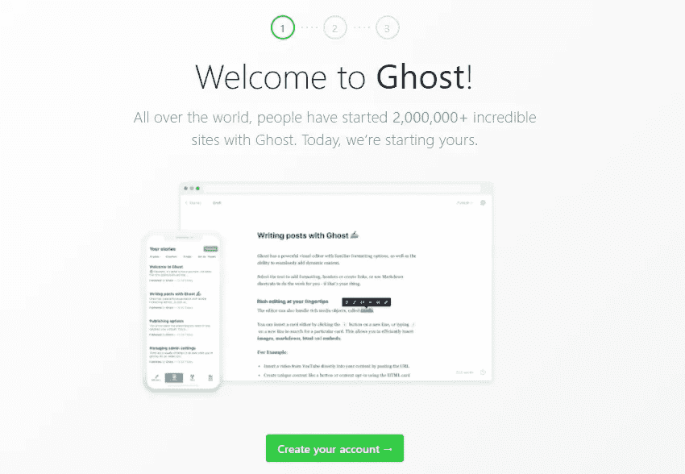

# 如何使用 Ghost 4 . 7 . 0 在 Heroku 中部署，在几分钟内创建一个博客

> 原文：<https://javascript.plainenglish.io/how-to-write-a-blog-in-minutes-with-ghost-v4-7-0-deploying-in-heroku-be3ed5eb7c15?source=collection_archive---------3----------------------->

## 如何用 **Ghost v4.7.0** ，部署在 **Heroku** 分分钟写一篇博客

****

> ****幽灵* ***世界上最流行的开源*** *无头****node . js*******CMS*******

****[**Ghost**](https://ghost.org/)**是一个简单的博客平台，最近开始流行。虽然界面相当简单，就像 **Medium** ， **Ghost** 提供了令人愉快的写作体验，这要归功于一个漂亮而强大的富文本内容编辑器、调度工具和协作工具。******

******像 **WordPress** 一样， **Ghost** 是开源的，这意味着你可以在任何兼容的网络主机上使用它，并根据你的独特需求扩展它。******

******的确，这个平台**最适合开发者**(或开发者实现者)，因为它的无头内容管理系统提供了很多的灵活性**。********

********Ghost** 还**提供了对电子邮件简讯和 SEO** 的内置支持，此外还能够创建**会员业务**和**接受付款**。它还可以**与数百种流行的第三方工具集成，以实现扩展功能**。******

# ******先决条件******

******在这一部分，有必要记住以下要素来创建一个有**幽灵**的博客。******

1.  ******-[-**Heroku 账号**-](https://signup.heroku.com/)******

******现在你已经有了所有必要的要求，我们可以继续**在 Heroku** 上安装 Ghost。对于这一步，我已经创建了一个存储库，其中包含了在 Heroku 上安装最新版本的 **Ghost** 的所有必要配置。******

# ******在 Heroku 部署******

******你所要做的就是使用 **Heroku** 中的**展开按钮**并遵循必要的指示。******

************

******[https://heroku.com/deploy?template=https://github.com/thelovekesh/ghost-v4-on-heroku](https://heroku.com/deploy?template=https://github.com/thelovekesh/ghost-v4-on-heroku)******

******现在你必须为你在 **Heroku** 中创建的应用选择一个**名称，这将是你的博客的 url。********

************

******App name******

******该配置将使用带有 **JawsDB** 和 **Mailgun 服务的 **MySql 数据库**来处理博客内的电子邮件**。******

************

******Add-ons******

******为了完成配置，我们定义了变量 **PUBLIC_URL** ，这将是访问我们博客的 URL。然后我们点击**部署应用**按钮。******

************

******Config Vars******

******当安装过程完成后，将显示到**仪表盘**和**应用程序**的以下链接******

************

******App successfully deployed******

******本例中，**仪表盘**、**后端**和**前端**将在以下网址上提供:******

********仪表盘**:[https://dashboard.heroku.com/apps/victorio-blog](https://dashboard.heroku.com/apps/victorio-blog)******

************

******Dashboard in Heroku******

********后端**:[https://victorio-blog.herokuapp.com/ghost](https://victorio-blog.herokuapp.com/ghost)******

************

******Backend******

********前端:**https://victorio-blog.herokuapp.com/******

************

******FrontEnd******

# ******配置后端******

********后端**:[https://victorio-blog.herokuapp.com/ghost](https://victorio-blog.herokuapp.com/ghost)******

******当我们第一次访问我们的博客时，我们将不得不在 **3 个简单的步骤**中对其进行配置:******

********第 1 步**:点击**创建您的账户**按钮继续:******

************

******Step 1******

********第 2 步**:我们定义博客的主要数据，除了主要用户的数据外，还要访问博客的**后端**:******

************

******Step 2******

********第 3 步**:如果你想和其他用户合作，现在就定义他们，或者我们以后再定义。******

************

******Step 3******

******准备好了。我们现在可以开始创建自己的博客帖子了。******

************

******BackEnd: Index******

************

******BackEnd: Posts******

************

******BackEnd: About******

******使用 **Ghost** 和 **Heroku** 创建博客非常简单，现在您的博客可以工作了，是时候对其进行定制了。******

## ******进一步阅读******

****** [## 如何构建可组合的博客

### 从头开始创建一个博客需要很多。有许多移动部件结合在一起形成了一个…

bit.cloud](https://bit.cloud/blog/how-to-build-a-composable-blog-l1jkl9f4) 

*更内容于* [***普通英语***](https://plainenglish.io/) *。报名参加我们的* [***免费周报***](http://newsletter.plainenglish.io/) *。在* [***推特***](https://twitter.com/inPlainEngHQ)[***领英***](https://www.linkedin.com/company/inplainenglish/)*[***YouTube***](https://www.youtube.com/channel/UCtipWUghju290NWcn8jhyAw)***和******T48 不和**T52 *对成长黑客感兴趣？查看* [***电路***](https://circuit.ooo/) ***。***********