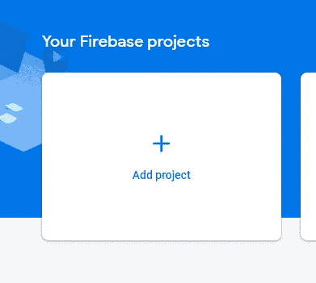
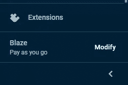
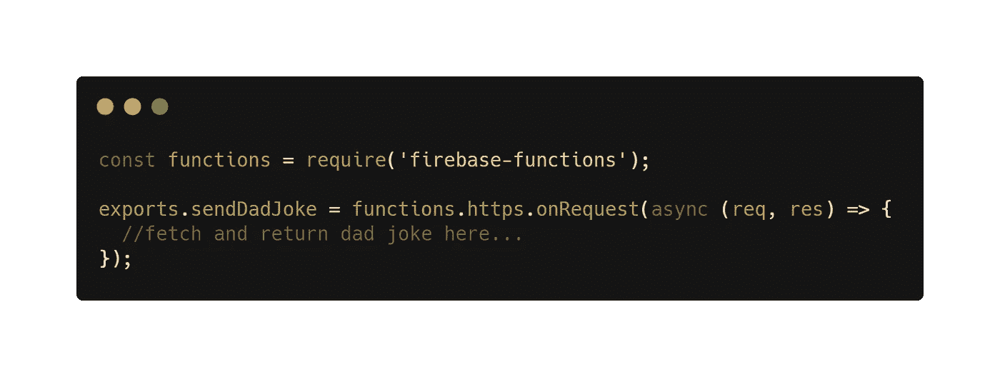
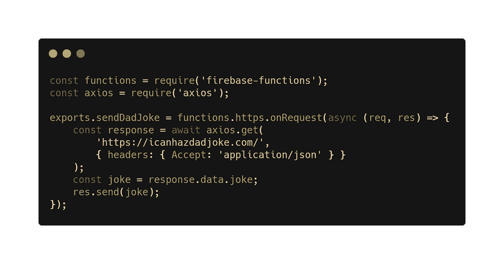
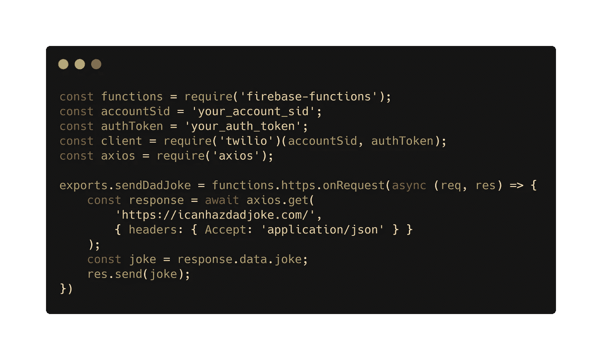
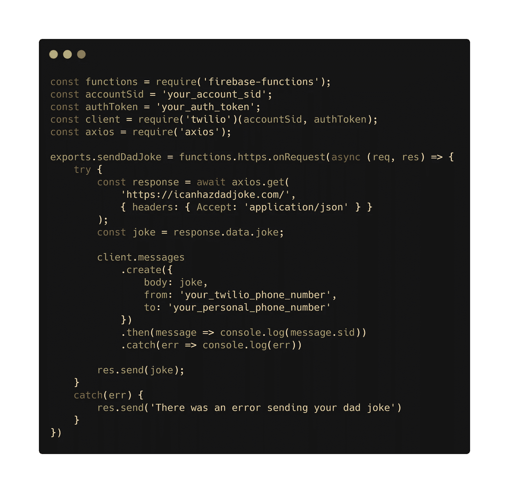
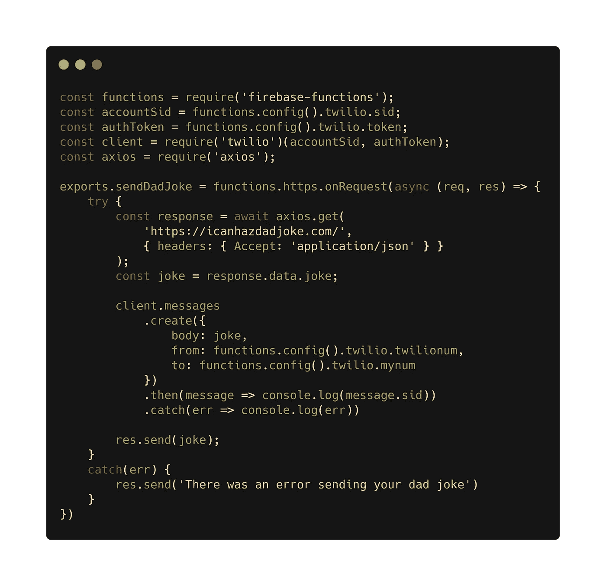

# 如何编写一个云函数来给你爸爸发笑话😁

> 原文：<https://javascript.plainenglish.io/how-to-write-a-cloud-function-that-texts-you-dad-jokes-a8e1f2a2dcdc?source=collection_archive---------6----------------------->


Photo by [DISRUPTIVO](https://unsplash.com/@sejadisruptivo?utm_source=medium&utm_medium=referral) on [Unsplash](https://unsplash.com?utm_source=medium&utm_medium=referral)

你喜欢爸爸的笑话吗？如果你每天都能收到一条关于爸爸的笑话短信，那不是很好吗？如果您的回答是肯定的，那么您一定会喜欢构建这个简单的项目！我们将编写并部署一个云功能，每天给你发一条随机的老爸笑话短信。

为此，我们将使用 Firebase 云函数以及 Twilio API 来发送文本。如果您不熟悉这些工具，不要担心！我们将一步一步地讲解所有内容，以确保您理解所有内容。如果你被卡住了，可以在这里随意参考我完成的代码[。](https://github.com/wilstaley/daily-dad-jokes)

首先，打开一个终端，导航到你想存储这个项目的地方，输入`mkdir daily-jokes`创建一个名为“每日笑话”的新目录。然后，您可以用 cd 进入这个新目录。

## 正在初始化项目

现在，在我们进入代码之前，让我们初始化一个 Firebase 项目。转到 firebase.google.com 的[然后点击右上角的‘转到控制台’。如果你还没有一个 Firebase 帐户，你可能需要创建一个，但是这应该很简单。一旦你在 Firebase 控制台上完成了，只要按照说明并阅读这篇文章就可以了。](http://firebase.google.com)

进入控制台后，您应该会看到一个大的“ole”按钮来添加一个新项目，如下所示:



Firebase Add Project

继续点击那个坏男孩！然后会提示您为新项目命名。我把我的命名为“每日老爸笑话”，但是你可以随意命名你的。然后你可以点击“继续”来启用谷歌分析，选择你想使用的谷歌账户，最后点击“创建项目”！

这将需要一些时间来初始化您的新项目，但一旦完成所有设置，您可以单击“继续”转到您的项目的概述页面。

好的多基。现在我们已经在 Firebase 中初始化了一个项目，并准备开始破解一些代码。回到你的终点站。我们将使用 Firebase CLI(命令行界面)来部署我们的功能！要安装 CLI，请输入以下命令:`npm install -g firebase-tools`

当然，您需要安装[节点](https://nodejs.org/en/download/)来运行这个命令😉。

一旦安装完成，你就可以运行`firebase login`来登录你的谷歌账户。为了确保您已经正确连接了您的帐户，您可以运行`firebase projects:list`来显示您帐户中的所有项目。您应该在那里看到至少一个项目:我们刚刚创建的“日常爸爸笑话”项目！

现在我们将运行`firebase init`在本地初始化项目。一旦你这样做了，它会问你你想在这个项目中使用哪些 Firebase 特性。对于这个项目，我们将只使用功能特性。您可以使用向下箭头导航到函数选项，然后按空格键选择函数，然后按 enter 确认您的选择。接下来，它会要求我们将这个目录与一个 Firebase 项目关联起来。因为我们已经使用 Firebase 在线控制台初始化了一个项目，所以我们可以选择“使用现有项目”。从这里，我们可以选择我们之前创建的日常爸爸笑话项目！然后我们被要求选择一种语言来编写我们的函数。我将在本教程中使用 JavaScript。然后我们被问到是否要使用 eslint 来设计我们的代码。我将选择是，因为为什么不呢？最后，系统会询问我们是否愿意继续使用 npm 安装依赖项。我将选择 yes，在安装完依赖项之后，我们已经初始化了 Firebase 项目！！！

恭喜你！作为对本教程到此为止的奖励，这里有一个爸爸的笑话…

> 我不会和 velcro 一起买任何东西。这完全是敲竹杠。

在继续之前，我们还需要解决另一个大问题…

不幸的是，Firebase 的免费 Spark 计划不允许出站联网。但是我们需要这种用 Twilio api 发送文本的能力。所以在我们继续之前，我们需要回到你的浏览器，在我们项目的页面内升级到 Blaze 计划。您可以通过选择左侧面板底部的“修改”来完成此操作:



Upgraded to Blaze Plan

一旦我们完成了这些，我们就完成了所有的项目设置。

## 编写和部署云函数

现在我们开始任何项目的有趣部分:编写代码！继续在您选择的文本编辑器中打开项目文件夹。如您所见，Firebase 向我们的项目添加了一些初始文件。在“函数”文件夹中，你会找到一个 **index.js** 文件。这是我们将添加云功能的地方。

我们需要做的就是用我们的函数替换 **index.js** 的内容。首先，让我们写一个函数来获取并返回一个爸爸的笑话。



Initial setup of cloud function

让我们从这段代码开始。首先，我们需要火基函数。这是 Firebase SDK 创建云函数和设置触发器所需要的。接下来我们有`exports.sendDadJoke`。无论您在“导出”后添加什么，都将是您的云功能的名称。在这种情况下，我选择将我的命名为“`sendDadJoke`”，但是您可以将您的命名为其他名称。

接下来，我们有`functions.https.onRequest`。这是一种告诉 Firebase 无论何时向与该函数相关联的端点发出 HTTP 请求，我们都要触发该函数的方式。现在不要太担心这个…一旦我们实际部署了这个功能，我们会得到一个端点并进行测试。

*旁注:你可能想知道为什么我们不使用* `*functions.pubsub.schedule*` *让我们的云功能每天运行一次。原因是因为，我不想让这个功能花费我任何钱！根据文档，每个云调度程序作业每月花费 0.10 美元。虽然这不是很多钱，但我将向您展示一种免费设置 cron-job 的方法。如果您想了解更多关于如何使用这种方法调度云功能的信息，您可以阅读文档* [*此处*](https://firebase.google.com/docs/functions/schedule-functions) *。*

关于这个设置，最后要注意的是回调函数。它将请求(req)和响应(res)作为参数。这也需要是一个异步函数，因为我们将进行一个 api 调用来获取一个爸爸笑话！

为了从 api 中获取一个爸爸笑话，我们需要 axios 模块。所以回到你的终端，cd 到“功能”文件夹(节点模块所在的位置)并运行`npm install axios`。这将把 axios 作为一个依赖项添加到我们的项目中，我们可以在我们的云功能中使用它。

现在我们可以更新函数来获取并返回一个爸爸的笑话:



Fetching and returning a dad joke

我们在这里做的第一件事是需要 axios。然后在回调内部，我们使用 axios 从[icanhazdaddjoke](https://icanhazdadjoke.com)API 获得一个笑话。我们在请求中使用一个头，告诉 api 我们想要接收 json 数据。最后，我们从 api 的响应中提取笑话，并使用`res.send(joke)`将其发送回去。

太棒了。这看起来很棒。现在我们应该试着部署我们所拥有的，看看我们是否能得到一个爸爸的笑话。要部署我们的功能，请转到终端并运行`firebase deploy --only functions`。部署需要一些时间，但是一旦完成，您就可以在 Firebase 控制台中看到该功能。

从 Firebase 控制台中，选择您的 daily dad jokes 项目，然后在左栏中选择 functions 选项卡。从这里，您应该能够看到与您的项目相关的所有云功能。您应该会看到您的 sendDadJoke 函数列在这里。在“trigger”标题下，您可以看到该函数是在请求 url 时触发的。将提供的 url 复制到一个新选项卡中，然后按 enter 键。你应该看到一个爸爸的笑话出现在你的浏览器里！

## 用 Twilio 发送短信

呜哇！我们现在有了一个工作云函数，可以获取并返回一个随机的老爸笑话！现在让我们来解决发短信的问题。为此，我们将使用 Twilio api。如果你没有 Twilio 账户，你应该在这里:)创建一个

关于 Twilio 的伟大之处在于，当你注册时，他们会给你一些免费的积分(我相信是 15 美元)，这样你就可以测试他们的服务。如果你每天只给自己发一条短信，15 美元够你用很长时间了。

一旦你创建了一个 Twilio 帐户，有一些事情要做，包括验证你的个人电话号码和购买一个 Twilio 电话号码(不要担心！Twilio 电话号码只需 1 美元，将从您的 15 美元信用点数中扣除)。我将带您了解如何做这些事情，但是 Twilio 已经有了一些关于如何做这些事情的很好的文档。你应该继续按照[这里](https://www.twilio.com/docs/usage/tutorials/how-to-use-your-free-trial-account)列出的“开始”步骤进行。

如果您查看 Twilio 关于使用 Node.js 发送 sms 文本的文档，会看到以下内容:


Sending an sms text with Twilio

发送一条短信只需要这么少的代码，这真是太疯狂了！你只需要用你的 accountSid 和 authToken 要求 Twilio，然后调用 client.messages.create()。

所以让我们将这段代码添加到我们的云函数中！首先，我们需要通过运行`npm install twilio`来安装 twilio node.js 模块。然后，我们可以在代码中添加以下内容:



Setup for twilio

这里，我们为 accountSid 和 authToken 添加了一个常量变量。您可以在 twilio 仪表板主页的“项目信息”部分找到这些值。现在我们可以添加函数调用来发送文本消息…



Making our cloud function send a text

我们只需要调用`client.messages.create()`。文本的主体将是我们之前获取的爸爸笑话。“发件人”属性将保存您的 Twilio 电话号码，“收件人”属性将保存您的个人电话号码。我还将整个事情包装在一个 try-catch 块中，因此如果在此过程中出现任何失败，我们将得到一条消息，说“发送您的爸爸笑话时出错”。

现在，我们可以重复一些我们以前做过的步骤，看看这是否可行。只需运行命令`firebase deploy --only functions`。然后返回 Firebase 控制台，将您的函数的 url 复制并粘贴到一个新的选项卡中。当你按下回车键，并要求该网址，你应该看到一个爸爸的笑话出现在浏览器中，但你也应该收到这个笑话作为一个文本从你的 Twilio 号码！

你可能会注意到邮件前面有这样一句话，“来自你的 Twilio 试用帐户-”。如果您使用的是 Twilio 试用帐户，这将自动添加到您的文本中。如果你像我一样，不介意那些额外的文字，你可以继续使用那个试用帐户…否则，你需要升级你的 Twilio 帐户。

任务完成:我们已经正式编写了代码，可以给我们发一个随机的爸爸笑话…但是我们可以做一些事情来使这个程序变得更好！

## 添加 Firebase 环境变量

虽然我们的功能目前工作得很好，但它确实有一个大禁忌。我们有敏感信息，如授权令牌和电话号码就在代码中！一般来说，当我们有敏感的信息时，比如 api 键，我们用一种叫做环境变量的东西把它们从代码中提取出来。环境变量是一种在运行代码的机器上存储一些信息的方法，而不是存储在代码本身中。因为我们的函数实际上是在 Google 的服务器上运行的，每当我们向提供的 url 发出请求时，Firebase 就为我们提供了一种设置环境变量的方法！

通过使用 cli 命令`firebase functions:config:set`，我们可以设置环境变量。

例如，我们可以运行`firebase functions:config:set someservice.key="THE API KEY" someservice.id="THE CLIENT ID"`来设置两个环境变量。

然后我们可以使用命令`firebase functions:config:get`来查看我们所有的环境变量。因此，如果我们在运行上面的示例“set”命令后运行这个“get”命令，我们将看到类似这样的内容:

```
{
  "someservice": {
    "key":"THE API KEY",
    "id":"THE CLIENT ID"
  }
} 
```

设置这些时要记住一点:键只允许小写字母。记住这一点，让我们运行以下命令，为我们的 Twilio 帐户 sid、auth token、Twilio 电话号码和您的个人电话号码设置环境变量:

`firebase functions:config:set twilio.sid="your_account_sid" twilio.token="your_auth_token" twilio.twilionum="your_twilio_number" twilio.mynum="your_personal_phone_number"`

哇，好长的命令啊！为了使更改生效，我们需要再次运行`firebase deploy --only functions`。但在此之前，让我们用对环境变量的引用来替换代码中的敏感数据。我们将这样做:



Implement firebase environment variables

好的，看起来不错！现在，我们可以运行我们的 deploy 命令，并确保一切仍按预期工作。请再次访问该网址，确保您的手机仍能收到短信。此外，我们可以运行`firebase functions:config:get`，我们应该看到我们设置的所有变量。

您可能想知道，“为什么要使用环境变量？”嗯，如果你正在编写客户端代码，你绝不会希望在你的代码中有敏感信息，因为任何人都可以访问它。此外，如果你想分享你的代码(比如在 GitHub 上)，你不希望每个人都可以访问你的敏感信息！简而言之，设置这些环境变量有助于保护我们的安全，是一种很好的安全措施。

## 设置 Cron 作业

好吧！这是我要和大家分享的最后一步。我们将设置一个 cron-job，每天向我们的 url 发出一次请求。这样一来，我们不用动一根手指，就能直接在手机上收到爸爸的笑话。

有很多方法可以设置 cron-job，但是为了简单起见，我将使用[cron-job.org](https://cron-job.org/en/)。这个网站让你设置一个 cron-job 完全免费！你确实需要创建一个账户，但是非常简单，而且还是免费的。然而，我不建议将这个网站用于生产项目，因为如果这个网站关闭，你将会失去你设置的所有 cron-jobs。

一旦你创建了一个帐户，转到成员页面，然后 cron-jobs 标签，并选择'创建 cron-job '。给你的工作一个头衔。我要给我的取名为“给爸爸讲笑话”。然后，对于地址，从 Firebase 控制台函数触发器中复制并粘贴 url。然后只需选择您希望 cron-job 运行的频率，并选择页面底部的“创建 cronjob ”!

你可以一开始设置它每分钟运行一次，以确认它正在工作，然后返回并将其更改为每天在你喜欢的任何时间运行！

## 结束语

恭喜你！你已经成功编写了一个云程序，它会给你发一个老爸笑话。您还学习了如何使用 cron-job.org 在给定的时间表触发该功能！现在你可以高枕无忧，每天享受老爸的笑话了。

如果你想玩得更开心一点，你可以在手机中添加你的 Twilio 电话号码作为联系人，名字是“爸爸”。这样，看起来你爸爸真的在给你发愚蠢的笑话！

我还鼓励您考虑一下使用云功能和 cron-job 还能做些什么。这两个简单的工具打开了一个你可以做的很酷的项目的世界！也许你想给自己发些短信，而不是爸爸的笑话…无论如何，我很想听听你对可以用这些工具构建的独特项目的想法！如果你真的做了什么，请和我分享！我很想去看看！

如果你喜欢这个教程，并希望看到更多类似的内容，请考虑成为 https://www.patreon.com/wilstaley 的一名志愿者

## **用简单英语写的 JavaScript**

你知道我们有四份出版物和一个 YouTube 频道吗？在 [**plainenglish.io**](https://plainenglish.io/) 和 [**找到它们订阅我们的 YouTube 频道**](https://www.youtube.com/channel/UCtipWUghju290NWcn8jhyAw) **！**