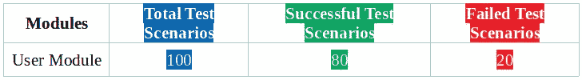
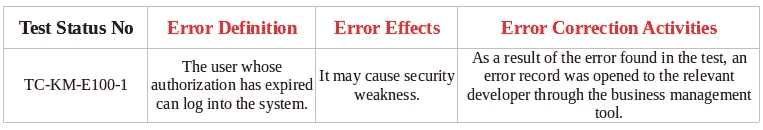

# 如何写软件测试报告？

> 原文：<https://javascript.plainenglish.io/how-to-write-a-software-test-report-e6700377791a?source=collection_archive---------2----------------------->

Photo by [Glenn Carstens-Peters](https://unsplash.com/@glenncarstenspeters?utm_source=unsplash&utm_medium=referral&utm_content=creditCopyText) on [Unsplash](https://unsplash.com/s/photos/write?utm_source=unsplash&utm_medium=referral&utm_content=creditCopyText)

在接下来的文章中，我将重点介绍如何编写软件测试报告，以及编写软件测试报告时应该考虑的问题。我会试着回答这些问题。

软件测试报告是在满足评估和报告阶段输出标准中规定的退出标准时，即测试执行过程完成时，开始编写并与项目干系人共享的文档。该文档在“软件测试文档标准”([IEEE Std 829–1998](https://standards.ieee.org/standard/829-1998.html))中进行了概述。

# 测试报告中的字段

*   测试产品和中间体
*   测试环境
*   测试结果概述
*   错误定义
*   结论和建议

# 1.测试产品和中间体

测试的产品和产品组件应在本节中详细说明。此外，没有经过充分测试的功能也应该在这一部分进行解释。

# 2.测试环境

包括与测试环境相关的特性。硬件(cpu、ram 等。)测试服务器的功能、安装在测试服务器上的操作系统、安装在服务器上的角色或测试自动化软件应在本节中进行说明。

# 3.测试结果概述

必须为每个测试级别(集成和系统测试)单独指定。应该清楚地说明在这个区域中编写的测试场景、成功的和不成功的测试场景的总数。还必须添加关于是否满足软件测试计划中规定的成功标准的信息。集成测试结果概述部分的示例说明如下:

> 将 X 项目中开发的软件与硬件测试环境集成，并对系统进行测试。集成测试分两个阶段进行，第一阶段编写的 x 个测试场景被执行，结果 x 个测试场景失败。第一阶段的成功率确定为 xx%。
> 
> 第一阶段出现的错误得到纠正，第二阶段通过。在第二阶段，进行重新测试以检查第一阶段中的错误是否被消除。在第二阶段进行的确认测试中没有遇到任何问题，测试的成功率被确定为 100%。

# 4.错误定义

Photo by [Romson Preechawit](https://unsplash.com/@woodies11?utm_source=unsplash&utm_medium=referral&utm_content=creditCopyText) on [Unsplash](https://unsplash.com/s/photos/error?utm_source=unsplash&utm_medium=referral&utm_content=creditCopyText)

测试结果概述部分中包含的失败测试场景的错误定义、错误影响和错误纠正活动在错误定义部分中有明确说明。错误定义的示例表如下。

# 5.结论和建议

改进建议，如果有的话，可以由测试专家在这个部分与项目涉众分享。

感谢您的阅读！点击查看作者的其他文章:

 [## 如何为成功的项目编写软件测试计划

### 成功测试过程的第一步是计划项目范围内的测试活动…

medium.com](https://medium.com/javascript-in-plain-english/how-to-write-software-test-planning-for-successful-projects-f2df2b9412a0)  [## 如何安装 Nightwatch.js？用 Nightwatch.js 进行第一次测试

### 在下面的文章中，我将重点介绍如何安装 Nightwatch.js，你必须知道的内容以及如何进行安装

medium.com](https://medium.com/lucid-archive/how-to-install-nightwatch-js-first-test-with-nightwatch-js-cffd7b96f49f)  [## 软件测试过程和测试级别

### 软件测试过程

medium.com](https://medium.com/swlh/software-testing-process-and-levels-of-testing-4274904ce655)  [## 软件测试和方法

### 在我的软件测试系列中，我将尝试讨论为什么测试是必要的，这些测试是如何执行的，如何…

medium.com](https://medium.com/swlh/software-testing-and-methodologies-1fc519c98fdf)