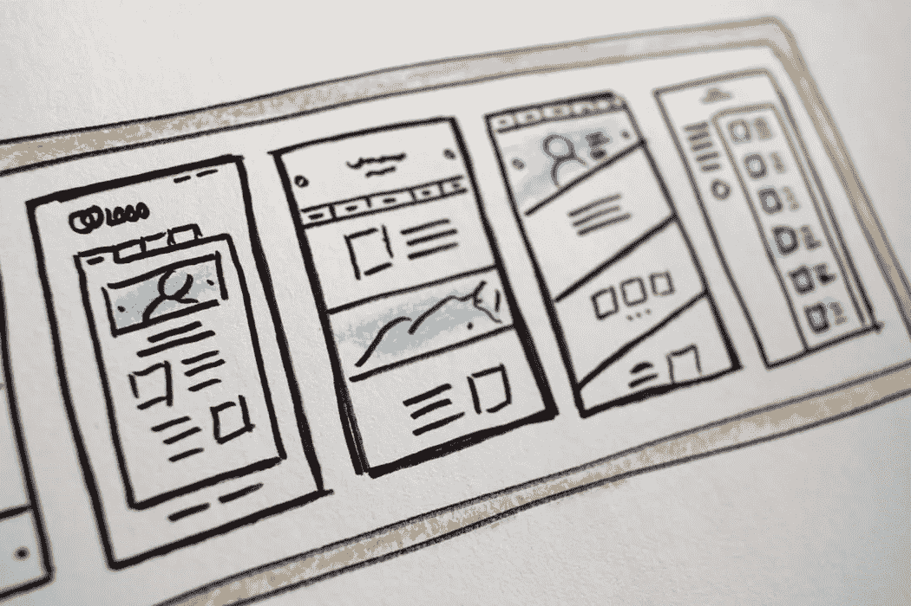

# 如何为成功的项目编写软件测试计划

> 原文：<https://javascript.plainenglish.io/how-to-write-software-test-planning-for-successful-projects-f2df2b9412a0?source=collection_archive---------7----------------------->

Photo by [Hal Gatewood](https://unsplash.com/@halgatewood?utm_source=unsplash&utm_medium=referral&utm_content=creditCopyText) on [Unsplash](https://unsplash.com/s/photos/plan?utm_source=unsplash&utm_medium=referral&utm_content=creditCopyText)

在一个软件项目中，产品必须经过良好的测试，以便能够以最准确和满足客户需求的方式将它放在客户面前。成功测试过程的第一步是计划项目范围内的测试活动。测试计划旨在主要关注要执行的测试活动，并定义在无错误测试期间需要的通信。

对成功的测试过程所必需的角色和职责的定义、执行任务共享、定义测试策略和测试文档结构、确定测试的开始和结束标准以及如何评估测试结果进行了研究。

所有这些步骤的第一步是测试计划的开发，如其他综合(质量保证计划、风险计划、软件开发计划等。)项目内的计划。

Photo by [Christopher Gower](https://unsplash.com/@cgower?utm_source=unsplash&utm_medium=referral&utm_content=creditCopyText) on [Unsplash](https://unsplash.com/s/photos/coding?utm_source=unsplash&utm_medium=referral&utm_content=creditCopyText)

对于一个好的测试计划，建议采取以下步骤:

1.  首先，应确定测试的目的、目标、范围以及在项目范围内进行的测试级别。应该定义测试引发的风险和一般测试策略。
2.  必须为每个测试级别定义测试的进入和退出标准。
3.  应该确定哪些测试活动将在项目阶段执行，并且应该提供它与项目生命周期的集成。
4.  应该测试什么，应该定义与测试相关的角色和职责。
5.  应该定义如何管理项目中的测试活动，以及如何报告和评估测试结果。
6.  应该完成测试设计活动的测试分析阶段和时间计划。
7.  应定义测试开始、停止和重启活动，并计划时间。
8.  对于测试计划中定义的所有活动，必须分配资源。
9.  测试文档应该描述详细程度、结构和模板。
10.  应定义错误管理流程，并确定重复测试策略。
11.  应该为测试活动的测量和评估定义度量标准。

在项目中执行上述步骤将意味着项目成功测试过程的第一步。然而，这并不能保证一个好的计划测试过程也会成功。重要的事情是放置一个好的可测试产品，并通过成功地应用测试计划中描述的那些来执行测试活动。只有这样，符合客户要求的次品才能少交付给客户。

感谢您的阅读！点击查看作者的其他文章:

 [## 渐进式 JavaScript 框架:Vue.js

### Vue.js 是一个用于构建网站 ui 的 Javascript 框架。它在许多方面类似于角形，也有…

medium.com](https://medium.com/javascript-in-plain-english/the-progressive-javascript-framework-vue-js-65f106080cb6)  [## 用 Nightwatch.js 测试 Amazon.com 登录页面

### 在我以前的文章中，我谈到了，什么是 Nightwatch.js，如何安装它，我演示了第一次测试。

medium.com](https://medium.com/javascript-in-plain-english/amazon-com-login-page-testing-with-nightwatch-js-a2acd0faa2f8)  [## 如何安装 Nightwatch.js？用 Nightwatch.js 进行第一次测试

### 在下面的文章中，我将重点介绍如何安装 Nightwatch.js，你必须知道的内容以及如何进行安装

medium.com](https://medium.com/lucid-archive/how-to-install-nightwatch-js-first-test-with-nightwatch-js-cffd7b96f49f)