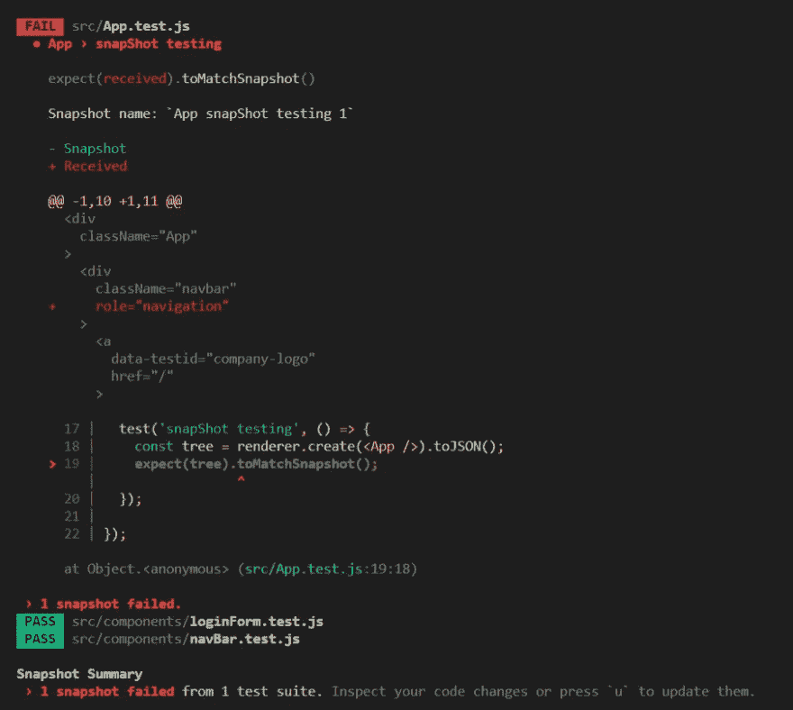
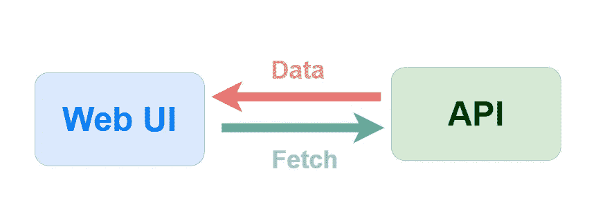

# 如何为 2020 年的 React 编写测试(第二部分)

> 原文：<https://javascript.plainenglish.io/how-to-write-tests-for-react-in-2020-8cf75cc73a33?source=collection_archive---------3----------------------->


> 用 React 推荐库编写 React 测试——面向 React 中级用户的 Jest & Testing 库。

# 清注意

在这篇文章中，我将探索 React 测试中更高级的概念，我希望它们对你的情况有所帮助。如果你是 React 的初学者或测试新手，我建议你在继续之前查看一下第一部分[](https://medium.com/javascript-in-plain-english/how-to-write-tests-for-react-in-2020-b27485e47a06)**，了解一些基础知识，谢谢！**

# *首先，让我们看看可访问性测试。*

*前端开发是所有关于可视化和与最终用户互动，可访问性测试可以确保我们的应用程序可以达到尽可能多的用户。*

**

****出自—***[***https://reactjs.org/docs/accessibility.html***](https://reactjs.org/docs/accessibility.html)*

*为你的应用程序的每个方面编写**可访问性测试**看起来很吓人，但是感谢[Deque Systems](https://www.deque.com/company/)——一家致力于通过提供免费在线获得的 [Axe](https://blog.kelvinliang.cn/www.deque.com/axe/) 测试包来提高软件可访问性的公司，我们现在可以通过导入 [Jest-axe](https://www.npmjs.com/package/jest-axe) 和 Jest 库来轻松利用世界各地许多高级开发人员的专业知识来测试 web 应用程序的可访问性。*

```
*$ npm install --save-dev jest-axe*
```

*或者*

```
*$ yarn add --dev jest-axe*
```

*随着软件包的安装，我们可以像这样将**可访问性测试**添加到项目中:*

```
*// App.test.js
import React from 'react';
import App from './App';
import { render } from '@testing-library/react';
import { axe, toHaveNoViolations } from 'jest-axe';
expect.extend(toHaveNoViolations);describe('App', () => {
  test('should have no accessibility violations', async () => {
    const { container } = render(<App />);
    const results = await axe(container);
    expect(results).toHaveNoViolations();
  });
});*
```

*这将有助于确保您的前端开发符合最新版本的 [WCAG(网页内容无障碍指南)](https://www.w3.org/WAI/standards-guidelines/wcag/)。例如，如果您给导航栏组件分配了一个错误的角色，*

```
*// ./components/navBar.js
...
<div className="navbar" role='nav'>
   ...
</div>
...*
```

*它会像下面这样提醒你:*

**

> **点击* *查看 WAI-ARIA 角色列表* [*。*](https://developer.mozilla.org/en-US/docs/Web/Accessibility/ARIA/Roles)*

*将 nav 替换为导航角色，如下所示，测试将通过。*

```
*// ./components/navBar.js
...
<div className="navbar" role='navigation'>
   ...
</div>
...*
```

*正如我们在上面看到的，这个测试将有助于确保你遵循 [WCAG(网页内容可访问性指南)](https://www.w3.org/WAI/standards-guidelines/wcag/)标准，这样你的应用就可以被大多数人使用。*

# *第二，添加快照测试。*

> *当你想确保你的用户界面不会发生意外变化时，快照测试是一个非常有用的工具。—摘自 [*Jest*](http://jestjs.io/)*

***你可以对整个应用程序或某个特定组件进行测试**。在开发周期中，它们可以用于不同的目的，你可以使用快照测试来确保你的应用程序的用户界面不会随着时间的推移而改变，或者比较上一次快照与当前输出之间的差异来迭代你的开发。*

*让我们以编写整个应用程序的测试为例，向您展示如何编写**快照测试**。*

```
*// App.test.js
import React from 'react';
import App from './App';import renderer from 'react-test-renderer';
...describe('App', () => {
  ... test('snapShot testing', () => {
    const tree = renderer.create(<App />).toJSON();
    expect(tree).toMatchSnapshot();
  });});*
```

*如果这是第一次运行这个测试，Jest 将创建一个快照文件(一个文件夹“`__snapshots__`”也将创建)，看起来像这样。*

**

```
*// App.test.js.snap
// Jest Snapshot v1, https://goo.gl/fbAQLPexports[`App snapShot testing 1`] = `
<div
  className="App"
>
  <div
    className="navbar"
  >
    ....*
```

*有了这个测试，一旦您对 DOM 做了任何更改，测试将失败，并以美化的格式向您显示更改的内容，如下所示:*

**

*在这种情况下，您可以按下`u`来更新快照，或者更改您的代码以使测试再次通过。*

> **如果您在开发的早期阶段添加了一个快照测试，您可能想要通过在测试前添加* `*x*` *来暂时关闭测试，以避免出现太多的错误并减慢进程。**

```
*xtest('should have no accessibility violations', async () => {
   ...
  });*
```

# *第三，让我们看看如何用 API 调用测试一个 UI。*

*现在前端 UI 在呈现页面之前必须从 API 获取一些数据是很常见的。对于今天的前端开发来说，编写测试变得更加重要。*

*首先，让我们看看这个过程，并考虑如何测试它。*

**

1.  *当一个条件被满足时(比如点击一个按钮或者加载的页面)，一个 API 调用将被触发；*
2.  *当数据从 API 返回时，通常响应需要在进入下一步之前进行解析(可选)；*
3.  *当有适当的数据时，浏览器开始相应地呈现数据；*
4.  *另一方面，如果出现问题，浏览器中应该会显示一条错误消息。*

*在前端开发中，我们可以测试如下内容:*

*   *响应是否被正确解析？*
*   *数据是否正确地呈现在浏览器的正确位置？*
*   *出错时浏览器是否显示错误信息？*

*但是，我们不应该:*

*   *测试 API 调用*
*   *调用真正的 API 进行测试*

> **因为大部分时候 API 是第三方托管的，取数据的时间是不可控的。此外，对于一些 API，给定相同的参数，返回的数据可能不同，这将使测试结果不可预测。**

*对于使用 API 的测试，我们应该:*

**

*   *使用模拟 API 进行测试并返回 fack 数据*
*   *使用假数据来比较 UI 元素，看它们是否匹配*

****如果你有想法，让我们开始真正的代码实践。****

*假设我们想要测试下面的**新闻页面**组件，它从`getNews` API 调用中获取新闻并在浏览器上呈现它们。*

```
*// ./page/News.js
import React, { useState, useEffect } from 'react';
import getNews from '../helpers/getNews';
import NewsTable from '../components/newsTable';export default () => {
  const [posts, setPosts] = useState([]);
  const [loading, setLoading] = useState(true);
  const [errorMsg, setErrorMsg] = useState('');
  const subreddit = 'reactjs'; useEffect(() => {
    getNews(subreddit)
      .then(res => {
        if (res.length > 0) {
          setPosts(res);
        } else {
          throw new Error('No such subreddit!');
        }
      })
      .catch(e => {
        setErrorMsg(e.message);
      })
      .finally(() => {
        setLoading(false);
      });
  }, []) return (
    <>
      <h1>What is News Lately?</h1>
      <div>
        {loading && 'Loading news ...'}
        {errorMsg && <p>{errorMsg}</p>}
        {!errorMsg && !loading && <NewsTable news={posts} subreddit={subreddit} />}
      </div>
    </>
  )
}*
```

*首先，让我们在 API 调用文件所在的位置创建一个`__mocks__`文件夹。(在我们的例子中，API 调用文件 call `**getNews.js**`)，在这个文件夹中创建同名的模拟 API 调用文件。最后，在这个文件夹中准备一些模拟数据。*

**

***模拟 API** 文件(`getNews.js`)应该如下所示*

```
*// ./helpers/__mocks__/getNews.js
import mockPosts from './mockPosts_music.json';// Check if you are using the mock API file, can remove it later
console.log('use mock api'); export default () => Promise.resolve(mockPosts);*
```

*与真实 API 调用的比较*

```
*// ./helpers/getNews.js
import axios from 'axios';
import dayjs from 'dayjs';// API Reference - https://reddit-api.readthedocs.io/en/latest/#searching-submissionsconst BASE_URL = 'https://api.pushshift.io/reddit/submission/search/';export default async (subreddit) => {
  const threeMonthAgo = dayjs().subtract(3, 'months').unix();
  const numberOfPosts = 5; const url = `${BASE_URL}?subreddit=${subreddit}&after=${threeMonthAgo}&size=${numberOfPosts}&sort=desc&sort_type=score`; try {
    const response = await axios.get(url);
    if (response.status === 200) {
      return response.data.data.reduce((result, post) => {
        result.push({
          id: post.id,
          title: post.title,
          full_link: post.full_link,
          created_utc: post.created_utc,
          score: post.score,
          num_comments: post.num_comments,
          author: post.author,
        });
        return result;
      }, []);
    }
  } catch (error) {
    throw new Error(error.message);
  }
  return null;
};*
```

*从上面的代码中我们可以看到，a `mock API call`只是简单地返回一个解析后的模拟数据，而 a `real API call`需要在每次测试运行时上线并获取数据。*

*准备好模拟 API 和模拟数据后，我们现在开始编写测试。*

```
*// ./page/News.test.js
import React from 'react';
import { render, screen, act } from '@testing-library/react';
import { BrowserRouter as Router } from "react-router-dom";
import News from './News';jest.mock('../helpers/getNews');  //adding this line before any test.// I make this setup function to simplify repeated code later use in tests.
const setup = (component) => (
  render(
   // for react-router working properly in this component
  // if you don't use react-router in your project, you don't need it.
    <Router>
      {component}
    </Router>
  )
);...*
```

> ****请注意:****

```
*jest.mock('../helpers/getNews');*
```

> **请将上述代码添加到每个可能触发 API 调用的测试文件的开头，而不仅仅是 API 测试文件。我在没有任何通知的情况下开始犯这个错误，直到我添加 console.log('call real API ')来监视测试期间的调用。**

*接下来，我们开始编写一个简单的测试来检查标题和加载消息是否正确显示。*

```
*// ./page/News.test.js
...
describe('News Page', () => {
  test('load title and show status', async () => {
    setup(<News />);  //I use setup function to simplify the code.
    screen.getByText('What is News Lately?'); // check if the title show up
    await waitForElementToBeRemoved(() => screen.getByText('Loading news ...'));
  });
...
});*
```

**

*调用模拟 API 并按照预期呈现页面。我们现在可以继续编写更复杂的测试。*

```
*...
test('load news from api correctly', async () => {
    setup(<News />);
    screen.getByText('What is News Lately?'); // wait for API get data back
    await waitForElementToBeRemoved(() => screen.getByText('Loading news ...')); screen.getByRole("table");  //check if a table show in UI now
    const rows = screen.getAllByRole("row");  // get all news from the table mockNews.forEach((post, index) => {
      const row = rows[index + 1];  // ignore the header row // use 'within' limit search range, it is possible have same author for different post
      within(row).getByText(post.title);  // compare row text with mock data 
      within(row).getByText(post.author); 
    }) expect(getNews).toHaveBeenCalledTimes(1); // I expect the Mock API only been call once
    screen.debug(); // Optionally, you can use debug to print out the whole dom
  });
...*
```

> ****请注意****

```
*expect(getNews).toHaveBeenCalledTimes(1);*
```

> **这段代码对于确保 API 调用只按预期调用是必不可少的。**

*当这个 API 调用测试相应地通过时，我们就可以开始探索更令人兴奋的东西了！*

*众所周知，一个 API 调用有时会因为各种原因出错，我们该如何测试它呢？*

*为此，我们需要首先重写模拟 API 文件。*

```
*// // ./helpers/__mocks__/getNews.js
console.log('use mock api');  // optionally put here to check if the app calling the Mock API
// check more about mock functions at https://jestjs.io/docs/en/mock-function-api
const getNews = jest.fn().mockResolvedValue([]); 
export default getNews;*
```

*然后我们需要在`News.test.js`文件中重新编写设置函数。*

```
*// ./page/News.test.js
...
// need to import mock data and getNews function
import mockNews from '../helpers/__mocks__/mockPosts_music.json';
import getNews from '../helpers/getNews';
...
// now we need to pass state and data to the initial setup
const setup = (component,  state = 'pass', data = mockNews) => {
  if (state === 'pass') {
    getNews.mockResolvedValueOnce(data);
  } else if (state === 'fail') {
    getNews.mockRejectedValue(new Error(data[0]));
  } return (
    render(
      <Router>
        {component}
      </Router>
    ))
};
...*
```

*我在这里将默认值传递到设置函数中，因此您不必更改之前的测试。但是我确实建议在测试中传递它们，以使测试更具可读性。*

*现在，让我们编写 API 失败的测试。*

```
*// ./page/News.test.js
...
test('load news with network errors', async () => {
    // pass whatever error message you want here.
    setup(<News />, 'fail', ['network error']);
    screen.getByText('What is News Lately?'); await waitForElementToBeRemoved(() => screen.getByText('Loading news ...'));
    screen.getByText('network error'); expect(getNews).toHaveBeenCalledTimes(1);
  })
...*
```

*最后，你可以从[这里](https://github.com/kelvin8773/react-test-examples/blob/master/src/pages/News.test.js)找到完整的测试代码。*

> ****请注意*** *它们只是用于演示目的的简单测试用例，在真实场景中，测试会复杂得多。你可以在这里* *查看我的另一个项目* [*的更多测试示例。*](https://github.com/ooloo-io/reddit-timer-kelvin8773)*

**

*Photo by [ThisisEngineering RAEng](https://unsplash.com/@thisisengineering) on **Unsplash***

# *最后的话*

*在本文中，我遵循了 Kent C. Dodds 在他 2020 年 5 月发表的博客文章—[React 测试库的常见错误](https://kentcdodds.com/blog/common-mistakes-with-react-testing-library)中建议的最佳实践，在这篇文章中，您可能会发现我的代码与 [**测试库示例**](https://testing-library.com/docs/react-testing-library/example-intro) 略有不同(我认为不久 Kent 也会更新文档)，但我相信这应该是我们在 2020 年及以后编写测试的方式。*

*我在这个项目中同时使用了 [**样式化组件**](https://testing-library.com/docs/react-testing-library/example-intro) 和内嵌样式来使 UI 看起来更好，但这不是必须的，你可以在 react 中自由使用任何 CSS 框架，这不会影响测试。*

*最后， ***测试*** 是前端开发中的一个高级课题，我只接触了很少的几个方面，还在学习中。如果你和我一样，刚刚开始，我建议你使用这里的例子或者我以前的文章中的一些例子来做你的个人项目。一旦你掌握了基本原理，你就可以开始探索市场上更多的替代品，找到最适合你的需求。*

# *以下是我推荐的一些继续学习的资源:*

*   *[来自 Create React 应用程序的测试](https://create-react-app.dev/docs/running-tests)*
*   *[我应该使用测试库中的哪个查询](https://testing-library.com/docs/guide-which-query)*
*   *[测试库中的更多示例](https://testing-library.com/docs/example-codesandbox)*
*   *[从 Redux.js 中为 Redux 编写测试](https://redux.js.org/recipes/writing-tests)*
*   *[来自 Gatsby.js 的单元测试](https://www.gatsbyjs.org/docs/unit-testing/)*
*   *[有效的快照测试](https://kentcdodds.com/blog/effective-snapshot-testing)来自[肯特·C·多兹](https://kentcdodds.com/)。*

# *我引用的参考资料和文章完成了本文:*

*   *[在开发人员的头脑中——重构和调试 React 测试](https://dev.to/jkettmann/inside-a-dev-s-mind-refactoring-and-debugging-a-react-test-2jap)作者 [Johannes Kettmann](https://dev.to/jkettmann) 。*
*   *[不要用 Effect 做回调！](https://jkettmann.com/dont-useeffect-as-callback/)作者[约翰内斯·凯特曼](https://dev.to/jkettmann)。*
*   *[Kent C . Dodds](https://kentcdodds.com/blog/common-mistakes-with-react-testing-library)的 React 测试库的常见错误。*
*   *[用](https://kentcdodds.com/blog/fix-the-not-wrapped-in-act-warning) [Kent C.Dodds](https://kentcdodds.com/) 固定未包裹动作警告。*
*   *[React](https://reactjs.org/docs/accessibility.html)的可达性。*
*   *[玩笑之斧](https://www.npmjs.com/package/jest-axe)。*

## *特别感谢 Johannes Kettmann 和他的课程。*