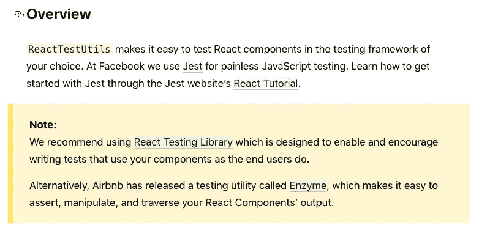
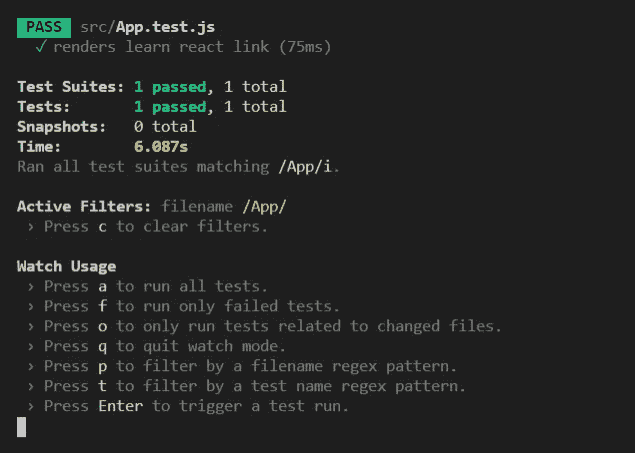
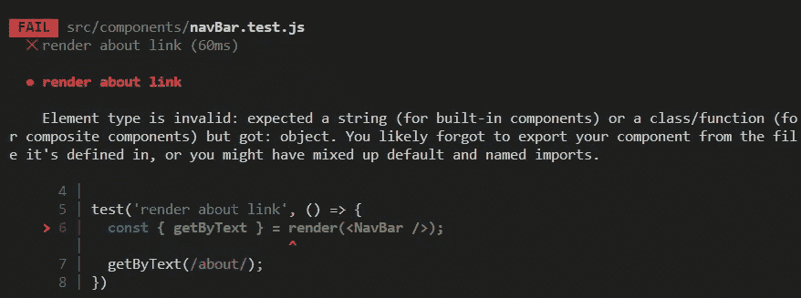
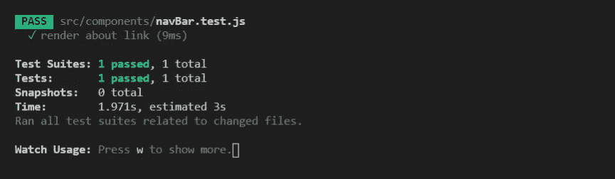
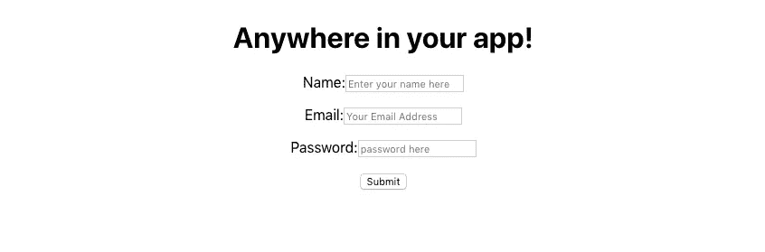
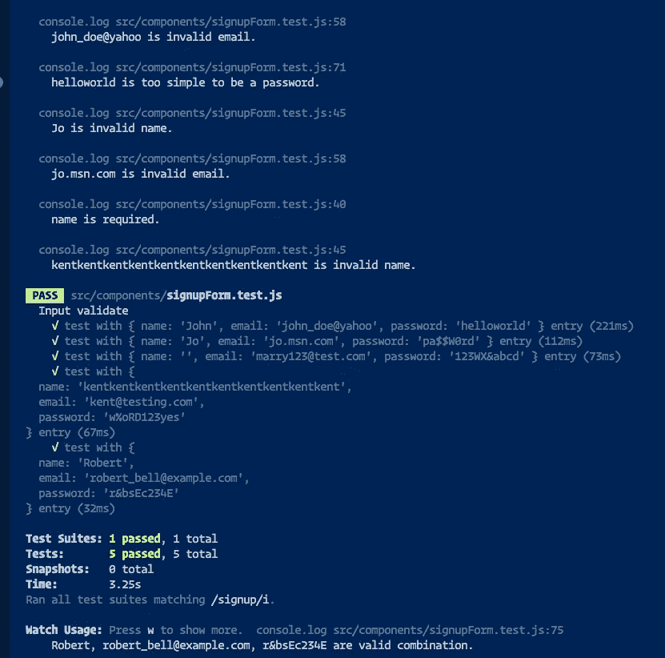

# 如何为 2020 年的 React 编写测试(第一部分)

> 原文：<https://javascript.plainenglish.io/how-to-write-tests-for-react-in-2020-b27485e47a06?source=collection_archive---------0----------------------->


Photo by [JESHOOTS.COM](https://unsplash.com/@jeshoots?utm_source=medium&utm_medium=referral) on [Unsplash](https://unsplash.com?utm_source=medium&utm_medium=referral)

> 用 react 编写 React 测试推荐库— [Jest](https://jestjs.io/docs/en/tutorial-react) & [React 测试库](https://testing-library.com/docs/react-testing-library/intro)适合完全初学者。



***From*** [***https://reactjs.org/docs/test-utils.html#overview***](https://reactjs.org/docs/test-utils.html#overview)

*这篇文章的目标读者是那些刚刚开始学习 React 并且想知道如何用他们的 React 应用程序编写一些简单的测试的人。就像大多数人开始使用`create-react-app`创建 React 应用一样，我也会开始使用它。*

# 首先，让我们从默认的例子开始。

**默认依赖** `**create-react-app**` **(2020/05/22)**

```
"dependencies": {
    "@testing-library/jest-dom": "^4.2.4",
    "@testing-library/react": "^9.3.2",
    "@testing-library/user-event": "^7.1.2",
    "react": "^16.13.1",
    "react-dom": "^16.13.1",
    "react-scripts": "3.4.1"
  }
```

已经编写了一个测试来帮助您开始。

```
// src/App.test.js
import React from 'react';
import { render } from '@testing-library/react';
import App from './App';test('renders learn react link', () => {
  const { getByText } = render(<App />); //render is from @testing-library/react
  const linkElement = getByText(/learn react/i);
  expect(linkElement).toBeInTheDocument(); //expect assertion is from Jest
});
```

如果您运行命令`$ yarn test App`，您将会看到与下面类似的结果:



> 使用默认的`create-react-app`设置，您可以开始编写一个测试，而不需要安装或配置任何东西。

从上面的例子中，我们应该知道-

*   我可以在哪里以及如何放置我的测试文件？——你可以看到在同一个文件夹中`App.test.js`被放在`App.js`的旁边，它在`App`组件名后面加上`.test.js`后缀作为文件名。这是`create-react-app`团队建议的默认约定([链接此处](https://create-react-app.dev/docs/running-tests/#filename-conventions))。
*   [**Jest**](https://jestjs.io/docs/en/tutorial-react) 和 [**React 测试库**](https://testing-library.com/react) 是测试背后的工具链，默认都是自带 create-react-app。

```
// setupTests.js
// Jest is importing from a global setup file if you wonder
import '@testing-library/jest-dom/extend-expect';
```

# 其次，为 NavBar 组件编写一个测试。

我正在创建一个包含链接和标志的`NavBar`组件。

首先，我将开始编写测试，而不编写实际的组件(测试驱动开发)。

```
// navBar.test.js
import React from 'react'; 
// screen newer way to utilize query in 2020 
import { render, screen } from '@testing-library/react'; 
import NavBar from './navBar'; // component to testtest('render about link', () => {
  render(<NavBar />);
  expect(screen.getByText(/about/)).toBeInTheDocument();
})
```

测试将首先失败，因为我还没有在`navBar.js`组件中编写任何代码。



然后让我们完成`navBar.js`组件，现在测试应该通过了。

```
// navBar.js
import React from 'react';const NavBar = () => (
  <div className="navbar">
    <a href="#">
      about
    </a>
  </div>
);export default NavBar;
```



现在，你应该学会:

*   `expect( ... ).toBeInTheDocument()`断言出自戏言。
*   `render(<NavBar />);`和`screen.getByText(/about/)`来自测试库。
*   Jest 和 React 测试库一起工作，使得在 React 中编写测试变得容易。
*   `screen.getByText(/about/)`使用“getByText”而不是通过类名选择是因为 React 测试库适应了关注用户体验而不是实现细节的思维模式。

要了解更多关于扩展和改变测试的信息，您可以查看以下资源:

*   [用 React App 测试 Jest 教程](https://jestjs.io/docs/en/tutorial-react)
*   [React 测试库语法备忘单](https://testing-library.com/docs/react-testing-library/cheatsheet)

现在让我们扩展测试和组件，使其更加真实-

```
// navBar.test.js
import React from 'react';
import { render, screen } from '@testing-library/react';
import NavBar from './navBar';// include as many test cases as you want here
const links = [
  { text: 'Home', location: "/" },
  { text: 'Contact', location: "/contact" },
  { text: 'About', location: "/about" },
  { text: 'Search', location: "/search" },
];// I use test.each to iterate the test cases above
test.each(links)(
  "Check if Nav Bar have %s link.",
  (link) => {
    render(<NavBar />);
    //Ensure the text is in the dom, will throw error it can't find
    const linkDom = screen.getByText(link.text); 

    //use jest assertion to verify the link property
    expect(linkDom).toHaveAttribute("href", link.location);
  }
);test('Check if have logo and link to home page', () => {
    render(<NavBar />);
    // get by TestId define in the navBar
    const logoDom = screen.getByTestId(/company-logo/); 
    // check the link location
    expect(logoDom).toHaveAttribute("href", "/"); 
    //check the logo image
  expect(screen.getByAltText(/Company Logo/)).toBeInTheDocument(); 
});
```

这是一个导航条组件通常的样子(可能需要添加一些样式)。

```
// navBar.js
import React from 'react';const NavBar = () => (
  <div className="navbar">
    <a href="/" data-testid="company-logo">
      
    </a> <ul>
      <li>
        <a href="/"> Home </a>
      </li>
      <li>
        <a href="/about"> About </a>
      </li>
      <li>
        <a href="/contact"> Contact </a>
      </li>
      <li>
        <a href="/search"> Search </a>
      </li>
    </ul>
  </div>
);export default NavBar;
```

好吧，写起来似乎很有趣，让我们写一个更复杂的。

# 第三，编写一个注册表单组件测试。

在编写了静态内容的测试之后，让我们编写一个更动态内容的测试—注册表单。

首先，让我们以 TDD 的方式思考——我们在这个注册表单中需要什么(不管它看起来如何):

*   名称的输入字段，只允许 3 到 30 个长度的字符串。
*   电子邮件的输入字段，可以检查它是否是有效的电子邮件地址。
*   密码的输入字段，可以检查其复杂性(至少 1 个数字，1 个小写字符串，1 个大写字符串，1 个特殊字符)
*   提交按钮。
*   以上 3 个输入都是必需的，不能为空。

现在，让我们编写测试。

```
/*  Prepare some test cases, ensure 90% edge cases are covered.
    You can always change your test cases to fit your standard
*/const entries = [
  { name: 'John', email: 'john_doe@yahoo', password: 'helloworld' },
  { name: 'Jo', email: 'jo.msn.com', password: 'pa$$W0rd' },
  { name: '', email: 'marry123@test.com', password: '123WX&abcd' },
  { name: 'kent'.repeat(10), email: 'kent@testing.com', password: 'w%oRD123yes' },
  { name: 'Robert', email: 'robert_bell@example.com', password: 'r&bsEc234E' },
]
```

接下来，建立测试的头骨。

```
// signupForm.test.js
// this mostly a input validate test
describe('Input validate', () => {
/* 
   I use test.each to iterate every case again
   I need use 'async' here because wait for 
   validation is await function 
*/  test.each(entries)('test with %s entry', async (entry) => {     ...

  })
})
```

接下来，让我们在测试中构建块。

```
// signupForm.test.js
...
test.each(entries)('test with %s entry', async (entry) => { 
//render the component first (it will clean up for every iteration    
render(<SignupForm />); 

/*  grab all the input elements. 
    I use 2 queries here because sometimes you can choose
    how your UI look (with or without Label text) without
    breaking the tests
*/	 
    const nameInput = screen.queryByLabelText(/name/i)
      || screen.queryByPlaceholderText(/name/i);
    const emailInput = screen.getByLabelText(/email/i)
      || screen.queryByPlaceholderText(/email/i);
    const passwordInput = screen.getByLabelText(/password/i)
      || screen.queryByPlaceholderText(/password/i);

/* use fireEvent.change and fireEvent.blur 
   to change name input value
   and trigger the validation
*/
    fireEvent.change(nameInput, { target: { value: entry.name } }); 
    fireEvent.blur(nameInput); /* first if-statement to check whether the name is input.
   second if-statement to check whether the name is valid.
   'checkName' is a utility function you can define by yourself.
   I use console.log here to show what is being checked.  
*/
  if (entry.name.length === 0) {
      expect(await screen.findByText(/name is required/i)).not.toBeNull();
      console.log('name is required.');
    }
    else if (!checkName(entry.name)) {
// if the name is invalid, error msg will showup somewhere
    expect(await screen.findByText(/invalid name/i)).not.toBeNull();
      console.log(entry.name + ' is invalid name.');
    };

// With a similar structure, you can continue building the rest of the test.
		.../*  Remember to add this line at the end of your test to 
    avoid act wrapping warning.
    More detail please checkout Kent C.Dodds's post:
    (He is the creator of Testing Library)    <https://kentcdodds.com/blog/fix-the-not-wrapped-in-act-warning>
*/
  await act(() => Promise.resolve()); 
})
...
```

> 完整的测试代码，请在这里找到[。](https://github.com/kelvin8773/react-test-examples/blob/master/src/components/signupForm.test.js)

好了，现在测试完成了(也许我们会回来做一些调整，但是现在让我们继续)，让我们写组件。

```
// signupForm.js
import React from 'react';
/* 
I borrow the sample code from formik library with some adjustments
<https://jaredpalmer.com/formik/docs/overview#the-gist>
*/
import { Formik } from 'formik';
/* 
For validation check, I wrote 3 custom functions.
(I use the same functions in test)
*/
import {
  checkName,
  checkEmail,
  checkPassword,
} from '../utilities/check';const SignupForm = () => (
  <div>
    <h1>Anywhere in your app!</h1>
    <Formik
      initialValues={{ name: '', email: '', password: '' }}
      validate={values => {
        const errors = {};
        if (!values.name) {
          errors.name = 'Name is Required'
        } else if (!checkName(values.name)) {
          errors.name = `invalid name`;
        } if (!values.email) {
          errors.email = 'Email is Required';
        }
        else if (!checkEmail(values.email)) {
          errors.email = 'Invalid email address';
        } if (!values.password) {
          errors.password = 'Password is Required';
        } else if (!checkPassword(values.password)) {
          errors.password = 'Password is too simple';
        } return errors;
      }}
      onSubmit={(values, { setSubmitting }) => {
        setTimeout(() => {
          alert(JSON.stringify(values, null, 2));
          setSubmitting(false);
        }, 400);
      }}
    >
      {({
        values,
        errors,
        touched,
        handleChange,
        handleBlur,
        handleSubmit,
        isSubmitting,
        /* and other goodies */
      }) => (
          <form onSubmit={handleSubmit}>
            <label>
              Name:
            <input
                type="text"
                name="name"
                placeholder="Enter your name here"
                onChange={handleChange}
                onBlur={handleBlur}
                value={values.name}
              />
            </label> <p style={{ 'color': 'red' }}>
              {errors.name && touched.name && errors.name}
            </p> <label>
              Email:
            <input
                type="email"
                name="email"
                placeholder="Your Email Address"
                onChange={handleChange}
                onBlur={handleBlur}
                value={values.email}
              />
            </label>
            <p style={{ 'color': 'red' }}>
              {errors.email && touched.email && errors.email}
            </p> <label>
              Password:
            <input
                type="password"
                name="password"
                placeholder="password here"
                onChange={handleChange}
                onBlur={handleBlur}
                value={values.password}
              />
            </label> <p style={{ 'color': 'red' }}>
            {errors.password && touched.password && errors.password}
            </p> <button type="submit" disabled={isSubmitting}>
              Submit
          </button>
          </form>
        )}
    </Formik>
  </div>
);export default SignupForm;
```

并且表单看起来类似于下图(没有太多的样式，但是对于我们的目的来说足够好了)。



如果输入错误，错误信息将显示在输入下方:


如果您完成了上面的测试，现在测试应该全部通过，运行`yarn test --verbose`，使用详细选项和 console.log 消息，您可以看到每个案例是如何被测试的，以及哪个是好案例，哪个不是。



如需更多测试代码示例和不同案例，请查看我的报告[这里](https://github.com/kelvin8773/react-test-examples)。


Photo by [NeONBRAND](https://unsplash.com/@neonbrand?utm_source=medium&utm_medium=referral) on [Unsplash](https://unsplash.com?utm_source=medium&utm_medium=referral)

# 最后的话。

对于初学者来说，一次学会所有的东西是很困难的，所以如果太难了，就慢下来。我至少花了整整一周的时间来学习基础知识，而这仅仅是为 React 应用程序编写测试的开始。

这是一个很难理解的话题，但是我相信如果你想成为一名专业的前端开发人员，花一些时间在这上面是值得的。

好消息是，你已经有了一个良好的开端，你现在应该知道如何利用 **Jest** 和 **React 测试库**来围绕你的 React 组件编写测试，并且你可以在这个良好的基础上开始探索其他库和解决方案。

如果我对这篇文章得到了积极的反馈，我计划写另一篇文章来介绍更多的例子，再次感谢您的时间。

## 我在撰写本文时参考的资源

*   【React 测试的常见错误作者[肯特·c·多兹](https://kentcdodds.com/)
*   [由](https://kentcdodds.com/blog/fix-the-not-wrapped-in-act-warning)[肯特·c·多兹](https://kentcdodds.com/)修复未包装动作警告
*   [我从酶到反应测试库的经验](https://medium.com/@boyney123/my-experience-moving-from-enzyme-to-react-testing-library-5ac65d992ce)(关于反应测试使用哪个库的意见)
*   [测试库配方](https://testing-library.com/docs/recipes)(许多了解库的好资源)
*   [在开发人员的头脑中——重构和调试 React 测试](https://dev.to/jkettmann/inside-a-dev-s-mind-refactoring-and-debugging-a-react-test-2jap)作者 [**约翰尼斯·凯特曼**](https://jkettmann.com/) (我是从这篇文章开始学习 React 测试的，但它要高级得多，我将在后面写更多)

## 特别感谢 [ooloo.io](https://ooloo.io/) 和 [Johannes Kettmann](https://dev.to/jkettmann)

> 对于想成为一名工作就绪的前端开发人员的人来说，我会推荐尝试一门来自 [ooloo.io](https://ooloo.io/) 的课程。它介绍了一些概念，例如——创建像素级完美的设计、规划和实现复杂的 UI 组件、在 ide 中调试，以及[编写集成测试](https://dev.to/jkettmann/inside-a-dev-s-mind-refactoring-and-debugging-a-react-test-2jap)，这些在大多数在线教程或课程中是看不到的。是的，我从这门课中得到了很多启发，最终帮助我写下了这篇文章。

***本文原帖***[***dev . to***](https://dev.to/kelvin9877/how-to-write-tests-for-react-in-2020-4oai)