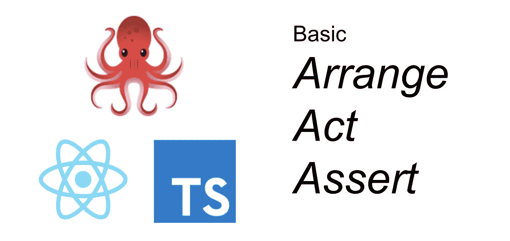
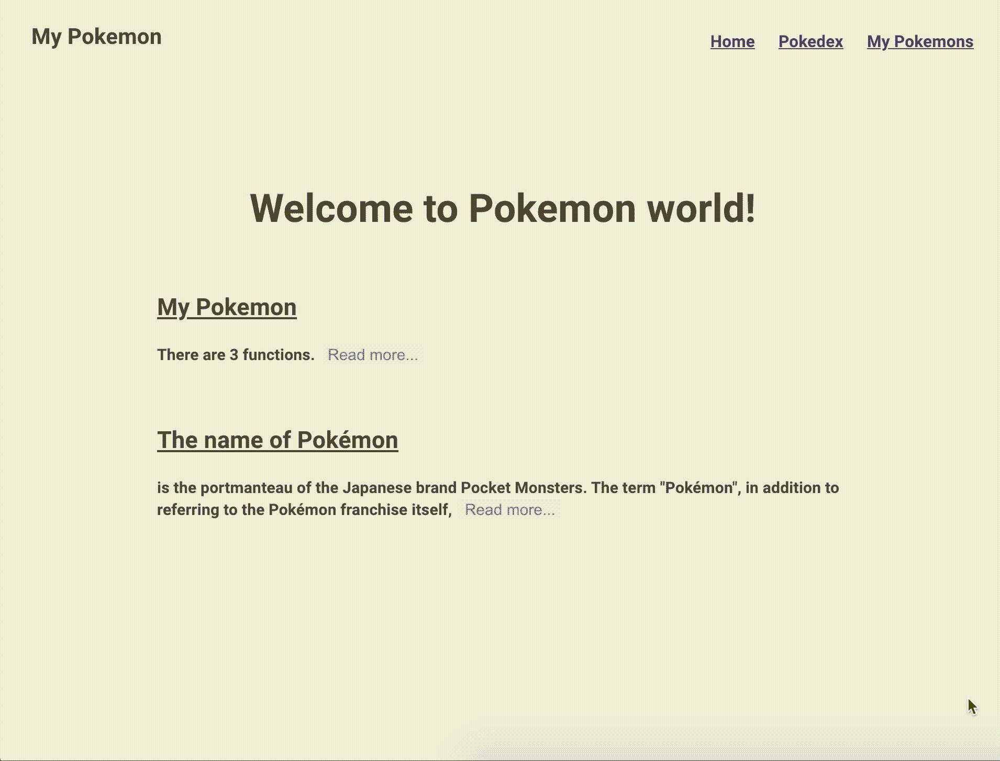

# 如何使用反应测试库和类型脚本编写测试

> 原文：<https://javascript.plainenglish.io/how-to-write-the-basic-aaa-pattern-tests-with-react-testing-library-and-typescript-6836173d656b?source=collection_archive---------1----------------------->

## 立即实施基本 AAA 测试模式！



每个人都知道编写测试对软件开发来说非常重要。它使我们能够以更少的错误更快地更改代码。

谈到前端，`React Testing Library`变得越来越流行，因为与`enzyme`相比，它更容易测试反作用钩子。然而，创建测试的方式完全不同。因此，本文解释了如何使用 React Testing Library 和 TypeScript 编写基本的 AAA 模式测试。

如果您想了解反应测试库的其他主题，请参考下面的文章。

*   [用 TypeScript 启动反应测试库的实用指南](https://medium.com/javascript-in-plain-english/the-practical-guide-to-start-react-testing-library-with-typescript-d386804a018)
*   [如何用 TypeScript](https://medium.com/@egctoru/how-to-setup-react-testing-library-for-material-ui-styled-component-with-typescript-556decbcbb55) 建立材料 UI 风格组件的反应测试库
*   [带有反应测试库和类型脚本的材料 UI 样式组件的快照](https://medium.com/@egctoru/snapshots-of-material-ui-styled-component-with-react-testing-library-and-typescript-d82d7d926d2c)

# 核心原则

**Kent c . dods**最重要的原则是:*“你的测试越像你的软件的使用方式，它们就越能给你信心。”*

这与软件工程师所做的完全不同。通常，您编写测试来确保每个实现都是正确的。但是 React Testing Library 声称你的测试必须基于用户如何接触它，而不是你的实现。

让我们看看一个简单的反应用程序示例。有了酶，测试就从实现是如何工作的开始。

```
// __test__/with_enzyme.jsimport PlusButton from "/path/to/PlusButton.tsx";
import { shallow } from "enzyme";it("call handleCountUp", () => {
  const wrapper = shallow(<PlusButton />);
  wrapper.instance().onClick = jest.fn();
  wrapper.update()
  wrapper.instance().handleClick();
  expect(wrapper.instance().onClick).toBeCalled();
});
```

另一方面，通过反应测试库，测试是如何使用组件的。

```
// __test__/with_testing_library.jsimport Counter from "path/to/Counter.tsx";
import { render, fireEvent, waitFor } from "@testing-library/react";it("count up the number", async () => {
  documentBody = render(<Index />);
  expect(documentBody.getByText("0")).toBeInDocument(); const plusButton = documentBody.getByText("+");
  fireEvent.click(plusButton);

  await waitFor(() => {
    expect(document.getByText("1")).toBeinDocument();
  })
});
```

区别是显而易见的。酶测试您的实现，onClick 被称为。但是反应测试库测试用户体验。正如您想象的那样，编写 React Testing Library 测试更耗时，因为这是一种集成测试。如果您喜欢，请继续！

# 设置演示应用程序

因为最好自己编写代码，所以准备了一个演示应用程序，名为“我的口袋妖怪”。[此处](https://medium.com/javascript-in-plain-english/the-practical-guide-to-start-react-testing-library-with-typescript-d386804a018)对其进行概述。

请克隆演示应用程序库，并请切换分支。

```
$ git clone [https://github.com/egurinko/react-testing-library-demo.git](https://github.com/egurinko/react-testing-library-demo.git)
$ git switch feature/01_BASIC_GUIDE
```

您可以使用运行该应用程序

```
$ yarn
$ yarn start
```

使用运行测试

```
$ yarn test
```

# 想想应该写什么样的测试

学习 React 测试库基础的好组件是`src/components/home/Index.tsx`。



尽管你想写测试，请停止它。建议在写任何一个测试之前，都要想好自己应该写什么样的测试。它使您能够考虑组件的全貌，并防止忽略任何东西。如果考虑的话，先创建伪代码。

```
// src/__test__/integration/home/index.spec.tsximport * as React from 'react';
import { render} from '@testing-library/react';
import Index from '../../../components/home/Index';describe('<Index />', () => {

  it('shows initial messages', () => {}); it('shows full texts when read more is clicked', () => {});});
```

# 基于 AAA(安排、行动、断言)编写测试

到目前为止，您已经完成了设置，并考虑了应该编写什么样的测试。接下来是你如何写测试！

从这里开始，本文创建基于 AAA 模式的测试，因为它几乎是软件领域的标准。这篇文章不解释 AAA 本身，因为它太有名和受欢迎了。

所以你需要做的第一件事是`Arrange`。有了 React 测试库，就有了必要的道具渲染。

```
// src/__test__/integration/home/index.spec.tsximport * as React from 'react';
import { render, RenderResult } from '@testing-library/react';
import Index from '../../../components/home/Index';let documentBody: RenderResult;describe('<Index />', () => {
  beforeEach(() => {
    // Arrange
    documentBody = render(<Index />);
  }); it('shows initial messages', () => {}); it('shows full texts when read more is clicked', () => {});});
```

我推荐在`beforeEach`中编写`render`函数，因为几乎所有的测试都需要组件的渲染。除此之外，最好用`RenderResult`给`render`的结果加上类型。它使您能够使用类型推断。

实际上，对于第一次测试，你不需要`Act`，因为它检查组件的初始状态。所以还是写`Assert`部分吧。可以写成下面这样。

```
// src/__test__/integration/home/index.spec.tsximport * as React from 'react';
import { render, RenderResult } from '@testing-library/react';
import Index from '../../../components/home/Index';let documentBody: RenderResult;describe('<Index />', () => {
  beforeEach(() => {
    // Arrange
    documentBody = render(<Index />);
  }); it('shows initial messages', () => {
    // ASSERT
    const welcome = documentBody.getByText('Welcome to Pokemon world!');
    const readMores = documentBody.getAllByText('Read more...');
    expect(welcome).toBeInTheDocument();
    expect(readMores.length).toEqual(2);
  }); it('shows full texts when read more is clicked', () => {});});
```

`[getByText](https://testing-library.com/docs/dom-testing-library/api-queries#bytext)`是 [DOM 测试库](https://testing-library.com/docs/dom-testing-library/api-queries)的查询之一。可以通过文本内容、标签、id 等进行查询。`toBeInTheDocument`是`@testing-library/jest-dom`的匹配器之一。如果你想了解更多，请点击 [jest-dom](https://github.com/testing-library/jest-dom#custom-matchers) 。

为了简化测试，上面的例子添加了两个断言，但是如果你认为这还不够，请添加更多。

好，让我们为第二个写测试。对于第二个，你需要检查新的文本出现后，点击阅读更多…按钮。这是 AAA 模式的一部分。

点击 DOM，`[fireEvent](https://testing-library.com/docs/dom-testing-library/api-events#fireevent)`准备就绪。它有大量的 DOM 事件。点击[这里](https://github.com/testing-library/dom-testing-library/blob/master/src/event-map.js)查看`fireEvent`操作的 DOM 事件的完整地图。

```
import * as React from 'react';
import { render, RenderResult, fireEvent } from '@testing-library/react';
import Index from '../../../components/home/Index';let documentBody: RenderResult;describe('<Index />', () => {
  ... it('shows full texts', () => {
    const readMores = documentBody.getAllByText('Read more...');

    const firstDesc = 'You can check pokemons in Pokedex page';
    expect(
      documentBody.queryByText(
        firstDesc, { exact: false }
      )
    ).not.toBeInTheDocument(); // ACT and ASSERT
    fireEvent.click(readMores[0]);
    expect(
      documentBody.queryByText(
        firstDesc, { exact: false }
      )
    ).toBeInTheDocument(); const secondDesc = 'also collectively refers to the 896 fictional';
    expect(
      documentBody.queryByText(
        secondDesc, { exact: false }
      )
    ).not.toBeInTheDocument(); // ACT and ASSERT
    fireEvent.click(readMores[0]);
    expect(
      documentBody.queryByText(
        secondDesc, { exact: false }
      )
    ).toBeInTheDocument();
  });
});
```

上面的测试检查新文本是否出现。要测试它，首先你应该检查目标文本是否没有出现。但是如果文本不存在，`getByText`会抛出错误。所以你需要使用`queryByText` ( [断言元素不存在](https://testing-library.com/docs/guide-disappearance#asserting-elements-are-not-present))。除此之外，`exact: false`选项用于避免文本的精确匹配。因为文字对我来说太长了，所以用在这里。另一方面，这也增加了查询其他 DOM 元素的可能性。所以就看你怎么用了。

# 写异步行为

上面的例子是同步的。那么如何处理异步 DOM 变化，比如异步 API 调用和显示一些东西呢？

使用 React 测试库非常简单👻就像下面这样用`waitFor`和`async await`！

```
import * as React from 'react';
import { render, RenderResult, fireEvent, waitFor } from '@testing-library/react';
import Index from '../../../components/home/Index';let documentBody: RenderResult;describe('<Index />', () => {
  ... it('shows full texts', async () => {
    const readMores = documentBody.getAllByText('Read more...'); // ACT and ASSERT
    const before = documentBody.queryByText('You can');
    expect(before).not.toBeInTheDocument(); fireEvent.click(readMores[0]); await waitFor(()=>{
      const after = documentBody.queryByText('You can');
      expect(after).toBeInTheDocument();
    })
  });
});
```

如果您想了解更多，请参考本节。

本文重点介绍用 TypeScript 测试 React 库的基础知识。您学习了核心概念以及如何使用 React 测试库编写 AAA 测试模式。

因为我写了其他关于 React 测试库的文章，喜欢就去看看吧！

*   [使用 TypeScript 启动 React 测试库的实用指南。](https://medium.com/@egctoru/the-practical-guide-to-start-react-testing-library-with-typescript-d386804a018)
*   [如何用 TypeScript 设置材质 UI 风格组件的 React 测试库](https://medium.com/@egctoru/how-to-setup-react-testing-library-for-material-ui-styled-component-with-typescript-556decbcbb55)
*   [带有 React 测试库和类型脚本的材质 UI 样式组件的快照](https://medium.com/@egctoru/snapshots-of-material-ui-styled-component-with-react-testing-library-and-typescript-d82d7d926d2c)

谢谢大家！

## 参考

*   [测试库](https://testing-library.com/)
*   [笑话](https://jestjs.io/en/)
*   [ts 是](https://github.com/kulshekhar/ts-jest)