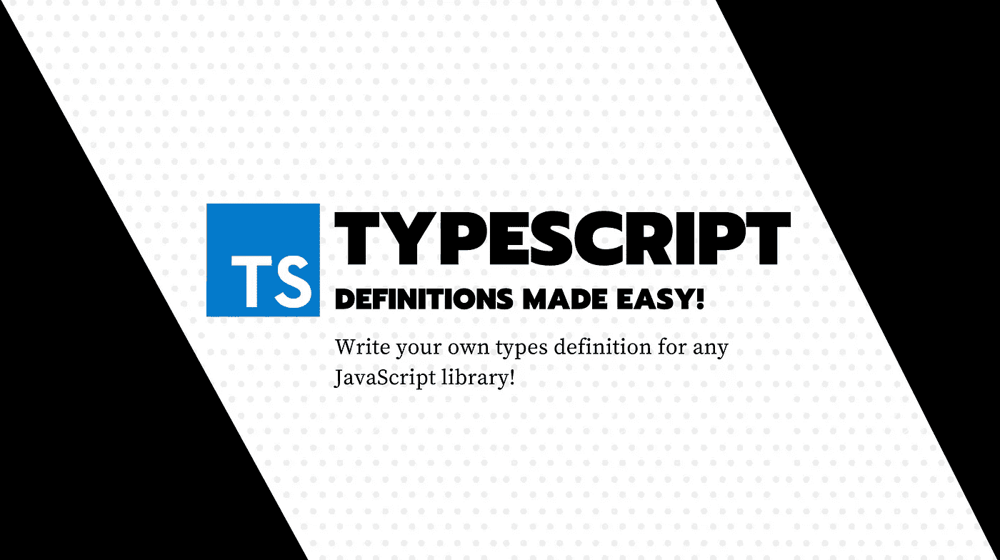
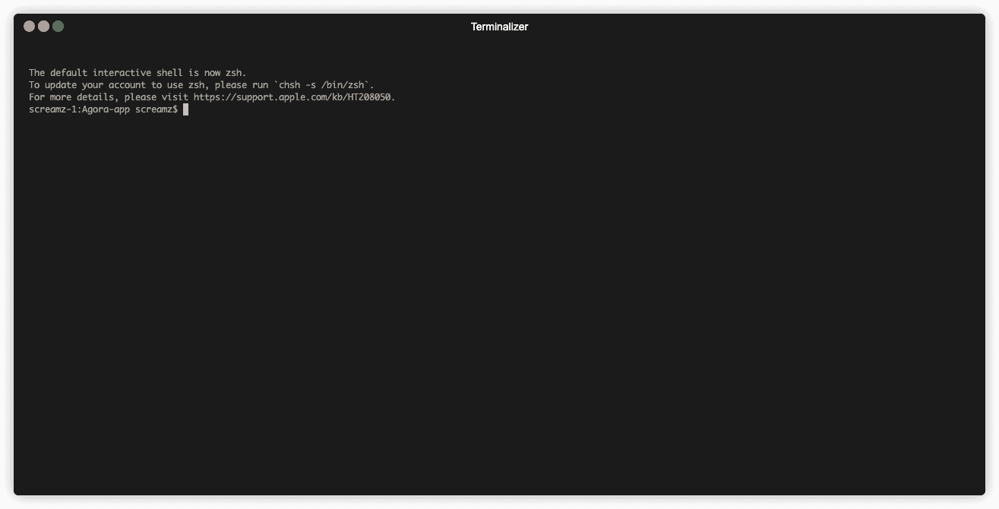

# 如何为 JavaScript 库编写类型脚本环境类型定义

> 原文：<https://javascript.plainenglish.io/how-to-write-typescript-types-for-a-javascript-library-e598b9eb8be7?source=collection_archive---------2----------------------->

## 提示和技巧

## 任何 JavaScript 库都可以轻松定义类型。创建、扩展和贡献任何缺少类型的存储库。



在打字稿的早期，这是一个复杂的时期。最初设计用于名称空间和某种“定制模块”，现在最好的方法是使用 ES6 模块。

如何管理模块和代码隔离将影响我们如何为我们的库编写环境类型定义。

我们来深究一下吧！

# 快速记住编译器的基本知识

在深入到 TypeScript 类型化的问题之前，我想澄清一些事情，因为对于每个开发人员来说，这似乎并不奇怪。

也许就像我一样，当老师试图教你 C 语言或某种编译语言时，你正在教室里做别的事情。

我们需要理解编译，因为在声明我们的类型定义时，我们需要很好地理解我们正在处理的范围。

我的意思是，当 TypeScript“编译”你的代码时，他到底在做什么？或者我应该说:任何编译器真正在做什么？

大多数时候，默认情况下，如果没有作用域机制，您编写的所有代码都是全局作用域的，即使是在多个文件中定义的:共享变量和函数。

这就是为什么在 JavaScript 早期，我们在浏览器页面全局上下文中使用模块模式。因为人们倾向于使用来自不同地方的多个脚本，这导致了代码冲突。

这通常以这样一种方式实现，即使用某种“立即调用的函数表达式”来用限定了作用域的 API 填充一个全局对象。这模仿了作用域的行为。

```
window.app_modules = window.app_modules || {};app_modules.MyModule = (function() {
  var privateVariable = 1;

  var publicFunction = function() {
    return privateVariable;
  } return {
    publicFunction: publicFunction
   };
})();console.log(app_modules.MyModule.publicFunction());
```

嗯，类似这样模仿私有财产的东西。允许使用 JavaScript 作用域来防止变量在模块间全局使用。

## 编译器的一项工作是将多个文件放入一个文件中，并确保声明之间的正确性。

因此，编译器获取一个文件工作空间，将所有文件合并成一个文件，一旦完成，它可能还会将代码转换为一些高度优化的字节码(这与 TypeScript 的情况不同)。

**这是什么意思？**

这意味着，如果 JavaScript 文件的作用域不正确，它会在文件之间共享相同的变量。这不是一件好事，因为它可能会引发某种意想不到的影响。但是对于 ES6 模块，这是 TypeScript 的一个兼容特性，有一个特殊性。

> 只要您导入或导出文件中的内容，您的代码就仅限于该文件。变量声明，函数，任何东西。否则，只需尝试创建两个没有导出的文件，一个创建变量`toto`，另一个显示该变量，所有没有导出的内容都在同一个名称空间中，用 TypeScript 编译它，您会得到两个文件中冲突的`toto`的值

为了解决这些问题，我们可以使用名称空间，它为事物的范围创建了某种边界(它在许多编程语言中工作得很好)，使用我们上面看到的模块模式，或者只是借助 EcmaScript 模块导出/导入某些东西。

嗯！让我们深入到我们真正的需求:创建一个类型定义

# 获取类型脚本库的良好声明

好了，现在我们有了基本的东西，我们可以使用我们的 scope 来玩我们的打字游戏了。我们刚刚下载了我们最新的库，但是有一个问题…库的创建者在没有打字稿的情况下完成了所有这些！(是啊 2020 年还存在)。

比如一个名为`somelibrary`的库，你最终得到的是经典

```
Could not find a declaration file for module 'somelibrary'. '/Users/screamz/workspace/myapp/node_modules/somelibrary/index.js' implicitly has an 'any' type.
  Try `npm install @types/somelibrary` if it exists or add a new declaration (.d.ts) file containing `declare module 'somelibrary';`ts(7016)
```

在孤注一掷的尝试中，你可以尝试运行`npm install -D @types/somelibrary`，当然，你会在墙上留下这个好消息



**404 未找到**

不错！

嗯，你现在可能会觉得有点绝望，但不要担心，你的好兄弟在这里！我们很快会解决这个问题。

# 为 JavaScript 库创建自己的 TypeScript 类型声明

严肃的事情开始了，我将向您展示处理这个问题的两种方法。

第一个也是最笨的一个，用我们在法国 Faire l'Autruche 中的一个表达来说是完美的，字面意思是把头埋在沙子里。(享受)

为了实现这一点，你只需创建一个名为`X.d.ts`的新文件，其中`X`是你想要的任何定义文件，这应该在你的类型脚本编译器的范围内(如果你没有在`tsconfig.json)`中指定`include`属性，这意味着在项目文件夹中)

## 示例 1

```
// ambients.d.ts at project root
declare module "somelibrary"; // Don't use brackets after
```

注意引号，这很重要，因为没有引号还有另一种语法，它的意思不一样。对于括号来说，这不是一回事，我们会进一步了解

好吧！你只是回避了这个问题，没有作任何声明。

它的意思是，它告诉编译器，当你将所有这些文件合并成一个文件时，只需将我要写的内容放在`somelibrary`上下文中，然后……什么都不做，将任何导出的内容标记为`any`类型

然而，当你赶时间的时候，这听起来不错，但实际上并不是最佳的，让我们看看我们能做得更好。

## 示例 2

想象一下，我们的`somelibrary`正在导出一个函数，我们用这个函数来玩`import { createFactory } from "somelibrary`，它有一个命名的导出，也有一个默认的导出，就像那个`import SomeLibrary from "somelibrary";`

现在我们有两种情况:

*   **你写代码是为了你自己，只在你自己的库中**

然后将它添加到编译范围内的环境定义文件中

```
// ambients.d.ts
declare module "somelibrary" {
  export function createFactory(someparam: string): SomeInterface;
  export default createFactory;

  interface SomeInterface {
    you: string;
    got_this: number;
    bro: boolean;
  }
}
```

到目前为止，一切顺利。这是因为您告诉 Typescript 编译器只覆盖名为`somelibrary`的库的类型。

*   **您编写代码是为了在应用程序存储库中发出一个拉请求**

几乎是同样的事情，在项目根目录下创建一个 types.d.ts 文件并声明 API，你可以省略`declare module "somelibrary"`指令，因为 TypeScript 会自动确定它的范围。

然后在库的`package.json`中应用一个`types`键，指向我们刚刚编写的声明文件。

好了，你现在可以提出拉请求了！

[**🇫🇷为法国人🥖我提议将⚡️编码 Spark 和 abonner 合并为一个简讯，以收取相关技术的费用**！](https://codingspark.io/?referral=medium)