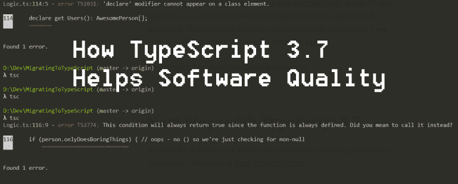

# TypeScript 3.7 如何提高代码质量

> 原文：<https://javascript.plainenglish.io/how-typescript-3-7-helps-quality-bb2b143f7425?source=collection_archive---------5----------------------->

在本文中，我将回顾最近发布的 TypeScript 3.7 中的一些重要亮点。我将从它们如何影响软件和代码质量的角度来看待这些事情，因为让我们面对它吧— [这是我的难题](https://www.killalldefects.com)。

我关注 TypeScript 发布已经有一段时间了。我已经看到过去的几个来来去去，没有任何重大影响我的日常生活。像 3.7 这样的小版本听起来不是很大或很重要，但是这个版本在提高代码质量方面是巨大的。

虽然 TypeScript 3.7 中有许多令人惊讶的东西，但我将专门写以下变化:

*   可选链接
*   无效合并
*   断言函数
*   Declare 关键字
*   未调用的函数检查

让我们开始吧。

# 可选链接

可选链接是一种语法形式，用于在某些内容为空或未定义的情况下缩短计算时间。

TypeScript 引入了`?.`操作符，以便在对象存在的情况下有选择地调用某些东西。

看看下面新旧做事方式的对比:

在 C#中我们已经有了可选的链接。网络世界有一段时间了，我是它的超级粉丝。

我喜欢的是:

*   它使得语法非常简洁，但是可读性非常好
*   这使得检查空值变得很容易

这两件事对代码和软件质量都有很大帮助。如果我正在审查代码，并且没有被 If 块的额外语法分散注意力，我就能够专注于真正重要的代码。

类似地，如果我是一个开发人员，正在开发一个比它应该的更长的方法，我可能会变得懒惰，并假设一个变量已经被检查为空。这听起来很傻，但是我自己也感觉到了不想脱离这个流程而去添加一个空检查的诱惑。

能够快速且有条件地检查 null 对质量的帮助比您最初想象的要大。

# 无效合并

Nullish 合并是指在评估可能为空或未定义的事物时使用`??`操作符。

首先,“nullish”这个术语让我发笑，因为它非常适合 JavaScript 概念。

JavaScript 需要这种区别，因为它有“T2”的概念，这个概念与“T3”是分开的，但又是相关的。当然，区别在于`null`明确地*什么都不是*但是`undefined`没有被定义为有任何价值。我想，动态语言的危险。

对于 nullish 合并的示例，请查看以下代码片段前后的内容:

如您所见，与使用赋值的等价 if 检查的三元(`?`)操作符相比，使用 nullish 合并非常简洁。

我喜欢的这一点与我喜欢的可选链接类似——它帮助您关注真正重要的代码。

如果我们作为工程师能够消除代码和语法中的额外干扰，我们将更容易、更早地发现缺陷。

# 断言函数

我更倾向于断言函数。从本质上说，它们是一些函数，如果被正确调用，它们会向 TypeScript 的内部类型解释代码断言一些东西。这反过来允许编译器基于现在被证明是真实的事实来捕捉更具体的问题。

让我们看一个例子:

这里我们有一个`getStandardFixedNumberString`函数，它接受一个已知为`string`或`number`的值。由于`toFixed`在`string`型上不可用，该代码通常是不允许的。

`assertIsNumber`函数定义了一个断言子句，本质上是说“如果这没有出错，那么函数断言的是真的，并且可以被你的方法的其余部分理解”。

因为我们断言输入是一个数字，在这种情况下，对数字可用的函数也变得可用，所以 TypeScript 对我们的`toFixed`调用没有问题。

所以，这里是我在这个问题上的立场:如果你的方法足够长，你需要断言函数，你可能应该把它们分成更小的方法。

您可能会认为断言函数是让 TypeScript 进行一些运行时类型检查的一种方式，而不是它只在编译时进行的标准静态检查。

然而，我不认为 TypeScript 是通过在运行时强制执行规则而繁荣起来的。在我看来，我们应该在编译时加强我们的打字，然后在边缘验证系统的外部输入。像 API 调用和用户输入这样的东西应该被断言和强制转换，而不是你的主应用程序代码。

尽管如此，断言函数仍然是值得考虑和关注的，因为它们有可能在将来为其他用途服务。

# Declare 关键字

Declare 让我们将动态类型系统与继承结合起来，从本质上重新声明继承的属性。

看看下面这个简单的层次结构:

这里我们有一个继承自`Theme`的`DarkTheme`。`Theme`声明了一个`Person`实体的集合，它本身就是一个抽象。

因为我们知道所有使用黑色主题的人都很棒，我们知道`users`属性也将只有`AwesomePerson`实体。

有了 TypeScript 3.7，TypeScript 也能理解这一点。

我们使用`declare`关键字来告诉 TypeScript 对某些事情做出假设，而不为这个假设发出任何特别的东西。以前我使用过`declare`来引用共享网页上加载的外部库。

这里我们使用`declare`来指定一个属性在上下文中具有不同于先前定义的类型。

我真的很喜欢这个功能。虽然不像其他语言特性那样常用，但这有助于具有复杂层次结构的团队理解它们的属性，并且不需要进行类型断言。

# 未调用的函数检查

最后，TypeScript 现在将捕获我们在函数中经常犯的一个常见错误。看一下下面的代码:

这里我们打算在第 10 行调用`person.onlyDoesBoringThings`，但是忘记了`()`，取而代之的是针对 null / undefined 评估函数。该函数已定义，因此条件的计算结果为`true`，即使调用它会返回`fasle`。

TypeScript 3.7 会立即捕捉到此错误:

`This condition will always return true since the function is always defined. Did you mean to call it instead?`

这个简单的内置检查应该可以提高你的质量，不需要额外的步骤，所以我完全支持。

# TypeScript 3.7 的后续步骤

如果你想了解更多关于 TypeScript 的这些特性或其他改进，请看一下[完整的发行说明](https://www.typescriptlang.org/docs/handbook/release-notes/typescript-3-7.html)。

可以通过运行`npm update -g typescript`经由 npm 更新到 TypeScript 3.7。

如果您还没有开始使用 TypeScript，请查看我的文章[将现有的 JavaScript 代码迁移到 TypeScript](https://killalldefects.com/2019/10/27/migrating-javascript-to-typescript/) 。

你对这些变化有什么看法？你最兴奋的是什么？你有令人信服的理由使用我没有想到的断言函数吗？

*原载于 2019 年 11 月 7 日*[*https://killalldefects.com*](https://killalldefects.com/2019/11/06/how-typescript-3-7-helps-quality/)*。*