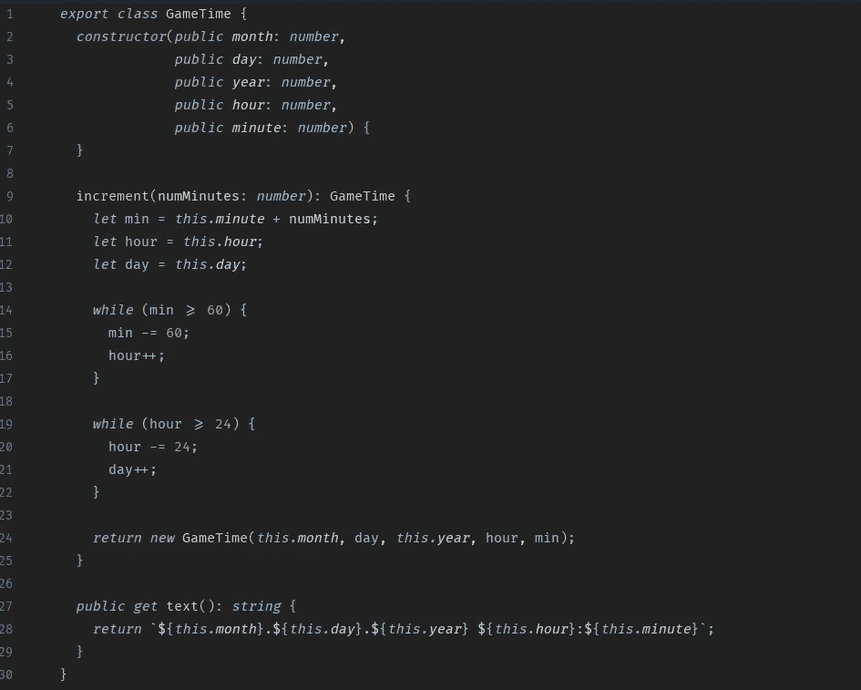

# TypeScript 如何消除所有已知的错误

> 原文：<https://javascript.plainenglish.io/how-typescript-squashed-all-known-bugs-dcf574d69ce9?source=collection_archive---------4----------------------->

## 你知道那个让你晚上睡不着觉，希望你不必改变它的应用程序吗？似乎我们都有一个。

我的是 JavaScript。这是一个只用 jQuery 和 JavaScript 编写的单页面应用程序，是我用过的最脆弱的东西。

让我告诉你如何切换到 [TypeScript](https://www.typescriptlang.org/) 来修复应用程序的所有已知错误，同时防止所有类别的缺陷再次出现。

# 发现现有的“链接”问题

我们在切换该应用程序时看到的第一个好处是，调用方法时参数太多或太少，或者方法名称明显拼写错误(这是一个庞大的、没有文档记录的代码库，没有多少有经验的人从事这方面的工作，也没有标准化的过程)，这些都是显而易见的。

通过强制一切通过`tsc`(TypeScript 编译器)，不存在的方法停止了程序流。

# 字符串类型变量

我们有一些变量，这些变量与一些地方的数字进行了比较。如果您使用的是 JavaScript 试图在字符串类型的数字和实际数字之间转换的`==`比较，这还不错，但是如果您甚至试图使用`===`(出于安全和性能考虑，您应该这样做)，您会很快发现`'1' === 1`将是假的，并且会有很多错误。

Bringing order through type declarations

通过用显式类型声明我们所有的参数和变量(例如使用`: number`，我们也能够捕捉到这些问题。

有一些遗漏的地方——例如，我们将值声明为一个数字，但它实际上是作为一个字符串从用户界面读入的，但是一旦我们找到了要查找的代码类型，这些就不难找到了。

# 用 ESLint 捕捉愚蠢的错误

我们使用 [ESLint](https://eslint.org/) 来 Lint 我们的类型脚本代码，因为 TSLint 当时表示它将在 2019 年的某个时候被弃用。

ESLint 允许我们捕捉可能的问题，比如返回值没有赋给变量或者其他正确性问题。因为我们将 ESLint 合并到我们的构建过程中，这意味着任何时候我们构建时都会发现任何新的林挺错误。

# 介绍课程

此外，我们用更漂亮的代码格式增强了 ESLint，给了我们一致的代码风格，而我们不必太担心它。

因为我们有 transpiler 来捕捉任何明显的问题，有林挺来捕捉任何新的错误，所以我们可以放心地开始使用松散的 JavaScript 函数并将它们移入类中，为我们的类型脚本带来更多的组织和标准化，并突出代码重用和整合的更多机会。

# 消除全局状态

因为我们引入了类，所以我们必须开始将状态从全局范围中移出，并移入负责它的单个类中。

事实证明，在明显的方法参数不匹配和比较不同数据类型的值的背后，糟糕的状态管理是应用程序中错误的第二大原因。

虽然我们没有时间在这个项目上引入像 [Redux](https://redux.js.org/) 或其他相关框架这样的解决方案，但是将状态转移到单独的类中的行为被证明是足够好的，给了我们找到不正确的状态操作代码并修复它所需的控制。

# 易测性

将大量的 JavaScript 代码分割成 TypeScript 类还允许我们围绕单个类编写 Jest 测试，在对应用程序进行修改时，给了我们更高程度的安全性和信心。

最终，将旧的遗留 JavaScript 应用程序迁移到 TypeScript 对于开发、质量保证和最终用户来说都是一个了不起的举动，因为我们引入的额外的严格性和安全性措施将应用程序稳定到了我们可以在不破坏东西的情况下进行更改的程度。

当然，我没有将应用程序转换成 [Angular](https://angular.io/) 或者添加一个像 Redux 这样的状态管理框架，但是最终，这个项目很早就完成了，没有任何缺陷，并且解决了过程中的大量现有缺陷——以至于将应用程序转移到 TypeScript 比找出 JavaScript 中的每个错误并修复它更快，希望我们能抓住它的所有方面。

每个项目都是不同的，但是如果您需要为老化的应用程序带来秩序和质量，我强烈建议您考虑 TypeScript。

*原载于 2019 年 9 月 22 日*[*https://dev . to*](https://dev.to/integerman/how-typescript-squashed-all-known-bugs-98c)*。*