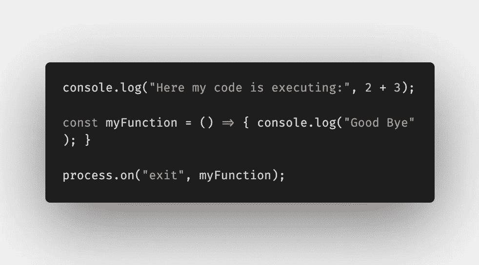
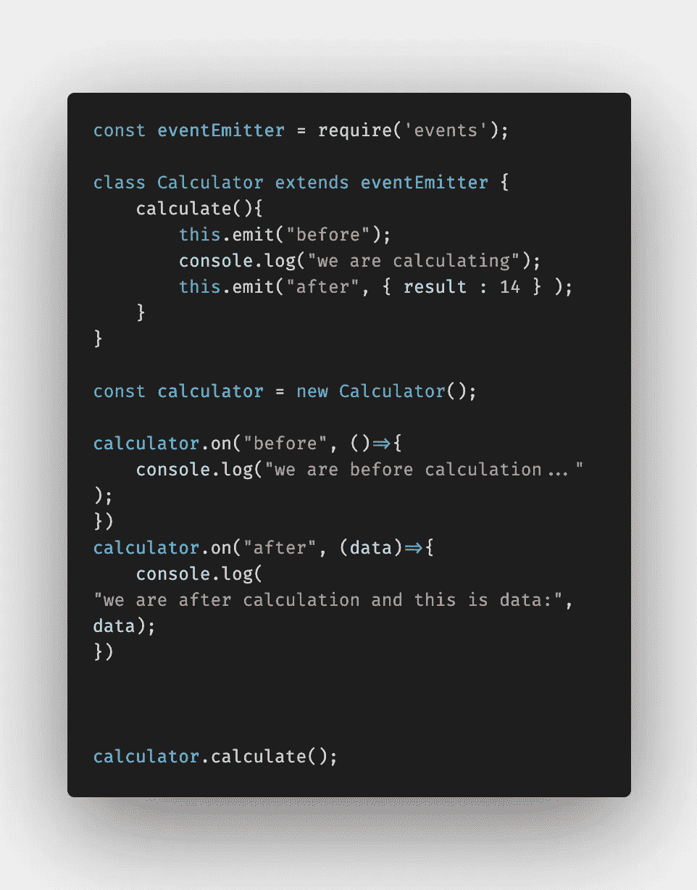
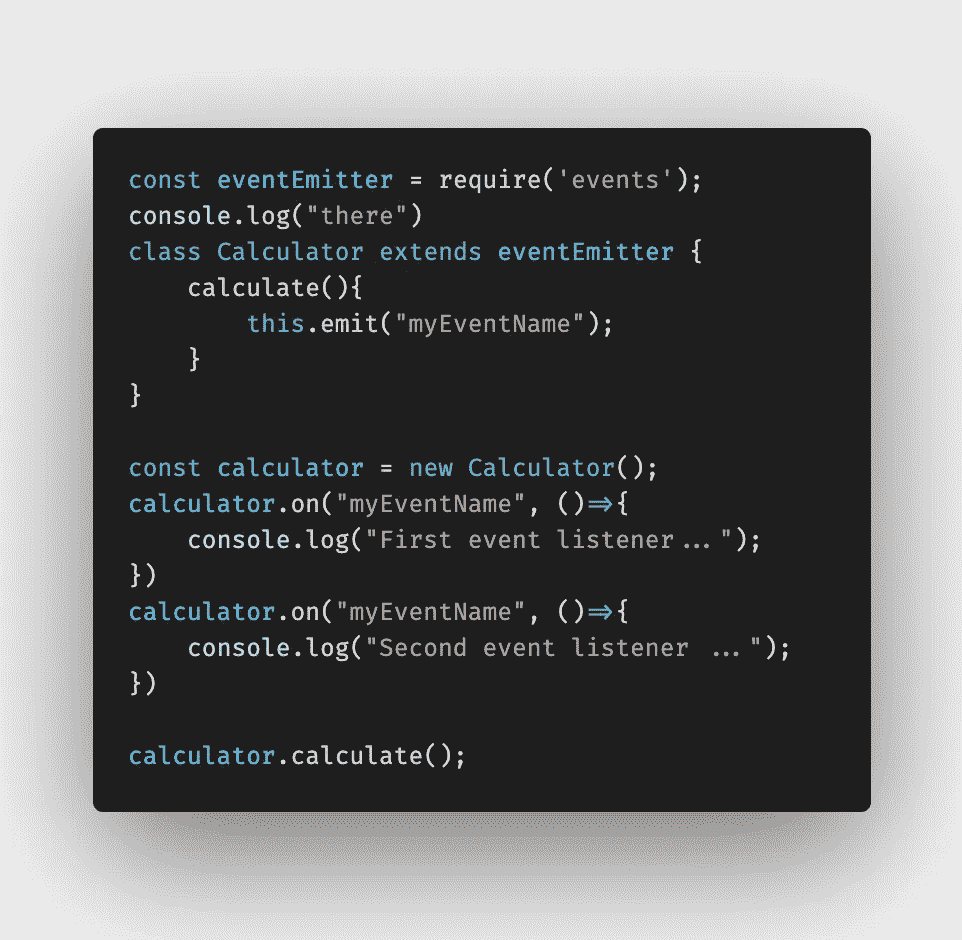
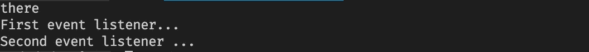

# 如何使用 Node.js 事件发射器

> 原文：<https://javascript.plainenglish.io/how-we-can-use-node-js-event-emitter-5c9e39c38749?source=collection_archive---------3----------------------->

## *“事件发射器”*是一个 Node.js 核心模块，帮助对象之间的通信

## 我们如何使用*事件发射器？*

**1。导入模块**

```
const eventEmitter = require('events');
```

**2。创建一个扩展** `**eventEmitter**`的类

```
class myCustomClass extends eventEmitter {};
```

**3。从此类实例化**

```
const myObject = new myCustomClass();
```

**4。添加事件监听器**

```
myObject.on("myEventName", myFunction)
```

**5。发出一个事件**

```
myObject.emit("myEventName");
```

因为我们发出了这个事件，所以我们的事件监听器调用了我们的`function(myFunction)`。

这是我们使用事件发射器类的最简单的方式。

## 事件发射器的使用

你知道`process`，它是全局对象中最重要的全局模块之一。

**见本例:**



A simple example of the usage of event emitters.

有时我们想在进程退出时做些什么。当进程退出时，会发出一个事件，我们可以给它添加一个事件监听器(也可以在函数中使用退出代码)。

## 我们如何通过事件传递数据:



如你所见，我们可以使用第二个 *参数*将数据传递给事件监听器。

## 如果一个事件有多个侦听器，会发生什么情况？

事件监听器将按顺序执行！



这是在我的终端上运行这段代码的结果:



正如您所看到的，函数是按顺序调用的。

就是这样！希望您觉得这很有用:)